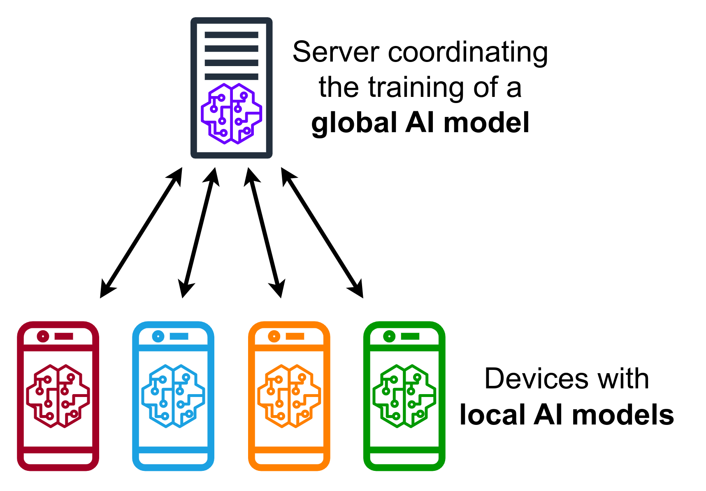

## Table of Contents

## What is Federated Learning?

Federated Learning is a way of training machine learning models where the data stays on the devices it was collected from, like your phone or computer. Instead of sending all the data to a central server, the model goes to the devices. Each device trains the model a little bit with its own data, and then sends only the changes back to the server. The server combines these changes to improve the model, and then sends the updated model back to the devices. This way, everyone's data stays private, but the model still gets better over time.

This method is really useful for things like predicting what you might type next on your phone, or suggesting apps you might like, without sending your personal information to a company. It helps keep your data safe and private, because only the model updates are shared, not the actual data. Federated Learning can be a bit slower and more complicated to set up than traditional methods, but it's becoming more popular as people care more about privacy.

## How does Federated Learning differ from traditional machine learning?

Federated Learning and traditional machine learning differ mainly in how they handle data. In traditional machine learning, all the data is gathered in one place, usually a central server. This server uses all the data to train a model. For example, if a company wants to improve its recommendation system, it would collect data from all its users and train the model on this big dataset. This method can be fast and efficient, but it requires users to share their personal data with the company, which can raise privacy concerns.

In contrast, Federated Learning keeps the data on the users' devices. Instead of sending data to a central server, the model is sent to the devices. Each device trains the model a bit using its own data and sends only the updates back to the server. The server then combines these updates to improve the model, which is sent back to the devices for further training. This way, users' data stays private, and the model still gets better over time. While this method can be slower and more complex to set up, it's great for applications where privacy is important, like on mobile phones where personal data is sensitive.

## What are the main benefits of using Federated Learning?

The main benefit of using Federated Learning is that it keeps your data private. Instead of sending your personal information to a company's server, the learning happens right on your device. This means you can help improve things like your phone's keyboard or app recommendations without sharing your data with anyone. It's like training a model together, but everyone keeps their information to themselves.

Another big advantage is that Federated Learning can work with data from all over the world. Since the data doesn't need to be moved to one place, devices in different countries can all help train the model. This can make the model better because it learns from a lot of different kinds of data. It's especially useful for companies that want to improve their services without having to deal with different countries' privacy laws.

Lastly, Federated Learning can save a lot of time and effort when it comes to data management. In traditional [machine learning](/wiki/machine-learning), companies need to gather all the data, clean it, and make sure it's ready for training. With Federated Learning, the data stays on the devices, so companies don't have to spend time and money moving and managing large amounts of data. This makes the whole process of training a model a lot easier and more efficient.

## What are the common challenges faced in implementing Federated Learning?

One of the biggest challenges in implementing Federated Learning is dealing with the variety of devices that are involved. Not all phones or computers are the same. Some might be old and slow, while others are new and fast. This means that when you're trying to train a model across all these devices, some will finish their part of the training much faster than others. This can make the whole process slower and more complicated, because you have to wait for the slowest devices to catch up. Also, some devices might not always be connected to the internet, so they can't send their updates back to the server right away. This can make it hard to keep the training on track.

Another challenge is making sure the model stays accurate and fair. When you're training a model with data from lots of different devices, the data might not be evenly spread out. Some devices might have a lot of data, while others have very little. This can make the model biased towards the data from the devices with more information. It's like if you're trying to learn about different kinds of music, but you only listen to one type a lot more than the others. The model might not work well for everyone. Also, keeping the model secure is important, because even though the data stays on the devices, there's still a risk that someone could try to mess with the model updates or steal them.

Lastly, setting up and managing a Federated Learning system can be tricky. It's not as simple as just collecting all the data in one place and training a model. You need to make sure the model can be sent to lots of different devices, and that those devices can send their updates back to the server in a way that works well. This means you might need special software or systems to handle everything, which can be expensive and take a lot of time to get right. It's like trying to organize a big group project where everyone is working from home, and you have to make sure everyone's work fits together in the end.

## Can you explain the basic architecture of a Federated Learning system?

The basic architecture of a Federated Learning system involves a central server and multiple client devices, like smartphones or computers. The central server acts as the coordinator, managing the overall training process. It starts by sending an initial model to all the client devices. Each client device then uses its own local data to train this model a little bit. After training, the device sends the changes, or updates, back to the central server. The server collects these updates from all the devices and combines them to improve the model. This updated model is then sent back to the devices, and the process repeats, allowing the model to get better over time without the need to move the data from the devices.

One important part of this architecture is how the server combines the updates from the devices. This is often done using a method called Federated Averaging. In Federated Averaging, the server calculates the average of the updates it receives from the devices. This average is then used to update the global model. The formula for Federated Averaging can be written as $$ w_{t+1} = \sum_{k=1}^{K} \frac{n_k}{n} w_k^t $$, where $$ w_{t+1} $$ is the new model, $$ w_k^t $$ are the updates from the $$ k $$-th device, $$ n_k $$ is the number of data samples on the $$ k $$-th device, and $$ n $$ is the total number of data samples across all devices. This process ensures that the contributions from all devices are considered fairly, even if some devices have more data than others.

Another key aspect is the communication between the server and the devices. The server needs to be able to send the model to the devices and receive the updates back efficiently. This can be challenging because devices might have different internet connections or might not always be online. To handle this, the system might use techniques like compression to make the model updates smaller, or it might allow devices to send their updates whenever they can, rather than requiring them to be online at specific times. This flexibility helps make sure that the training process can continue smoothly, even with lots of different devices involved.

## What are the different types of Federated Learning?

There are mainly two types of Federated Learning: Horizontal Federated Learning and Vertical Federated Learning. Horizontal Federated Learning is used when different devices have data with the same features but different samples. For example, if many phones have data about their users' app usage, but each phone has data from a different user, that's horizontal. The goal is to train a model that can predict app usage across all these devices without sharing the actual data. The central server sends the model to each phone, and each phone trains it a bit with its own data, then sends the updates back. The server combines these updates to improve the model, using a method like $$ w_{t+1} = \sum_{k=1}^{K} \frac{n_k}{n} w_k^t $$, where $$ w_{t+1} $$ is the new model, and the other terms represent the contributions from each device.

Vertical Federated Learning, on the other hand, is used when different devices have data about the same samples but different features. Imagine two companies that both have data about the same customers, but one company knows about the customers' shopping habits and the other knows about their browsing history. They want to train a model that uses both types of data to predict customer behavior, but they don't want to share their data with each other. In this case, the central server helps coordinate the training process, but the data stays with each company. They use techniques like encryption to make sure the data stays private while still allowing the model to learn from it. This type of Federated Learning can be more complex to set up, but it's very useful for situations where different organizations have complementary data.

## How does data privacy and security work in Federated Learning?

In Federated Learning, data privacy and security are really important. The main way it keeps your data safe is by not moving your data off your device. Instead of sending your personal information to a big server, the model comes to your device. Your phone or computer uses its own data to train the model a little bit, and then only sends the changes back to the server. This means your data stays private, because no one else can see it. The server just gets the updates, not your actual data. This makes it harder for anyone to steal your information, because it never leaves your device.

Another way Federated Learning keeps things secure is by using special math to protect the updates. For example, the server might use something called Federated Averaging to combine the updates from all the devices. The formula for this is $$ w_{t+1} = \sum_{k=1}^{K} \frac{n_k}{n} w_k^t $$, where $$ w_{t+1} $$ is the new model, and the other terms represent how much each device contributes. But even these updates can be protected with things like encryption. This means the updates are scrambled before they're sent, so even if someone managed to intercept them, they wouldn't be able to understand them. This extra layer of security helps make sure that the whole process stays safe and private.

## What are some practical applications of Federated Learning?

One practical application of Federated Learning is improving the keyboard on your smartphone. When you type, your phone learns from your habits to suggest the next word or correct your spelling. With Federated Learning, your phone can train this model using your data without sending it to a company's server. Instead, it sends only the changes to the model back to the server, which then combines these changes to make the keyboard better for everyone. This way, your typing data stays private, but the keyboard still gets smarter over time.

Another use is in healthcare, where different hospitals might want to train a model to predict diseases without sharing patient data. Each hospital uses its own patient data to train the model a bit, and then sends only the updates to a central server. The server combines these updates using a method like $$ w_{t+1} = \sum_{k=1}^{K} \frac{n_k}{n} w_k^t $$, where $$ w_{t+1} $$ is the new model, and the other terms represent the contributions from each hospital. This way, the model can learn from a lot of data without any hospital having to share its patients' private information. It helps improve healthcare while keeping patient data safe.

## How do you handle model aggregation in Federated Learning?

In Federated Learning, model aggregation is the process of combining the updates from different devices to improve the model. The central server sends the model to each device, and each device trains it a bit using its own data. Then, the devices send their updates back to the server. The server uses a method called Federated Averaging to combine these updates. The formula for Federated Averaging is $$ w_{t+1} = \sum_{k=1}^{K} \frac{n_k}{n} w_k^t $$, where $$ w_{t+1} $$ is the new model, and the other terms represent how much each device contributes. This way, the server can create a better model without seeing the actual data from the devices.

Handling model aggregation can be tricky because devices might have different amounts of data or different processing speeds. Some devices might have a lot of data and can train the model quickly, while others might have less data and take longer. The server needs to wait for all the updates to come in before it can combine them. This can slow down the training process, but it's important to make sure the model is fair and accurate for everyone. By using Federated Averaging, the server can make sure that all devices' contributions are considered, even if some devices have more data than others.

## What role do edge devices play in Federated Learning?

Edge devices, like smartphones or computers, are really important in Federated Learning. They keep the data private because the data never leaves the device. Instead of sending all your information to a big server, the model comes to your device. Your phone or computer uses its own data to train the model a little bit and then sends only the changes back to the server. This way, your personal information stays safe, but the model still gets better over time.

The edge devices also help make the model work well for lots of different people. Each device might have different kinds of data, so when they all train the model a bit, it learns from a lot of different experiences. The server uses a special way to combine these changes called Federated Averaging. The formula for this is $$ w_{t+1} = \sum_{k=1}^{K} \frac{n_k}{n} w_k^t $$, where $$ w_{t+1} $$ is the new model, and the other terms represent how much each device helps. This helps make the model fair and useful for everyone, even though the data stays on the devices.

## How can you evaluate the performance of models trained with Federated Learning?

Evaluating the performance of models trained with Federated Learning can be a bit tricky because the data stays on the devices and is never seen by the central server. To get around this, you can use a method called "local evaluation." In this method, each device uses a small part of its data to test the model after it has been trained. The device then sends the test results back to the server. The server combines these results to get an overall idea of how well the model is doing. This way, you can see if the model is getting better without moving any data around.

Another way to evaluate the model is to use a "global evaluation" method. In this approach, the server might have a small set of data that it can use to test the model. After the server combines the updates from all the devices using Federated Averaging, which is calculated as $$ w_{t+1} = \sum_{k=1}^{K} \frac{n_k}{n} w_k^t $$, it uses this global dataset to see how well the new model performs. This can give a good idea of how the model works across different kinds of data, even though the server doesn't see the data from the devices themselves. Both methods help make sure the model is improving and working well for everyone.

## What are the future trends and research directions in Federated Learning?

One of the future trends in Federated Learning is making it work better with different kinds of devices. Right now, not all phones or computers can train models at the same speed because they're different. Researchers are working on ways to make sure that even the slowest devices can help improve the model without slowing everything down too much. They're also looking into how to make the model updates smaller, so they can be sent back and forth more easily. This could make Federated Learning faster and more useful for more people.

Another important research direction is keeping the model fair and accurate for everyone. When different devices have different amounts of data, the model might learn more from some devices than others. This can make the model biased. Scientists are trying to find better ways to combine the updates from all the devices, like using the formula $$ w_{t+1} = \sum_{k=1}^{K} \frac{n_k}{n} w_k^t $$, where $$ w_{t+1} $$ is the new model, and the other terms represent how much each device contributes. They're also working on ways to make sure the model works well for everyone, even if some devices have more data than others. This is important for making sure Federated Learning is fair and useful for all kinds of users.

## References & Further Reading

[1]: Kairouz, P., McMahan, B., Avent, B., Bellet, A., Bennis, M., Bhagoji, A., ... & Zhao, H. (2019). ["Advances and Open Problems in Federated Learning."](https://arxiv.org/abs/1912.04977) arXiv preprint arXiv:1912.04977.

[2]: Li, T., Sahu, A. K., Talwalkar, A., & Smith, V. (2020). ["Federated Learning: Challenges, Methods, and Future Directions."](https://ieeexplore.ieee.org/document/9084352) IEEE Signal Processing Magazine, 37(3), 50-60.

[3]: Bonawitz, K., Eichner, H., Grieskamp, W., Huba, D., Ingerman, A., Ivanov, V., ... & Seth, K. (2019). ["Towards Federated Learning at Scale: System Design."](https://arxiv.org/abs/1902.01046) In Proceedings of the 2nd SysML Conference.

[4]: Yang, Q., Liu, Y., & Chen, T. (2019). ["Federated Machine Learning: Concept and Applications."](https://arxiv.org/abs/1902.04885) ACM Transactions on Intelligent Systems and Technology, 10(2), 1-19.

[5]: Yang, Q., Liu, Y., & Zhang, T. (2019). ["Federated Machine Learning: Concept and Applications."](https://arxiv.org/abs/1902.04885) ACM Transactions on Intelligent Systems and Technology, 10(2), 1-19.

[6]: Google AI Blog. (2017). ["Federated Learning: Collaborative Machine Learning without Centralized Training Data."](https://research.google/blog/federated-learning-collaborative-machine-learning-without-centralized-training-data/)

[7]: McMahan, H. B., Moore, E., Ramage, D., & Hampson, S. (2017). ["Communication-Efficient Learning of Deep Networks from Decentralized Data."](https://arxiv.org/abs/1602.05629) In Artificial Intelligence and Statistics (pp. 1273-1282). PMLR.