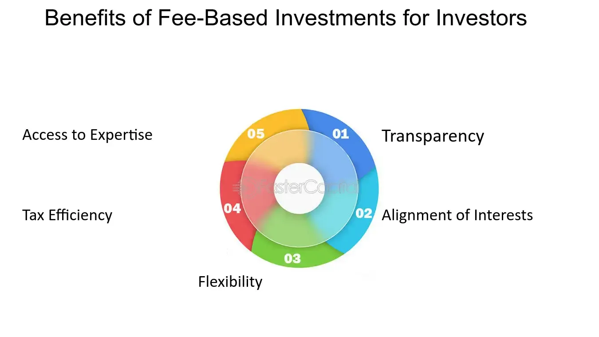

## Table of Contents

## What is a fee-based investment?

A fee-based investment is a type of investment where you pay a fee to a financial advisor or investment manager. This fee is usually a percentage of the total amount of money you have invested. The advisor uses this money to help you choose and manage your investments. They might pick stocks, bonds, or other types of investments for you.

The main advantage of a fee-based investment is that it can be more personalized. Your advisor works with you to understand your financial goals and risk tolerance. They then create a plan that fits your needs. However, the fees can add up over time, which might reduce your overall returns. It's important to weigh the benefits of personalized advice against the costs before deciding if a fee-based investment is right for you.

## How does a fee-based investment differ from a commission-based investment?

A fee-based investment and a commission-based investment are two different ways that financial advisors can get paid. In a fee-based investment, you pay your advisor a fee, usually a percentage of the money you have invested. This fee is for their advice and management of your investments. The advisor's goal is to help you grow your money, and they get paid no matter how well your investments do.

On the other hand, a commission-based investment means the advisor earns money through commissions. They get paid a certain amount every time they buy or sell an investment for you. This can sometimes lead to more trading than necessary, because the advisor makes more money with each transaction. It's important to understand that their income depends on how often they trade, not just on how well your investments perform.

Choosing between fee-based and commission-based investments depends on what you value more. If you want personalized advice and a long-term plan, a fee-based investment might be better. But if you're okay with more trading and want to keep costs down, a commission-based investment could work for you. Always think about the costs and how they might affect your returns over time.

## What are the common types of fees associated with fee-based investments?

When you invest in a fee-based investment, you usually pay different kinds of fees. One common fee is the management fee. This is a percentage of your total investment that you pay to the advisor for managing your money. For example, if you have $10,000 invested and the management fee is 1%, you'll pay $100 each year. Another fee you might see is the performance fee. This fee is based on how well your investments do. If your investments do better than expected, the advisor gets an extra payment.

There are also other fees to watch out for. One is the administrative fee, which covers the costs of running the investment account, like paperwork and record-keeping. Another fee is the expense ratio, which is a percentage of your investment that goes to pay for the costs of running the mutual funds or ETFs you might be invested in. All these fees can add up, so it's good to know about them before you start investing.

## How are fee-based investment fees typically calculated?

Fee-based investment fees are usually calculated as a percentage of the total amount of money you have invested. This percentage is called the management fee. For example, if you have $10,000 invested and the management fee is 1%, you will pay $100 each year. The management fee is meant to cover the cost of the advisor's time and expertise in managing your investments. It's important to know this fee because it comes out of your investment returns.

Sometimes, there's also a performance fee. This fee is based on how well your investments do. If your investments perform better than a certain target, the advisor gets an extra payment. This is meant to reward the advisor for doing a good job. Besides these, there might be other fees like administrative fees for running your account and expense ratios for the costs of mutual funds or ETFs you're invested in. All these fees can add up, so it's good to understand them before you invest.

## What are the benefits of choosing a fee-based investment?

One of the main benefits of choosing a fee-based investment is that you get personalized advice. Your financial advisor works with you to understand your goals and how much risk you're comfortable with. They then create a plan that fits your needs. This can help you feel more confident about your investments because you know they're tailored just for you. Plus, since the advisor gets paid a fee no matter how your investments do, they're more likely to focus on your long-term success rather than making quick trades for their own gain.

Another benefit is that fee-based investments can be more transparent. You know exactly what you're paying for, which is usually a percentage of your total investment. This makes it easier to see the costs and understand how they might affect your returns over time. Also, since the advisor isn't earning money from commissions on trades, they might trade less often. This can save you money on transaction costs and help keep your investment strategy focused on the long term.

## Can you explain the potential drawbacks of fee-based investments?

One potential drawback of fee-based investments is that the fees can add up over time. Even though the fee might seem small, like 1% of your investment, it can take a big chunk out of your returns. If you have a lot of money invested, that fee can be a lot of money each year. This means less money for you in the long run, which might make it harder to reach your financial goals.

Another issue is that while fee-based advisors are supposed to focus on your long-term success, they might still have some conflicts of interest. For example, they might recommend certain investments because they get extra payments from those companies. This can make it harder for you to trust that their advice is really in your best interest. It's important to ask questions and make sure you understand why they're suggesting certain investments.

## How do fee-based investment advisors manage client portfolios?

Fee-based investment advisors manage client portfolios by first understanding the client's financial goals and how much risk they're okay with. They talk to the client to learn about their dreams, like saving for retirement or buying a house. Then, they make a plan that matches those goals. This plan might include different types of investments like stocks, bonds, or mutual funds. The advisor keeps an eye on these investments to make sure they're doing well and still fit the client's needs.

Over time, the advisor might need to make changes to the portfolio. If the client's goals change or if the market goes up and down, the advisor will adjust the investments. They might sell some stocks and buy others, or they might shift more money into safer investments if the client is getting closer to retirement. The advisor's job is to keep the portfolio in line with the client's plan, and they do this by checking on it regularly and making smart choices about what to buy and sell.

## What should investors look for when selecting a fee-based investment advisor?

When choosing a fee-based investment advisor, it's important to find someone who really listens to what you want. You should feel like they understand your goals, like saving for a house or planning for retirement. A good advisor will ask you about your dreams and how much risk you're okay with. They'll use this information to make a plan that fits you perfectly. It's also a good idea to pick someone who is easy to talk to and who explains things in a way you can understand.

Another thing to look for is how much the advisor charges. Since you'll be paying them a fee, usually a percentage of your money, you want to make sure it's fair. Some advisors might charge extra fees, so ask about all the costs upfront. Also, check if they have any conflicts of interest. For example, do they get extra money from certain investments? A good advisor should always put your needs first. By choosing carefully, you can find someone who helps you reach your financial goals while keeping your costs down.

## How does the fee structure impact the overall performance of a fee-based investment?

The fee structure of a fee-based investment can affect how much money you make over time. When you pay a fee to your advisor, it comes out of your investment returns. If the fee is high, like 1% or more, it can take a big chunk out of your money each year. Over many years, these fees can add up and reduce the total amount you earn from your investments. So, it's important to think about how the fees might lower your returns before you choose a fee-based investment.

However, if the advisor's fee is fair and they do a good job, the personalized advice you get can help your investments do better. A good advisor can help you pick the right investments and make smart changes to your portfolio when needed. This can lead to higher returns that might be worth the cost of the fee. The key is to balance the benefits of the advice against the fees you're paying, and make sure the advisor is really helping you reach your financial goals.

## What regulatory considerations should be taken into account with fee-based investments?

When you choose a fee-based investment, it's important to know about the rules that keep things fair. In the United States, the main rule is called the Investment Advisers Act of 1940. This law says that advisors have to act in your best interest, not their own. They have to tell you about any fees they charge and any conflicts of interest they might have. This helps make sure they're giving you good advice and not just trying to make money for themselves.

Another important thing to know is that the Financial Industry Regulatory Authority (FINRA) and the Securities and Exchange Commission (SEC) watch over fee-based advisors. These groups make sure advisors follow the rules and treat their clients fairly. If an advisor doesn't follow the rules, you can complain to these organizations. Knowing these rules can help you feel more confident that your advisor is working to help you reach your financial goals.

## How can investors evaluate the cost-effectiveness of a fee-based investment?

To figure out if a fee-based investment is worth the money, investors should first look at the fees they're paying. These fees usually come out of the money you earn from your investments. If the fees are high, like 1% or more, they can take a big bite out of your returns over time. So, it's smart to compare the fees of different advisors and see how they might affect your money in the long run. Also, ask about any other fees, like performance fees or administrative costs, because they can add up too.

Next, think about the value you get from the advisor's advice. A good advisor can help you pick the right investments and make smart changes to your portfolio when needed. This can lead to higher returns that might be worth the cost of the fee. To see if the advisor is doing a good job, look at how your investments are doing compared to what you expected. If they're doing better and you feel confident about your financial plan, the fees might be worth it. The key is to balance the cost of the fees against the benefits of the advice you're getting.

## What advanced strategies can be employed to optimize returns in a fee-based investment?

One advanced strategy to optimize returns in a fee-based investment is called asset allocation. This means spreading your money across different types of investments, like stocks, bonds, and real estate. By doing this, you can lower your risk because if one type of investment goes down, the others might go up. A good advisor can help you find the right mix of investments that matches your goals and how much risk you're okay with. They might also use something called rebalancing, which means they'll adjust your investments over time to keep them in line with your plan.

Another strategy is called tax-loss harvesting. This is a fancy way of saying you can sell investments that have lost value to help lower your taxes. When you sell these investments at a loss, you can use that loss to reduce the taxes you owe on your gains. A smart advisor can watch your portfolio and do this for you, which can help you keep more of your money. By using these advanced strategies, you can make your fee-based investment work harder for you and get closer to your financial goals.

## References & Further Reading

[1]: Bergstra, J., Bardenet, R., Bengio, Y., & Kégl, B. (2011). ["Algorithms for Hyper-Parameter Optimization."](https://papers.nips.cc/paper/4443-algorithms-for-hyper-parameter-optimization) Advances in Neural Information Processing Systems 24.

[2]: ["Advances in Financial Machine Learning"](https://www.amazon.com/Advances-Financial-Machine-Learning-Marcos/dp/1119482089) by Marcos Lopez de Prado

[3]: ["Evidence-Based Technical Analysis: Applying the Scientific Method and Statistical Inference to Trading Signals"](https://www.semanticscholar.org/paper/Evidence-Based-Technical-Analysis%3A-Applying-the-and-Aronson/3b33df8737f1772e9e14d66a08c9696f140a2ee1) by David Aronson

[4]: ["Machine Learning for Algorithmic Trading"](https://github.com/PacktPublishing/Machine-Learning-for-Algorithmic-Trading-Second-Edition) by Stefan Jansen

[5]: ["Quantitative Trading: How to Build Your Own Algorithmic Trading Business"](https://books.google.com/books/about/Quantitative_Trading.html?id=j70yEAAAQBAJ) by Ernest P. Chan