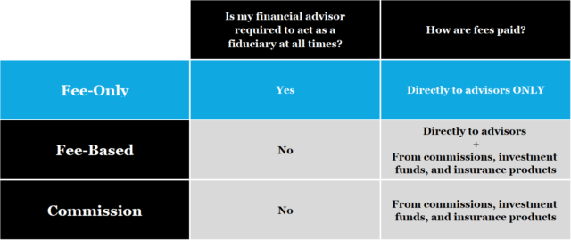

## Table of Contents

## What is a fee-only financial advisor?

A fee-only financial advisor is someone who gets paid directly by their clients for the advice they give. They don't earn money from commissions on products like insurance or investments. This means their advice is not influenced by what will earn them more money, but by what is best for the client.

This type of advisor can charge in different ways. They might charge a flat fee for a specific service, an hourly rate, or a percentage of the assets they manage for you. Because they are paid directly by you, it's easier to see exactly what you're paying for and how much it costs. This transparency can help build trust between the advisor and the client.

## How does a fee-only financial advisor differ from other types of financial advisors?

A fee-only financial advisor is different from other types of financial advisors because they only get paid directly by their clients. They don't earn any money from selling products like insurance or investments. This means they don't have any extra reasons to push certain products on you. Their advice is based on what's best for you, not what will make them more money. This makes their advice more trustworthy.

Other types of financial advisors might be fee-based or commission-based. Fee-based advisors charge you directly, but they can also earn money from commissions on products they sell. Commission-based advisors earn money only from the products they sell to you. This can sometimes lead them to recommend products that pay them more, even if those products aren't the best for you. Knowing the difference can help you choose the right advisor for your needs.

## What are the benefits of working with a fee-only financial advisor?

Working with a fee-only financial advisor means you know exactly what you're paying for. They don't make money from selling you products, so they can focus on giving you the best advice for your situation. This can help you trust them more because their advice isn't influenced by commissions. You can see all the fees clearly, which makes it easier to plan your finances.

Another benefit is that fee-only advisors often offer a wide range of services. They can help you with everything from making a budget to planning for retirement. Because they aren't tied to specific products, they can find the best options for you from many different places. This can lead to better financial decisions and a more secure future.

## How are fee-only financial advisors compensated?

Fee-only financial advisors get paid directly by their clients. They don't earn any money from selling products like insurance or investments. This means they can focus on giving you the best advice without worrying about making money from commissions.

There are different ways a fee-only advisor can charge you. They might charge a flat fee for a specific service, like making a financial plan. They could also charge by the hour, so you only pay for the time they spend helping you. Another common way is to charge a percentage of the assets they manage for you, which means the fee depends on how much money they are looking after.

## What services can you expect from a fee-only financial advisor?

A fee-only financial advisor can help you with a lot of things. They can create a plan for your money, look at how you spend and save, and help you set goals for the future. They might also help you figure out how much you need to save for retirement, how to invest your money wisely, and how to pay less in taxes. Because they don't sell products, they can look at all your options and pick the best ones for you.

They can also help you if you have a lot of debt. They can make a plan to pay it off and help you avoid getting into more debt. If you have a business, they can give you advice on how to manage your money better. They can be there to answer your questions and guide you through big financial decisions, like buying a house or planning for your kids' education.

## How do you find and choose a reputable fee-only financial advisor?

Finding a reputable fee-only financial advisor starts with knowing where to look. You can start by checking websites like the National Association of Personal Financial Advisors (NAPFA) or the Certified Financial Planner Board of Standards (CFP Board). These organizations have lists of fee-only advisors. You can also ask friends or family if they know a good advisor. Once you have some names, do some research. Look at their websites, read reviews, and see if they have any certifications or special training.

After you find some potential advisors, it's important to choose the right one for you. You can set up meetings with a few to see if you feel comfortable with them. Ask about their experience, how they get paid, and what services they offer. It's good to know if they have worked with people in situations similar to yours. Make sure they are clear about their fees and how they will help you reach your financial goals. Choosing the right advisor can make a big difference in your financial future, so take your time and pick someone you trust.

## What should you look for in a fee-only financial advisor's qualifications and credentials?

When looking for a fee-only financial advisor, it's important to check their qualifications and credentials. One of the most respected credentials is the Certified Financial Planner (CFP) certification. This means the advisor has passed a tough exam, has a lot of experience, and follows high ethical standards. Another good credential is membership in the National Association of Personal Financial Advisors (NAPFA), which is a group only for fee-only advisors. You should also see if they have any special training or experience in areas that matter to you, like retirement planning or managing investments.

Besides formal credentials, it's good to know about their background and how long they've been working as a fee-only advisor. Ask if they have worked with people in situations similar to yours. It's also important that they are clear about how they get paid and what services they offer. A good advisor will be open about their fees and will explain things in a way that's easy to understand. Choosing an advisor with the right qualifications and a good track record can help you feel more confident in their advice.

## How does the fiduciary standard apply to fee-only financial advisors?

The fiduciary standard is a rule that says financial advisors must put their clients' interests first. This means they have to give advice that is best for the client, not what makes them more money. Fee-only financial advisors are usually held to this standard. Because they don't earn money from selling products, it's easier for them to follow the fiduciary standard. They can focus on what's best for you without worrying about commissions.

Knowing that a fee-only advisor follows the fiduciary standard can give you peace of mind. It means they are legally required to act in your best interest. This is important because it helps make sure the advice you get is honest and aimed at helping you reach your financial goals. When choosing an advisor, it's good to ask if they follow the fiduciary standard to make sure they are committed to putting your needs first.

## Can you explain the potential conflicts of interest with fee-only versus commission-based advisors?

Fee-only financial advisors don't have the same conflicts of interest as commission-based advisors. Since fee-only advisors get paid directly by their clients, they don't make money from selling products like insurance or investments. This means they can give advice that's best for you without worrying about [earning](/wiki/earning-announcement) a commission. Their focus is on helping you reach your financial goals, not on selling you something to make more money.

On the other hand, commission-based advisors earn money from the products they sell to you. This can create a conflict of interest because they might be tempted to recommend products that pay them more, even if those products aren't the best for you. For example, they might push you to buy a certain investment because it gives them a big commission, not because it's the best choice for your financial situation. This can make it harder to trust their advice, as their recommendations might be influenced by what benefits them financially.

## What are some common fee structures used by fee-only financial advisors?

Fee-only financial advisors have different ways to charge for their services. One common way is a flat fee. This means you pay a set amount for a specific service, like making a financial plan. Another way is an hourly rate, where you pay for the time the advisor spends helping you. This can be good if you only need help with a few things and want to keep costs down.

Another common fee structure is a percentage of assets under management (AUM). This means the advisor charges a percentage of the money they manage for you. For example, if you have $100,000 and they charge 1%, you would pay $1,000 a year. This fee can go up or down depending on how much money you have with them. Some advisors might also use a retainer fee, where you pay a regular amount each month or year for ongoing advice and support.

## How can a fee-only financial advisor help with complex financial planning needs?

A fee-only financial advisor can be really helpful if you have a lot of complex financial needs. They can look at all parts of your money situation, like your investments, taxes, and how you save and spend. Because they don't make money from selling products, they can pick the best options for you from many different places. This means they can help you make a plan that fits your life and your goals, whether you're trying to save for retirement, pay off debt, or figure out how to invest your money wisely.

They can also help you with big decisions, like buying a house or planning for your kids' education. If you own a business, they can give you advice on how to manage your money better. Because they are focused on what's best for you, they can give you honest advice and help you through tough financial choices. Having a fee-only advisor by your side can make it easier to handle complex financial planning and feel more confident about your future.

## What are the latest trends and future outlook for fee-only financial advising?

The trend in fee-only financial advising is growing because more people want advisors who put their needs first. They like knowing exactly what they're paying for and that their advisor isn't influenced by commissions. Technology is also changing things. More advisors are using digital tools to help their clients. This can make it easier to manage your money and get advice from anywhere. Another trend is that more people are looking for help with specific things, like saving for retirement or paying off debt. Fee-only advisors can offer services that are tailored to these needs.

In the future, fee-only financial advising is likely to keep growing. People will want advisors who are clear about fees and who follow the fiduciary standard. This means advisors will need to keep learning and getting better at what they do. Technology will probably play an even bigger role, with more online tools and advice. As people's financial needs get more complex, fee-only advisors will be important in helping them plan for the future and reach their goals.

## References & Further Reading

[1]: ["The Fiduciary Duty of Financial Advisors: Has it Been a Success?"](https://www.forbes.com/advisor/investing/financial-advisor/fiduciary-vs-financial-advisor/) by Arthur B. Laby, Case Western Reserve Law Review, 2010.

[2]: Fama, E. F., & French, K. R. (1992). ["The Cross-Section of Expected Stock Returns."](https://www.jstor.org/stable/2329112) The Journal of Finance, 47(2), 427–465.

[3]: Marco Avellaneda's Quantitative Trading Research, ["Mathematical Models for Algorithmic Trading: A Review"](https://math.nyu.edu/~avellane/HighFrequencyTrading.pdf)

[4]: Schwager, J. D. (2008). ["The New Market Wizards: Conversations with America’s Top Traders."](https://archive.org/details/newmarketwizards00jack) Harper Paperbacks.

[5]: National Association of Personal Financial Advisors (NAPFA). ["Directory of Fee-Only Advisors."](https://www.napfa.org/)

[6]: Pardo, R. (2011). ["The Evaluation and Optimization of Trading Strategies."](https://onlinelibrary.wiley.com/doi/book/10.1002/9781119196969) John Wiley & Sons.

[7]: ["The Essentials of Algorithmic Trading: Understanding the Role of Machine Learning, Deep Learning, and AI"](https://www.researchgate.net/publication/378548435_Algorithmic_Trading_and_AI_A_Review_of_Strategies_and_Market_Impact) by Edward Leshik and Jane Cralle