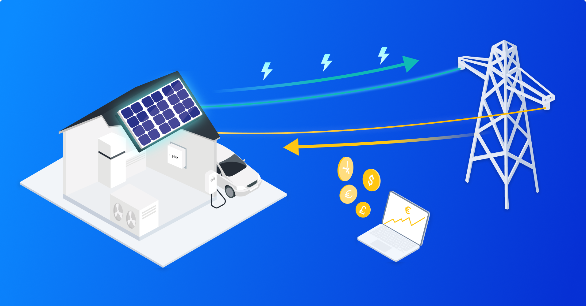

## Table of Contents

## What is a Feed-In Tariff (FIT)?

A Feed-In Tariff (FIT) is a policy that encourages people to produce their own renewable energy, like solar or wind power. It does this by paying them for the electricity they generate and feed back into the power grid. This means if you have solar panels on your roof, you can sell any extra electricity you produce to your energy company. This not only helps the environment by promoting clean energy, but it also helps people save money on their energy bills.

Governments use FITs to make renewable energy more attractive to the public. By offering a guaranteed payment for the electricity produced, more people are willing to invest in things like solar panels or wind turbines. This helps increase the overall amount of green energy being used, which is good for fighting climate change. FITs are popular in many countries because they are a simple way to support renewable energy growth.

## How does a Feed-In Tariff work?

A Feed-In Tariff works by paying people who make their own renewable energy. If you have solar panels or a wind turbine, you can make electricity. When you make more electricity than you need, you can send the extra back to the power grid. The energy company then pays you for that extra electricity. This payment is called a Feed-In Tariff. It makes it easier for people to decide to use renewable energy because they can earn money from it.

The amount of money you get from a Feed-In Tariff depends on how much electricity you send back to the grid and the rate set by the government or energy company. The rate can change, but it's usually set for a long time so people can plan ahead. This helps more people want to use renewable energy because they know they will get paid for the electricity they produce. It's a way to help the environment and save money at the same time.

## What are the main objectives of implementing a Feed-In Tariff?

The main goal of a Feed-In Tariff is to encourage more people to use renewable energy. By paying people for the extra electricity they make from things like solar panels or wind turbines, it makes it easier for them to decide to use clean energy. This helps the environment because more people will choose to make their own electricity instead of using energy from dirty sources like coal or gas.

Another important goal is to help fight climate change. When more people use renewable energy, it means less pollution and fewer greenhouse gases. This is good for the planet because it helps slow down the warming of the Earth. Feed-In Tariffs make it easier for people to do their part in using clean energy and helping the environment.

## What are the benefits of Feed-In Tariffs for renewable energy producers?

Feed-In Tariffs give renewable energy producers a steady income. When you make more electricity than you need, you can send the extra back to the power grid. The energy company then pays you for that extra electricity. This means you can earn money from the electricity you produce, which can help pay for the cost of things like solar panels or wind turbines. Knowing you will get paid for the electricity you make can make it easier to decide to use renewable energy.

Another benefit is that Feed-In Tariffs help make renewable energy more popular. When people see that they can earn money from making their own electricity, more of them will want to do it. This means more people will use clean energy, which is good for the environment. It also helps fight climate change because less pollution and fewer greenhouse gases are produced when more people use renewable energy. So, Feed-In Tariffs help both the people who make the energy and the planet.

## How do Feed-In Tariffs impact the environment?

Feed-In Tariffs help the environment by encouraging more people to use renewable energy. When people get paid for the extra electricity they make from solar panels or wind turbines, they are more likely to choose clean energy over dirty energy from coal or gas. This means less pollution and fewer harmful gases going into the air. By making renewable energy more popular, Feed-In Tariffs help reduce the damage we do to the environment.

Using more renewable energy also helps fight climate change. When we use less dirty energy, we produce fewer greenhouse gases that make the Earth warmer. Feed-In Tariffs make it easier for people to do their part in using clean energy, which helps slow down the warming of the planet. So, by encouraging more people to use renewable energy, Feed-In Tariffs have a big positive impact on the environment.

## What are the differences between Feed-In Tariffs and other renewable energy support mechanisms?

Feed-In Tariffs are different from other renewable energy support mechanisms like tax credits and grants. With Feed-In Tariffs, people get paid for the extra electricity they make from renewable sources like solar or wind. This payment is guaranteed for a long time, which makes it easier for people to decide to use renewable energy because they know they will get money back. On the other hand, tax credits and grants give people money upfront to help them pay for things like solar panels, but they don't keep paying over time like Feed-In Tariffs do.

Another type of support mechanism is called a Renewable Portfolio Standard (RPS). With an RPS, the government makes energy companies use a certain amount of renewable energy. This can help increase the use of clean energy, but it doesn't directly pay people for the electricity they make like Feed-In Tariffs do. Feed-In Tariffs are more direct because they pay people for their renewable energy, which can make it easier for them to afford the switch to clean energy. Each type of support has its own way of helping, but Feed-In Tariffs focus on paying people over time for the energy they produce.

## Can you provide examples of countries that have successfully implemented Feed-In Tariffs?

Germany has been very successful with Feed-In Tariffs. They started using them in 2000, and it helped them become a leader in renewable energy. People in Germany got paid for the electricity they made from solar panels and wind turbines. This made more people want to use clean energy, and now Germany gets a lot of its power from renewable sources. It's a good example of how Feed-In Tariffs can work well.

Spain also used Feed-In Tariffs to grow its renewable energy. They started paying people for the electricity they made from the sun and wind. This helped Spain build a lot of solar and wind power plants. But, they had to change the rules later because it cost a lot of money. Even though they had to make changes, Spain showed that Feed-In Tariffs can help a country use more clean energy.

Another country that did well with Feed-In Tariffs is Japan. After a big problem with a nuclear power plant in 2011, Japan wanted to use more renewable energy. They started paying people for the electricity they made from solar panels. This helped Japan use more clean energy and made it easier for people to switch to renewable sources. Japan's use of Feed-In Tariffs shows how they can help a country move away from dirty energy.

## What are the challenges and criticisms associated with Feed-In Tariffs?

Feed-In Tariffs can be expensive for governments and energy companies. They have to pay people for the extra electricity they make, and if a lot of people start using renewable energy, it can cost a lot of money. Sometimes, the cost can be so high that governments have to change the rules or lower the payments. This can make people upset because they were expecting to get paid a certain amount for their electricity. Also, if the payments are too high, it can make energy prices go up for everyone, which is not fair to people who can't afford to use renewable energy.

Another challenge is that Feed-In Tariffs can be hard to manage. It can be tricky to set the right payment rate. If the rate is too high, it can cost too much money. If it's too low, not enough people will want to use renewable energy. Governments have to keep changing the rates to make sure they work well, but this can be confusing for people. Some people also say that Feed-In Tariffs can be unfair because they mostly help people who can afford to buy things like solar panels. People who can't afford to buy them don't get the same chance to earn money from renewable energy.

## How are Feed-In Tariff rates determined and adjusted over time?

Feed-In Tariff rates are set by the government or the energy company. They look at things like how much it costs to make renewable energy and how much they want to encourage people to use it. They might start with a high rate to get more people interested in using renewable energy. The rate is usually set for a long time, like 20 years, so people know how much they will get paid for their electricity. This helps people feel sure about their investment in things like solar panels.

Over time, the rates can change. Governments might lower the rates if too many people start using renewable energy and it costs too much money. They might also change the rates to keep up with new technology that makes renewable energy cheaper. When the rates change, it can be hard for people who already have solar panels because they might get paid less than they expected. But, the changes are made to keep the Feed-In Tariff system working well for everyone.

## What role do Feed-In Tariffs play in achieving national and international renewable energy targets?

Feed-In Tariffs help countries reach their goals for using more renewable energy. When people get paid for the electricity they make from solar panels or wind turbines, more of them want to use clean energy. This means a country can use less dirty energy from coal or gas. By making renewable energy more popular, Feed-In Tariffs help countries meet their targets for using more clean energy and fighting climate change. Many countries have set goals to use a certain amount of renewable energy by a certain year, and Feed-In Tariffs are a big part of reaching those goals.

On an international level, Feed-In Tariffs also help meet global targets for renewable energy. The world has set big goals to reduce greenhouse gases and slow down climate change. When more countries use Feed-In Tariffs, more people around the world use clean energy. This helps the whole planet because it means less pollution and fewer harmful gases. So, Feed-In Tariffs play an important role in helping the world reach its goals for using more renewable energy and protecting the environment.

## How do technological advancements influence the effectiveness of Feed-In Tariffs?

Technological advancements make Feed-In Tariffs work better. When new technology makes things like solar panels cheaper and more efficient, more people can afford to use them. This means more people can make their own electricity and get paid for it through Feed-In Tariffs. As technology gets better, the cost of making renewable energy goes down, so the government can set the payment rates lower and still have a lot of people interested. This helps keep the Feed-In Tariff system affordable for everyone.

Also, new technology can make it easier to manage Feed-In Tariffs. With better technology, it's easier to keep track of how much electricity people are making and sending back to the grid. This helps make sure people get paid the right amount for their electricity. As technology keeps improving, Feed-In Tariffs can become more effective at encouraging people to use renewable energy and helping the environment.

## What future developments can we expect in the application of Feed-In Tariffs globally?

In the future, we can expect Feed-In Tariffs to become more common around the world as more countries try to use more renewable energy. As technology gets better and cheaper, more people will be able to use things like solar panels and wind turbines. This means more people will want to use Feed-In Tariffs to get paid for the electricity they make. Governments might also make the rules for Feed-In Tariffs easier to understand and use, so more people can take part.

We might also see Feed-In Tariffs working together with other ways to support renewable energy, like tax breaks and grants. This could make it even easier for people to switch to clean energy. As the world keeps trying to fight climate change, Feed-In Tariffs will play a big role in helping countries reach their goals for using more renewable energy. They will help make sure more people can use clean energy and help the environment.

## References & Further Reading

[1]: Couture, T., Cory, K., Kreycik, C., & Williams, E. (2010). ["A Policymaker’s Guide to Feed-in Tariff Policy Design."](https://www.nrel.gov/docs/fy10osti/44849.pdf) National Renewable Energy Laboratory.

[2]: Mendonça, M., Jacobs, D., & Sovacool, B. K. (2010). ["Powering the Green Economy: The Feed-In Tariff Handbook."](https://books.google.com/books/about/Powering_the_Green_Economy.html?id=4XAVzT9hyTkC) Earthscan.

[3]: International Energy Agency (IEA). (2021). ["Renewables 2021: Analysis and Forecast to 2026."](https://www.iea.org/reports/renewables-2021) IEA Publications.

[4]: European Commission. (2019). ["The European Green Deal."](https://commission.europa.eu/strategy-and-policy/priorities-2019-2024/european-green-deal_en) European Commission Press Release.

[5]: U.S. Department of Energy. (2021). ["Production Tax Credit (PTC) and Investment Tax Credit (ITC)."](https://windexchange.energy.gov/projects/tax-credits) U.S. Department of Energy.

[6]: Lopez de Prado, M. (2018). ["Advances in Financial Machine Learning."](https://www.amazon.com/Advances-Financial-Machine-Learning-Marcos/dp/1119482089) John Wiley & Sons.

[7]: Chan, E. P. (2009). ["Quantitative Trading: How to Build Your Own Algorithmic Trading Business."](https://github.com/ftvision/quant_trading_echan_book) Wiley Trading.