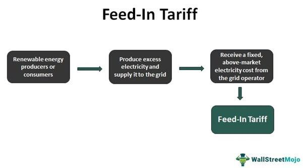

In this article, we will explore how various energy incentives are shaping the renewable energy landscape, focusing particularly on the Feed-in Tariff (FiT) and its impact on sustainable energy policy. Feed-in Tariffs have emerged as a significant tool for boosting the adoption of renewable technologies by ensuring that energy producers receive fixed payments for their contributions to the grid. This financial mechanism reduces the risk for investors and promotes the development of alternative energy sources like solar and wind.

We will also examine the role of algorithmic trading in optimizing energy generation and consumption. Algorithmic trading leverages sophisticated algorithms to automate and enhance trading strategies, offering precision and efficiency that are invaluable for balancing the fluctuating supply and demand in energy markets. This innovative approach not only improves market stability but could potentially lead to more profitable and sustainable energy trading practices.



The integration of renewable energy sources into the existing grid has become increasingly important as the world shifts towards more sustainable practices. Ensuring seamless integration requires technological innovations, adaptable infrastructures, and supportive policies, like FiTs, which collectively guide the energy sector towards a cleaner future.

Understanding these elements is crucial for both policymakers and investors who are looking to maximize returns while promoting clean energy. For policymakers, grasping how energy incentives function and how they interact with emerging technologies provides the knowledge needed to formulate effective regulations. For investors, awareness of these mechanisms and technological advancements aids in making informed decisions that align with both economic interests and sustainability goals.

This introduction sets the stage for a deeper exploration of how these components work together in the ever-evolving energy sector. As we navigate through the article, it becomes evident how critical the synergy between financial incentives, technological innovations, and policy frameworks is for driving the global energy transition.

## Table of Contents

## Understanding Energy Incentives

Energy incentives are crucial financial instruments designed to facilitate the adoption and growth of renewable energy sources. These incentives are implemented in various forms, each serving to lower the economic barriers associated with the initial adoption of renewable technologies. Some of the most common forms include tax rebates, grants, and technical support.

Tax rebates are widely used to incentivize individuals and businesses to invest in renewable energy. These rebates can effectively lower the upfront cost by allowing deductions on the taxes owed. For instance, investors installing solar panels might benefit from a tax rebate that reduces their taxable income, thereby making the investment more economically viable.

Grants provide another avenue of financial support, offering direct funding to individuals or organizations undertaking renewable energy projects. By supplying capital without the expectation of repayment, grants can substantially mitigate financial risks, encouraging more stakeholders to engage in renewable energy endeavors.

Technical support is another critical form of incentive, offering expertise and resources to facilitate the adoption of renewable technologies. This support can include training programs, consultancy services, and technical assistance, all aimed at enhancing the operational success of renewable energy projects.

The primary objective of these energy incentives is to lessen the financial burden on investors and consumers. By reducing upfront costs and ongoing financial risks, these incentives make renewable energy options more appealing. This financial attractiveness is vital for accelerating the shift away from fossil fuels towards more sustainable energy solutions. Economic studies often indicate a positive correlation between the availability of energy incentives and increased investment in renewables, signifying their vital role in shifting energy paradigms.

Evaluating the effectiveness of these incentives reveals their critical role in driving innovation within the energy sector. By fostering an environment conducive to renewable energy adoption, these financial instruments prompt research, development, and the deployment of new technologies. Governments and organizations that employ comprehensive incentive schemes often witness heightened levels of renewable energy penetration, paving the way for a more sustainable energy future.

In summary, energy incentives serve as pivotal tools in the transition to renewable energy. By making such energy sources more financially accessible, they catalyze both innovation and investment, contributing significantly to the global move towards sustainable energy solutions.

## The Role of Feed-in Tariffs (FiT)

Feed-in Tariffs (FiT) are a foundational mechanism in the promotion of renewable energy, providing a structured approach to incentivizing cleaner energy generation. These tariffs are designed to guarantee producers of renewable energy a fixed payment for the electricity they supply to the grid. Typically, these payments are based on the cost of generation specific to each technology, ensuring that producers can cover their costs while [earning](/wiki/earning-announcement) a reasonable return on investment. This structure effectively lowers the financial barriers to entry, encouraging more entities to enter the renewable energy market.

The implementation of FiTs has proven highly effective in promoting the deployment of renewable energy technologies such as solar photovoltaics, wind turbines, and biomass. This policy tool has catalyzed substantial growth by offering long-term contracts, which provide economic certainty to producers. For instance, the German Renewable Energy Sources Act (EEG) is often cited as a successful case where FiTs played a crucial role in advancing the country's renewable energy capacity, particularly in the solar and wind sectors.

The predictability of returns provided by FiTs is a critical [factor](/wiki/factor-investing) in their success. By offering stable and predictable financial returns, these tariffs minimize investment risks, thereby attracting a broad array of investors ranging from small-scale private individuals to large-scale energy conglomerates. This stability is particularly important in the energy sector, where significant capital investments are usually required upfront.

Various case studies worldwide illustrate the efficacy and scalability of FiT systems. In Germany, FiTs facilitated a substantial increase in renewable energy generation, leading to the country becoming a global leader in solar PV installations. Similarly, in countries like Spain and Italy, FiTs were instrumental in accelerating renewable energy adoption, although both countries experienced challenges in maintaining the stability of these policies over time due to economic constraints and policy shifts.

The evolution and refinement of FiT policies continue to be a topic of interest for policymakers and stakeholders. Lessons learned from existing implementations guide ongoing policy development, with an emphasis on balancing incentive levels, ensuring economic sustainability, and driving further technological innovation. Such analyses are vital for optimizing FiT mechanisms to maintain their effectiveness in promoting renewable energy, making this policy tool an enduring element in the global effort to transition to cleaner energy sources.

## Renewable Energy Policy: Global Perspectives

Governments worldwide are implementing policies to support the growth of renewable energy, recognizing the urgent need to transition to more sustainable energy systems. These policies vary significantly across regions due to differences in economic structures, priorities, and available resources. 

One prominent example is the European Green Deal, which aims to make Europe the first climate-neutral continent by 2050. This strategy encompasses various initiatives, including investments in energy-efficient technologies, the decarbonization of energy systems, and the promotion of clean transport. It also establishes a framework to enhance carbon pricing mechanisms and encourage private investments in green projects. The European Green Deal underscores a commitment to extensive legislative measures and financial resources to support green transformation efforts across all EU member states [1].

In contrast, China has enacted robust incentives for solar energy, driving its position as a global leader in solar power production. The Chinese government has implemented policies that offer subsidies for solar panel installations and further investment in photovoltaic (PV) technology. China's substantial manufacturing capacity and government support have led to considerable reductions in the cost of solar technology, contributing to its widespread adoption both domestically and internationally [2].

The United States adopts a different approach, focusing on state-level policies and market-driven incentives to enhance renewable energy generation. For instance, the Production Tax Credit (PTC) and the Investment Tax Credit (ITC) are federal incentives that encourage the development of wind and solar industries. Moreover, individual states have Renewable Portfolio Standards (RPS) mandating a certain percentage of electricity to be sourced from renewable energy, driving significant growth in clean energy capacity [3].

By comparing these distinct policy frameworks, policymakers can glean valuable insights. European strategies highlight the impact of regulatory and financial instruments in driving comprehensive climate goals. In contrast, China's model demonstrates the effectiveness of direct government intervention and support in scaling specific technologies like solar power. The U.S. experience underscores the role of diversified policy measures and private sector collaboration in promoting renewable energy deployment.

Understanding these global trends is key for identifying best practices and potential pitfalls in renewable energy policy formation. The lessons learned from these varying approaches can guide future policies, ensuring they are tailored to regional contexts and effectively contribute to global renewable energy objectives.

### References
1. European Commission. (2019). The European Green Deal. Retrieved from https://ec.europa.eu/commission/presscorner/detail/en/ip_19_6691
2. International Energy Agency (IEA). (2021). Renewables 2021: Analysis and forecast to 2026. Retrieved from https://www.iea.org/reports/renewables-2021
3. U.S. Department of Energy. (2021). Renewable Energy: Production Tax Credit (PTC) and Investment Tax Credit (ITC). Retrieved from https://www.energy.gov/eere/renewables/production-tax-credit-ptc-and-investment-tax-credit-itc

## How Algorithmic Trading Innovates Energy Markets

Algorithmic trading in energy markets leverages complex algorithms and real-time data to automate and enhance the efficiency of energy transactions. As the demand for renewable energy assets grows, these algorithms help improve market operations by providing increased precision and diminished risk. This section explores how [algorithmic trading](/wiki/algorithmic-trading) is utilized within these markets, highlighting its potential benefits in terms of stability and profitability.

Algorithmic trading systems use sophisticated mathematical models and statistical analyses to predict market trends and execute trades. By analyzing vast datasets, these systems can identify patterns and correlations that might be overlooked by human traders. For instance, algorithms can evaluate weather forecasts, electricity consumption data, and market prices to make informed trading decisions in real time. This capability is particularly beneficial in energy markets, where price fluctuations can occur rapidly due to changes in demand, weather conditions, or geopolitical events.

An essential feature of algorithmic trading in energy markets is its ability to react instantly to market changes. With the integration of real-time data feeds, these systems can adjust buy and sell orders dynamically, ensuring optimal transaction timing. For example, an algorithm might decide to purchase additional renewable energy credits if it predicts a forthcoming increase in demand due to an approaching heatwave. By maintaining a balanced supply and demand, algorithmic trading aids in stabilizing prices and reducing [volatility](/wiki/volatility-trading-strategies).

The precision of algorithmic trading contributes to the reduction of risks associated with energy market transactions. By eliminating human error and emotion from trading decisions, algorithmic systems enhance the predictability and reliability of market operations. Furthermore, algorithms can be back-tested using historical data to evaluate their performance under various market conditions, allowing for continuous optimization and improvement.

Python, a popular programming language for algorithmic trading, offers numerous libraries and tools for developing these systems. For example, the `Pandas` library can handle large datasets, while `NumPy` and `SciPy` are useful for numerical computations. A simple Python script for algorithmic trading might look like this:

```python
import pandas as pd
import numpy as np

# Load historic energy market data
data = pd.read_csv('market_data.csv')

# Define a simple moving average function
def moving_average(series, window):
    return series.rolling(window=window).mean()

# Calculate moving averages
data['Short_MA'] = moving_average(data['Price'], window=10)
data['Long_MA'] = moving_average(data['Price'], window=50)

# Identify trade signals
data['Signal'] = 0
data['Signal'][10:] = np.where(data['Short_MA'][10:] > data['Long_MA'][10:], 1, 0)

# Calculate daily returns
data['Returns'] = data['Price'].pct_change()

# Backtest strategy performance
data['Strategy_Returns'] = data['Returns'] * data['Signal'].shift(1)
strategy_performance = data['Strategy_Returns'].sum()
```

This script demonstrates a basic strategy using moving averages to generate buy and sell signals based on historical energy prices. While simplistic, it illustrates the core components of an algorithmic trading system: data analysis, signal generation, and strategy evaluation.

In conclusion, the integration of algorithmic trading into energy markets represents a significant advancement in market mechanics. By improving accuracy, responsiveness, and risk management, algorithmic systems pave the way for a more stable and profitable future in energy trading. As these technologies continue to evolve, their impact on the trading landscape will only grow, further intertwining the future of energy markets with innovative algorithmic solutions.

## Challenges and Opportunities in Renewable Energy Trading

Algorithmic trading has introduced a new paradigm in renewable energy markets by automating and optimizing trades with high precision. Despite its advantages, several challenges must be addressed to fully leverage its potential.

Data security is a significant concern, as the reliance on vast amounts of data makes algo-trading systems vulnerable to breaches and unauthorized access. Ensuring robust cybersecurity measures is essential to protect sensitive information and maintain market confidence. Moreover, the risk of market manipulation is amplified by the speed and complexity at which these algorithms operate. Rogue algorithms could engender unfair trading practices, necessitating stringent monitoring and detection systems.

Adapting regulatory frameworks to keep pace with these technological innovations is another considerable challenge. Regulators must strike a balance between fostering innovation and ensuring market stability. This process calls for a deep understanding of automated trading dynamics and thorough analysis to adapt existing regulations accordingly.

On the opportunities side, the enhanced [liquidity](/wiki/liquidity-risk-premium) provided by algorithmic trading can attract more investors to the renewable energy sector. Improved liquidity means easier entry and [exit](/wiki/exit-strategy) from positions, which can lower the capital costs associated with investments in renewable energy infrastructure. Furthermore, the increased efficiency in trade executions minimizes transaction costs, encouraging higher trading volumes and improving market depth.

Emerging technologies like blockchain provide promising solutions for addressing transparency deficiencies and enhancing data security. Blockchain's immutable ledger can offer a transparent and tamper-proof way of recording transactions, which could help mitigate risks associated with data integrity and manipulation. For example, a smart contract on a blockchain could automatically execute trades once pre-defined conditions are met, all while maintaining a transparent and secure transaction history.

Python Code Example:
```python
from cryptography.hazmat.primitives import hashes
from cryptography.hazmat.backends import default_backend

# Illustrating the use of blockchain for secure transaction records
def hash_transaction(transaction):
    digest = hashes.Hash(hashes.SHA256(), backend=default_backend())
    digest.update(transaction.encode())
    return digest.finalize()

transaction = "Renewable Energy Trade: 1000 Solar Units at $50 each"
hashed_transaction = hash_transaction(transaction)

print(f"Transaction Hash: {hashed_transaction.hex()}")
```

In conclusion, while challenges such as data security and regulatory adaptation are significant, the potential benefits of integrating algorithmic trading with renewable energy are substantial. With enhanced liquidity and the prospect of utilizing blockchain for transparency, the incorporation of technological advancements in energy trading could catalyze a more dynamic and robust renewable energy market. Addressing these issues comprehensively will be crucial for stakeholders aiming to maximize both their environmental and economic objectives in the renewable energy landscape.

## Conclusion: The Interplay of Technology and Policy

The synergy between energy incentives, policies such as Feed-in Tariffs (FiT), and innovative technologies like algorithmic trading plays a crucial role in the advancement of renewable energy. These elements collectively contribute to creating a more sustainable and profitable energy future by addressing the multifaceted challenges inherent in transitioning away from fossil fuels. 

Energy incentives, including FiTs, provide a stable financial framework that encourages investment from both public and private sectors. By offering predictable returns, these incentives lower the financial risks associated with renewable energy projects, making them more attractive to investors. This has been evidenced by the significant increase in renewable installations globally, leading to advancements in technologies and a decrease in costs.

On the technological front, algorithmic trading offers significant potential for optimizing the energy markets. Through efficiently balancing supply and demand using real-time data, algorithmic trading enhances market liquidity and reduces the risks associated with price volatility. This technological innovation ensures that renewable energy can be traded with enhanced precision, providing a foundation for further investments and development in this sector. Moreover, the application of advanced algorithms facilitates greater integration of renewable sources into the existing grid, supporting a smoother and more efficient transition.

The continuous collaboration among governments, investors, and tech innovators remains central to overcoming future energy challenges. Policymakers are tasked with creating adaptive regulatory frameworks that keep pace with technological advancements and market shifts, while investors and technologists must focus on developing and deploying solutions that address current limitations. As this ecosystem matures, the integration of energy incentives, policy mechanisms, and state-of-the-art technologies will largely dictate the speed at which global energy transformation is achieved.

Staying informed and adapting to emerging trends and technologies will allow stakeholders to fully leverage the advancements in renewable energy. This proactive approach will not only accelerate the global transition to sustainable energy sources but also pave the way for a resilient energy infrastructure that could efficiently meet the demands of future generations. As the landscape evolves, the interplay of technology and policy will be instrumental in shaping a sustainable energy future.

## References & Further Reading

[1]: Couture, T., Cory, K., Kreycik, C., & Williams, E. (2010). ["A Policymaker’s Guide to Feed-in Tariff Policy Design."](https://www.nrel.gov/docs/fy10osti/44849.pdf) National Renewable Energy Laboratory.

[2]: Mendonça, M., Jacobs, D., & Sovacool, B. K. (2010). ["Powering the Green Economy: The Feed-In Tariff Handbook."](https://books.google.com/books/about/Powering_the_Green_Economy.html?id=4XAVzT9hyTkC) Earthscan.

[3]: International Energy Agency (IEA). (2021). ["Renewables 2021: Analysis and Forecast to 2026."](https://www.iea.org/reports/renewables-2021) IEA Publications.

[4]: European Commission. (2019). ["The European Green Deal."](https://commission.europa.eu/strategy-and-policy/priorities-2019-2024/european-green-deal_en) European Commission Press Release.

[5]: U.S. Department of Energy. (2021). ["Production Tax Credit (PTC) and Investment Tax Credit (ITC)."](https://windexchange.energy.gov/projects/tax-credits) U.S. Department of Energy.

[6]: Lopez de Prado, M. (2018). ["Advances in Financial Machine Learning."](https://www.amazon.com/Advances-Financial-Machine-Learning-Marcos/dp/1119482089) John Wiley & Sons.

[7]: Chan, E. P. (2009). ["Quantitative Trading: How to Build Your Own Algorithmic Trading Business."](https://github.com/ftvision/quant_trading_echan_book) Wiley Trading.