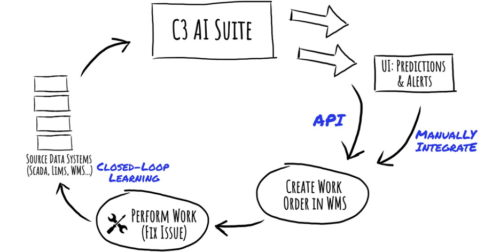

## Table of Contents

## What is a feedback loop in the context of machine learning?

A feedback loop in machine learning is a process where the output of a model is used as input to improve the model's performance over time. Imagine you're learning to play a musical instrument. Each time you practice, you listen to your performance and adjust your technique based on what you hear. Similarly, in machine learning, a model might make predictions, and then those predictions are used to refine the model, making it better at predicting in the future.

This process can be very powerful, but it also needs to be managed carefully. If the feedback loop is set up correctly, it can help the model learn from new data and become more accurate. However, if the loop introduces errors or biases, it can make the model's performance worse. For example, if a model is used to recommend videos on a platform, and it only recommends videos similar to what users have watched before, it might create a feedback loop that limits the variety of content users see, making the recommendations less useful over time.

## How does a feedback loop work in machine learning models?

A feedback loop in machine learning works by using the model's predictions to help improve its performance over time. Imagine you're playing a game where you guess a number, and after each guess, you get a hint if you're too high or too low. In machine learning, the model makes a prediction, and then it uses the real outcome to adjust its guesses in the future. This is like learning from your mistakes to get better at the game.

For example, let's say you have a model that predicts whether it will rain tomorrow. Every day, it makes a prediction, and then the next day, it sees if it was right or wrong. If it was wrong, it adjusts its calculations to be more accurate next time. This process keeps going, with the model getting a little better each time it learns from its predictions. But, it's important to make sure the data it's learning from is good, because if the model learns from bad data, it might start making worse predictions instead of better ones.

## What are the different types of feedback loops in machine learning?

In machine learning, there are mainly two types of feedback loops: positive feedback loops and negative feedback loops. A positive feedback loop is when the model's output is used to reinforce and amplify the initial predictions. For example, if a recommendation system suggests a product and the user likes it, the system might suggest similar products more often, creating a cycle where the recommendations become more focused on that type of product. This can be good for quickly improving accuracy, but it can also lead to problems like overfitting or creating echo chambers where users only see similar content.

On the other hand, a negative feedback loop works to correct and stabilize the model's performance. If the model makes a wrong prediction, the negative feedback loop uses that information to adjust the model so it's less likely to make the same mistake again. For instance, if a model predicts a stock price and gets it wrong, the negative feedback loop would use the actual price to refine the model's calculations. This helps the model learn from its errors and become more accurate over time. Both types of feedback loops are important, but they need to be carefully managed to make sure the model keeps improving without going off track.

## Can you explain the role of feedback loops in improving model performance?

Feedback loops play a crucial role in improving the performance of machine learning models by allowing them to learn from their predictions. When a model makes a prediction, it compares that prediction to the actual outcome. If the prediction was wrong, the model uses this information to adjust its calculations, making it more likely to get it right next time. This process is like practicing a skill: the more you practice and learn from your mistakes, the better you get. For example, if a model predicts whether it will rain and it's wrong, it can use the real weather data to tweak its prediction method, gradually improving its accuracy.

However, feedback loops need to be managed carefully to ensure they help rather than hurt the model's performance. Positive feedback loops can quickly improve a model's accuracy by reinforcing successful predictions, but they can also lead to problems like overfitting, where the model becomes too specialized and loses its ability to generalize to new data. Negative feedback loops, on the other hand, help correct the model's errors, making it more stable and reliable over time. By balancing these types of feedback, machine learning models can continuously learn and adapt, becoming more effective at their tasks.

## What are some common examples of feedback loops in everyday machine learning applications?

One common example of a feedback loop in everyday machine learning applications is in recommendation systems, like those used by streaming services or online shopping platforms. When you watch a movie or buy a product, the system takes note of your choice and uses it to suggest similar items in the future. If you like the recommendations and keep choosing them, the system learns to show you more of the same type of content or products. This is a positive feedback loop because it reinforces the model's predictions based on your behavior.

Another example is in predictive text and autocorrect features on smartphones. When you type a message, the phone suggests words or corrects your spelling. If you accept the suggestion or correction, the system learns that it made a good guess and will be more likely to suggest similar words or corrections in the future. If you ignore or override the suggestion, the system learns from that too, adjusting its predictions to be more accurate next time. This is a negative feedback loop because it helps the model correct its errors and improve over time.

## How can feedback loops lead to bias in machine learning models?

Feedback loops can introduce bias into machine learning models when the data they learn from is not diverse or representative. Imagine a recommendation system on a website that suggests videos. If it only suggests videos similar to what you've watched before, you might keep watching the same type of content. This creates a positive feedback loop where the model keeps suggesting more of the same, narrowing your choices and reinforcing any initial biases in the data. Over time, this can lead to a model that only works well for certain types of people or situations, ignoring others.

To prevent this, it's important to keep an eye on the data the model is learning from and make sure it includes a wide variety of examples. If the model only learns from a small slice of the world, it will make biased predictions. For instance, if a model for approving loans only learns from data of people who were approved, it might miss out on important patterns that could help approve loans for a wider range of applicants. By carefully managing feedback loops and ensuring the data is diverse, we can reduce bias and make machine learning models fairer and more accurate for everyone.

## What are the potential risks and ethical considerations of using feedback loops in machine learning?

Using feedback loops in machine learning can lead to several risks and ethical concerns. One major risk is the potential for creating or amplifying biases. If the data used in the feedback loop is not diverse, the model might start making predictions that favor certain groups over others. This can lead to unfair outcomes, like a recommendation system that only suggests content to people who already like similar things, ignoring the preferences of others. Another risk is the possibility of the model overfitting to the data it sees, meaning it becomes too specialized and performs poorly on new, unseen data. This can happen if the feedback loop reinforces the model's initial predictions too strongly without considering new information.

Ethically, it's important to consider how feedback loops might affect people's lives. For example, if a model used in hiring or lending decisions has biased feedback loops, it could unfairly disadvantage certain groups of people. This raises questions about fairness and equality. Additionally, there's the issue of transparency: if feedback loops are used to continuously update a model, it can be hard for people to understand how decisions are being made about them. This lack of transparency can erode trust in the technology. To address these concerns, it's crucial to monitor the data used in feedback loops, ensure it's diverse and representative, and be open about how the model works and how it's being improved over time.

## How can one design a feedback loop to enhance a machine learning model's accuracy?

To design a feedback loop that enhances a machine learning model's accuracy, start by ensuring the model has access to good data. The data used in the feedback loop should be diverse and represent the real world well. For example, if you're building a model to predict house prices, make sure the data includes houses from different neighborhoods and price ranges. When the model makes a prediction, compare it to the actual outcome. If the prediction is wrong, use that information to adjust the model's calculations. This helps the model learn from its mistakes and get better over time. Think of it like playing a game where you get better each time you play by learning from your previous moves.

It's also important to balance positive and negative feedback loops. A positive feedback loop can quickly improve the model's accuracy by reinforcing successful predictions. For instance, if a model correctly predicts a stock price, it can use that success to fine-tune its approach. However, be careful not to let the model become too specialized, which can happen if it only learns from a narrow set of data. On the other hand, a negative feedback loop helps correct the model's errors, making it more stable and reliable. If the model predicts a stock price and gets it wrong, the negative feedback loop uses the real price to adjust the model's calculations. By carefully managing both types of feedback loops, you can help the model learn and adapt, becoming more accurate and effective at its task.

## What techniques are used to monitor and adjust feedback loops in machine learning?

To monitor and adjust feedback loops in machine learning, one common technique is to use performance metrics. These metrics help track how well the model is doing over time. For example, if you're using a model to predict whether it will rain, you might look at how often it gets the prediction right. If the accuracy starts to drop, it might mean the feedback loop is not working well, and you need to adjust the model. Another technique is to use A/B testing, where you compare two versions of the model to see which one performs better. This helps you understand if changes to the feedback loop are helping or hurting the model's performance.

Another important technique is to keep an eye on the data the model is learning from. If the data starts to become less diverse or representative, the feedback loop might start introducing biases. To fix this, you might need to add more diverse data or adjust how the model uses the data it has. Regularly reviewing the model's predictions and the real outcomes can also help you spot when the feedback loop is going off track. By carefully monitoring these aspects and making adjustments when needed, you can keep the feedback loop working well and help the model stay accurate and fair.

## How do feedback loops interact with other machine learning concepts like reinforcement learning?

Feedback loops and reinforcement learning are closely related because both involve learning from outcomes to improve performance over time. In reinforcement learning, an agent learns to make decisions by taking actions in an environment and receiving rewards or penalties based on those actions. This process creates a feedback loop where the agent uses the rewards or penalties to adjust its future actions. For example, if a robot is learning to navigate a maze, it might try different paths and get rewarded for finding the exit. The feedback loop helps the robot learn which actions lead to better outcomes, guiding it to find the best path more quickly.

In both feedback loops and reinforcement learning, the key idea is to use past experiences to make better decisions in the future. The feedback loop in reinforcement learning helps the agent refine its policy, which is the strategy it uses to choose actions. If the agent makes a good decision and gets a high reward, the feedback loop reinforces that action, making it more likely to be chosen again. On the other hand, if the agent makes a bad decision and gets a low reward, the feedback loop helps it learn to avoid that action in the future. This continuous cycle of action, feedback, and adjustment is what allows the agent to improve its performance over time, making reinforcement learning a powerful tool in machine learning.

## What are advanced methods for optimizing feedback loops in complex machine learning systems?

To optimize feedback loops in complex machine learning systems, one advanced method is to use adaptive learning rates. Imagine you're adjusting the volume on a radio: if it's too loud, you turn it down a bit, but if it's just a little off, you make smaller adjustments. In machine learning, the learning rate is like the volume knob. By using techniques like learning rate schedules or adaptive optimizers like Adam or RMSprop, the model can make bigger adjustments when it's far from the right answer and smaller ones when it's getting close. This helps the model learn more efficiently and avoid getting stuck in less-than-optimal solutions.

Another method is to implement ensemble learning, where multiple models work together and learn from each other's feedback. Think of it like a team of experts working on a problem: each expert might have a different approach, but by sharing their insights, they can come up with a better solution together. In machine learning, these models can be combined in various ways, such as through bagging or boosting, to create a more robust and accurate system. By carefully designing how these models interact and share feedback, the overall performance of the system can be significantly improved.

## Can you discuss a case study where a feedback loop significantly impacted a machine learning project's outcome?

One notable case study where a feedback loop significantly impacted a machine learning project's outcome is the story of how Netflix improved its recommendation system. Netflix used a feedback loop to continuously learn from user behavior, which helped them tailor movie and TV show recommendations more accurately over time. When a user watched a show or movie, the system took note of this and used it to suggest similar content. If the user liked the recommendations and watched more of the same type, the feedback loop reinforced these suggestions, making the recommendations increasingly personalized. This positive feedback loop helped Netflix keep users engaged and satisfied, leading to higher retention rates and more satisfied customers.

However, Netflix also had to be careful to avoid creating echo chambers where users only saw the same type of content. To prevent this, they introduced elements of negative feedback into their system. For example, if a user consistently skipped or disliked certain types of recommendations, the system learned to show less of that content. This balance between positive and negative feedback loops helped Netflix maintain a diverse set of recommendations while still personalizing them to individual users. As a result, Netflix's recommendation system became one of the key factors in its success, showing how well-designed feedback loops can significantly enhance the performance of a machine learning model.