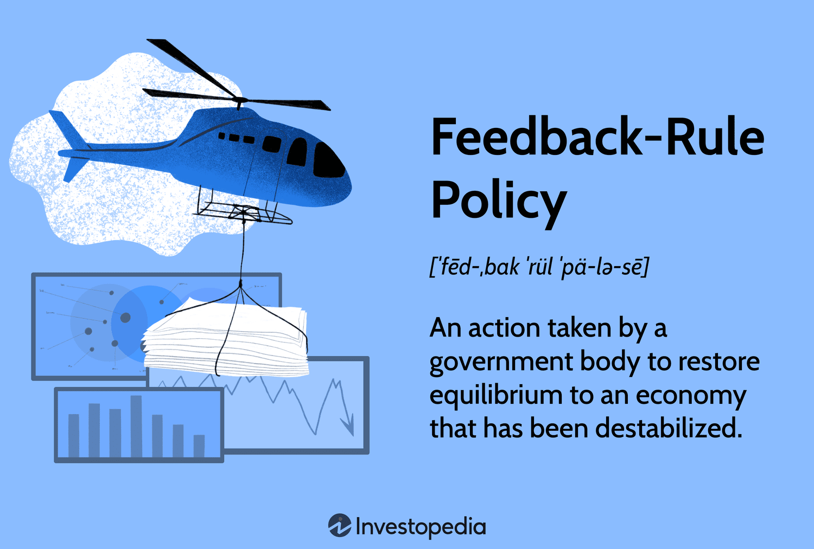

## Table of Contents

## What is a Feedback Rule Policy?

A Feedback Rule Policy is a set of guidelines that a company or organization uses to manage and respond to feedback from customers or users. It helps make sure that feedback is handled in a fair and consistent way. This policy outlines how feedback should be collected, who should review it, and how the company should respond to it. It also includes rules on what kind of feedback is useful and how to use it to improve products or services.

Having a clear Feedback Rule Policy is important because it helps build trust with customers. When people know that their feedback is valued and will be dealt with properly, they are more likely to share their thoughts and ideas. This can lead to better products and services, as the company can learn from the feedback and make necessary changes. A good policy also ensures that everyone in the organization knows how to handle feedback, which can prevent confusion and mistakes.

## Why is a Feedback Rule Policy important in organizations?

A Feedback Rule Policy is important in organizations because it helps them handle feedback from customers in a fair and consistent way. When a company has clear rules about how to collect, review, and respond to feedback, it makes sure that everyone knows what to do. This helps prevent confusion and mistakes. It also makes sure that all feedback is treated the same, no matter who it comes from.

Having a good Feedback Rule Policy also builds trust with customers. When people see that their feedback is taken seriously and handled properly, they are more likely to share their thoughts and ideas. This can help the company improve its products and services. By listening to feedback and making changes based on it, the organization can meet the needs of its customers better and keep them happy.

## How does a Feedback Rule Policy differ from other types of policies?

A Feedback Rule Policy is different from other types of policies because it focuses on how a company handles feedback from customers. While other policies might deal with things like employee behavior, safety rules, or financial procedures, a Feedback Rule Policy is all about making sure customer feedback is collected, reviewed, and responded to in a fair and consistent way. It sets out clear steps for how feedback should be managed, which helps everyone in the organization know what to do.

Unlike general policies that might apply to everyone in the company, a Feedback Rule Policy is specifically aimed at improving the relationship between the company and its customers. It helps build trust by showing customers that their opinions are valued and will be acted upon. Other policies might not have this direct impact on customer relations. By having a dedicated policy for feedback, a company can make sure it is always learning from its customers and using that information to get better.

## What are the key components of an effective Feedback Rule Policy?

An effective Feedback Rule Policy has several important parts. First, it needs clear rules on how to collect feedback. This means deciding what methods to use, like surveys, emails, or feedback forms, and making sure everyone knows how to use them. The policy should also say who is in charge of looking at the feedback and how often they should do it. This helps make sure feedback is not ignored and is dealt with quickly.

Second, the policy should explain how to respond to feedback. It should set out steps for thanking people for their feedback, letting them know what will happen next, and telling them what changes were made because of their input. This part is important for building trust with customers. They need to see that their feedback matters and that the company is listening to them.

Lastly, the policy should include rules on how to use feedback to improve products or services. It should say how to decide which feedback is most useful and how to turn that feedback into action. This might mean making changes to products, training staff differently, or changing how the company does things. By having these rules, the company can make sure it is always getting better based on what customers say.

## Who should be involved in creating a Feedback Rule Policy?

Creating a Feedback Rule Policy needs a team effort. People from different parts of the company should be involved. This includes folks from customer service who know how to talk to customers, people from product development who can use feedback to make things better, and managers who can make sure everyone follows the policy. It's also good to have someone from the legal team to make sure the policy follows the law.

Having a diverse team helps make a strong policy. Each person brings their own skills and knowledge. Customer service people can say how to collect and respond to feedback in a way that makes customers happy. Product developers can explain how to use feedback to improve products. Managers can make sure the policy works well across the whole company. This way, the Feedback Rule Policy will be fair, useful, and easy to follow.

## How can a Feedback Rule Policy be implemented within an organization?

To implement a Feedback Rule Policy in an organization, start by sharing the policy with everyone who works there. Use meetings, emails, or training sessions to explain the policy. Make sure everyone knows how to collect feedback, who should look at it, and how to respond to it. It's also important to set up a system for tracking feedback, so you can see what people are saying and how the company is responding. This could be a computer program or just a simple spreadsheet.

Next, make sure the policy is followed every day. Have someone in charge of checking that feedback is being handled the right way. This person can help fix any problems and make sure the policy is working well. It's also a good idea to ask employees and customers what they think about the policy. If something isn't working, change the policy to make it better. By keeping the policy up to date and making sure everyone follows it, the organization can use feedback to improve and keep customers happy.

## What are common challenges faced when enforcing a Feedback Rule Policy?

One common challenge when enforcing a Feedback Rule Policy is getting everyone to follow it. People might not understand the policy or they might forget to do things the right way. This can lead to feedback being ignored or not handled properly. To fix this, the company needs to keep reminding everyone about the policy and make sure there is training to help people know what to do. Having someone in charge to check that the policy is being followed can also help.

Another challenge is dealing with a lot of feedback. Sometimes, a company might get so much feedback that it's hard to keep up. This can make it slow to respond to customers and can cause important feedback to be missed. To solve this, the company can use tools to sort and track feedback better. It's also important to decide which feedback is most important and focus on that first. By doing this, the company can handle feedback more efficiently and make sure customers feel heard.

## How can the effectiveness of a Feedback Rule Policy be measured?

To measure how well a Feedback Rule Policy is working, you can look at how quickly the company responds to feedback. If customers get quick replies to their feedback, it shows the policy is helping the company handle feedback efficiently. Another way to check is by seeing if the feedback is actually being used to make things better. If the company makes changes based on what customers say, it means the policy is helping turn feedback into action.

You can also ask customers what they think about how their feedback is handled. If they feel their feedback is valued and acted upon, it's a good sign the policy is effective. Surveys or feedback forms can help gather this information. By looking at these different measures, a company can see if its Feedback Rule Policy is working well and making a positive difference.

## What are best practices for updating a Feedback Rule Policy?

To keep a Feedback Rule Policy working well, it's important to update it regularly. One good way to do this is by checking the policy every year or when there are big changes in the company. This helps make sure the policy still fits with how the company works and what customers need. When updating, it's helpful to look at feedback from customers and employees to see what's working and what's not. If people say the policy is hard to follow or not useful, it's time to make changes.

Another important part of updating the policy is to involve different people in the company. This means getting input from customer service, product development, and managers. Each group can share what they've learned and suggest ways to make the policy better. After making changes, it's key to tell everyone about the updates. Use meetings, emails, or training to explain the new rules so everyone knows how to follow them. By keeping the policy up to date and clear, the company can keep using feedback to improve and keep customers happy.

## Can you provide examples of successful Feedback Rule Policies in different industries?

In the tech industry, a company like Apple has a successful Feedback Rule Policy. They use customer feedback to improve their products. For example, when people gave feedback about wanting more battery life in their iPhones, Apple listened and made changes to the next models. They also have a clear way to collect feedback through their website and app. Customers know their feedback is valued because Apple often tells them about new features that came from their suggestions. This helps build trust and keeps customers happy.

In the hospitality industry, a hotel chain like Marriott uses feedback to make guests' stays better. They have a system where guests can leave feedback after their stay, and the staff quickly respond to any issues. If a guest says the room was too cold, the hotel might adjust the heating or offer a warmer blanket. Marriott also uses feedback to train their staff and improve services. By showing guests that their feedback leads to real changes, Marriott keeps guests coming back and improves their reputation for good service.

## How does technology impact the implementation and management of Feedback Rule Policies?

Technology makes it easier to handle Feedback Rule Policies. It helps companies collect feedback in many ways, like through apps, websites, or emails. This means more people can share their thoughts quickly and easily. Technology also helps sort and track feedback, so it's not hard to find what customers are saying. Special software can look at feedback to find common problems or good ideas. This helps companies respond faster and make better choices based on what customers say.

Using technology also helps keep everyone in the company on the same page. Systems can send reminders about the policy and show how to follow it. This makes sure everyone knows what to do with feedback. Technology can also help see if the policy is working well. It can track how fast the company responds to feedback and if changes are made because of it. By using technology, companies can make their Feedback Rule Policies stronger and more effective.

## What advanced strategies can be used to enhance the impact of a Feedback Rule Policy?

One advanced strategy to make a Feedback Rule Policy better is to use data analysis tools. These tools can look at a lot of feedback quickly and find patterns or common issues that might be missed by just reading feedback. For example, if many customers say the same thing about a product, the company can see this and fix it faster. Using data analysis helps make sure the company is focusing on the most important feedback and making changes that will help the most people.

Another strategy is to use AI and machine learning to handle feedback. These technologies can sort feedback into different groups, like positive or negative, and even suggest what to do about it. For example, AI can read feedback and say if a customer needs a quick reply or if the feedback should be used to change a product. By using AI, the company can respond to feedback faster and make smarter choices about how to use it. This makes the Feedback Rule Policy more effective and helps keep customers happy.

## References & Further Reading

[1]: Breiman, L. (2001). ["Random Forests."](https://link.springer.com/article/10.1023/A:1010933404324) Machine Learning, 45(1), 5-32.

[2]: ["Advances in Financial Machine Learning"](https://www.amazon.com/Advances-Financial-Machine-Learning-Marcos/dp/1119482089) by Marcos Lopez de Prado

[3]: Taylor, J. B. (1993). ["Discretion versus Policy Rules in Practice."](https://web.stanford.edu/~johntayl/Onlinepaperscombinedbyyear/1993/Discretion_versus_Policy_Rules_in_Practice.pdf) Carnegie-Rochester Conference Series on Public Policy, 39, 195-214.

[4]: ["Machine Learning for Algorithmic Trading"](https://github.com/stefan-jansen/machine-learning-for-trading) by Stefan Jansen

[5]: Goodfellow, I., Bengio, Y., & Courville, A. (2016). ["Deep Learning."](https://www.deeplearningbook.org/) MIT Press.

[6]: ["Quantitative Trading: How to Build Your Own Algorithmic Trading Business"](https://www.amazon.com/Quantitative-Trading-Build-Algorithmic-Business/dp/1119800064) by Ernest P. Chan

[7]: Bloom, N. (2009). ["The Impact of Uncertainty Shocks."](https://onlinelibrary.wiley.com/doi/abs/10.3982/ECTA6248) American Economic Review, 99(2), 623-85.