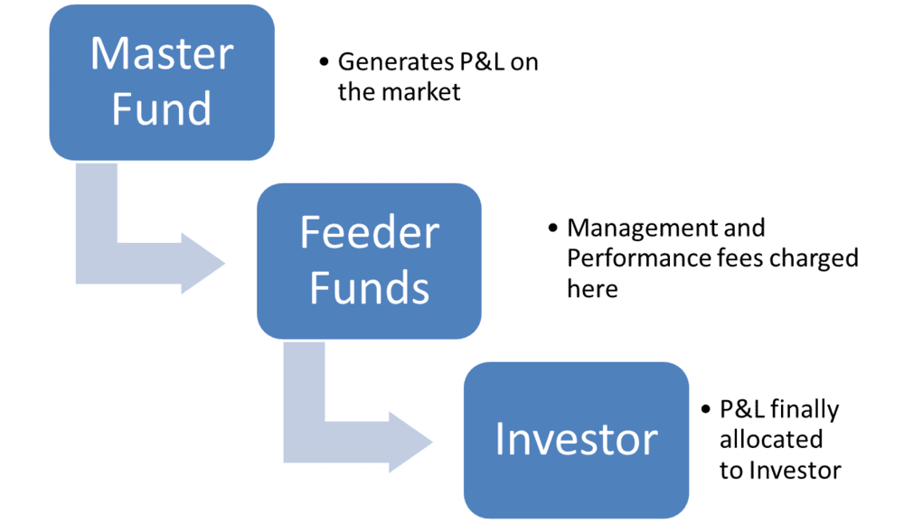

## Table of Contents

## What is a feeder fund?

A feeder fund is a type of investment fund that pools money from investors and then invests that money into a larger, main fund called a master fund. This setup allows smaller investors to access the investment opportunities and strategies of the master fund, which they might not be able to invest in directly due to high minimum investment requirements or other restrictions.

Feeder funds are commonly used in hedge funds, private equity, and other alternative investment vehicles. They can be structured in different ways, but the basic idea is to make it easier for a wider range of investors to participate in sophisticated investment strategies. By investing through a feeder fund, investors can benefit from the expertise and diversification of the master fund, while the feeder fund handles the administrative and operational aspects of the investment.

## How does a feeder fund work?

A feeder fund works by collecting money from many investors and then using that money to buy into a bigger fund, called a master fund. This is helpful because the master fund might be too expensive or hard for small investors to join on their own. So, the feeder fund acts like a bridge, making it easier for these smaller investors to be part of the master fund's investments.

Once the money is in the master fund, it is managed by experts who make investment decisions. The profits or losses from these investments are then shared back with the feeder fund, which in turn shares them with its investors. This way, everyone in the feeder fund gets a piece of the master fund's performance without having to meet its high entry requirements or handle its complex management.

## What are the benefits of investing in a feeder fund?

Investing in a feeder fund can help you get into big investment opportunities that you might not be able to reach on your own. These big opportunities, like hedge funds or private equity, often need a lot of money to start with, which can be too much for many people. By putting your money into a feeder fund, you can join these big funds with less money because the feeder fund pools everyone's money together.

Another good thing about feeder funds is that they let you use the skills of expert investors without having to manage the investments yourself. The master fund, where the feeder fund puts its money, is run by people who know a lot about investing. This means you can benefit from their knowledge and experience, and you don't have to worry about making investment decisions or handling the paperwork.

## What are the risks associated with feeder funds?

Investing in feeder funds can be risky because they depend on the performance of the master fund. If the master fund does badly, everyone who put money into the feeder fund will lose money too. This means you're trusting the master fund's managers to make good choices, and if they don't, it can hurt your investment.

Another risk is that feeder funds can be complicated and hard to understand. They might have extra fees and costs that you have to pay on top of what the master fund charges. These extra costs can eat into your profits and make your investment less worthwhile. Also, because feeder funds can be less regulated than other types of investments, it might be harder to get clear information about what you're investing in and how it's doing.

## Who typically invests in feeder funds?

Feeder funds are often used by people who want to invest in big, fancy funds like hedge funds or private equity, but don't have enough money to join those funds directly. These investors might be regular people who want to try out these special investments without needing to be super rich. They see feeder funds as a way to get a piece of the action without having to put in a huge amount of money all at once.

Sometimes, feeder funds are also used by smaller investment groups or family offices. These groups might manage money for a few rich families or a small number of clients. They use feeder funds to help their clients get into bigger investment opportunities that they wouldn't be able to access on their own. This way, they can offer their clients a chance to diversify their investments and possibly make more money.

## How do feeder funds differ from master funds?

Feeder funds and master funds are two parts of the same investment plan, but they have different jobs. A feeder fund collects money from lots of smaller investors and then puts all that money into a master fund. The master fund is the big, main fund that actually makes the investments. It's where all the action happens, and it's run by experts who decide where to put the money to try to make it grow.

The main difference is that you can't invest directly in a master fund if you don't have a lot of money. That's where the feeder fund comes in. It lets smaller investors join in on the master fund's investments by pooling their money together. So, while the master fund does the investing, the feeder fund helps more people get a chance to be part of it.

## What are the common structures of feeder funds?

Feeder funds can be set up in different ways, but two common structures are the master-feeder structure and the fund-of-funds structure. In the master-feeder structure, the feeder fund collects money from investors and puts it all into one master fund. This setup is often used for hedge funds. The master fund does the actual investing, and the feeder fund just helps more people join in by pooling their money together.

The fund-of-funds structure is another way to set up a feeder fund. In this setup, the feeder fund doesn't just invest in one master fund. Instead, it spreads the money across several different funds. This can help spread out the risk because the feeder fund isn't relying on just one master fund to do well. Both structures have their own benefits and can be chosen based on what the investors want and how much risk they're willing to take.

## Can you provide examples of successful feeder funds?

One example of a successful feeder fund is the Renaissance Technologies' Medallion Fund feeder. Renaissance Technologies is a famous [hedge fund](/wiki/hedge-fund-trading-strategies) company, and their Medallion Fund is known for its great performance. The feeder fund for the Medallion Fund lets smaller investors get a piece of the action. Even though the Medallion Fund itself is only open to a few big investors, the feeder fund makes it possible for more people to benefit from the fund's successful trading strategies.

Another example is the Blackstone Group's feeder funds. Blackstone is a big private equity firm, and they use feeder funds to help more people invest in their private equity deals. By pooling money from smaller investors, Blackstone's feeder funds allow these investors to join in on big investment opportunities that they couldn't afford on their own. This has helped many investors make money from Blackstone's successful investments in different companies and industries.

## How are feeder funds regulated?

Feeder funds are watched over by different rules depending on where they are set up and what kind of investments they make. In the United States, the Securities and Exchange Commission (SEC) is the main group that makes sure feeder funds follow the rules. If a feeder fund is part of a hedge fund or private equity fund, it has to follow special rules about who can invest and how much they need to tell investors about what's going on with their money. These rules are there to protect people who put their money into feeder funds and to make sure everything is done fairly.

In other countries, like in Europe, feeder funds might be watched by different groups like the European Securities and Markets Authority (ESMA). These groups also have rules to make sure feeder funds are honest and clear about what they're doing with investors' money. No matter where they are, feeder funds have to follow strict rules about how they report their activities and how they handle investors' money. This helps keep things safe and fair for everyone involved.

## What should investors consider before investing in a feeder fund?

Before putting money into a feeder fund, investors should think about how much risk they are willing to take. Feeder funds can be risky because they depend on how well the master fund does. If the master fund doesn't do well, the feeder fund will lose money too. Investors should also check out the people running the master fund to make sure they know what they're doing and have a good track record. It's important to understand that feeder funds might have extra fees and costs that can eat into your profits, so you should look at all the fees carefully before deciding.

Another thing to consider is how easy it is to get your money back if you need it. Some feeder funds might make it hard to take your money out quickly, so you need to know the rules about getting your money back. Also, because feeder funds can be complicated and less regulated than other types of investments, it's a good idea to do a lot of research and maybe talk to a financial advisor. Make sure you understand what the feeder fund is investing in and how it works before you put your money in.

## How do fees and expenses work in feeder funds?

Feeder funds can have different kinds of fees and expenses that you need to know about before investing. One common fee is the management fee, which is what you pay for the people running the feeder fund to do their job. This fee is usually a percentage of the money you have invested in the fund. There might also be performance fees, which you pay if the fund does well. These fees are a way for the fund managers to earn more money if they make good investments. On top of these, there can be other costs like legal fees, accounting fees, and administrative costs that the feeder fund has to pay to keep running.

These fees and expenses can add up and affect how much money you make from your investment. The master fund, where the feeder fund puts its money, also has its own fees. So, you might end up paying fees to both the feeder fund and the master fund. It's important to look at all these costs carefully because they can make a big difference in your final profits. Understanding the fee structure will help you decide if investing in a feeder fund is worth it for you.

## What is the role of a feeder fund in a fund of funds strategy?

In a fund of funds strategy, a feeder fund plays an important role by collecting money from many smaller investors and then putting that money into a bigger fund, called a master fund. This setup helps investors who might not have enough money to join the master fund on their own. By pooling everyone's money together, the feeder fund makes it possible for these smaller investors to be part of the bigger investment opportunities that the master fund offers.

The feeder fund also helps spread out the risk in a fund of funds strategy. Instead of putting all the money into just one master fund, a feeder fund can invest in several different master funds. This way, if one master fund doesn't do well, the feeder fund and its investors are not relying on just that one fund to make money. This can help protect the investors' money and give them a chance to benefit from the success of different funds.

## What is the key to understanding investment funds?

Investment funds are financial entities that aggregate capital from multiple investors to collectively invest in a range of securities such as stocks, bonds, real estate, and other financial instruments. This pooling of resources allows individual investors access to a diversified portfolio managed by professional fund managers, aimed at achieving specific investment objectives.

There are various types of investment funds, each designed to meet different investor needs and risk appetites. Mutual funds are perhaps the most well-known, offering investors access to a broad range of asset classes with the ability to buy or redeem shares at any time. Exchange-Traded Funds (ETFs) share similarities with mutual funds but are traded on stock exchanges like individual stocks, providing [liquidity](/wiki/liquidity-risk-premium) and ease of access. Hedge funds employ more complex strategies and may invest in a wider array of asset classes, typically targeting higher returns while assuming greater risk.

The principal advantage of investment funds is the diversification of risk. By investing in a variety of securities, funds reduce the impact of a poor-performing asset on the overall portfolio. This diversification is mathematically represented by the formula for the portfolio's expected return and variance:

$$
E(R_p) = \sum_{i=1}^N w_i E(R_i)
$$

$$
\sigma_p^2 = \sum_{i=1}^N w_i^2 \sigma_i^2 + \sum_{i \neq j} w_i w_j \text{Cov}(R_i, R_j)
$$

where $E(R_p)$ is the expected return of the portfolio, $w_i$ is the weight of asset i in the portfolio, $E(R_i)$ is the expected return of asset i, $\sigma_p^2$ is the variance of the portfolio's return, $\sigma_i^2$ is the variance of asset i, and $\text{Cov}(R_i, R_j)$ is the covariance between the returns of asset i and asset j.

Investment funds can be organized in numerous structures, each offering distinct benefits and flexibility tailored to differing regulatory environments or investor base. For example, open-end funds continuously issue and redeem shares on demand, while closed-end funds have a fixed number of shares and trade on exchanges.

The professional management inherent in investment funds represents another key advantage. Fund managers, leveraging their expertise and market analysis, make strategic investment decisions to optimize returns and adhere to the fund’s investment mandate. This professional oversight benefits investors who may lack the time or expertise to manage an investment portfolio on their own.

In conclusion, investment funds are fundamental components of financial systems, facilitating access to diverse investment opportunities and professional management. Their structured approach to risk diversification and potential for capital growth makes them an attractive option for a wide range of investors.

## References & Further Reading

[1]: Bergstra, J., Bardenet, R., Bengio, Y., & Kégl, B. (2011). ["Algorithms for Hyper-Parameter Optimization."](https://papers.nips.cc/paper/4443-algorithms-for-hyper-parameter-optimization) Advances in Neural Information Processing Systems 24.

[2]: ["Advances in Financial Machine Learning"](https://www.amazon.com/Advances-Financial-Machine-Learning-Marcos/dp/1119482089) by Marcos Lopez de Prado

[3]: ["Evidence-Based Technical Analysis: Applying the Scientific Method and Statistical Inference to Trading Signals"](https://www.amazon.com/Evidence-Based-Technical-Analysis-Scientific-Statistical/dp/0470008741) by David Aronson

[4]: ["Machine Learning for Algorithmic Trading"](https://github.com/stefan-jansen/machine-learning-for-trading) by Stefan Jansen

[5]: ["Quantitative Trading: How to Build Your Own Algorithmic Trading Business"](https://www.amazon.com/Quantitative-Trading-Build-Algorithmic-Business/dp/1119800064) by Ernest P. Chan