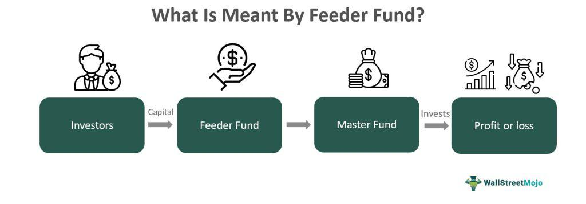

Investment funds are foundational elements in the construction of financial portfolios, providing investors with the advantages of diversification and professional management. Among the diverse array of investment strategies, feeder funds and algorithmic trading have emerged as significant and frequently discussed topics within the investment community. Feeder funds serve as a conduit, allowing investors to gain indirect exposure to master funds. This indirect exposure enables greater diversification and access to investment opportunities that might otherwise be challenging to attain for individual investors.

Algorithmic trading, on the other hand, represents a technological evolution in trading practices, utilizing computer algorithms to execute trades under pre-defined criteria. This approach enhances trading efficiency by optimizing the timing and pricing of trades, playing a crucial role in the strategies employed by various investment funds.



Understanding the intricacies associated with feeder funds and the strategic implementation of algorithmic trading can significantly enhance an investor's ability to formulate effective investment strategies. This article aims to provide a comprehensive exploration of feeder funds and algorithmic trading, emphasizing their significance in contemporary investment frameworks. Through this examination, investors can gain insights into how these elements contribute to achieving diversification, professional management, and efficient trading, ultimately leading to informed decision-making and potentially improved financial outcomes.

## Table of Contents

## Understanding Investment Funds

Investment funds are financial entities that aggregate capital from multiple investors to collectively invest in a range of securities such as stocks, bonds, real estate, and other financial instruments. This pooling of resources allows individual investors access to a diversified portfolio managed by professional fund managers, aimed at achieving specific investment objectives.

There are various types of investment funds, each designed to meet different investor needs and risk appetites. Mutual funds are perhaps the most well-known, offering investors access to a broad range of asset classes with the ability to buy or redeem shares at any time. Exchange-Traded Funds (ETFs) share similarities with mutual funds but are traded on stock exchanges like individual stocks, providing [liquidity](/wiki/liquidity-risk-premium) and ease of access. Hedge funds employ more complex strategies and may invest in a wider array of asset classes, typically targeting higher returns while assuming greater risk.

The principal advantage of investment funds is the diversification of risk. By investing in a variety of securities, funds reduce the impact of a poor-performing asset on the overall portfolio. This diversification is mathematically represented by the formula for the portfolio's expected return and variance:

$$
E(R_p) = \sum_{i=1}^N w_i E(R_i)
$$

$$
\sigma_p^2 = \sum_{i=1}^N w_i^2 \sigma_i^2 + \sum_{i \neq j} w_i w_j \text{Cov}(R_i, R_j)
$$

where $E(R_p)$ is the expected return of the portfolio, $w_i$ is the weight of asset i in the portfolio, $E(R_i)$ is the expected return of asset i, $\sigma_p^2$ is the variance of the portfolio's return, $\sigma_i^2$ is the variance of asset i, and $\text{Cov}(R_i, R_j)$ is the covariance between the returns of asset i and asset j.

Investment funds can be organized in numerous structures, each offering distinct benefits and flexibility tailored to differing regulatory environments or investor base. For example, open-end funds continuously issue and redeem shares on demand, while closed-end funds have a fixed number of shares and trade on exchanges.

The professional management inherent in investment funds represents another key advantage. Fund managers, leveraging their expertise and market analysis, make strategic investment decisions to optimize returns and adhere to the fund’s investment mandate. This professional oversight benefits investors who may lack the time or expertise to manage an investment portfolio on their own.

In conclusion, investment funds are fundamental components of financial systems, facilitating access to diverse investment opportunities and professional management. Their structured approach to risk diversification and potential for capital growth makes them an attractive option for a wide range of investors.

## What are Feeder Funds?

Feeder funds are specialized investment vehicles designed to channel investor capital into a central investment entity known as a master fund. This arrangement enables individual and institutional investors to gain exposure to a particular investment strategy indirectly, as investments are consolidated and managed within the master fund. In essence, feeder funds serve as conduits that facilitate the flow of resources from their investors into the master fund, which is responsible for actual portfolio management and investment operations.

This structure is prominently observed within hedge funds, wherein feeder funds enable the aggregation of capital, thereby realizing economies of scale. The primary advantage of employing a feeder fund model is the diversification it offers, as investors gain access to a broad range of asset classes and investment strategies managed by professionals within the master fund. Such diversification helps investors minimize risk while potentially achieving higher returns compared to individual direct investments.

The benefits of investing through feeder funds are manifold. Firstly, they provide access to professional fund management, leveraging the expertise of seasoned portfolio managers to make informed investment decisions. Secondly, feeder funds significantly lower entry barriers for individual investors, who might otherwise be excluded from participating in a master fund due to high minimum investment requirements or other constraints. This inclusivity allows a wider audience to access complex investment strategies typically available to larger institutional investors.

Moreover, the feeder fund structure is highly adaptive, catering to varying investor needs by allowing different feeder funds to have distinct investment terms or tax considerations, all while maintaining a unified investment strategy through the master fund. This flexibility enhances the ability of fund managers to appeal to a diverse investor base, each with unique preferences and risk tolerances, thus expanding the reach and scalability of the investment strategy employed by the master fund.

## The Master-Feeder Structure

The master-feeder structure in investment funds is a sophisticated framework where multiple feeder funds channel investments into a central master fund. This design centralizes the investment activities, permitting the master fund to handle all portfolio management tasks, including asset selection, trading, and risk management. By consolidating investments from various feeder funds, the master fund can achieve enhanced economies of scale, which may reduce transaction costs and improve operational efficiency.

A primary benefit of this arrangement is the ability to cater distinctively to diverse investor needs. For example, several feeder funds might be established to attract different types of investors based on geographical locations, currency preferences, or regulatory requirements. Each feeder fund has unique entry points and conditions tailored to its investor base while still directing capital into the same central pool, the master fund.

This structure offers considerable flexibility and efficiency, as it maintains a unified investment strategy across all feeder funds. Fund managers can optimize resource allocation and investment strategies without dealing with the complexities of managing multiple separate fund accounts. Additionally, by having a single investment strategy overseen by the master fund, consistency in portfolio management is maintained, thereby streamlining the execution of trades and reducing the potential for discrepancies between fund performance.

Furthermore, this setup allows fund managers to provide investors with a more comprehensive risk and return profile. Since the master fund aggregates investments from several feeder funds, it can pursue more diversified and potentially lucrative asset classes, which individual feeder funds might not access independently. Hence, the master-feeder structure both enhances investment diversification and facilitates a more strategic approach to meeting varied investor objectives.

## Advantages of Using Feeder Funds

Feeder funds offer a range of advantages that make them appealing to investors seeking to broaden their exposure to various investment opportunities. One significant benefit of feeder funds is their ability to provide access to investment opportunities that might otherwise be inaccessible to individual investors. This is primarily due to the structure of these funds, which allows them to pool resources and gain entry to exclusive or larger-scale investments typically available only to sizeable institutional investors.

Professional management is another notable advantage associated with feeder funds. By channeling investments into a master fund managed by seasoned professionals, investors can leverage the expertise and strategic acumen of experienced fund managers. These managers employ sophisticated investment strategies and conduct extensive research to optimize returns, which individual investors may not have the capability or resources to do independently.

Feeder funds also enhance the potential for returns through diversification. By pooling assets into a central master fund, they can spread investments across a diverse array of securities and asset classes. This diversification helps to mitigate risk by reducing exposure to any single asset or market. For example, a master fund might invest in a combination of equities, bonds, and commodities, thereby potentially smoothing out returns during periods of market [volatility](/wiki/volatility-trading-strategies).

Another key advantage is the ability of feeder funds to attract different investor classifications. This adaptability is possible due to the legal and regulatory frameworks that can vary by region or investor type. For instance, feeder funds might cater to both domestic and international investors by creating distinct feeder structures tailored to each group's regulatory requirements and investment preferences. This flexibility allows feeder funds to optimize asset accumulation and effectively address diverse investor needs.

Overall, feeder funds serve as a versatile and efficient vehicle for accessing a wide range of investment opportunities, offering professional management, diversification, and the ability to attract varied investor classifications, ultimately enhancing the appeal and effectiveness of investment strategies.

## Algorithmic Trading in Investment Funds

Algorithmic trading in investment funds refers to the application of computer algorithms to automate the process of buying and selling financial instruments. These algorithms operate based on pre-set rules, which outline specific criteria for executing trades. The primary aim of this technological integration is to enhance trading efficiency, ensuring that trades are executed at optimal times and at the best possible prices.

The efficiency gains from [algorithmic trading](/wiki/algorithmic-trading) are particularly beneficial in the fast-paced financial markets, where even small delays can significantly impact the profitability of a trade. By leveraging algorithms, traders and fund managers can execute large volumes of orders swiftly and accurately, thus improving the responsiveness to market fluctuations. This capability is crucial in exploiting short-lived market opportunities that require immediate action.

Algorithmic trading can optimize returns through strategies such as [arbitrage](/wiki/arbitrage), where price differences in the market are exploited to gain profit, and quantitative strategies that use statistical methods and mathematical modeling. For example, algorithms might use historical market data to predict future price movements and place trades accordingly.

In addition to optimizing returns, algorithmic trading also plays a significant role in risk management. Algorithms can incorporate risk management frameworks that automatically adjust trading parameters in response to market conditions. This includes setting stop-loss limits or diversifying trades to mitigate potential losses. By automating these processes, investment funds can achieve a more disciplined approach to managing risk, minimizing the potential for human error.

Furthermore, algorithmic trading allows for [backtesting](/wiki/backtesting) strategies using historical data. This process involves running a strategy algorithm on past market data to evaluate how it would have performed. Backtesting can help in refining the rules and parameters of an algorithm before it is deployed in live markets.

Here is a simple example of a basic moving average crossover strategy implemented in Python using the pandas and numpy libraries. This code helps identify buy and sell signals based on two moving averages:

```python
import pandas as pd
import numpy as np

# Sample data: Replace with your financial data
data = pd.DataFrame({'price': [100, 101, 102, 104, 103, 105, 108, 110, 112, 115]})

# Calculate short and long moving averages
short_window = 3
long_window = 5

data['short_mavg'] = data['price'].rolling(window=short_window, min_periods=1).mean()
data['long_mavg'] = data['price'].rolling(window=long_window, min_periods=1).mean()

# Generate trading signals
data['signal'] = 0
data['signal'][short_window:] = np.where(data['short_mavg'][short_window:] > data['long_mavg'][short_window:], 1, 0)

# Identify the points where a position should change
data['positions'] = data['signal'].diff()

# Print the data to see the buy/sell signals
print(data)
```

This script calculates moving averages over specified windows and generates signals for buying or selling based on the crossover of these averages. It highlights the utility of algorithmic trading in systematically capturing trading opportunities while employing risk management techniques.

In summary, the role of algorithmic trading in investment funds is vital in executing trades efficiently, optimizing returns, and managing risks. By automating trading processes, funds can achieve enhanced accuracy, speed, and consistency in executing strategies.

## Impact of Algorithmic Trading on Feeder Funds

Algorithmic trading significantly enhances the operational efficiency and performance of investment funds, including feeder funds. By employing computer algorithms to execute trades based on pre-defined criteria, algorithmic trading allows for rapid responses to market fluctuations, thus optimizing the timing and pricing of trades. This capability is crucial for feeder funds, which rely on the performance of the master fund to benefit investors. When a master fund employs algorithmic trading, it leverages computational power and advanced mathematical models to analyze vast amounts of market data in real-time. This enables quick decision-making, often considerably faster than human traders could achieve.

Algorithmic trading's ability to minimize transaction costs further amplifies the potential returns for feeder fund investors. By reducing the need for human intervention, the costs associated with trading, such as broker fees, can be minimized. The consistent application of algorithms helps in executing trades at near-optimal prices, thus potentially lowering the spread and transaction costs. This efficiency is pivotal in improving the overall return profile of feeder funds, which directly reflects on their investors.

Python, among other programming languages, is a prominent tool in developing algorithmic trading strategies. A simple example of a moving average crossover strategy implemented in Python is shown below:

```python
import numpy as np
import pandas as pd
import matplotlib.pyplot as plt

def moving_average_crossover(data, short_window=40, long_window=100):
    signals = pd.DataFrame(index=data.index)
    signals['price'] = data['Close']
    signals['short_mavg'] = data['Close'].rolling(window=short_window, min_periods=1, center=False).mean()
    signals['long_mavg'] = data['Close'].rolling(window=long_window, min_periods=1, center=False).mean()
    signals['signal'] = 0.0
    signals['signal'][short_window:] = np.where(signals['short_mavg'][short_window:]
                                                > signals['long_mavg'][short_window:], 1.0, 0.0)
    signals['positions'] = signals['signal'].diff()
    return signals

# Example data fetched from a DataFrame 'historical_data'
signals = moving_average_crossover(historical_data)

# Plotting the signals
plt.figure(figsize=(10, 5))
plt.plot(signals['price'], label='Price')
plt.plot(signals['short_mavg'], label=f'Short Moving Average ({short_window})')
plt.plot(signals['long_mavg'], label=f'Long Moving Average ({long_window})')
plt.plot(signals[signals['positions'] == 1].index,
         signals['short_mavg'][signals['positions'] == 1], '^', markersize=10, color='g', label='Buy Signal')
plt.plot(signals[signals['positions'] == -1].index,
         signals['short_mavg'][signals['positions'] == -1], 'v', markersize=10, color='r', label='Sell Signal')
plt.title('Moving Average Crossover Strategy')
plt.xlabel('Date')
plt.ylabel('Price')
plt.legend()
plt.show()
```

The efficiency gains and reduced market impact due to enhanced speed and precision in trade execution impart significant advantages to feeder funds. By leveraging cutting-edge technology, the master fund can refine investment strategies and capitalize on fleeting market opportunities, thereby enhancing the performance that benefits feeder fund investors. Nevertheless, the adoption of algorithmic trading requires a thorough understanding of the underlying algorithms and potential risks, as systems can be prone to technical issues or ineffective strategies leading to unanticipated outcomes.

## Considerations and Risks

Feeder funds and algorithmic trading, while offering significant benefits, are not without their risks and considerations. These risks can significantly impact investor outcomes and should be carefully understood.

Firstly, feeder funds inherently come with higher fees. This is due to the structure of investing through a feeder fund into a master fund, where both levels may impose management and performance fees. Investors must account for these additional costs, which can erode returns over time. For instance, a feeder fund charging an extra management fee of 1-2% annually can substantially reduce the compounded returns over a long investment horizon.

Transparency is another concern with feeder funds. Investors often lack detailed insight into the master fund's specific investments and strategies. This opacity can lead to difficulties in assessing risk, especially during volatile market conditions, and can impede informed decision-making.

Algorithmic trading systems present their own set of risks. Despite their potential to optimize trading execution, they are susceptible to technical issues such as software bugs, hardware failures, and connectivity problems. More critically, algorithms can become misaligned with the current market dynamics if they rely on outdated or incorrect data inputs. For example, a trading algorithm based on historical correlations might fail during sudden geopolitical events that disrupt market patterns.

Moreover, algorithmic trading systems may inadvertently contribute to market instability. Issues such as "flash crashes," where markets suddenly drop before quickly recovering, have been attributed to algorithmic trading mismatches and cascading sell orders. Algorithms executing trades based on similar criteria can lead to rapid price movements, exacerbating volatility.

Investors should thoroughly understand the specific strategies employed by both feeder funds and algorithmic trading systems. This includes a comprehensive review of the associated fee structures, investment goals, and any historical performance data. Additionally, due diligence should extend to evaluating the technological infrastructure supporting algorithmic trading systems, ensuring robust contingency protocols are in place to mitigate technical and strategic risks.

Regularly revisiting these elements and remaining informed about market environments can assist investors in navigating the complexities brought by feeder funds and algorithmic trading, ultimately aligning these investment vehicles with their risk tolerance and financial goals.

## Conclusion

Feeder funds and algorithmic trading have become indispensable elements of contemporary investment strategies. These components enable investors to access diversified portfolios and leverage professional management. Feeder funds channel investments into a centralized master fund, allowing investors to benefit from economies of scale, reduced entry barriers, and exposure to sophisticated financial strategies. Meanwhile, algorithmic trading offers efficiency by executing trades at optimally calculated times and prices, enhancing returns and minimizing human errors.

However, the integration of feeder funds and algorithmic trading in investment portfolios necessitates thorough due diligence. Investors should meticulously evaluate the fund’s strategy, fee structures, and inherent risks. The potential for higher fees, reduced transparency, and technical failures in algorithmic systems are key considerations.

For investors, understanding these investment vehicles can lead to more informed decision-making and potentially superior returns. By appreciating the advantages and limitations of feeder funds and algorithmic trading, investors are better equipped to optimize their portfolios and align their financial goals with the opportunities presented by these sophisticated investment tools.

## References & Further Reading

[1]: Bergstra, J., Bardenet, R., Bengio, Y., & Kégl, B. (2011). ["Algorithms for Hyper-Parameter Optimization."](https://papers.nips.cc/paper/4443-algorithms-for-hyper-parameter-optimization) Advances in Neural Information Processing Systems 24.

[2]: ["Advances in Financial Machine Learning"](https://www.amazon.com/Advances-Financial-Machine-Learning-Marcos/dp/1119482089) by Marcos Lopez de Prado

[3]: ["Evidence-Based Technical Analysis: Applying the Scientific Method and Statistical Inference to Trading Signals"](https://www.amazon.com/Evidence-Based-Technical-Analysis-Scientific-Statistical/dp/0470008741) by David Aronson

[4]: ["Machine Learning for Algorithmic Trading"](https://github.com/stefan-jansen/machine-learning-for-trading) by Stefan Jansen

[5]: ["Quantitative Trading: How to Build Your Own Algorithmic Trading Business"](https://www.amazon.com/Quantitative-Trading-Build-Algorithmic-Business/dp/1119800064) by Ernest P. Chan