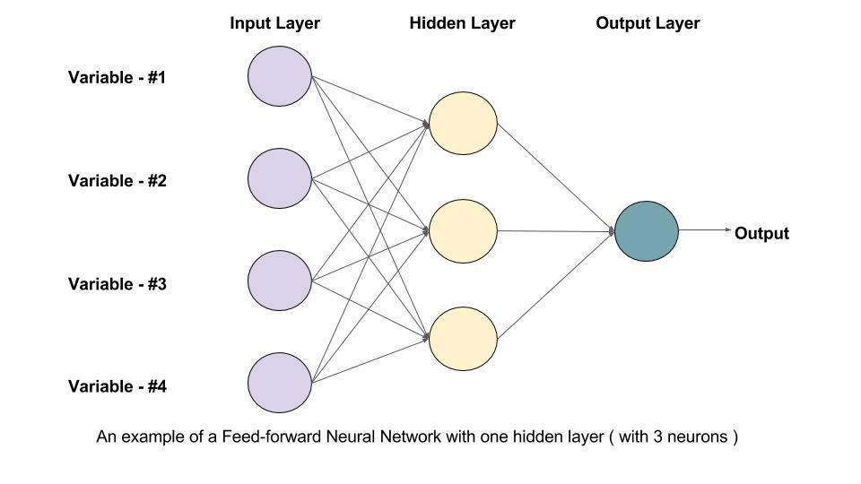

## Table of Contents

## What is a Feedforward Neural Network and how does it differ from other types of neural networks?

A Feedforward Neural Network (FNN) is a type of artificial neural network where the connections between nodes do not form a cycle. This means information moves only forward from the input nodes, through the hidden layers (if any), and to the output nodes. There are no loops or feedback loops in the network. FNNs are used for tasks like classification and regression, where the goal is to map inputs to outputs. The simplest form of an FNN is a single-layer perceptron, but more complex networks can have multiple hidden layers, making them capable of learning more intricate patterns.

FNNs differ from other types of neural networks, such as Recurrent Neural Networks (RNNs) and Convolutional Neural Networks (CNNs), in their structure and application. Unlike RNNs, which have loops that allow information to persist over time, making them suitable for tasks like natural language processing and time series prediction, FNNs do not have this capability. This makes FNNs less effective for tasks that require memory of previous inputs. On the other hand, CNNs are specialized for processing data with grid-like topology, such as images, using convolutional layers to reduce the number of parameters and improve efficiency. FNNs, while versatile, do not have these specialized layers and are generally used for more straightforward mapping tasks.

## How do the layers in a Feedforward Network process data?

In a Feedforward Neural Network, data processing starts at the input layer, where each neuron receives an input value. These values are then passed forward to the next layer, which could be a hidden layer or the output layer. Each connection between neurons has a weight associated with it, and each neuron also has a bias. The neuron calculates a weighted sum of its inputs, adds the bias, and then applies an activation function to this sum. The activation function introduces non-linearity into the network, allowing it to learn complex patterns. The result of this process is then passed to the next layer until it reaches the output layer.

The hidden layers, if present, are where the network learns to recognize patterns in the data. Each hidden layer can have multiple neurons, and the number of layers and neurons can vary depending on the complexity of the task. As data moves through these layers, the network transforms the input data into a form that is more useful for making predictions or classifications. The output layer then produces the final result, which could be a class label in classification tasks or a continuous value in regression tasks. The weights and biases in the network are adjusted during training to minimize the error between the predicted and actual outputs, allowing the network to improve its performance over time.

## What is the role of activation functions in Feedforward Networks?

Activation functions are very important in Feedforward Neural Networks. They help the network learn and make decisions by adding non-linearity to the data. Without activation functions, the network would just be a series of linear operations, and it wouldn't be able to learn complex patterns. The activation function takes the weighted sum of the inputs to a neuron, adds a bias, and then applies a non-linear transformation. This transformed value is what gets passed to the next layer in the network.

There are many types of activation functions, each with its own strengths. Common ones include the sigmoid, which squashes values between 0 and 1, the hyperbolic tangent (tanh), which squashes values between -1 and 1, and the Rectified Linear Unit (ReLU), which outputs the input directly if it's positive, and zero otherwise. The choice of activation function can affect how well the network learns and performs. For example, ReLU is often used because it helps with the problem of vanishing gradients, where the gradient becomes very small and slows down learning, especially in deep networks. By introducing non-linearity, activation functions allow the network to model more complex relationships between inputs and outputs.

## Can you explain the concept of a Linear Layer within a Feedforward Network?

A Linear Layer in a Feedforward Neural Network is a layer where the output is a linear combination of the inputs. This means that each neuron in the layer takes the inputs, multiplies them by weights, adds a bias, and then outputs the result without any further transformation. The formula for a single neuron in a linear layer can be written as $$y = \sum_{i=1}^{n} w_i x_i + b$$ where $$x_i$$ are the inputs, $$w_i$$ are the weights, $$b$$ is the bias, and $$y$$ is the output. Linear layers are often used as the final layer in a network for regression tasks, where the goal is to predict a continuous value.

However, using only linear layers throughout a network would limit its ability to learn complex patterns because the entire network would just be a series of linear operations. To overcome this, linear layers are usually followed by activation functions that introduce non-linearity. This allows the network to model more complex relationships between inputs and outputs. For example, in a typical Feedforward Neural Network, you might have several hidden layers with linear operations followed by activation functions like ReLU, and then a final linear layer to produce the output.

## What is a Position-Wise Feed-Forward Layer and where is it commonly used?

A Position-Wise Feed-Forward Layer is a special type of layer used in certain [neural network](/wiki/neural-network) architectures. It applies the same transformation to each position of the input data independently. This means that for every position in the input sequence, the layer uses the same set of weights and biases to process the data at that position. The transformation typically consists of two linear transformations with a non-linear activation function in between. The formula for a single position can be written as $$y = \text{ReLU}(xW_1 + b_1)W_2 + b_2$$ where $$x$$ is the input at a position, $$W_1$$ and $$W_2$$ are weight matrices, $$b_1$$ and $$b_2$$ are bias vectors, and ReLU is the activation function.

Position-Wise Feed-Forward Layers are commonly used in transformer models, which are popular in natural language processing tasks like machine translation and text generation. In transformers, these layers help the model learn complex patterns in the data by allowing each position to be processed independently but with the same set of operations. This design allows the model to capture local dependencies in the input sequence effectively, while other parts of the transformer architecture, like the self-attention mechanism, handle global dependencies. By combining these elements, transformers can achieve state-of-the-art performance on a variety of tasks.

## How does an Adapter modify the architecture of a Feedforward Network?

An adapter is a small neural network module that can be added to a Feedforward Network to change its architecture without changing the main structure too much. It's like adding a small helper to the network that can learn new things without messing up what the network already knows. Adapters are often used to make a pre-trained network work better on a new task. They do this by adding a few layers, usually with a small number of parameters, to the network. These layers can be trained on the new task while keeping the rest of the network the same.

In a Feedforward Network, an adapter is usually added after the main layers. For example, if you have a layer that does $$y = \text{ReLU}(xW + b)$$, you might add an adapter that does $$y_{\text{adapted}} = y + \text{ReLU}(yW_{\text{adapter}} + b_{\text{adapter}})$$. This means the adapter takes the output of the main layer, processes it a bit, and then adds it back to the original output. This way, the network can learn new things without forgetting what it already knows. Adapters are useful because they let you use a pre-trained network for new tasks without starting from scratch, which saves time and resources.

## What are HyperNetworks and how do they relate to Feedforward Networks?

HyperNetworks are a special kind of neural network that can create other neural networks. They do this by taking some input and using it to generate the weights and biases for another network, called the "target network." This is different from a regular Feedforward Network, which just takes inputs and turns them into outputs using fixed weights and biases. In a HyperNetwork, the weights and biases of the target network are not fixed; they are created by the HyperNetwork itself. This can be useful for tasks where you need to quickly adapt to new data or create many different networks for different purposes.

The relationship between HyperNetworks and Feedforward Networks is that a HyperNetwork can be used to generate the weights and biases for a Feedforward Network. For example, if you have a Feedforward Network with a layer that does $$y = \text{ReLU}(xW + b)$$, a HyperNetwork could generate the matrix $$W$$ and the vector $$b$$ based on some input. This means you can use a HyperNetwork to create a Feedforward Network that is tailored to a specific task or dataset. This can make the Feedforward Network more flexible and able to learn new things more quickly.

## How do Highway Networks improve the training of deep Feedforward Networks?

Highway Networks make it easier to train very deep Feedforward Networks by adding special connections called "highway layers." These layers have a way to let information flow more easily through the network, which helps prevent the problem of vanishing gradients. Vanishing gradients happen when the network is so deep that the signals get very small as they move through the layers, making it hard for the network to learn. Highway layers use a simple trick to help signals move better. They use something called a "transform gate" and a "[carry](/wiki/carry-trading) gate" to decide how much of the original input should be kept and how much should be changed. This makes it easier for the network to learn and perform well, even when it has many layers.

In a Highway Network, each layer can be described by the formula $$y = H(x, W_H) \cdot T(x, W_T) + x \cdot C(x, W_C)$$, where $$H$$ is the nonlinear transform, $$T$$ is the transform gate, and $$C$$ is the carry gate. The transform gate $$T$$ decides how much of the transformed input $$H(x, W_H)$$ should be used, and the carry gate $$C$$ decides how much of the original input $$x$$ should be passed through unchanged. By carefully balancing these gates, Highway Networks can effectively train deeper networks, allowing them to learn more complex patterns and achieve better performance on tasks that require deep architectures.

## What are the differences between Mix-FFN and Switch FFN in terms of architecture and application?

Mix-FFN and Switch FFN are both types of Feedforward Networks used in transformer models, but they have different ways of processing data. Mix-FFN, or Mixture of Experts Feedforward Network, works by splitting the input into different parts and sending each part to a different "expert" network. Each expert is a small neural network that specializes in handling a specific type of data. After the experts process the data, their outputs are combined using a gating mechanism that decides how much each expert's output should contribute to the final result. This approach allows Mix-FFN to handle complex tasks more efficiently by using multiple specialized networks.

Switch FFN, on the other hand, uses a simpler approach where it chooses only one expert to process the entire input. Instead of combining the outputs of multiple experts, Switch FFN uses a "switch" mechanism to select the most suitable expert for the given input. This makes the network faster because it only needs to run one expert at a time, but it might not be as flexible as Mix-FFN in handling different types of data. Both types of networks are used in transformer models to improve performance, but Mix-FFN might be better for tasks that need to handle a wide variety of data, while Switch FFN could be more efficient for simpler tasks where speed is important.

## Can you describe the function of an Affine Operator in the context of Feedforward Networks?

An Affine Operator in a Feedforward Network is a way to change the input data before it goes through the rest of the network. It does this by multiplying the input by a set of weights and adding a bias. This is a simple but important step because it helps the network learn how to turn the input into something useful for making predictions or decisions. In math, an Affine Operator can be written as $$y = Wx + b$$, where $$x$$ is the input, $$W$$ is the weight matrix, $$b$$ is the bias vector, and $$y$$ is the output. This operation is like stretching, shrinking, or shifting the input data to fit the needs of the network.

Affine Operators are used in every layer of a Feedforward Network. They help the network learn by adjusting the weights and biases during training. When the network is trained, it changes these weights and biases to make the output closer to what it should be. This process helps the network get better at its job over time. By using Affine Operators, the network can learn complex patterns and make accurate predictions or classifications.

## How do Spatial Gating Units enhance the performance of Feedforward Networks?

Spatial Gating Units (SGUs) help Feedforward Networks work better by adding a special way to handle information as it moves through the network. They do this by looking at the data in different parts of the input and deciding how to use that information to make the network's predictions more accurate. SGUs are often used in transformer models, where they help the network understand the relationships between different parts of the input data. By using SGUs, the network can focus on the most important parts of the data and ignore the less important parts, which makes it better at tasks like understanding language or recognizing patterns in images.

In a Feedforward Network, an SGU works by taking the input and splitting it into different pieces. It then applies a gating mechanism to each piece, which decides how much of that piece should be used in the next step of the network. This can be written as $$y = x \cdot \text{gate}(x)$$, where $$x$$ is the input and $$\text{gate}(x)$$ is the gating function that decides how to use the input. By doing this, SGUs help the network learn more complex patterns and make better predictions. They are especially useful in deep networks, where they can help keep the information flowing smoothly and prevent problems like vanishing gradients.

## What advanced techniques like Boom Layer, ALCN, DExTra, VarImpVIANN, and NLSIG contribute to the evolution of Feedforward Networks?

Advanced techniques like Boom Layer, ALCN, DExTra, VarImpVIANN, and NLSIG help make Feedforward Networks better and more useful. A Boom Layer is a special kind of layer that helps the network learn faster by using a trick called "boosting." It works by adding more layers to the network in a smart way, so the network can learn more complex patterns without getting too slow. ALCN, or Adaptive Learning-rate Convolutional Network, changes how the network learns by adjusting the learning rate based on the data it sees. This helps the network learn better and faster. DExTra, or Deep Extreme Learning Machine with Transfer Learning, uses a method called transfer learning to take what the network has learned from one task and use it for another task. This saves time and makes the network more flexible. VarImpVIANN, or Variable Importance in Variable Interaction Networks, helps the network understand which parts of the input are most important for making predictions. This can make the network more accurate. NLSIG, or Nonlinear Sparse Identification of Systems, helps the network find the most important connections between different parts of the data, which can make the network simpler and more efficient.

These techniques each add something special to Feedforward Networks. Boom Layer helps with learning complex patterns quickly, ALCN makes learning more efficient, DExTra helps the network adapt to new tasks, VarImpVIANN improves accuracy by focusing on important inputs, and NLSIG simplifies the network by finding key connections. Together, these methods make Feedforward Networks more powerful and versatile, allowing them to handle a wider range of tasks and perform better on complex data. By using these advanced techniques, researchers and engineers can build networks that learn faster, work more efficiently, and make better predictions.

## References & Further Reading

[1]: Goodfellow, I., Bengio, Y., & Courville, A. (2016). ["Deep Learning"](https://link.springer.com/article/10.1007/s10710-017-9314-z). MIT Press.

[2]: LeCun, Y., Bengio, Y., & Hinton, G. (2015). ["Deep Learning."](https://www.nature.com/articles/nature14539) Nature, 521(7553), 436-444.

[3]: Nair, V., & Hinton, G. E. (2010). ["Rectified Linear Units Improve Restricted Boltzmann Machines."](https://dl.acm.org/doi/10.5555/3104322.3104425) Proceedings of the 27th International Conference on Machine Learning.

[4]: Vaswani, A., Shazeer, N., Parmar, N., Uszkoreit, J., Jones, L., Gomez, A. N., ... & Polosukhin, I. (2017). ["Attention is All You Need."](https://arxiv.org/abs/1706.03762) Advances in Neural Information Processing Systems 30 (NIPS 2017).

[5]: Krizhevsky, A., Sutskever, I., & Hinton, G. E. (2012). ["ImageNet Classification with Deep Convolutional Neural Networks."](https://dl.acm.org/doi/10.1145/3065386) Advances in Neural Information Processing Systems 25.

[6]: Rashid, T. (2016). ["Make Your Own Neural Network."](https://www.amazon.com/Make-Your-Own-Neural-Network/dp/1530826608) CreateSpace Independent Publishing Platform.