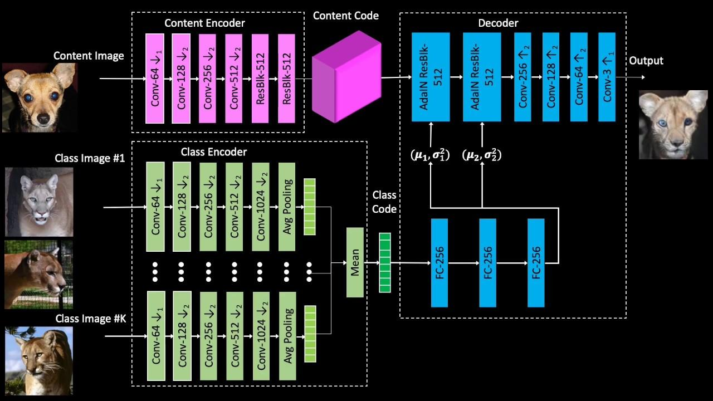

## Table of Contents

## What is Few-Shot Image-to-Image Translation?

Few-Shot Image-to-Image Translation is a method in artificial intelligence where a computer learns to change one image into another type of image, using only a few examples. Imagine you want to turn a photo of a dog into a drawing of that dog. Normally, a computer would need to see many examples of dog photos and their corresponding drawings to learn how to do this. But with few-shot learning, the computer can do it after seeing just a few examples, making it much faster and easier to teach the computer new tricks.

This technique is useful because it's often hard to gather a lot of examples for every possible transformation you might want. For instance, if you want to turn pictures of apples into pictures of oranges, you might not have thousands of apple-to-orange image pairs. Few-shot learning helps by allowing the computer to learn from just a handful of examples, using smart algorithms to figure out the rest. This makes image-to-image translation more flexible and applicable to a wider range of tasks.

## How does Few-Shot Image-to-Image Translation differ from traditional image-to-image translation?

Few-Shot Image-to-Image Translation and traditional image-to-image translation both aim to transform one type of image into another, like turning a photo into a sketch. The big difference is in how much data they need to learn from. Traditional methods require a lot of paired examples, like thousands of photos and their corresponding sketches, to train the computer to make good transformations. This means you need a huge dataset, which can be hard to get for every new type of transformation you want to do.

On the other hand, Few-Shot Image-to-Image Translation can learn to do the same thing but with just a few examples. This is great because it's often tough to find lots of examples for every possible change you might want. For instance, if you want to turn pictures of apples into pictures of oranges, you might only have a few examples to work with. Few-shot methods use smart algorithms to figure out the transformation from these few examples, making it much easier and quicker to teach the computer new types of image changes.

## What are the key components of a Few-Shot Image-to-Image Translation model?

The first key component of a Few-Shot Image-to-Image Translation model is a base model that can learn general image features. This base model is usually a deep [neural network](/wiki/neural-network), like a [convolutional neural network](/wiki/convolutional-neural-network) (CNN), which is trained on a large dataset of diverse images. The idea is that this model learns to recognize and extract useful features from images, which can be applied to new types of images. When you want to teach the model a new type of image transformation, you can use this pre-trained base model as a starting point, adapting it quickly with just a few examples.

The second important component is a meta-learning or few-shot learning algorithm. This part of the model helps it learn new transformations quickly from just a few examples. Techniques like model-agnostic meta-learning (MAML) or prototypical networks are often used here. These algorithms enable the model to adapt its learned features to new tasks without needing a lot of new data. For instance, if you want to turn photos of dogs into cartoons, the meta-learning algorithm helps the model figure out how to do this after seeing just a few dog-to-cartoon examples. Together, the base model and the meta-learning algorithm allow Few-Shot Image-to-Image Translation to work effectively with minimal data.

## What is the COCO-FUNIT model and how does it work?

The COCO-FUNIT model, or COCO-based Few-shot UNsupervised Image Translation model, is a type of Few-Shot Image-to-Image Translation model that works with the COCO dataset. This dataset has lots of different images, like people, animals, and objects. The COCO-FUNIT model uses these images to learn how to change one image into another type of image, even if it only sees a few examples of the change it needs to make. It's really good at this because it can learn general things about images from the COCO dataset and then apply those lessons to new kinds of image changes.

The way COCO-FUNIT works is by using a special kind of learning called meta-learning. This means it can quickly learn new image transformations from just a few examples. The model starts with a base model that's already been trained on the COCO dataset. When you want to teach it a new kind of image change, like turning a photo of a cat into a painting, the model uses its meta-learning skills to adapt quickly. It looks at the few examples you give it and figures out how to make the change, even if it's never seen those exact kinds of images before. This makes COCO-FUNIT very flexible and useful for all sorts of image translation tasks.

## How is the COCO-FUNIT model trained?

The COCO-FUNIT model is trained using a two-step process that starts with a pre-training phase on the COCO dataset. In this phase, the model learns general features from a wide variety of images, like people, animals, and objects. This helps the model understand how different things look and how they can be changed. The pre-training is done using a deep neural network, which is good at [picking](/wiki/asset-class-picking) up on patterns in images. After this phase, the model has a good base understanding of images, which it can use to learn new image transformations quickly.

After pre-training, the COCO-FUNIT model goes into a fine-tuning phase where it learns to make specific image changes from just a few examples. This is where meta-learning comes in. The model uses a few examples of the new transformation, like turning a photo into a painting, and adapts its pre-trained knowledge to this new task. The meta-learning algorithm helps the model figure out how to apply its general image understanding to the specific change it needs to make. This way, the COCO-FUNIT model can quickly learn new image transformations without needing a lot of new data.

## What are the advantages of using Few-Shot Image-to-Image Translation?

One big advantage of using Few-Shot Image-to-Image Translation is that it saves a lot of time and effort. With traditional methods, you need thousands of examples to teach a computer how to change one type of image into another. This can be really hard, especially if you want to do something new and don't have many examples to work with. But with Few-Shot learning, the computer can learn from just a few examples. This makes it much easier and faster to teach the computer new tricks, like turning photos into drawings or apples into oranges.

Another advantage is that Few-Shot Image-to-Image Translation is more flexible. Because it can learn from so few examples, you can use it for all sorts of different tasks without needing a huge dataset for each one. This means you can quickly adapt the model to new kinds of image changes, making it a powerful tool for creative projects and practical applications. Whether you're an artist wanting to try out new styles or a researcher needing to analyze different types of images, Few-Shot learning can help you get the job done more efficiently.

## Can you explain the role of the few-shot learning in image translation?

Few-shot learning plays a crucial role in image translation by allowing computers to learn new image transformations with just a few examples. Imagine you want to turn a photo of a dog into a cartoon. With traditional methods, you would need thousands of examples of dog photos and their cartoon versions to teach the computer. But with few-shot learning, the computer can do it after seeing just a few examples. This makes it much easier and quicker to teach the computer new types of image changes, without needing a huge dataset.

The way few-shot learning works is by using smart algorithms that help the computer figure out how to apply its general knowledge of images to new tasks. For example, a model might be pre-trained on a large dataset like COCO, learning about different objects and how they can be changed. When you want to teach it a new transformation, like turning a photo into a painting, the few-shot learning algorithm helps it adapt its existing knowledge to this new task. This flexibility makes few-shot image translation a powerful tool for creative projects and practical applications, where gathering lots of examples can be difficult.

## What are some common applications of Few-Shot Image-to-Image Translation?

Few-Shot Image-to-Image Translation has lots of cool uses. One common application is in art and design. Artists can use it to quickly turn their photos into different styles, like paintings or sketches, without needing tons of examples. This helps them experiment with new looks and save time. For example, if an artist wants to see how a photo of a landscape would look as a watercolor painting, they can show the computer just a few examples and get the job done.

Another big use is in the fashion industry. Designers can use Few-Shot Image-to-Image Translation to see how different fabrics or patterns would look on clothes. They only need a few examples to teach the computer, and then it can show them lots of different options. This helps them make decisions faster and come up with new ideas without having to make lots of physical samples.

Few-Shot Image-to-Image Translation is also helpful in medical imaging. Doctors can use it to turn one type of medical image into another, like turning an MRI into a clearer image that's easier to read. This can help them spot problems faster and make better diagnoses. With just a few examples, the computer can learn to make these important changes, which can be a big help in healthcare.

## How do you evaluate the performance of a Few-Shot Image-to-Image Translation model?

To evaluate the performance of a Few-Shot Image-to-Image Translation model, you look at how well it can change one type of image into another using just a few examples. One way to do this is by using something called the Fréchet Inception Distance (FID) score. The FID score measures how similar the translated images are to real images of the same type. A lower FID score means the model is doing a good job because the translated images look more like the real ones. Another way to check performance is by asking people to rate the translated images. If people think the images look good and are similar to what they should be, then the model is working well.

Another important thing to look at is how well the model can learn new types of image changes. This is called generalization. You can test this by showing the model new kinds of images it hasn't seen before and seeing if it can still make good translations. If the model can do this well, it means it's good at using the few examples it has seen to figure out new tasks. Overall, evaluating a Few-Shot Image-to-Image Translation model involves checking both how good the translated images look and how well the model can adapt to new types of image changes.

## What are the current challenges and limitations of Few-Shot Image-to-Image Translation?

One big challenge with Few-Shot Image-to-Image Translation is that it can sometimes struggle to keep all the details right. When you only show the computer a few examples, it might miss out on some important parts of the image. For example, if you want to turn a photo of a dog into a cartoon, the model might get the shape and color right but miss the dog's collar or expression. This is because it's hard for the computer to learn everything it needs to know from just a few images. Another issue is that the model might not work well with very different kinds of images. If you train it on pictures of animals and then try to use it on pictures of buildings, it might not do a good job because it hasn't seen enough examples of buildings.

Another limitation is that Few-Shot Image-to-Image Translation can be tricky to evaluate. It's not always clear how good the translated images are, especially when there are only a few examples to compare them to. People might have different opinions on whether the images look right, and it can be hard to measure this with numbers. Also, the models can be sensitive to the few examples they are given. If the examples aren't very good or don't show a wide range of what the image should look like, the model might not learn well. This means you need to be careful about choosing the right examples to teach the model, which can be a challenge in itself.

## How can Few-Shot Image-to-Image Translation be improved in future research?

One way to make Few-Shot Image-to-Image Translation better in the future is by finding smarter ways to use the few examples we give to the computer. Right now, the computer can miss out on some details because it only sees a few images. But if we can teach it to pay attention to more things in those images, like colors, shapes, and small details, it could do a better job. Researchers might try new kinds of algorithms that help the computer learn more from less. They could also look at how to make the computer remember what it learns better, so it can use that knowledge for new types of images it hasn't seen before.

Another way to improve Few-Shot Image-to-Image Translation is by making it easier to check how good the translated images are. Right now, it's hard to know if the computer is doing a good job because there aren't many examples to compare to. But if we can find better ways to measure how similar the translated images are to what they should look like, we can tell if the model is working well. One idea is to use more people to rate the images and see if they agree on what looks good. Another idea is to come up with new ways to use numbers to measure how well the images match, like using a formula like $$FID = \sqrt{\|\mu_r - \mu_g\|^2 + Tr(\Sigma_r + \Sigma_g - 2\sqrt{\Sigma_r \Sigma_g})}$$ to compare the translated images to real ones. By working on these things, we can make Few-Shot Image-to-Image Translation more useful and reliable.

## What are some alternative models or approaches to Few-Shot Image-to-Image Translation?

One alternative to Few-Shot Image-to-Image Translation is the use of Generative Adversarial Networks (GANs). GANs work by having two parts: a generator that makes new images and a discriminator that checks if those images look real. The generator tries to fool the discriminator, and they both get better over time. This can be used for image translation by training the GAN on lots of examples of one type of image and then showing it a few examples of the new type of image you want. The GAN can then create new images that look like the new type, even if it only saw a few examples. This method can be good because it can make very realistic images, but it might need more examples than Few-Shot learning to work well.

Another approach is using transfer learning. In transfer learning, you start with a model that's already been trained on a big dataset, like photos of many different things. Then, you fine-tune this model on a smaller set of images that show the new kind of image change you want. This means the model already knows a lot about images and can learn new types of changes faster. For example, if you want to turn photos of dogs into cartoons, you can use a model trained on lots of photos and then show it just a few examples of dog cartoons. The model can use what it already knows to learn this new task quickly. Transfer learning can be really helpful because it makes the most out of the examples you have, but it still needs some examples to work well.

## References & Further Reading

[1]: Huang, X., Liu, M.-Y., Belongie, S., & Kautz, J. (2018). ["Multimodal Unsupervised Image-to-Image Translation."](https://arxiv.org/abs/1804.04732) In Proceedings of the European Conference on Computer Vision (ECCV).

[2]: Zhao, Y., Hong, L., Yuan, L., & Tresp, V. (2020). ["Domain Generalization and Adaptation using Few-Shot Learning."](https://www.sciencedirect.com/science/article/pii/S138589472501633X) ArXiv Preprint.

[3]: Wang, T.-C., Liu, M.-Y., Zhu, J.-Y., Tao, A., Kautz, J., & Catanzaro, B. (2018). ["High-Resolution Image Synthesis and Semantic Manipulation with Conditional GANs."](https://arxiv.org/abs/1711.11585) In Proceedings of the IEEE Conference on Computer Vision and Pattern Recognition (CVPR).

[4]: Oreshkin, B. N., López, P. R., & Lacoste, A. (2018). ["TADAM: Task Dependent Adaptive Metric for Improved Few-Shot Learning."](https://arxiv.org/abs/1805.10123) In Advances in Neural Information Processing Systems (NeurIPS).

[5]: Lin, T.-Y., Maire, M., Belongie, S., Hays, J., Perona, P., Ramanan, D., Dollár, P., & Zitnick, C. L. (2014). ["Microsoft COCO: Common Objects in Context."](https://arxiv.org/abs/1405.0312) In European Conference on Computer Vision (ECCV).