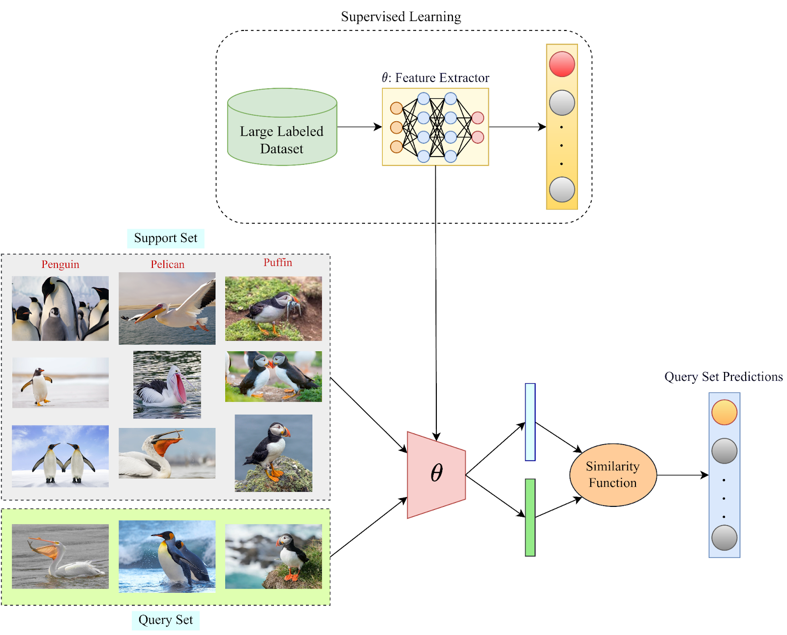

## Table of Contents

## What is Few-Shot Learning in the context of machine learning?

Few-Shot Learning is a type of machine learning where a model can learn new tasks or recognize new objects from just a few examples. In traditional machine learning, models often need a lot of data to learn well. But in few-shot learning, the model can do a good job even if it only sees a few examples. This is useful in situations where collecting a lot of data is hard or expensive.

For example, if you want to teach a model to recognize a new type of flower, you might only show it a few pictures of that flower. The model uses what it already knows from other tasks to quickly learn about the new flower. This makes few-shot learning very powerful because it can adapt to new things quickly, just like how humans can learn new things from just a few examples.

## How does Few-Shot Learning differ from traditional machine learning approaches?

Few-Shot Learning and traditional machine learning differ mainly in how much data they need to learn. Traditional machine learning often needs a lot of examples to train a model well. For instance, if you want to teach a computer to recognize cats, you might need thousands of cat pictures. The model learns by looking at all these pictures and figuring out what makes a cat a cat. This approach works well but can be slow and needs a lot of data, which can be hard to get.

On the other hand, Few-Shot Learning can learn new things from just a few examples. Imagine you want to teach the computer to recognize a new type of dog. With Few-Shot Learning, you might only need to show it a handful of pictures of that dog. The model uses what it already knows from other tasks to quickly understand the new dog. This makes Few-Shot Learning faster and more flexible, especially when you don't have a lot of data to work with.

## What are the main challenges faced in Few-Shot Learning?

One of the main challenges in Few-Shot Learning is making sure the model can learn well from just a few examples. When you don't have a lot of data, it's hard for the model to understand all the different ways something can look. For example, if you only show the model a few pictures of a cat, it might not know what to do if it sees a cat in a different pose or color. This makes it tricky for the model to be good at recognizing new things from just a few examples.

Another challenge is that the model needs to use what it already knows from other tasks to help it learn the new task quickly. This is called transfer learning. The model has to figure out which parts of what it already knows are helpful for the new task and which parts are not. If it doesn't do this well, it might not learn the new task properly. This balancing act can be really hard, and it's one of the big things researchers are trying to solve in Few-Shot Learning.

## Can you explain the concept of 'shots' in Few-Shot Learning?

In Few-Shot Learning, the term 'shots' refers to the number of examples the model gets to learn from for each new task. If a model is learning from just one example per class, it's called 'one-shot learning'. If it's learning from five examples per class, it's called 'five-shot learning'. The number of shots is important because it shows how few examples the model needs to still do a good job at learning new things.

For example, if you want to teach a model to recognize different types of fruit, and you show it just one picture of each type, that would be one-shot learning. The model has to use that one picture to figure out what makes each fruit unique. If you show it five pictures of each type of fruit, that's five-shot learning. The model gets a bit more information to work with, but it's still learning from a small number of examples compared to traditional machine learning where it might see hundreds or thousands of pictures.

## What are some common algorithms used in Few-Shot Learning?

One common algorithm used in Few-Shot Learning is the Siamese Neural Network. This type of network is good at comparing things. It takes two inputs and decides if they are the same or different. For example, if you want to teach a computer to recognize different types of birds, the Siamese Network can look at two pictures and say if they are pictures of the same bird or not. This helps the computer learn new birds quickly, even if it only sees a few pictures.

Another popular algorithm is the Prototypical Network. This method works by finding a 'prototype' or average example for each class. When the model sees a new example, it compares it to these prototypes to decide which class it belongs to. Imagine you want to teach the computer to recognize different types of cars. The Prototypical Network would create an average picture of each car type from the few examples it sees. Then, when it sees a new car, it compares it to these average pictures to figure out what type of car it is.

Matching Networks are also used in Few-Shot Learning. These networks learn to match new examples to the examples they have already seen. They are good at remembering and using what they learned before to help with new tasks. For instance, if you want to teach the computer to recognize different types of shoes, the Matching Network would use the few examples it has seen to match new shoes to the right type. This helps the computer learn quickly from just a few examples.

## How does meta-learning contribute to Few-Shot Learning?

Meta-learning, often called "learning to learn," is really helpful for Few-Shot Learning. It helps the model learn how to learn new tasks quickly from just a few examples. Think of meta-learning like a student who learns how to study better. Once the student knows good study habits, they can quickly learn new subjects even if they only have a little bit of information. In Few-Shot Learning, meta-learning teaches the model to use what it already knows to figure out new things fast. This way, when the model sees a new task, it can use its past learning experience to do well, even with just a few examples.

One way meta-learning helps is by using a technique called gradient-based meta-learning. This method adjusts the model's learning process so it can adapt quickly to new tasks. For example, if the model is learning to recognize different types of animals, meta-learning helps it figure out how to learn from just a few pictures of each animal. The model learns how to update its knowledge in a way that makes it good at learning new things quickly. This is important because it lets the model be flexible and smart, even when it doesn't have a lot of data to work with.

## What role do embeddings play in Few-Shot Learning?

In Few-Shot Learning, embeddings are like special codes that help the model understand and compare different things. Imagine you want to teach a computer to recognize different types of flowers. Instead of looking at the whole picture of each flower, the computer turns each picture into a small set of numbers, called an embedding. These numbers capture the important features of the flower, like its shape and color. By using embeddings, the model can see how similar or different two flowers are, even if it only has a few pictures to learn from.

Embeddings make Few-Shot Learning easier because they help the model learn quickly from just a few examples. For example, if the model has embeddings for different types of birds, it can use these embeddings to figure out if a new bird is similar to the ones it has already seen. This way, the model doesn't need to start from scratch every time it sees a new type of bird. Instead, it can use the embeddings to quickly understand and classify new things, making Few-Shot Learning more effective and efficient.

## Can you provide examples of successful applications of Few-Shot Learning?

Few-Shot Learning has been successfully used in face recognition systems. Imagine you want to teach a computer to recognize new people with just a few pictures. With Few-Shot Learning, the computer can quickly learn to identify new faces, even if it only sees a couple of photos. This is really helpful for things like unlocking phones with your face or tagging friends in photos on social media. The computer uses what it already knows about faces to figure out new ones fast, making it easier and quicker to add new people to the system.

Another great example is in medical diagnosis. Doctors sometimes need to identify rare diseases from just a few medical images. Few-Shot Learning helps computers learn to recognize these rare conditions from limited data. For instance, if a doctor has only a few X-rays of a rare bone disease, a Few-Shot Learning model can use those images to help diagnose new cases. This can make a big difference in healthcare, helping doctors make faster and more accurate diagnoses, even for diseases they don't see very often.

## How is Few-Shot Learning evaluated and what metrics are typically used?

Few-Shot Learning is evaluated by testing how well a model can learn new tasks from just a few examples. Researchers often use a dataset that has many different classes, and they pick a few examples from some of these classes to train the model. Then, they test the model on new examples from those same classes to see if it can recognize them correctly. The goal is to see if the model can use what it learned from the few examples to do well on new, unseen examples. This helps show how good the model is at learning quickly from limited data.

The main metrics used to evaluate Few-Shot Learning are accuracy and F1 score. Accuracy measures the percentage of examples the model gets right. It's a simple way to see how well the model is doing overall. The F1 score is a bit more complex; it's the harmonic mean of precision and recall. Precision looks at how many of the model's positive predictions were correct, while recall looks at how many of the actual positive examples the model found. The F1 score is useful because it balances both precision and recall, giving a good overall picture of the model's performance. These metrics help researchers understand how well their Few-Shot Learning models are working and where they might need to improve.

## What are the latest advancements in Few-Shot Learning research?

Recent advancements in Few-Shot Learning have focused on improving how models can learn from even fewer examples. One exciting development is the use of self-supervised learning, where models learn to understand data without needing labeled examples. This helps models to better use the limited labeled data they get in Few-Shot Learning. Researchers have also been working on better ways to combine different types of data, like images and text, to help models learn more effectively. This approach, called multi-modal learning, lets models use different kinds of information to understand new tasks quickly.

Another important advancement is in the area of meta-learning algorithms. These algorithms are getting better at figuring out how to learn new tasks quickly. For example, researchers have developed new techniques like Model-Agnostic Meta-Learning (MAML), which helps models adapt to new tasks by fine-tuning their parameters with just a few examples. This has made Few-Shot Learning more effective and flexible. Additionally, advancements in neural architecture search have led to the development of more efficient network designs specifically tailored for Few-Shot Learning, allowing models to perform better with less data.

## How can Few-Shot Learning be integrated with other AI techniques like transfer learning?

Few-Shot Learning can be integrated with transfer learning to make models even better at learning new things quickly. Transfer learning is when a model uses what it learned from one task to help it with another task. In Few-Shot Learning, the model needs to learn from just a few examples. By using transfer learning, the model can start with knowledge it already has from other tasks, which makes it easier to learn the new task with just a few examples. For example, if a model learned to recognize cats and dogs, it can use that knowledge to quickly learn to recognize a new type of animal, like a horse, even if it only sees a few pictures of horses.

Researchers are finding new ways to combine Few-Shot Learning and transfer learning to improve how models learn. One way they do this is by fine-tuning the model on the new task with just a few examples. This means the model adjusts what it already knows to fit the new task better. Another way is by using meta-learning, which helps the model learn how to learn new tasks quickly. By combining these techniques, models can become more flexible and smart, able to learn new things from very little data. This is really helpful in situations where getting a lot of data is hard or expensive.

## What future developments can we expect in the field of Few-Shot Learning?

In the future, we can expect Few-Shot Learning to become even better at learning new things from just a few examples. Researchers are working on new ways to make models smarter and more flexible. One big area of focus is making models better at understanding different types of data, like pictures, sounds, and words, all at the same time. This is called multi-modal learning. By using different kinds of information, models can learn more effectively and quickly. Another exciting development is in self-supervised learning, where models learn without needing a lot of labeled examples. This can help Few-Shot Learning models do even better with the limited data they have.

We might also see new ways to combine Few-Shot Learning with other AI techniques, like transfer learning and meta-learning. Transfer learning helps models use what they already know to learn new tasks, and meta-learning teaches models how to learn new things quickly. By putting these techniques together, models can become even better at figuring out new tasks with just a few examples. This could make Few-Shot Learning useful in more areas, like healthcare, where doctors need to diagnose rare diseases from just a few images, or in personal devices, where you might want to teach your phone to recognize new faces with just a couple of pictures.