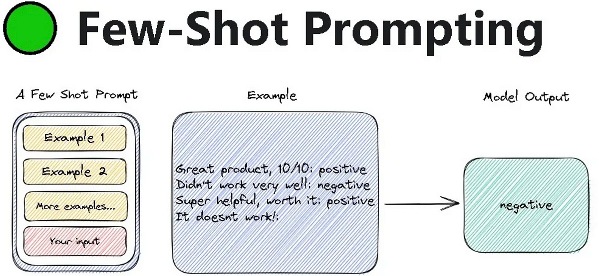

## Table of Contents

## What is Few-Shot Prompting in machine learning?

Few-Shot Prompting is a technique used in machine learning, especially with large language models, where the model is given a small number of examples to learn from before making predictions or generating responses. Instead of training on a huge dataset, the model uses these few examples, or "shots," to understand the task at hand. This method is particularly useful because it allows the model to adapt quickly to new tasks without needing extensive retraining.

For instance, if you want a model to translate English to French, you might show it just a few examples of English sentences and their French translations. The model then uses these examples to figure out how to translate new English sentences into French. This approach is powerful because it mimics how humans learn from a few examples and can apply that knowledge to new situations. It's like showing a student a couple of math problems and then asking them to solve a new one on their own.

## How does Few-Shot Prompting differ from traditional machine learning methods?

Few-Shot Prompting is different from traditional machine learning methods because it uses very few examples to learn a task. In traditional machine learning, you usually need a lot of data to train a model. For example, if you want to teach a computer to recognize pictures of cats, you would show it thousands of cat pictures. With Few-Shot Prompting, you might show the model just a few cat pictures, and it can still learn to recognize cats. This makes Few-Shot Prompting faster and more flexible because you don't need to spend a long time collecting and labeling a huge dataset.

Another key difference is how the model learns and applies its knowledge. Traditional methods often involve training the model from scratch or fine-tuning it extensively on a specific task. This can take a lot of time and computational power. In contrast, Few-Shot Prompting leverages pre-trained models that have already learned a lot from a broad range of data. When you give these models a few examples of a new task, they can quickly adapt and perform well on that task. This ability to learn from just a few examples is similar to how humans can pick up new skills or concepts quickly with minimal guidance.

## What are the key components of a Few-Shot Prompting model?

A Few-Shot Prompting model relies on a pre-trained large language model as its foundation. This pre-trained model has been exposed to a vast amount of data and has learned to understand and generate language. When you use Few-Shot Prompting, you're not starting from scratch; instead, you're building on what the model already knows. The key is to provide the model with a few carefully chosen examples that illustrate the task you want it to perform. These examples, or "shots," help the model understand the specific task without needing to be retrained extensively.

The second crucial component is the prompt itself, which includes both the instructions and the few-shot examples. The prompt guides the model on what to do, and the examples show it how to do it. For instance, if you want the model to translate English to Spanish, your prompt might include a few sentences in English with their Spanish translations. The model uses these examples to figure out the pattern and apply it to new sentences. This approach allows the model to adapt quickly to new tasks, making it versatile and efficient.

## Can you explain the concept of 'shots' in Few-Shot Prompting?

In Few-Shot Prompting, 'shots' refer to the small number of examples you give to the model to help it learn a new task. Think of these shots as quick lessons or demonstrations. For instance, if you want the model to learn how to translate from English to Spanish, you might show it two or three sentences in English along with their Spanish translations. These examples help the model understand what you want it to do without needing a lot of training data.

The number of shots can vary, but usually, it's just a few - often between one and ten. The idea is that even with these few examples, the model can figure out the pattern and apply it to new situations. This makes Few-Shot Prompting very efficient because you don't need to spend a long time teaching the model. It's like showing a friend a couple of math problems and then trusting them to solve a new one on their own.

## What are some common applications of Few-Shot Prompting?

Few-Shot Prompting is used in many areas where you want a computer to do something new without teaching it a lot. One common use is in language translation. If you want to translate from English to another language, you can show the computer just a few examples of sentences and their translations. The computer then uses these examples to figure out how to translate new sentences. This is really helpful because you don't need to spend a long time teaching the computer.

Another area where Few-Shot Prompting is useful is in text generation, like writing stories or answering questions. If you want the computer to write a story, you can show it a few short stories and ask it to write a new one. The computer will look at the examples and create a new story that follows the same style. This makes it easy to get the computer to do creative tasks without a lot of training.

Few-Shot Prompting is also used in tasks like sentiment analysis, where you want to know if a piece of text is positive or negative. By showing the computer a few examples of positive and negative texts, it can learn to classify new texts quickly. This method is great for when you need quick results and don't have a lot of time or data to train a model from scratch.

## How does Few-Shot Prompting improve model efficiency and adaptability?

Few-Shot Prompting makes models more efficient because it lets them learn new tasks with just a few examples. Instead of needing thousands of examples, which can take a long time to gather and process, the model can start working on a new task right away. This saves a lot of time and resources. For example, if you want a computer to translate from English to Spanish, you can show it just a few sentences and their translations. The computer then uses these examples to figure out how to translate new sentences quickly.

This method also makes models more adaptable. Because the model doesn't need a lot of data to learn a new task, it can switch between different tasks easily. If you want the model to do something different, like writing a story or answering questions, you just need to show it a few examples of what you want. This flexibility means the model can be used for many different things without having to be retrained from scratch each time. It's like having a tool that can do many jobs with just a little bit of guidance.

## What are the challenges faced when implementing Few-Shot Prompting?

One challenge with Few-Shot Prompting is that it can be hard to choose the right examples to show the model. If the examples are not good, the model might not learn the task well. For example, if you want the model to translate from English to Spanish, you need to pick sentences that show different ways of using words and grammar. If the examples are too simple or similar, the model might not learn how to handle more complex sentences. This means you have to be careful and thoughtful when [picking](/wiki/asset-class-picking) the examples.

Another challenge is that Few-Shot Prompting might not work as well for very hard tasks. If the task is too different from what the model has learned before, a few examples might not be enough. For example, if you want the model to do something it has never seen before, like translating a rare language, it might struggle even with good examples. This means that while Few-Shot Prompting is great for many tasks, it has limits and might not always give the best results for very new or complex tasks.

## How can one evaluate the performance of a Few-Shot Prompting model?

To evaluate the performance of a Few-Shot Prompting model, you can use a test set of examples that the model hasn't seen before. This test set should be similar to the examples you used to teach the model, but different enough to see if the model really learned the task. You can then compare the model's answers to the correct answers to see how well it did. For example, if you taught the model to translate from English to Spanish, you would give it new English sentences to translate and check how accurate the Spanish translations are.

Another way to evaluate the model is to use metrics like accuracy, precision, and recall. Accuracy tells you how often the model gets the right answer. Precision tells you how many of the model's positive predictions were correct. Recall tells you how many of the actual positive cases the model correctly identified. You can calculate these metrics by comparing the model's predictions to the correct answers in your test set. This helps you understand how well the model performs on different aspects of the task.

## What are some advanced techniques used to enhance Few-Shot Prompting?

One advanced technique to enhance Few-Shot Prompting is called "prompt engineering." This involves carefully designing the instructions and examples given to the model to make it understand the task better. By choosing good examples and writing clear instructions, you can help the model learn more effectively. For example, if you want the model to summarize news articles, you might show it a few examples of summaries and explain what makes a good summary. This helps the model know what to do when it sees a new article.

Another technique is "meta-learning," which means teaching the model how to learn from few examples. This can make the model better at Few-Shot Prompting because it learns how to quickly pick up new tasks. For instance, if you train the model on many different tasks with few examples each, it can get better at understanding new tasks with just a few examples. This is like teaching a student how to learn new things quickly, so they can apply that skill to any subject.

## How does Few-Shot Prompting integrate with other machine learning paradigms like transfer learning?

Few-Shot Prompting integrates well with transfer learning because both methods use what the model already knows to learn new things quickly. In transfer learning, a model that has been trained on one task can use that knowledge to help it learn a new, but related, task. For example, a model trained to recognize cats can use that knowledge to help it learn to recognize dogs. Few-Shot Prompting takes this a step further by showing the model just a few examples of the new task. This helps the model adapt what it knows to the new task even faster. It's like showing a student who knows basic math a couple of algebra problems and then asking them to solve new ones.

This combination of Few-Shot Prompting and transfer learning makes models very versatile and efficient. The model can use its broad knowledge from transfer learning to understand the new task quickly, and the few examples from Few-Shot Prompting help it fine-tune its understanding. This means the model can learn new tasks with very little data and time, which is great for when you need quick results or don't have a lot of training data. It's like having a tool that can do many jobs well with just a little bit of guidance.

## What are the future prospects and research directions for Few-Shot Prompting?

The future of Few-Shot Prompting looks bright because it helps machines learn new things quickly and with less data. Researchers are working on making this method even better. They want to find new ways to pick the best examples to show the model, so it can learn even faster. They are also looking at how to use Few-Shot Prompting for harder tasks, like understanding very complex language or solving problems in fields like medicine or law. By making Few-Shot Prompting work well for these tough tasks, it could help in many important areas where quick learning is key.

Another exciting direction is combining Few-Shot Prompting with other smart methods like meta-learning. This means teaching the model how to learn from just a few examples, which could make it even better at picking up new tasks. Researchers are also looking at how to make Few-Shot Prompting more reliable and consistent. They want to make sure that the model gives good results every time, no matter what task it's learning. This could lead to machines that can help us in new and helpful ways, like translating rare languages or understanding complex scientific papers with just a little bit of guidance.

## Can you provide a case study or example where Few-Shot Prompting significantly impacted a project or application?

A notable example where Few-Shot Prompting made a big difference is in the development of a language translation app for a non-profit organization. The app aimed to help people in remote areas communicate with healthcare providers in their native languages. The challenge was that many of these languages had very little data available for traditional [machine learning](/wiki/machine-learning) models. By using Few-Shot Prompting, the developers were able to show the model just a few examples of translations between English and these lesser-known languages. This allowed the app to start working quickly, even without large amounts of training data. As a result, the app was able to help more people get the healthcare they needed by breaking down language barriers.

Another case study involves a company that wanted to improve its customer service chatbot. The company needed the chatbot to handle a wide variety of customer inquiries, from simple questions to more complex issues. Using Few-Shot Prompting, the team showed the model a few examples of different types of customer interactions and the appropriate responses. This allowed the chatbot to quickly adapt to new types of questions without needing to be retrained extensively. As a result, the chatbot became more efficient and helpful, leading to higher customer satisfaction and fewer support tickets. This example shows how Few-Shot Prompting can make AI systems more versatile and responsive to real-world needs.