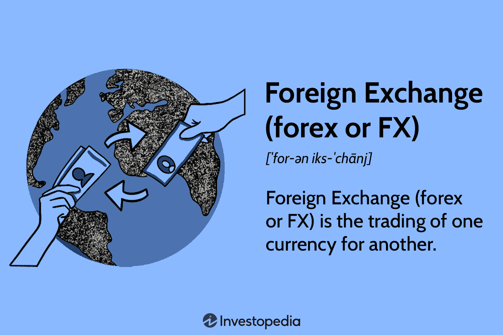

Financial trading encompasses various financial markets, including commodities, currencies, and derivatives, with each sector presenting its unique dynamics and opportunities. The FEX Global commodity exchange stands as a pivotal player within this domain, particularly in the trading of energy, commodities, and environmental derivatives not only in Australia but also on a broader, international scale. Established as a benchmark for trading these instruments, FEX Global serves as an essential hub for the facilitation and growth of these critical markets.

Algorithmic trading, frequently referred to as algo trading, signifies a transformative shift in modern financial markets. It automates trading processes through the deployment of computer algorithms, thus redefining how trades are executed. The utilization of algorithms allows for executing trades at speeds and frequencies far superior to human capabilities, thereby offering enhanced precision and potentially higher profits.



This article aims to explore the synergy between the FEX Global exchange and algorithmic trading, demonstrating how this integration benefits traders. By strategically combining the robust platform provided by FEX Global with sophisticated algorithmic trading techniques, traders can harness the potential of technology and innovation to optimize their trading strategies. We will cover essential aspects of trading within this exchange, discussing how algorithmic strategies can be employed to achieve optimal trading outcomes and improve risk management.

Traders leveraging algorithmic strategies at FEX Global can expect an improvement in efficiency and effectiveness in trade execution. The platform's advanced market technology offers an ideal environment for deploying algorithms that capitalize on market trends, identify arbitrage opportunities, and enhance overall trading performance. Through understanding and implementing these strategies, traders have the potential to transform their trading practices, achieving higher precision and profitability in a competitive trading landscape.

## Table of Contents

## Understanding FEX Global

FEX Global, a prominent subsidiary of the FEX Group, was established in 2006 and operates from its headquarters in Sydney, Australia. The exchange has carved a niche for itself as a pivotal market structure designer with a focus on commodity and energy derivatives. Its strategic positioning lies in its capability to offer a highly technological trading environment, marked by its use of Nasdaq technology for its futures market trading engine. This integration ensures a reliable, efficient, and fast processing of trades, contributing to the robustness of the trading experience offered to global participants.

The regulatory framework surrounding FEX Global is stringent and comprehensive, ensuring transparent and secure trading operations. The markets of FEX Global are regulated by the Australian Securities and Investments Commission (ASIC), which provides a regulatory oversight ensuring fair trading practices and adherence to financial laws. In addition to domestic regulation, FEX Global's clearing processes are managed by CME Clearing, offering additional security and efficiency in trade settlements. This integration with CME Clearing aligns FEX Global with global standards, ensuring that participants' transactions are processed securely and reliably.

Moreover, FEX Global's ability to engage in international markets is facilitated by its registration as a Foreign Board of Trade with the U.S. Commodity Futures Trading Commission. This registration is a mark of compliance with stringent U.S. regulatory standards and enhances the exchange's capacity to draw international traders by providing a trustworthy platform for trade in energy and commodity derivatives. Consequently, FEX Global not only serves the Australian market but also acts as a gateway for international market participants looking to trade within a regulated and technologically advanced environment.

## What is Algorithmic Trading?

Algorithmic trading, commonly known as algo trading, refers to the process of executing trades using automated, pre-defined programs. These programs are designed to follow a set of rules that consider various factors such as price, timing, and trading [volume](/wiki/volume-trading-strategy) to make buy or sell decisions. The core objective of [algorithmic trading](/wiki/algorithmic-trading) is to improve trading efficiency, reduce the need for manual intervention, and ultimately, increase profitability.

The algorithms deployed in algo trading are programmed to analyze market conditions continuously and execute trades at optimal times. A primary advantage of these algorithms is their ability to operate free from human emotional biases, thereby making data-driven decisions that aim for precision and speed. Algorithmic trading has become a dominant practice in markets with high [liquidity](/wiki/liquidity-risk-premium) where rapid trade executions can yield significant advantages, such as those found in currency pairs, stocks, and derivatives.

In markets characterized by [high frequency](/wiki/high-frequency-trading) and liquidity, algorithmic trading systems are specifically advantageous. Consider, for example, a simple trading strategy that buys when a stock's moving average is above a certain threshold, reflecting an upward trend, and sells when it falls below a designated point, indicating a potential downturn. Implementing such strategies using an algorithm ensures trades are executed instantly upon meeting the conditions, thus capturing favorable market opportunities.

Moreover, algo trading allows for the implementation of complex strategies that can simultaneously track and react to multiple trading signals, offering superior risk management. Here is a basic example using Python pseudocode to illustrate a simple mean-reversion algorithm:

```python
# Pseudocode for mean-reversion algorithm
def mean_reversion_strategy(prices):
    moving_average = calculate_moving_average(prices)
    for price in prices:
        if price < moving_average:  # Buy signal
            execute_trade('buy', price)
        elif price > moving_average:  # Sell signal
            execute_trade('sell', price)

def calculate_moving_average(prices, window_size=20):
    return sum(prices[-window_size:]) / window_size

def execute_trade(action, price):
    print(f"Executing {action} at {price}")
```

By leveraging such strategies, traders can enhance their decision-making processes and optimize their trading outcomes. The automated and systematic approach of algorithmic trading enables seamless execution of trading strategies, capturing market movements quickly and efficiently to achieve desired financial goals.

## Benefits of Algorithmic Trading at FEX Global

Algorithmic trading on FEX Global allows traders to leverage speed and automation to capitalize on commodity market trends effectively. The approach significantly reduces the influence of human emotions, which often lead to irrational decision-making in trading. By automating the trading process, traders can achieve more disciplined and objective execution of trades.

One of the key advantages of using algorithms on FEX Global is the ability to execute multiple trading strategies across different markets simultaneously. This capability enhances risk management by ensuring that traders are not overly exposed to a single market or strategy. It also allows for diversification, which can mitigate potential losses and optimize overall trading performance.

Moreover, algorithmic trading enables thorough [backtesting](/wiki/backtesting) using historical data available on FEX Global. By simulating trades with past market conditions, traders can refine their strategies and identify potential weaknesses before applying them in live trading environments. This process not only improves the robustness of trading algorithms but also increases the likelihood of successful trades.

Additionally, algorithmic trading supports continuous market monitoring without the need for constant human oversight. This feature is particularly beneficial for global markets that operate outside traditional business hours. Algorithms can execute trades 24/7, ensuring that traders do not miss out on opportunities that arise during periods of inactivity. This round-the-clock operation provides a significant edge, especially in fast-moving markets where timing is crucial for profitability.

## Key Algorithmic Trading Strategies

Algorithmic trading strategies have revolutionized the financial markets by employing advanced computational techniques to enhance trading efficiency and profitability. This section reviews five prominent strategies used in algorithmic trading: [trend following](/wiki/trend-following), mean reversion, [arbitrage](/wiki/arbitrage), high-frequency trading, and [market making](/wiki/market-making).

### Trend Following
Trend following is a strategy that aims to capitalize on the persistence of market trends. The strategy is based on the premise that asset prices, when moving in a certain direction (up or down), will continue to move in that direction for a period. Traders using this strategy typically employ moving averages or other technical indicators to identify entry and [exit](/wiki/exit-strategy) points. Here's an example of a basic moving average crossover strategy in Python:

```python
import pandas as pd

def moving_average_crossover(data, short_window=40, long_window=100):
    signals = pd.DataFrame(index=data.index)
    signals['price'] = data['Close']
    signals['short_mavg'] = data['Close'].rolling(window=short_window, min_periods=1, center=False).mean()
    signals['long_mavg'] = data['Close'].rolling(window=long_window, min_periods=1, center=False).mean()
    signals['signal'] = 0.0
    signals['signal'][short_window:] = np.where(signals['short_mavg'][short_window:] > signals['long_mavg'][short_window:], 1.0, 0.0)   
    signals['positions'] = signals['signal'].diff()
    return signals
```

### Mean Reversion
Mean reversion is rooted in the idea that asset prices tend to revert to their historical averages over time. This strategy seeks to identify overbought or oversold conditions and anticipates a return to the mean. The use of statistical measures such as standard deviation and z-scores helps in formulating this strategy. For instance, a common technique involves Bollinger Bands, which signal potential buy or sell opportunities when prices move significantly above or below standard deviation bands.

### Arbitrage
Arbitrage involves profiting from price discrepancies across different markets or instruments. In its simplest form, it entails buying an asset in one market at a lower price and simultaneously selling it in another market at a higher price. More complex forms of arbitrage include triangular arbitrage in [forex](/wiki/forex-system) markets, which takes advantage of discrepancies in the exchange rates between three currencies. Here’s a conceptual outline of a triangular arbitrage implementation:

```python
def triangular_arbitrage(exchange_rates):
    for currency_a in exchange_rates:
        for currency_b in exchange_rates:
            for currency_c in exchange_rates:
                if currency_a != currency_b and currency_b != currency_c and currency_a != currency_c:
                    profit = (1 / exchange_rates[currency_a][currency_b]) * exchange_rates[currency_b][currency_c] * exchange_rates[currency_c][currency_a]
                    if profit > 1:
                        print(f"Arbitrage opportunity found: {currency_a} -> {currency_b} -> {currency_c} -> {currency_a}, Profit: {profit}")
```

### High-Frequency Trading
High-frequency trading ([HFT](/wiki/high-frequency-trading-strategies)) focuses on executing a large number of trades at extremely high speeds. It leverages low latency systems and sophisticated algorithms to benefit from minute price variations. This is particularly effective in highly liquid markets. HFT strategies often require significant technological infrastructure, including co-location services to minimize latency.

### Market Making
Market making involves providing liquidity to the markets by simultaneously placing buy and sell orders for a particular security. Market makers profit from the bid-ask spread, essentially [earning](/wiki/earning-announcement) the difference between the buying and selling prices. This strategy requires constant market presence and efficient execution to manage inventory risk and maintain profitability.

## Optimizing Algo Trading on FEX Global

Selecting the appropriate trading platform that supports algorithmic trading is essential for optimizing trading activities on FEX Global. FEX Global collaborates with Trading Technologies, providing traders with advanced platforms tailored for algorithmic trading. Trading Technologies offers a suite of tools that enable custom algorithm development, execution, and management, helping traders to implement efficient trading strategies with ease.

Understanding the regulatory landscape is another fundamental aspect. In Australia, trading activities are regulated by the Australian Securities and Investments Commission (ASIC). Compliance with ASIC's guidelines and other international regulatory bodies ensures that trading strategies are executed within the legal framework, reducing the risk of penalties and maintaining market integrity.

Employing custom or pre-built trading algorithms requires thorough testing within FEX Global's competitive trading environment. Traders can leverage backtesting and forward-testing methodologies to evaluate algorithm performance under historical and simulated market conditions. This process is vital for identifying potential weaknesses and enhancing algorithm reliability before deploying them in live trading.

Risk management is a critical component of algorithmic trading. Traders should incorporate key risk management techniques such as setting stop-loss orders, determining position sizing, and establishing risk limits within their algorithms. For example, a Python snippet for setting stop-loss orders might look like this:

```python
def calculate_stop_loss(price, percentage):
    return price * (1 - percentage/100)

# Example: Calculate a stop-loss at 2% below the current price
current_price = 100
stop_loss_price = calculate_stop_loss(current_price, 2)
```

Continuous performance monitoring and adjustments based on market dynamics are necessary for sustaining profitability. Algorithmic strategies must be regularly reviewed to adapt to changing market conditions, employing real-time analytics and feedback loops to refine trading parameters. This involves tracking various performance metrics and recalibrating strategies to maintain and improve trading performance over time. With these optimizations, traders can capitalize on the flexibility and precision offered by algorithmic trading on FEX Global.

## Conclusion

FEX Global provides a comprehensive market framework for financial trading and algorithmic strategies. The integration of algo trading within this exchange brings myriad opportunities to refine and enhance trading processes and performance. By leveraging algorithmic trading, traders can optimize execution speed, accuracy, and consistency, thus setting the stage for higher profitability and strategic advantage.

Embracing these advancements in trading technology allows for a transformation of traditional practices, where enhanced precision is not just a possibility but a reality. Algorithmic systems mitigate human error and emotional bias, enabling a data-driven approach to trading decisions. The automation inherent in algo trading facilitates round-the-clock market participation, ensuring traders never miss crucial trading opportunities due to absence or oversight.

Furthermore, traders on FEX Global must consider the vital convergence of regulatory compliance, sophisticated technology, and strategic execution. Compliance with regulatory standards such as those set by the Australian Securities and Investments Commission (ASIC) ensures that trading activities are conducted within the legal framework. The use of advanced technologies, supported by collaborations with platforms like Trading Technologies, provides a robust infrastructure for executing complex trading strategies. Strategic execution, involving well-tested algorithms and diligent risk management, is essential to navigating the competitive landscape and maximizing returns.

In conclusion, embracing algorithmic trading on FEX Global can significantly enhance a trader's approach, fostering a more efficient, strategic, and profitable engagement with the financial markets.

## References & Further Reading

[1]: Bergstra, J., Bardenet, R., Bengio, Y., & Kégl, B. (2011). ["Algorithms for Hyper-Parameter Optimization."](https://dl.acm.org/doi/10.5555/2986459.2986743) Advances in Neural Information Processing Systems 24.

[2]: ["Advances in Financial Machine Learning"](https://www.amazon.com/Advances-Financial-Machine-Learning-Marcos/dp/1119482089) by Marcos Lopez de Prado

[3]: ["Evidence-Based Technical Analysis: Applying the Scientific Method and Statistical Inference to Trading Signals"](https://www.amazon.com/Evidence-Based-Technical-Analysis-Scientific-Statistical/dp/0470008741) by David Aronson

[4]: ["Machine Learning for Algorithmic Trading"](https://github.com/stefan-jansen/machine-learning-for-trading) by Stefan Jansen

[5]: ["Quantitative Trading: How to Build Your Own Algorithmic Trading Business"](https://www.amazon.com/Quantitative-Trading-Build-Algorithmic-Business/dp/1119800064) by Ernest P. Chan