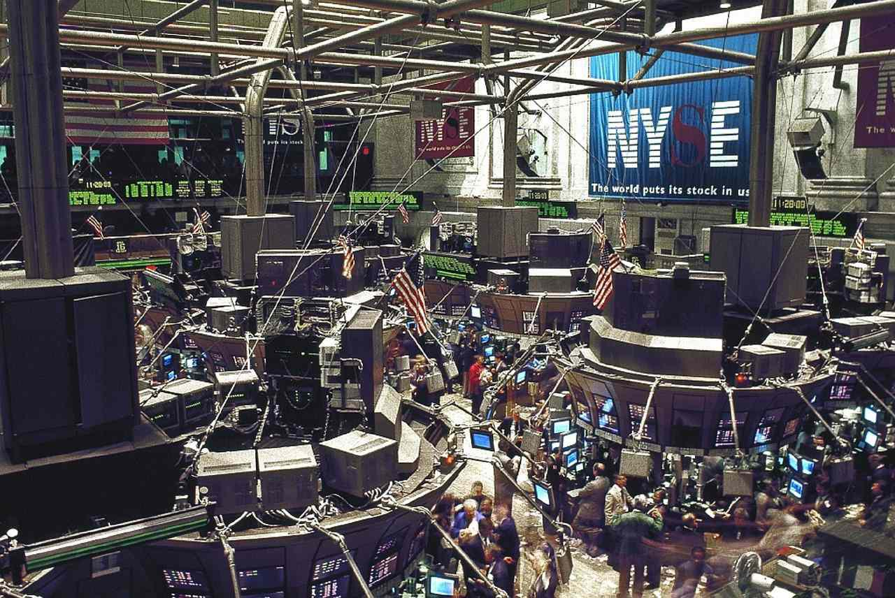

Financial markets have undergone substantial transformations over the years, largely due to technological advancements. A key development in this area is the adoption of algorithmic trading, also known as algo trading. This approach leverages technology to automate trading activities, enabling traders to execute orders with speed and precision that manual methods cannot achieve. Algo trading has allowed firms to analyze large datasets, implement complex strategies instantaneously, and manage risk more effectively. The competitive landscape of trading has been significantly shaped by these innovations, pushing firms to continuously adapt and refine their approaches.

Among the entities at the forefront of leveraging algorithmic trading are the members of the FIA Principal Traders Group (PTG). Founded in 2010 under the Futures Industry Association (FIA), this group consists of principal traders, predominantly independent proprietary trading firms that trade with their own capital. The formation of FIA PTG was partly in response to controversies around high-frequency trading, providing a unified voice for these firms in regulatory and policy discussions. With many of their members based in trading hubs like Chicago, FIA PTG firms play a crucial role in today's financial markets.



This article examines the landscape of algorithmic trading in financial markets, alongside the integral role FIA Principal Traders Group and its member firms play. We will discuss the group's formation, objectives, and key figures, highlighting their influence on market dynamics through the application of sophisticated trading techniques. By understanding these elements, it becomes evident how these firms contribute to shaping modern financial markets, maintaining market integrity while pushing the boundaries of what is possible in trading practices.

## Table of Contents

## Understanding FIA Principal Traders Group

The FIA Principal Traders Group (FIA PTG) was established in 2010 as a lobby group under the auspices of the Futures Industry Association (FIA). The primary purpose of FIA PTG is to serve as a representative body for principal traders, which refers to independent proprietary trading firms that engage in trading activities using their own capital rather than customers' funds. These firms are characterized by their focus on autonomous trading strategies developed internally and executed across various financial markets.

The inception of the FIA PTG was a direct reaction to the controversies that had emerged concerning certain trading practices, notably high-frequency trading ([HFT](/wiki/high-frequency-trading-strategies)). HFT involves the use of powerful computer algorithms to execute large orders at extremely high speeds, often leveraging minimal latency and exploiting market inefficiencies. While HFT has contributed to improved liquidity and tighter spreads in many instances, it has also been scrutinized for potentially exacerbating market volatility and contributing to situations of market disruption.

Chicago serves as the base for most FIA PTG member firms, highlighting the city’s prominence as a hub for trading activity. This geographical concentration supports collaborative efforts and knowledge sharing among firms, facilitating a cohesive stance on policy matters. The FIA PTG plays a crucial role in uniting these firms to articulate their collective positions on policy issues affecting their operations. The group's advocacy focuses on promoting an understanding of the benefits these trading firms provide to market function and efficiency, while also seeking to contribute to debates on regulatory frameworks that impact their sector.

By providing a unified voice and fostering communication within the trading community, FIA PTG ensures that its members can effectively address common challenges and engage with regulatory bodies to influence policy in ways that are constructive for the market.

## Mission and Objectives of FIA PTG

The FIA Principal Traders Group (FIA PTG) is dedicated to serving as a collaborative platform for principal traders, enabling them to share insights and address pertinent issues within the trading community. One of the organization's primary objectives is to advocate for cost-effective and transparent access to global markets, emphasizing the beneficial role that individual trading groups play within these environments. By fostering an inclusive dialogue among participants, FIA PTG aims to enhance understanding and cooperation among stakeholders in the financial markets.

FIA PTG places significant emphasis on increasing awareness about the constructive contributions made by its member firms. The group recognizes that principal traders are pivotal in enhancing market [liquidity](/wiki/liquidity-risk-premium), aiding in price discovery, and ultimately contributing to market efficiency. Through targeted advocacy efforts, FIA PTG seeks to align market perception with the positive impact that these trading groups have on the broader market ecosystem.

Additionally, FIA PTG collaborates closely with the Futures Industry Association (FIA) to achieve these aims. The partnership supports the crafting and dissemination of initiatives and statements that advocate for optimal market conditions. These joint efforts often involve engaging with regulators to ensure that market structures promote transparency and fairness while encouraging technological innovation.

Overall, the mission and objectives of FIA PTG are centered around fostering a dynamic and resilient market environment where principal traders can operate with clarity and efficiency, thereby contributing positively to the global financial markets.

## Operation and Influence in Financial Markets

FIA Principal Traders Group (PTG) members actively participate in a diverse range of financial markets by employing a variety of trading strategies. These strategies are categorized into automated, manual, and hybrid approaches, each tailored to their specific markets and asset classes, which include futures, equities, foreign exchange, and fixed income. Automated trading strategies, powered by algorithmic models, enable these firms to execute trades at high speed and with precision, reducing human errors and increasing efficiency in market executions.

The technological infrastructure supporting these trading activities is pivotal. FIA PTG member firms often leverage the latest advancements in technology, including high-speed internet connections and sophisticated trading algorithms, enabling them to maintain a competitive edge. These cutting-edge technologies facilitate rapid data processing and decision-making, which are crucial in markets where time is a critical [factor](/wiki/factor-investing). The reliance on technology also extends to latency minimization, where minimal time delay between an order being placed and executed can significantly impact profitability and market positioning.

Moreover, FIA PTG exerts its influence in financial markets by actively contributing to the development of fair market conditions. This is achieved through the publication of research papers and official statements that not only advocate for transparency and cost-effectiveness but also emphasize the importance of robust risk management practices. Such publications serve as frameworks for establishing standardized guidelines, thereby fostering a stable market environment.

The advocacy efforts of FIA PTG include collaborations with exchanges and regulators to ensure that the evolving trading landscape adheres to principles that support both innovation and market integrity. By promoting fair competition and ethical trading practices, FIA PTG plays a crucial role in shaping the evolution of trading systems that prioritize investor protection and efficient market operation. Through these comprehensive measures, FIA PTG continues to align its activities with the overarching goal of fostering a sustainable and dynamic trading ecosystem.

## Key People and Member Firms

Rob Creamer, serving as the chairman of the FIA Principal Traders Group, holds a pivotal leadership position in shaping the endeavors and strategic direction of the organization. As the president and CEO of Geneva Trading USA, Creamer brings a wealth of experience and insight to his role, facilitating the organization's efforts to represent and advocate for the interests of proprietary trading firms.

FIA PTG's membership comprises some of the most influential and dynamic firms within the financial trading community. Notable member firms include Citadel, Jump Trading, DRW, and Optiver. These firms exemplify the extensive reach and substantial impact that principal trading firms have in modern financial markets. Citadel, a prominent global financial institution, is known for its significant presence in both [market making](/wiki/market-making) and [hedge fund](/wiki/hedge-fund-trading-strategies) management. Jump Trading is renowned for its role in high-frequency trading and technological innovation. DRW, a diversified principal trading firm, engages in a range of asset classes, continuously leveraging new strategies and technology. Optiver, with its roots in market making, emphasizes efficiency and liquidity across global markets.

These member firms not only represent a diverse cross-section of the trading industry but also set standards for trading efficiency and market participation. Through continuous innovation and adoption of cutting-edge technology, they enhance the functionality and competitiveness of financial markets. Their involvement in FIA PTG reflects a commitment to fostering market integrity and efficiency, benefiting the broader financial ecosystem.

## The Role of Algo Trading in Modern Markets

Algorithmic trading, or algo trading, represents a paradigm shift in financial markets by executing orders using pre-programmed instructions that account for variables such as price, timing, and [volume](/wiki/volume-trading-strategy). This method surpasses the capabilities of manual trading, offering unparalleled speed and precision. The approach is particularly effective in volatile markets, where the ability to execute trades in milliseconds can lead to significant competitive advantages.

FIA Principal Traders Group (PTG) member firms are leaders in this rapidly evolving field. They employ complex algorithms that can analyze vast datasets in real time, execute trades, and minimize risk exposure. These algorithms often incorporate [machine learning](/wiki/machine-learning) models to adapt to changing market conditions and optimize trading strategies continuously.

The success of algo trading is evident in its influence on trading outcomes. By automating the decision-making process, firms can process high volumes of transactions more efficiently, reducing the likelihood of human error. Moreover, these algorithms can operate throughout the trading day without fatigue, ensuring consistent performance and increased throughput.

From a market liquidity perspective, algo trading has contributed to more robust market conditions. The constant buying and selling by algorithms ensure tighter spreads and an abundance of liquidity, which benefits all market participants by reducing transaction costs.

However, the widespread adoption of algo trading also presents challenges, such as algorithmic overload, where too many orders are executed simultaneously, potentially causing market disruptions. To mitigate such risks, firms continually refine their algorithms, incorporating real-time feedback and learning mechanisms that allow them to mend their strategies dynamically. A typical approach involves using Python to backtest algorithms with historical data to ensure robustness before they are deployed in live trading environments. For example:

```python
import pandas as pd
import numpy as np

# Load historical data
data = pd.read_csv('historical_market_data.csv')

# Define a simple moving average strategy
short_window = 40
long_window = 100

# Generate signals
data['short_mavg'] = data['Close'].rolling(window=short_window, min_periods=1, center=False).mean()
data['long_mavg'] = data['Close'].rolling(window=long_window, min_periods=1, center=False).mean()
data['signal'] = 0
data['signal'][short_window:] = np.where(data['short_mavg'][short_window:] > data['long_mavg'][short_window:], 1, 0)

# Evaluate strategy performance
data['returns'] = data['Close'].pct_change()
data['strategy_returns'] = data['returns'] * data['signal'].shift(1)

# Cumulative returns
cumulative_strategy_returns = (1 + data['strategy_returns'].dropna()).cumprod()

print('Cumulative strategy returns:', cumulative_strategy_returns.iloc[-1])
```

Ultimately, FIA PTG member firms continue to drive the adoption and evolution of [algorithmic trading](/wiki/algorithmic-trading). Their advanced use of sophisticated algorithms not only enhances trading efficiency and liquidity but also shapes the broader financial market landscape. While challenges remain, ongoing innovation and regulatory engagement ensure that algorithmic trading remains a sustainable and integral part of modern financial markets.

## Challenges and Regulatory Landscape

Algorithmic trading, while offering unprecedented speed and efficiency in executing transactions, has drawn critical attention due to its potential effects on market stability and fairness. One of the primary concerns is the propensity for algo trading to amplify market [volatility](/wiki/volatility-trading-strategies). Rapid-fire transactions executed by algorithms can lead to erratic price movements, often in milliseconds, posing significant risks to market equilibrium. This is exemplified by events such as the "Flash Crash" of May 2010, where the Dow Jones Industrial Average plummeted nearly 1,000 points within minutes before recovering just as swiftly. Such incidents underscore the need for stringent oversight and regulation to prevent market disruptions caused by automated trading.

The FIA Principal Traders Group (FIA PTG) plays a proactive role in engaging with regulators to address these concerns. The group contributes to discussions on market structures and advocates for policies that strike a delicate balance between promoting technological innovation and ensuring market stability. Their involvement underscores a commitment to fostering a sustainable trading environment, which is crucial for maintaining investor confidence and ensuring fair trading practices.

FIA PTG's advocacy efforts include issuing papers, participating in public consultations, and collaborating with other industry stakeholders to shape regulatory frameworks that govern algorithmic trading. Their initiatives often focus on enhancing market transparency, improving risk management practices, and ensuring fair access to trading platforms. These efforts are in response to regulatory measures, such as the Markets in Financial Instruments Directive II (MiFID II) in Europe, which aims to increase transparency and reduce systemic risks associated with automated trading.

A vital aspect of FIA PTG's regulatory engagement is their emphasis on risk controls and safeguards. They advocate for robust pre-trade risk assessments, circuit breakers, and real-time monitoring systems to mitigate the risks associated with high-frequency and algorithmic trading. By promoting these measures, FIA PTG seeks to minimize the potential for algorithm-driven market disruptions and protect the integrity of financial markets.

Through its active participation in regulatory discourse, the FIA Principal Traders Group demonstrates its dedication to nurturing a resilient and fair trading landscape. Their efforts to balance the benefits of technological advancements with the imperative of market stability highlight the ongoing challenges and responsibilities faced by principal trading firms in the era of algorithmic trading.

## Conclusion

The FIA Principal Traders Group (FIA PTG) serves as a vital component in the global financial markets, underscoring the essential role of principal trading firms. These firms continuously advance trading practices through a dynamic combination of collaboration, advocacy, and innovation. By working together, they effectively influence market structures and promote fair trading environments, often advocating for progressive policy changes that enhance market operations.

As technology continues its rapid evolution, the role of FIA PTG members is expected to grow even more prominent. Their adoption of emerging technologies and advanced trading algorithms places them at the forefront of the financial trading landscape. This ongoing technological integration facilitates improvements in trading efficiency and market liquidity, while also bolstering market integrity.

By advocating for robust risk management practices and fair market conditions, FIA PTG demonstrates a commitment to sustainable market evolution. Their proactive engagement with regulators ensures a balanced approach to market innovation and stability. Looking forward, the continued efforts of FIA PTG and its members are poised to shape future trading paradigms, driving advancements and ensuring resilient financial markets.

## References & Further Reading

[1]: Aldridge, I. (2013). ["High-Frequency Trading: A Practical Guide to Algorithmic Strategies and Trading Systems."](https://www.amazon.com/High-Frequency-Trading-Practical-Algorithmic-Strategies/dp/1118343506) Wiley.

[2]: MacKenzie, D. (2019). ["Trading at the Speed of Light: How Ultrafast Algorithms Are Transforming Financial Markets."](https://www.amazon.com/Trading-Speed-Light-Algorithms-Transforming/dp/0691211388) Princeton University Press.

[3]: Patterson, S. (2013). ["Dark Pools: High-Speed Traders, A.I. Bandits, and the Threat to the Global Financial System."](https://books.google.com/books/about/Dark_Pools.html?id=LIoNSKUEn24C) Crown Business.

[4]: Harris, L. (2003). ["Trading and Exchanges: Market Microstructure for Practitioners."](https://academic.oup.com/book/52292) Oxford University Press.

[5]: Easley, D., López de Prado, M. M., & O'Hara, M. (2013). ["The Volume Clock: Insights into the High-Frequency Paradigm."](https://papers.ssrn.com/sol3/papers.cfm?abstract_id=2034858) The Journal of Portfolio Management.