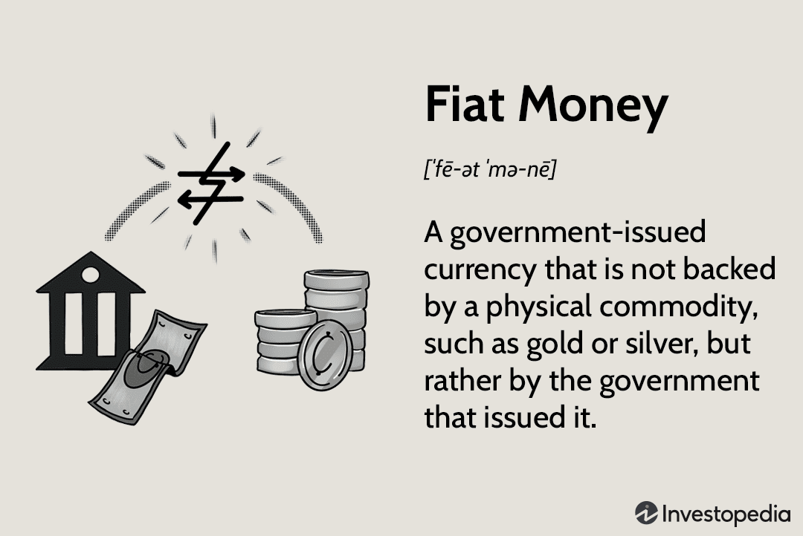

In the ever-evolving world of finance and economics, understanding the intricacies of money supply and currency forms is crucial. Fiat currency, a dominant form in global economies, plays a fundamental role in shaping economic policies. Unlike money that is backed by physical commodities such as gold or silver, fiat currency derives its value from the trust and authority of the government that issues it. This form of currency allows greater flexibility in monetary policy, enabling governments to adapt more readily to economic conditions and foster economic stability and growth.

Simultaneously, the financial landscape is being reshaped by advanced technologies like algorithmic trading. This innovative form of trading employs complex algorithms to make trading decisions at speeds and volumes beyond human capabilities, thus enhancing market efficiency and minimizing errors. Algorithmic trading involves leveraging large datasets and complex mathematical models, transforming how markets operate and influencing trading strategies across the globe.

This article explores the complex interaction between economics, fiat currency, money supply, and algorithmic trading. It examines how these elements combine to influence the stability and dynamics of modern economies and trading practices. As these factors intertwine, they highlight the importance of understanding both traditional economic mechanisms and modern technological advancements to navigate today’s global financial environment effectively. The interplay of these elements presents both opportunities and challenges in terms of economic growth, market efficiency, inflation control, and regulatory practices.

## Table of Contents

## Understanding Fiat Currency

Fiat currency serves as the backbone of modern economic systems, representing a form of legal tender established by a government's authority rather than being backed by a tangible commodity such as gold or silver. This currency holds its value primarily through the collective trust and acceptance it receives from users, as well as the stability and reputation of the issuing government. 

Unlike commodity money, which derives its value from the material from which it is made, fiat money has no intrinsic worth. Instead, its value is constructed on the legal framework and economic metrics of a sovereign state. For instance, the U.S. dollar, Euro, and British pound are all examples of fiat currencies that are widely used and accepted, not because they are redeemable in gold or any other commodity, but because the issuing authorities have decreed that these currencies are legal tender.

Central banks, leveraging fiat money, gain significant flexibility in shaping monetary policy. This flexibility enables them to implement strategies aimed at ensuring economic stability and responding to financial fluctuations. For instance, during recessions, central banks can increase the money supply or lower interest rates to stimulate economic activity. Conversely, they can tighten the money supply during periods of inflationary pressure.

However, the effectiveness of a fiat currency system is highly dependent on sound fiscal management. If a government mismanages its economy, it runs the risk of losing the collective trust on which the value of its currency is based. This scenario can lead to hyperinflation, where the currency rapidly loses its purchasing power, as historically witnessed in countries like Zimbabwe and Argentina. Therefore, maintaining the balance between fiscal policy, monetary stability, and public confidence is crucial in managing a fiat currency system effectively.

## Role of Central Banks in Money Supply Management

Central banks are pivotal institutions in managing a country's money supply and are integral to the execution of monetary policies. Their primary tool, fiat currency, enables them to implement various strategies to influence economic conditions and maintain stability. 

One of the principal methods employed by central banks is the adjustment of interest rates. By altering these rates, central banks can regulate borrowing and spending behaviors across the economy. Lowering interest rates generally encourages borrowing and investment, stimulating economic activity. Conversely, increasing interest rates tends to restrain borrowing and spending, which can help manage inflation. The manipulation of interest rates serves as a lever to influence aggregate demand within the economy, thereby impacting GDP growth and employment levels.

In addition to [interest rate](/wiki/interest-rate-trading-strategies) adjustments, central banks conduct open market operations to control money supply. This involves buying or selling government securities in the open market to either increase or decrease the amount of money in the banking system. For instance, purchasing government bonds injects [liquidity](/wiki/liquidity-risk-premium) into the economy, encouraging lending and spending. Selling these bonds has the opposite effect, withdrawing liquidity and potentially cooling down an overheated economy. These operations are crucial for implementing monetary policy objectives, such as targeting inflation rates or achieving specific economic growth targets.

Central banks also play a critical role during economic turmoil, acting as a financial backstop to ensure systemic stability. They can provide liquidity in times of financial distress, through mechanisms like the lender of last resort, to prevent financial systems from collapsing. This function was evident during the 2007-2008 financial crisis, where central banks worldwide intervened heavily to stabilize the banking sector and secure financial markets.

Moreover, by dynamically adjusting the money supply and interest rates, central banks strive to maintain a balance between inflation and economic growth. The goal is to achieve a stable price environment, which is essential for long-term economic prosperity. Price stability helps create a predictable economic environment, fostering investment and savings, which are key to sustainable economic development. 

Overall, central banks' management of fiat currency and money supply is a complex balancing act designed to stabilize the economy, control inflation, and promote economic growth. While their actions can vary in scope and method, the underlying objective remains consistent: to align the economic conditions with optimal growth, employment, and stability outcomes.

## Algorithmic Trading and Its Influence

Algorithmic trading utilizes advanced algorithms to execute trades at remarkable speeds and volumes, drastically transforming the financial trading landscape. By automating the trading process, it enhances efficiency and minimizes the risk of human errors. This automation relies heavily on complex data analyses that encompass historical data, market trends, and predictive modeling to make informed trading decisions. As a result, [algorithmic trading](/wiki/algorithmic-trading) facilitates more precise and timely market actions than those possible through traditional trading methods.

The synergy between algorithmic trading and fiat currencies, along with money supply management, creates a complex interplay influencing trading patterns and overall market dynamics. When central banks adjust money supply or interest rates, algorithmic trading strategies must adapt rapidly to these changes, shifting trading volumes and pricing models accordingly. For example, a decrease in interest rates often leads to a decrease in the cost of borrowing, impacting the valuation models used by algorithmic traders.

Moreover, algorithmic trading's influence extends to market liquidity and [volatility](/wiki/volatility-trading-strategies). By engaging in high-frequency trading, algorithms can contribute to greater market liquidity, making it easier for buyers and sellers to transact without significantly affecting the price. However, the same high speeds can also amplify market volatility. Rapid-fire trading strategies might unintentionally lead to large fluctuations in asset prices, as seen in several flash crash events.

Regulatory frameworks and ethical considerations are essential to ensure fair and transparent trading practices. Regulations aim to prevent market manipulation, a risk exacerbated by the anonymity and speed of algorithmic trades. For instance, regulators impose rules to curtail illegal activities such as spoofing, where traders place false orders to manipulate market prices. Maintaining ethical standards calls for creating algorithms that adhere to fair trading practices and incorporate risk management protocols to prevent unintended systemic risks.

In summary, algorithmic trading has redefined financial markets by leveraging advanced computational techniques to enhance trade accuracy and market efficiency. However, its integration with fiat currencies and broader economic policies requires careful regulation and ethical oversight to maintain market integrity and stability.

## Economic Implications of Fiat Money and Algo Trading

Fiat currencies and algorithmic trading significantly contribute to the structural dynamics of modern economies. Fiat money, as sovereign-issued legal tender, is pivotal for implementing monetary policy. It allows central banks to adjust interest rates and control the money supply, thus ensuring economic stability and growth. By controlling these levers, fiat money helps regulate inflation and maintain economic equilibrium, which is essential for fostering consumer and business confidence.

Algorithmic trading, on the other hand, has revolutionized financial markets by offering unprecedented efficiency and liquidity. Through sophisticated algorithms and high-frequency trading systems, large volumes of transactions can be executed at rapid speeds, significantly reducing transaction costs and enhancing market efficiency. This technological advancement mitigates human error, enables better price discovery, and increases market participation.

The interaction between fiat money and algorithmic trading can create a synergistic environment conducive to economic stability and growth. Central banks' monetary policies directly influence the liquidity and interest rates within financial markets. These changes are promptly reflected in market dynamics through algorithmic trading, leading to more stable financial environments conducive to long-term growth. For example, a decrease in interest rates, implemented to stimulate economic activity, can quickly lead to adjustments in trading algorithms, resulting in increased market liquidity and potential growth in asset prices.

However, this synergy also presents challenges. Inflation control remains a primary concern for economies relying on fiat currency. Excessive issuance of currency without corresponding economic growth can lead to inflation, diminishing the currency's purchasing power. Central banks must carefully balance money supply to prevent inflationary pressures.

Algorithmic trading introduces its own set of risks, including potential market manipulation and systemic risks due to flawed algorithms or unforeseen market conditions. Rapid and massive trading orders can lead to market volatility and even "flash crashes." Regulatory frameworks must therefore evolve to monitor these activities, ensuring transparency and fairness in financial markets.

Effective management and foresight are crucial in leveraging the benefits of fiat money and algorithmic trading while mitigating associated risks. Policymakers and financial institutions must coordinate to ensure robust regulatory oversight, stimulate responsible innovations, and maintain market integrity. Embracing technological advancements while fostering regulatory compliance will optimize these elements’ contributions to global economic prosperity and stability.

## Conclusion

Understanding the interplay between fiat currencies, money supply, and algorithmic trading is increasingly vital in today's economic landscape. Central banks, through their control of fiat money, wield significant influence over economic stability. Their capacity to manage the money supply and adjust interest rates directly affects inflation, employment, and overall economic growth. By leveraging fiat currency, central banks aim to stabilize economies during both times of economic expansion and contraction.

Algorithmic trading, on the other hand, continues to reshape financial markets by introducing both opportunities for enhanced efficiency and liquidity, as well as challenges related to transparency and market fairness. The rise of algorithmic trading has automated many trading processes, reducing human error but also necessitating rigorous regulatory oversight to prevent market manipulation and ensure ethical trading practices.

As technology in trading and monetary policy keeps advancing, responsible governance becomes crucial. Balancing these developments with sound regulatory frameworks will be key in steering the global economy toward sustained prosperity. Future discussions and policies must prioritize innovation, control, and balance, which are essential to optimizing the benefits of both fiat money and algorithmic trading. Such balanced governance promises to not only uphold the integrity of financial systems but also enhance economic resilience and growth on a global scale.

## References & Further Reading

[1]: ["The Origins and Development of Fiat and Inconvertible Paper Money"](https://www.jstor.org/stable/1875415) by Milton Friedman, Journal of Economic Literature.

[2]: ["The Role of Central Banks in Money Supply"](https://www.investopedia.com/articles/investing/053115/how-central-banks-control-supply-money.asp) by the International Monetary Fund.

[3]: Aldridge, I. (2013). ["High-Frequency Trading: A Practical Guide to Algorithmic Strategies and Trading Systems"](https://www.wiley.com/en-us/High+Frequency+Trading%3A+A+Practical+Guide+to+Algorithmic+Strategies+and+Trading+Systems-p-9780470579770) by Irene Aldridge.

[4]: Krugman, P. (1998). ["The return of depression economics"](https://www.princeton.edu/~pkrugman/fullerton.pdf) by Paul Krugman.

[5]: ["Algorithmic Trading: A Practitioner's Guide"](https://www.amazon.com/Algorithmic-Trading-Practitioners-Jeffrey-Bacidore/dp/0578715236) by Jeffrey Bacidore, Algo Research & Trading.