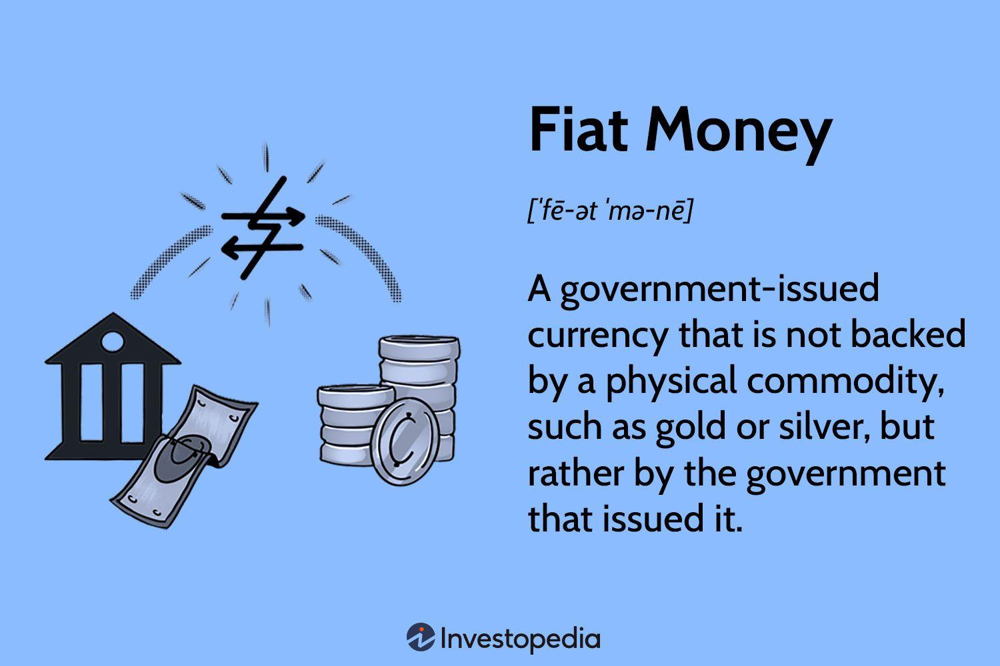

## Table of Contents

## What is fiat currency?

Fiat currency is money that a government says is worth something, even though it's not backed by a physical thing like gold or silver. It's just made of paper or digital numbers. People use it because they trust the government and believe others will accept it for buying things.

The value of fiat currency can go up or down based on how much people want it and how much of it there is. Governments can print more of it if they need to, which can sometimes cause inflation, where prices go up. Most countries use fiat money today because it gives governments more control over their economy.

## How does fiat currency differ from commodity money?

Fiat currency and commodity money are two different types of money. Fiat currency is money that a government says is valuable, even though it's not made from anything special like gold or silver. It's usually made of paper or just numbers in a computer. People use it because they trust the government and believe others will accept it when they want to buy things. The value of fiat money can change based on how much people want it and how much of it there is. Governments can print more of it if they need to, which can make prices go up.

Commodity money, on the other hand, is money that has value because it's made from something useful or valuable, like gold or silver. You can use it to buy things, but you can also use the material it's made from for other purposes. The value of commodity money comes from the material itself, not just because a government says it's worth something. Because it's tied to a physical thing, the amount of commodity money can't be changed as easily as fiat money. This can make it harder for governments to control the economy, but it can also make the money more stable.

## What are some examples of fiat currencies?

Some examples of fiat currencies are the US dollar, the Euro, and the Japanese yen. These are the money that people use in the United States, countries in Europe, and Japan. They are called fiat currencies because they are not made from valuable things like gold or silver. Instead, they are just pieces of paper or numbers on a computer that people use because their governments say they are worth something.

Another example of a fiat currency is the British pound, which people use in the United Kingdom. Like the other fiat currencies, the British pound's value comes from people trusting that others will accept it for buying things. The Chinese yuan is also a fiat currency, used in China. All these currencies can change in value based on how much people want them and how much of them there is, which is different from commodity money that has value because of the material it's made from.

## When and why was fiat currency first introduced?

Fiat currency was first introduced in the 11th century in China during the Song Dynasty. Before that, people used commodity money, like coins made of gold or silver. But the government started using paper money because it was easier to [carry](/wiki/carry-trading) around and use for big purchases. They called it "flying money" because it was so light and easy to move. The government promised that this paper money could be traded for gold or silver, but over time, it became valuable on its own.

The reason fiat currency became popular is that it gave governments more control over their economies. With fiat money, governments could print more money when they needed to, without having to find more gold or silver. This helped them manage things like inflation and economic growth. But it also meant that the value of the money could change based on how much was printed and how much people trusted it. Today, almost every country uses fiat currency because it's easier to use and gives governments more power to help their economies.

## How is the value of fiat currency determined?

The value of fiat currency is determined by how much people want it and how much of it there is. If people trust that they can use the money to buy things, and if there's not too much of it around, then it will be worth more. Governments and central banks play a big role in this. They can print more money or take some out of circulation, which can change how much people want it and how much it's worth.

Sometimes, other things can affect the value of fiat currency too. For example, if a country's economy is doing well, people might want its money more, making it more valuable. On the other hand, if people start to worry about a country's economy or its government, they might not want its money as much, which can make it less valuable. So, the value of fiat currency is always changing based on what's happening in the world and how people feel about it.

## What role do central banks play in managing fiat currency?

Central banks are really important for managing fiat currency. They control how much money is in the economy by deciding how much to print or take out. If they think there's too much money, which can make prices go up, they might take some out. If they think there's not enough money, and the economy needs a boost, they might print more. They also set interest rates, which is like the cost of borrowing money. When interest rates go up, people might borrow less, and when they go down, people might borrow more. This helps the central bank keep the economy stable.

Another thing central banks do is make sure people trust the money. They do this by being careful and making good decisions about the economy. If people trust the central bank, they'll trust the money too. Central banks also watch what's happening in the world and change their plans if they need to. For example, if there's a big problem like a financial crisis, the central bank might do special things to help keep the economy safe. So, central banks are always working to make sure the fiat currency stays valuable and the economy stays healthy.

## What are the advantages of using fiat currency over other forms of money?

One big advantage of using fiat currency is that it's easier to use than other kinds of money. For example, carrying around gold or silver coins can be heavy and hard to do. But with fiat currency, you can just use paper money or even a card or your phone to pay for things. It's also easier for governments to make and use fiat money because they don't have to find gold or silver to back it up. This means they can make more money when they need to, which can help the economy grow.

Another advantage is that governments can control the economy better with fiat currency. They can print more money or take some out to help keep prices stable and make sure the economy is doing well. This control can help prevent big problems like too much inflation, where prices go up a lot. Also, because fiat money isn't tied to a physical thing like gold, its value can change based on what people think and what's happening in the world. This flexibility can help the economy adjust to new situations more easily.

## What are the potential risks and disadvantages associated with fiat currency?

One risk of using fiat currency is that it can lose value over time. If a government prints too much money, there can be too much of it around, which can make prices go up a lot. This is called inflation, and it means that the money you have can buy less than it used to. Another problem is that people might stop trusting the money if they think the government isn't managing it well. If people lose trust, they might not want to use the money anymore, which can cause big problems for the economy.

Another disadvantage is that fiat currency can be affected by what's happening in the world. If a country's economy is doing badly or if people are worried about the government, the value of the money can go down. This can make it hard for people to plan for the future because they don't know if their money will be worth the same tomorrow. Also, because governments have a lot of control over fiat money, they might make decisions that aren't good for everyone, like printing too much money to pay for things, which can hurt the economy in the long run.

## How does inflation affect fiat currency?

Inflation is when the prices of things go up over time. With fiat currency, inflation can happen if there's too much money around. If a government prints a lot of money, there's more money for people to spend, but there aren't more things to buy. This can make the value of the money go down because each piece of money is worth less. So, people need more money to buy the same things they used to buy with less.

Inflation can be a problem for people who save money. If the money they save loses value because of inflation, it won't buy as much when they want to use it later. This means they might not be able to buy the things they planned on, like a new car or a house. Governments and central banks try to keep inflation under control by managing how much money is in the economy, but it can be hard to get it just right. If they don't do a good job, inflation can make life harder for everyone.

## Can fiat currency collapse, and what historical examples exist?

Yes, fiat currency can collapse. This happens when people stop trusting the money and don't want to use it anymore. If too much money is printed, it can lose its value, and prices can go up a lot, which is called hyperinflation. When people see this happening, they might start using other things to buy stuff, like foreign money or gold. If enough people do this, the fiat currency can become worthless.

A famous example of a fiat currency collapse happened in Germany in the 1920s. After World War I, Germany printed a lot of money to pay for things, and this caused hyperinflation. Prices went up so fast that people needed wheelbarrows full of money just to buy a loaf of bread. In the end, the German mark became worthless, and the government had to start using a new currency.

Another example is Zimbabwe in the late 2000s. The government printed so much money that prices went up by millions of percent. People started using foreign money, like the US dollar, instead of the Zimbabwean dollar. The Zimbabwean dollar became so useless that the government had to stop using it and start over with a new currency.

## What measures can governments take to stabilize or devalue their fiat currency?

Governments can take several steps to stabilize their fiat currency. One way is by controlling how much money is in the economy. If there's too much money, they can take some out by raising interest rates, which makes it more expensive to borrow money. This can slow down spending and help keep prices from going up too fast. Another way is by making sure people trust the money. They can do this by being careful with how they manage the economy and by being open about what they're doing. If people trust the government, they'll trust the money too, which can help keep its value stable.

On the other hand, governments might want to devalue their fiat currency on purpose. They can do this by printing more money, which makes each piece of money worth less. This can make their country's products cheaper for other countries to buy, which can help their businesses sell more stuff. But devaluing the currency can also cause problems, like making prices go up a lot at home. So, governments have to be careful and think about what will happen if they try to change the value of their money.

## How do international trade and foreign exchange markets impact the value of fiat currencies?

International trade and foreign exchange markets can have a big impact on the value of fiat currencies. When a country exports a lot of things, like cars or electronics, other countries need to use that country's money to buy them. This can make the exporting country's currency more valuable because there's more demand for it. On the other hand, if a country imports a lot of things, it has to use other countries' money to pay for them, which can make its own currency less valuable.

Foreign exchange markets are where people and businesses trade different currencies. The value of a fiat currency can change a lot based on what people think about a country's economy. If people think a country's economy is doing well, they might want to buy its currency, which can make it more valuable. But if they think the economy is doing badly, they might sell the currency, which can make it less valuable. So, what happens in international trade and foreign exchange markets can really affect how much a fiat currency is worth.

## References & Further Reading

[1]: ["The Origins and Development of Fiat and Inconvertible Paper Money"](https://www.jstor.org/stable/1875415) by Milton Friedman, Journal of Economic Literature.

[2]: ["The Role of Central Banks in Money Supply"](https://www.investopedia.com/articles/investing/053115/how-central-banks-control-supply-money.asp) by the International Monetary Fund.

[3]: Aldridge, I. (2013). ["High-Frequency Trading: A Practical Guide to Algorithmic Strategies and Trading Systems"](https://www.wiley.com/en-us/High+Frequency+Trading%3A+A+Practical+Guide+to+Algorithmic+Strategies+and+Trading+Systems-p-9780470579770) by Irene Aldridge.

[4]: Krugman, P. (1998). ["The return of depression economics"](https://www.princeton.edu/~pkrugman/fullerton.pdf) by Paul Krugman.

[5]: ["Algorithmic Trading: A Practitioner's Guide"](https://www.amazon.com/Algorithmic-Trading-Practitioners-Jeffrey-Bacidore/dp/0578715236) by Jeffrey Bacidore, Algo Research & Trading.