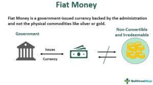

Monetary systems are foundational constructs in the global economy, enabling the facilitation of trade, investment, and economic stability. They provide the necessary framework for the valuation and exchange of goods and services, acting as a critical intermediary in financial transactions worldwide. At the core of monetary systems, we find different forms of money, namely, representative money and fiat money, each with its distinct characteristics and historical significance.

Representative money is a type of currency that is backed by a tangible asset, such as gold or silver. Historically, it served as a cornerstone of trade, as its value was directly linked to a physical commodity. In contrast, fiat money, which forms the basis of most contemporary economies, derives its value not from physical assets but from government decree. The transition from representative money to fiat money marked a significant evolution in economic systems, driven by the need for greater flexibility and control over monetary policy.

This evolution underscores the necessity of understanding these monetary forms and their implications within modern financial systems, where algorithmic trading plays a pivotal role. Algorithmic trading utilizes complex algorithms and mathematical models to execute trades at high speeds, often taking advantage of the nuances in monetary policy and market conditions. The interaction between fiat money and algorithmic trading highlights the dynamic nature of current financial markets, where digitalization and automation are increasingly prevalent.

The goal of this article is to explore the intricate relationships between representative money, fiat money, and algorithmic trading. Understanding these concepts is vital for comprehending the broader impacts of monetary systems on the global economic landscape.

## Table of Contents

## Overview of Monetary Systems

A monetary system is a complex structure established to manage the production, distribution, and value of money within an economy. Its primary purpose is to facilitate the exchange of goods and services, thereby simplifying trade. By providing a standardized unit of value, a monetary system enables participants in an economy to avoid the inefficiencies associated with barter systems, where the direct exchange of goods can be cumbersome and limited by the necessity for a double coincidence of wants.

Historically, monetary systems have evolved significantly, reflecting the changing needs and technological advancements of societies. Early forms of money, like livestock and grains, were used in ancient economies before societies moved toward commodity money, which included items such as gold and silver. These commodities possessed intrinsic value, making them suitable mediums of exchange. Over time, this evolved into the use of representative money, where currency was backed by a physical commodity like gold — a system exemplified by the Gold Standard.

By the 20th century, many economies transitioned to fiat money, which is currency without intrinsic value but legitimized by government decrees as legal tender. This shift was necessitated by the need for more elastic monetary systems, capable of adjusting to the growing complexities of global trade and finance. Fiat money allows governments greater flexibility in economic policy, as they can control the money supply without being restricted by a physical reserve.

Monetary systems are instrumental in fiscal policy and economic stability. They enable central authorities to conduct monetary policy, influencing inflation rates, interest rates, and overall economic growth. By adjusting the money supply and interest rates, central banks aim to achieve macroeconomic objectives such as controlling inflation, reducing unemployment, and fostering economic growth. 

Moreover, a stable monetary system is crucial for maintaining confidence in an economy, as it underpins the reliability of financial transactions and savings. Without a functional and adaptive monetary system, economies could suffer from hyperinflation or deflation, leading to economic instability. Thus, an effective monetary system not only supports the smooth functioning of daily transactions but also plays a vital role in broader economic policy and financial stability.

## Representative Money: Definition and History

Representative money is a type of economic currency that embodies a tangible asset, typically precious metals such as gold and silver. This form of money represents a promise to exchange it for a set amount of a specific commodity, serving as a bridge between tangible assets and the function of money as a medium of exchange. Representative money's value is derived from the commodity backing it, an approach that contrasts with fiat money, whose value is not intrinsic.

Historically, representative money has played a crucial role in various civilizations, facilitating economic transactions by streamlining the process of trade. One of the earliest instances is the use of grain and metals as representative currencies in ancient Mesopotamia. These currencies were underpinned by the value of the commodities themselves, stored in public granaries or treasuries as tangible collateral.

In the Middle Ages, representative money became more formalized with the issuance of paper money in China, known as "jiaozi." These paper notes were initially backed by reserves of precious metals, establishing a reliable system for facilitating trade across vast territories. Similarly, in the European context, the goldsmith bankers of the 17th century issued receipts that could be exchanged for gold deposits, marking another significant development in the history of representative money.

The advantages of representative money include increased security and convenience in transactions compared to carrying physical commodities. Representative money also provides a level of stability grounded in the intrinsic value of tangible assets, making it resistant to sudden fluctuations in value unrelated to the supply of the backing commodities. Furthermore, it encourages trust in the economic system by offering a guarantee of worth against physical reserves.

However, representative money is not without its disadvantages. One significant limitation is the finite availability of the backing commodity, which can restrict economic growth and lead to deflationary pressures if the economy outgrows the supply of commodities. Additionally, the need to store and secure the physical assets backing the currency can pose logistical and financial challenges. Finally, representative money can be less flexible in responding to recessionary pressures or other economic disruptions, as expanding the money supply requires increasing the reserves of the backing asset.

Over time, the limitations of representative money, particularly its inflexibility, contributed to its gradual replacement by fiat money systems, which allow for a more elastic money supply adaptable to economic demands. Nonetheless, understanding the historical and functional role of representative money provides insight into the evolution of monetary systems worldwide.

## Fiat Money: Transition and Impact

Fiat money is a type of currency that is recognized as legal tender by a government but does not have intrinsic value or a standard backing, such as gold or silver. Its value is largely derived from the public's trust and the government's declaration that it must be accepted as a means of payment. This differs from representative money, which is directly linked to a physical commodity of equal value, meaning its value is intrinsically tied to the commodity it represents.

The transition from representative to fiat money occurred for several reasons. One of the primary drivers was the limitation of representative money, which required the continued availability of physical commodities like gold or silver. As global trade expanded and economies grew, the demand for money outpaced the supply of these commodities. Fiat money offered a solution by allowing governments to issue currency to meet economic needs without the constraints of commodity reserves. Additionally, this transition enabled governments to exert greater control over their monetary policies, which could be adjusted without being constrained by the availability of commodities.

Fiat money systems present several benefits alongside notable challenges. On the positive side, fiat money provides flexibility in monetary policy. Governments can control the supply of money, which allows them to respond to economic changes by implementing policies such as adjusting interest rates and influencing inflation. This can stabilize economies during financial crises or recessions. Moreover, fiat money is more efficient for modern economies due to its ease of storage, transfer, and division compared to tangible commodity-based money.

However, the challenges associated with fiat money include the risk of hyperinflation if the currency is overissued, leading to a rapid devaluation. Since fiat money lacks intrinsic value, its credibility largely depends on the soundness of a nation's monetary policy and economic conditions. Poor policy decisions or political instability can undermine trust in the currency.

Today, most countries operate using fiat money. Prominent examples include the United States dollar (USD), the euro (EUR), the Japanese yen (JPY), and the British pound sterling (GBP). Each of these currencies is issued by a central authority and accepted within their respective countries as well as in international markets, reflecting the global reliance on fiat monetary systems.

## Algorithmic Trading: Introduction and Importance

Algorithmic trading, also known as algo trading, refers to the use of computer algorithms to execute trading strategies in financial markets with minimal human intervention. These algorithms follow a set of predetermined instructions based on various factors like timing, price, quantity, or complex mathematical models. The main goal of [algorithmic trading](/wiki/algorithmic-trading) is to enhance trading efficiency, maximize profits, and minimize risks.

In algorithmic trading, data plays a crucial role. Algorithms analyze vast amounts of historical and real-time market data to identify trading opportunities and execute orders. The process usually involves several steps: data collection, data analysis, decision-making based on predefined trading rules, and order execution. For example, a simple trading algorithm might monitor stock prices and execute a buy order when prices fall to a specific level and sell when they rise to another predefined level.

Mathematical models underpin many trading algorithms, helping traders predict price movements and market trends. These models might include statistical methods, quantitative measures like moving averages, and advanced techniques such as [machine learning](/wiki/machine-learning) and [artificial intelligence](/wiki/ai-artificial-intelligence). A common approach is to use moving averages to determine the appropriate trading moments, with the simple moving average (SMA) being one of the basic strategies. For instance, if the 50-day SMA crosses above the 200-day SMA, it might signal a buying opportunity, known as a "golden cross."

The growth of algorithmic trading has been substantial in recent years, driven by advances in technology, increased availability of data, and the quest for greater efficiency. High-frequency trading ([HFT](/wiki/high-frequency-trading-strategies)) is a form of algorithmic trading that has gained prominence, characterized by rapid execution of a large number of orders across diverse markets within fractions of a second. As of recent data, algo trading accounts for a significant proportion of total trading [volume](/wiki/volume-trading-strategy) in global markets. Regulatory changes, competition among financial institutions, and the evolution of trading platforms have also fueled this growth.

Algorithmic trading offers numerous benefits, including increased transaction speed, reduced transaction costs, and the ability to trade continuously across multiple markets. Furthermore, it allows traders to backtest their strategies using historical data to optimize performance before applying them in the live market. However, the complexity of algorithms and their reliance on technology also pose risks, such as system failures and market anomalies, which need robust risk management strategies.

The evolution and expansion of algorithmic trading continue to shape the dynamics of global financial markets, emphasizing the intricate connection between technological progress and financial innovation.

## The Interplay Between Fiat Money and Algorithmic Trading

Fiat money underpins contemporary financial markets, providing a flexible and stable framework where algorithmic trading operates effectively. Fiat currencies, backed by the financial authority of governments rather than tangible assets, form the baseline currency for trading platforms globally. They facilitate the smooth exchange of goods and services and, critically, permit the development of sophisticated financial markets where algorithmic trading is most active.

Algorithmic trading depends on the reliability and transparency of financial markets. The stability of fiat currencies directly affects the strategies employed by algorithmic traders. Volatility in fiat currencies can lead to fluctuating market conditions, impacting the predictive models utilized by trading algorithms. Traders must account for exchange rate fluctuations, inflation rates, and other macroeconomic variables that can influence currency stability. For example, if a fiat currency experiences hyperinflation or rapid devaluation, algorithms might adjust asset allocations to hedge against potential risks. Hence, currency stability can allow efficient implementation of algorithms aimed at maximizing returns and minimizing risks.

Algorithmic traders often respond swiftly to changes in monetary policy, such as [interest rate](/wiki/interest-rate-trading-strategies) adjustments or quantitative easing measures. These policy changes influence market [liquidity](/wiki/liquidity-risk-premium) and the cost of capital, which algorithms need to consider when executing trades. For instance, in response to an interest rate hike by a central bank, algorithmic traders might increase their positions in bonds or fixed-income assets, anticipating a rise in yields. Conversely, a decrease in interest rates might prompt algorithms to seek opportunities in equities or commodities. To effectively respond to these developments, algorithms are designed to process vast amounts of economic data and execute trades based on predefined criteria.

Algorithmic trading platforms employ techniques like machine learning and artificial intelligence to adapt to unforeseen monetary policy shifts. These technologies enable algorithms to perceive complex patterns in financial data, re-calibrate strategies rapidly, and optimize trading performance across various market conditions. By using such sophisticated models, algorithmic traders can maintain proficiency in highly dynamic and volatile markets maintained on fiat money systems.

In summary, the interaction between fiat money stability and algorithmic trading is critical for market efficacy. Understanding how fiat currency fluctuations and monetary policy shifts influence algorithmic strategies is essential for optimizing trading algorithms in the contemporary financial landscape.

## Future Trends in Monetary Systems and Algorithmic Trading

Emerging trends in monetary systems, particularly the rise of digital currencies, present a potential turning point for the future of fiat money. Digital currencies, such as Central Bank Digital Currencies (CBDCs) and cryptocurrencies, offer new paradigms that could supplement or even challenge traditional fiat money systems. CBDCs, issued by central banks, aim to enhance financial inclusion and efficiency in the payment systems while maintaining government control over monetary policy. Countries like China with its digital yuan and several European nations piloting digital euro projects, exemplify how digital currencies can coexist with fiat systems with potential benefits including reduced transaction costs and enhanced security of payments.

Cryptocurrencies like Bitcoin and Ethereum, decentralized and operating without central authority, present a different facet of digital currencies. While less likely to replace fiat due to [volatility](/wiki/volatility-trading-strategies) and regulatory challenges, they introduce concepts like blockchain technology, which could be integrated into traditional monetary systems to enhance transparency and reduce fraud.

Algorithmic trading has experienced substantial advancements in technology, reshaping the landscape of financial markets. With developments in artificial intelligence (AI) and machine learning, algorithmic trading systems can process vast amounts of data to execute trades at optimal prices and speeds. The incorporation of AI allows these systems to adapt to market conditions in real-time, utilizing historical data, market sentiment, and other inputs to refine strategies.

Python remains a dominant language in algorithmic trading due to its rich ecosystem of libraries such as NumPy, Pandas, and Scikit-learn which facilitate data manipulation and model building. Algorithmic traders can further leverage high-frequency trading (HFT) systems, which engage in executing a large number of trades in milliseconds, benefiting from minuscule price differences.

Future interactions between evolving monetary systems and trading technologies are expected to deepen, potentially leading to more dynamic and responsive financial markets. As digital currencies gain prominence, algorithmic trading strategies may increasingly account for currency exchange rates and the impact of digital currency adoption on market volatility. Additionally, the integration of blockchain technology could enable more robust and transparent trading processes, potentially transforming the regulatory landscape.

The confluence of digital currencies and advanced algorithmic trading systems highlights a future where financial markets are more interconnected and responsive, challenging institutions and investors to adapt continually. As technology continues to evolve, the potential for innovative monetary systems and trading methodologies is vast, necessitating proactive engagement from policymakers and market participants alike.

## Conclusion

The exploration of monetary systems and algorithmic trading has revealed their essential roles within the modern economic framework. Monetary systems, having evolved from representative to fiat money, form the backbone of global trade and economic policy, ensuring stability and functionality within economies. Understanding the nuances of representative and fiat currencies is crucial for economists and investors alike, as these systems directly influence fiscal policy and economic strategies.

Fiat money has transitioned from tangible asset-backed representative money, facilitating greater control for governments over monetary supply and economic growth. This transformation has led to impactful benefits, such as increased flexibility in monetary policy, while also presenting challenges like inflation control and maintaining currency confidence. 

Simultaneously, algorithmic trading has emerged as a defining facet of financial markets, utilizing complex data-driven algorithms to optimize trading strategies. The interplay between fiat money and algorithmic trading highlights how monetary stability and policy decisions can affect market dynamics and trading efficacy.

Looking forward, the emergence of digital currencies could significantly reshape the fiat monetary systems, offering new avenues for financial transactions and policy formulations. Continuous advancements in algorithmic trading technology promise to enhance trading efficiencies and market predictions. As these domains evolve, a comprehensive understanding of their interaction will remain essential for stakeholders aiming to navigate the future economic landscape effectively. Economists and investors must remain vigilant and adaptable to potential developments, ensuring informed decision-making in an ever-transforming financial environment.

## References & Further Reading

[1]: Krugman, P., & Obstfeld, M. (2008). ["International Economics: Theory and Policy."](https://books.google.com/books/about/International_Economics.html?id=NZnk5C2r8qEC) Pearson Education.

[2]: Mishkin, F. S. (2015). ["The Economics of Money, Banking, and Financial Markets."](https://www.pearsonhighered.com/assets/preface/0/1/3/4/0134855388.pdf) Pearson.

[3]: Friedman, M., & Schwartz, A. J. (1963). ["A Monetary History of the United States, 1867-1960."](https://www.jstor.org/stable/j.ctt7s1vp) Princeton University Press.

[4]: "Money and the Mechanism of Exchange" by William Stanley Jevons (Available on [Project Gutenberg](https://archive.org/details/moneymechanismof0000jevo))

[5]: Nixon, H. (1976). ["The End of the Gold Standard."](https://www.federalreservehistory.org/essays/gold-convertibility-ends) History Today, 26(8), 551-558.

[6]: Allen, F., & Gale, D. (2000). ["Comparing Financial Systems."](https://www.jstor.org/stable/41794912) MIT Press.

[7]: Murphy, J. J. (1999). ["Technical Analysis of the Financial Markets: A Comprehensive Guide to Trading Methods and Applications."](https://archive.org/details/technicalanalysi0000murp) New York Institute of Finance.

[8]: Urquhart, A. (2016). ["The Efficiency of Bitcoin: A Market Dynamics Perspective"](https://papers.ssrn.com/sol3/papers.cfm?abstract_id=2828745). International Review of Financial Analysis, 50, 98-105.