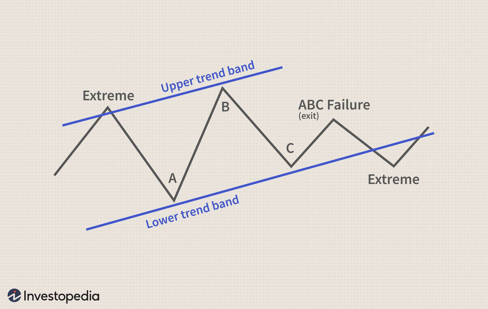

## Table of Contents

## What is the Fibonacci ABC pattern in financial trading?

The Fibonacci ABC pattern is a tool used in financial trading to predict where the price of a stock or other asset might go next. It is based on the Fibonacci sequence, a series of numbers where each number is the sum of the two before it. Traders use this pattern by looking at the price movements on a chart and drawing lines to connect the high and low points of these movements, which they label as points A, B, and C. The idea is that the price will move in a way that follows the ratios found in the Fibonacci sequence, helping traders guess where the price might go next.

This pattern helps traders find good times to buy or sell. They look for the price to move from point A to B, then from B to C. The distance between these points often follows certain Fibonacci ratios, like 38.2%, 50%, or 61.8%. If the price moves from A to B and then retraces to a Fibonacci level before moving to C, traders might decide to buy or sell at these points. Using the Fibonacci ABC pattern can help traders make better decisions, but it's not perfect and should be used with other tools and analysis.

## How does the Fibonacci ABC pattern differ from other chart patterns?

The Fibonacci ABC pattern is different from other chart patterns because it uses specific numbers from the Fibonacci sequence to predict where the price might go next. Most other patterns, like head and shoulders or triangles, just look at the shape of the price movements. But with the Fibonacci ABC pattern, traders draw lines between the high and low points of the price and use Fibonacci ratios like 38.2%, 50%, or 61.8% to find where the price might change direction. This makes it more math-based than other patterns that rely more on the visual shape of the chart.

Another way the Fibonacci ABC pattern is different is that it focuses on three main points labeled A, B, and C. Other patterns might focus on different numbers of points or different shapes. For example, a double top pattern looks at two high points, while the Fibonacci ABC pattern looks at the relationship between three points and their distances. This means that the Fibonacci ABC pattern gives traders a clear way to measure how far the price might move, using the Fibonacci numbers to guide their decisions. This can be helpful, but it also means that traders need to be good at math and understand how to apply these numbers correctly.

## What are the key components of the Fibonacci ABC pattern?

The Fibonacci ABC pattern in trading has three main parts: points A, B, and C. These points are high and low points on a price chart. Traders draw lines between these points to see how the price moves. Point A is the start, where the price is at a high or low. From A, the price moves to point B, which is the opposite of A, so if A is a high, B is a low, and vice versa. Then, the price moves from B to C, which is often in the same direction as the move from A to B.

What makes the Fibonacci ABC pattern special is that it uses Fibonacci numbers to predict where the price might go next. Traders look at the distance between A and B and then use Fibonacci ratios like 38.2%, 50%, or 61.8% to guess where point C might be. If the price moves from A to B and then retraces to one of these Fibonacci levels before moving to C, traders might decide to buy or sell at these points. This pattern helps traders make better decisions by giving them a clear way to measure how far the price might move, but it's not perfect and should be used with other tools.

## How can traders identify the Fibonacci ABC pattern on a price chart?

To spot the Fibonacci ABC pattern on a price chart, traders first need to find the three key points: A, B, and C. Point A is where the price starts, either at a high or a low. From A, the price moves to point B, which is the opposite of A - so if A is a high, B is a low, and if A is a low, B is a high. After hitting B, the price then moves to point C, which is often in the same direction as the move from A to B. Traders draw lines between these points to see how the price moves.

Once the points A, B, and C are marked, traders use Fibonacci numbers to predict where the price might go next. They measure the distance between A and B and then use Fibonacci ratios like 38.2%, 50%, or 61.8% to guess where point C might be. If the price moves from A to B and then retraces to one of these Fibonacci levels before moving to C, traders might decide to buy or sell at these points. This pattern helps traders make better decisions by giving them a clear way to measure how far the price might move, but it's not perfect and should be used with other tools.

## What are the typical Fibonacci retracement levels used in the ABC pattern?

The Fibonacci ABC pattern uses special numbers to guess where the price might go next. The typical Fibonacci retracement levels used in this pattern are 38.2%, 50%, and 61.8%. These numbers come from the Fibonacci sequence and help traders see where the price might stop or change direction.

Traders look at the distance between point A and point B on the chart. Then, they use these Fibonacci levels to find where point C might be. If the price moves from A to B and then goes back to one of these levels before moving to C, traders might decide to buy or sell at these points. This helps them make better trading choices.

## Can you explain the process of trading the Fibonacci ABC pattern?

To trade using the Fibonacci ABC pattern, traders first need to find three points on the price chart: A, B, and C. Point A is where the price starts, either at a high or a low. From A, the price moves to point B, which is the opposite of A - so if A is a high, B is a low, and if A is a low, B is a high. After hitting B, the price then moves to point C, which is often in the same direction as the move from A to B. Traders draw lines between these points to see how the price moves and use special numbers from the Fibonacci sequence to guess where the price might go next.

Once the points A, B, and C are marked, traders measure the distance between A and B. They then use Fibonacci retracement levels like 38.2%, 50%, or 61.8% to predict where point C might be. If the price moves from A to B and then retraces to one of these Fibonacci levels before moving to C, traders might decide to buy or sell at these points. For example, if the price goes from a high at A to a low at B and then retraces to the 61.8% level before moving up to C, a trader might buy at the 61.8% level, expecting the price to keep going up. This pattern helps traders make better decisions by giving them a clear way to measure how far the price might move, but it's not perfect and should be used with other tools.

## What are the common entry and exit strategies for the Fibonacci ABC pattern?

When trading the Fibonacci ABC pattern, a common entry strategy is to buy or sell at the Fibonacci retracement levels. Traders look for the price to move from point A to B and then retrace to one of the Fibonacci levels like 38.2%, 50%, or 61.8%. If the price hits one of these levels and shows signs of reversing, traders might enter a trade. For example, if the price goes from a high at A to a low at B and then retraces to the 61.8% level, a trader might buy at this level, expecting the price to keep going up to point C.

For [exit](/wiki/exit-strategy) strategies, traders often set a target at point C. They measure the distance between A and B and use the Fibonacci ratios to guess where C might be. If the price reaches this predicted point C, traders might decide to close their trade and take their profit. Another way to exit is by using a stop-loss order to limit losses. Traders might place a stop-loss just below the Fibonacci retracement level they entered at, so if the price keeps going the wrong way, they can get out of the trade without losing too much money. Using both entry and exit strategies helps traders manage their trades better and make more informed decisions.

## How does one set stop-loss and take-profit levels when trading the ABC pattern?

When trading the Fibonacci ABC pattern, setting a stop-loss is important to limit losses if the trade goes the wrong way. Traders usually place the stop-loss just below the Fibonacci retracement level they entered at. For example, if you buy at the 61.8% retracement level, you might set your stop-loss a little below that level. This way, if the price keeps falling instead of going up like you expected, you can exit the trade without losing too much money. It's a safety net that helps traders manage their risk.

For setting a take-profit level, traders often aim for point C, which they predict using the Fibonacci ratios. They measure the distance between points A and B and use these ratios to guess where C might be. If the price reaches this predicted point C, traders might close their trade and take their profit. This is a way to lock in gains when the price moves as expected. Using both stop-loss and take-profit levels helps traders manage their trades better and make more informed decisions.

## What are the potential risks and limitations of using the Fibonacci ABC pattern?

Using the Fibonacci ABC pattern in trading can be risky because it's not always right. The pattern uses special numbers to guess where the price might go next, but these guesses can be wrong. Sometimes the price doesn't stop at the Fibonacci levels like 38.2%, 50%, or 61.8%, and it keeps going the wrong way. This can make traders lose money if they rely only on this pattern. Also, the pattern can be hard to spot on the chart, and different traders might see different points A, B, and C, which can lead to confusion and bad trades.

Another limitation is that the Fibonacci ABC pattern works best when used with other tools and analysis. By itself, it's not enough to make good trading decisions. Traders need to look at other things like the overall trend, news about the company or market, and other chart patterns to get a full picture. If traders use the Fibonacci ABC pattern without these other tools, they might miss important information and make mistakes. So, while the pattern can be helpful, it's important to use it carefully and not depend on it too much.

## How can the Fibonacci ABC pattern be integrated with other technical indicators for better results?

Traders can make better decisions by using the Fibonacci ABC pattern along with other technical indicators. One way to do this is by using moving averages to see the overall trend of the price. If the price is above the moving average and the Fibonacci ABC pattern shows a good place to buy, it might be a stronger signal to go ahead with the trade. Also, using the Relative Strength Index (RSI) can help. If the RSI shows that the price is not overbought or oversold when the Fibonacci level is reached, it can add more confidence to the trading decision.

Another way to use the Fibonacci ABC pattern with other tools is by looking at chart patterns like support and resistance levels. If the Fibonacci retracement level lines up with a strong support or resistance level, it might be a better place to enter or exit a trade. Traders can also use [volume](/wiki/volume-trading-strategy) indicators to see if there's a lot of interest in the price at the Fibonacci levels. High volume at these levels can mean that more traders are paying attention, which can make the pattern more reliable. By combining the Fibonacci ABC pattern with these other tools, traders can get a fuller picture of what's happening and make smarter choices.

## What are some real-world examples of the Fibonacci ABC pattern in different financial markets?

In the stock market, the Fibonacci ABC pattern can be seen when traders look at the price of a company like Apple. Imagine the price of Apple's stock goes up to a high point, which we call point A. Then, it drops down to a low point, which we call point B. If the price then starts to go back up and stops at a level that matches one of the Fibonacci retracement levels, like 61.8%, before continuing up to another high point C, traders might use this pattern to decide when to buy the stock. They would buy at the 61.8% level, hoping the price will keep going up to point C. This helps them make a plan for when to enter and exit their trade.

In the [forex](/wiki/forex-system) market, the Fibonacci ABC pattern is also useful. Let's say a trader is looking at the EUR/USD currency pair. The price might start at a low point A and then move up to a high point B. If the price then comes back down and stops at the 50% Fibonacci retracement level before going up again to point C, traders might see this as a good time to buy the EUR/USD. They would set their entry at the 50% level, expecting the price to go up to point C. By using the Fibonacci ABC pattern, traders in different markets can find good times to buy or sell, but they need to be careful and use other tools too to make the best decisions.

## How can advanced traders optimize the Fibonacci ABC pattern for different trading timeframes?

Advanced traders can optimize the Fibonacci ABC pattern for different trading timeframes by adjusting how they apply the pattern to fit the specific timeframe they are trading on. On shorter timeframes like 1-minute or 5-minute charts, the price moves quickly, so traders might need to use smaller Fibonacci retracement levels, like 38.2% or 50%, to catch quick changes in the price. They might also need to set tighter stop-loss and take-profit levels because the price can move a lot in a short time. This means they need to be ready to enter and exit trades faster.

On longer timeframes like daily or weekly charts, the price moves more slowly, so traders can use larger Fibonacci levels, like 61.8%, to find good places to buy or sell. They can set wider stop-loss and take-profit levels because the price takes more time to move to these points. This gives traders more time to watch the price and make decisions. By changing how they use the Fibonacci ABC pattern based on the timeframe, advanced traders can make better choices and improve their chances of making money.

## What is Risk Management in ABC Trading?

Risk management is essential in [algorithmic trading](/wiki/algorithmic-trading) when employing strategies like the ABC pattern. It ensures the preservation of trading capital and helps traders maintain a sustainable trading practice. Effective risk management involves several key components, including the use of stop-loss orders, appropriate position sizing, and diversification across markets and time frames.

Utilizing stop-loss orders is a fundamental practice. These orders are predicated on predetermined price levels that trigger an automatic sell action, limiting potential losses. For instance, if a trader determines that a position becomes untenable beyond a certain price point, a stop-loss order ensures the position is exited promptly, thus safeguarding against unforeseen downturns.

Position sizing is another critical [factor](/wiki/factor-investing) in risk management. It involves determining the appropriate amount of capital to allocate to a trade based on the trader's risk tolerance and account size. The formula for position sizing can be expressed as:

$$
\text{Position Size} = \frac{\text{Account Risk} \times \text{Account Balance}}{\text{Stop-Loss Distance}}
$$

This formula ensures that no single trade can significantly impact the overall account balance, allowing traders to manage their exposure efficiently.

Diversification plays a pivotal role in mitigating risks associated with adverse market movements. By spreading trades across various markets (such as stocks, forex, and commodities) and different time frames, traders reduce the impact of a negative outcome in any single market or timeframe on their overall portfolio. This approach balances the risks inherent in any one trade with the potential for gains in others.

Tools like the Average True Range (ATR) are instrumental for dynamic risk management. ATR provides a measure of market [volatility](/wiki/volatility-trading-strategies), which traders can use to adjust their stop-loss levels according to current conditions. For instance, a higher ATR might indicate more volatility, suggesting a wider stop-loss to accommodate market fluctuations, while a lower ATR might allow for a tighter stop-loss setting.

In Python, calculating ATR can be implemented as follows:

```python
import pandas as pd

def calculate_atr(data, period=14):
    data['High-Low'] = data['High'] - data['Low']
    data['High-Close'] = abs(data['High'] - data['Close'].shift())
    data['Low-Close'] = abs(data['Low'] - data['Close'].shift())
    data['True Range'] = data[['High-Low', 'High-Close', 'Low-Close']].max(axis=1)
    atr = data['True Range'].rolling(window=period).mean()
    return atr

# Example usage with a DataFrame 'df' containing market data
# atr_values = calculate_atr(df)
```

Implementing tools like ATR assists traders in adapting their strategies to prevailing market conditions, refining their risk management approach and enhancing overall trading performance. By systematically incorporating these elements, traders can ensure their use of the ABC pattern remains a viable and effective component of their broader trading strategy.

## References & Further Reading

[1]: Bergstra, J., Bardenet, R., Bengio, Y., & Kégl, B. (2011). ["Algorithms for Hyper-Parameter Optimization."](https://dl.acm.org/doi/10.5555/2986459.2986743) Advances in Neural Information Processing Systems 24.

[2]: ["Advances in Financial Machine Learning"](https://www.amazon.com/Advances-Financial-Machine-Learning-Marcos/dp/1119482089) by Marcos Lopez de Prado

[3]: ["Evidence-Based Technical Analysis: Applying the Scientific Method and Statistical Inference to Trading Signals"](https://www.amazon.com/Evidence-Based-Technical-Analysis-Scientific-Statistical/dp/0470008741) by David Aronson

[4]: ["Machine Learning for Algorithmic Trading"](https://github.com/stefan-jansen/machine-learning-for-trading) by Stefan Jansen

[5]: ["Quantitative Trading: How to Build Your Own Algorithmic Trading Business"](https://www.amazon.com/Quantitative-Trading-Build-Algorithmic-Business/dp/1119800064) by Ernest P. Chan