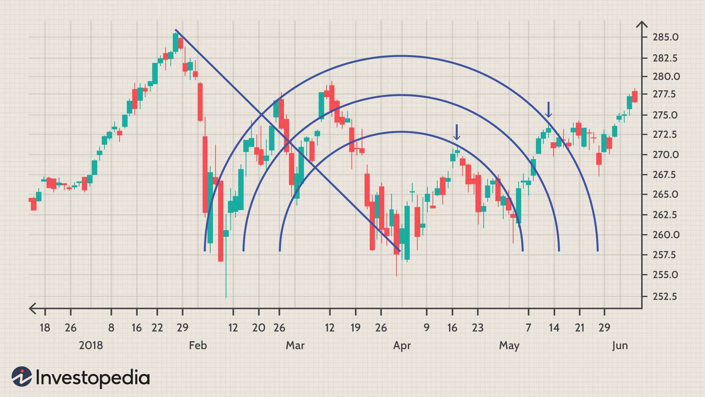

Technical analysis is an essential practice in the trading world, enabling traders to forecast market trends and make informed decisions based on past price movements and volume data. A wide array of technical analysis tools is available to traders, each with its own approach to evaluating price actions and identifying potential market movements. Among these, Fibonacci Arcs hold a special position due to their unique method of identifying potential support and resistance levels through geometric relationships.

Fibonacci Arcs derive their name and methodology from the concept of Fibonacci retracement, rooted in the Fibonacci sequence—a series of numbers where each number is the sum of the two preceding ones, often associated with natural proportions and patterns in financial markets. This mathematical approach uses semicircular lines that fan out from a baseline drawn between two significant price points, typically a notable high and low. The key Fibonacci retracement levels at which these arcs intersect the baseline are 23.6%, 38.2%, 50%, 61.8%, and 78.6%. These levels are widely recognized in trading as they often correspond to areas where the price may either stall or reverse direction, serving as potential points of support or resistance.



The dynamic nature of Fibonacci Arcs allows them to adapt as market conditions change, providing traders with evolving insights that can be crucial for timing their trades. This adaptability is particularly beneficial when combined with other indicators and tools, enhancing analytical accuracy. Moreover, Fibonacci Arcs are gaining traction in algorithmic trading strategies, where advanced algorithms automate the identification of support and resistance levels. The algorithms leverage historical data and dynamic calculations to develop refined and nuanced trading strategies, thereby facilitating real-time decision-making in volatile markets.

This article will explore the concept of Fibonacci Arcs in depth, their significance within trading ecosystems, and the potential for integration with algorithmic trading systems, equipping traders with the knowledge to leverage these tools in building robust trading strategies.

## Table of Contents

## Understanding Fibonacci Arcs

Fibonacci Arcs are tools used in technical analysis that consist of semi-circular lines emanating from a baseline, which is established by connecting two significant price points on a chart, namely a high and a low. These arcs, structured around key Fibonacci retracement levels (23.6%, 38.2%, 50%, 61.8%, and 78.6%), require the identification of these critical points for accurate application.

The primary function of Fibonacci Arcs is to forecast potential support and resistance areas within a market. Support levels are zones where a downtrend can be expected to pause due to a concentration of demand, whereas resistance levels are points where an uptrend may halt due to an accumulation of selling interest. However, unlike static horizontal lines, the arcs' semi-circular shape means they can adapt their position as the market evolves, adding a dynamic aspect to their analysis.

To draw these arcs, first compute the length of the baseline, which is the vertical distance between the identified high and low price levels. The baseline serves as the horizontal axis from which the arcs will expand outward. To depict each Fibonacci Arc, calculate the corresponding vertical distance by applying each Fibonacci percentage to the baseline length. These calculated points mark where each arc intersects, allowing for accurate plotting on a chart.

The intersection points of these arcs with the baseline represent potential zones of support or resistance. For instance, the arcs encompassing 38.2% and 61.8% are often closely observed, as they represent significant Fibonacci levels widely recognized by traders and analysts alike.

Overall, the dynamic positioning of Fibonacci Arcs provides traders with insights into anticipated market behaviors, offering a visual heuristic to delineate areas of market reaction. While no mathematical formula is necessary to calculate these points directly, software tools within trading platforms typically offer built-in functions to streamline the plotting of Fibonacci Arcs, thereby enhancing their accessibility and utility for traders.

## Calculating and Drawing Fibonacci Arcs

Charting software often provides tools to draw Fibonacci Arcs, simplifying the process and minimizing the need for manual calculations. To effectively draw Fibonacci Arcs, follow these steps:

1. **Establishing the Baseline**: In an uptrend scenario, begin by identifying a significant prior swing low and connect it with the most recent swing high. This line serves as the baseline or the reference line for the Fibonacci Arcs. The choice of these points is crucial, as they significantly influence the arcs' position and relevance.

2. **Fibonacci Percentages**: Once the baseline is established, use the Fibonacci retracement levels—specifically 23.6%, 38.2%, 50%, 61.8%, and 78.6%—to determine the intersection points along the baseline. These percentages are derived from the Fibonacci sequence, a mathematical pattern where each number is the sum of the two preceding numbers, often found in natural phenomena.

3. **Drawing the Arcs**: With the intersection points calculated, draw semi-circular lines from each point on the baseline. These arcs should curve above (or below, in a downtrend) the baseline between the two price points. The resulting Fibonacci Arcs visually map potential support and resistance zones in a dynamic, non-linear fashion that adjusts with market conditions.

Here's a simple Python script to illustrate calculating the intersection points on the baseline:

```python
def calculate_fibonacci_arcs(swing_high, swing_low):
    fibonacci_levels = [0.236, 0.382, 0.500, 0.618, 0.786]
    baseline_length = swing_high - swing_low
    intersection_points = [swing_high - (baseline_length * level) for level in fibonacci_levels]
    return intersection_points

# Example: swing_high = 150, swing_low = 100
swing_high = 150
swing_low = 100
arcs_intersections = calculate_fibonacci_arcs(swing_high, swing_low)
print(arcs_intersections)
```

This script calculates where the arcs would intersect the baseline, providing a starting point for their graphical representation on trading software. In practice, most modern charting platforms include built-in features to automate this process, allowing traders to draw Fibonacci Arcs with ease and precision. This automation is advantageous, as it eliminates potential human error associated with manual calculations and plotting.

## Application of Fibonacci Arcs in Trading

Traders utilize Fibonacci Arcs primarily to identify potential support and resistance areas, which are crucial for making informed decisions regarding the timing of trades and determining optimal entry and [exit](/wiki/exit-strategy) points. These semi-circular lines, based on key Fibonacci retracement levels, offer a dynamic approach, adjusting with market shifts and providing insights into future price movements.

When traders incorporate Fibonacci Arcs with other technical analysis tools, such as the Relative Strength Index (RSI) or moving averages, the effectiveness of their analysis can be significantly enhanced. RSI, a [momentum](/wiki/momentum) oscillator, helps determine overbought or oversold conditions, while moving averages smooth out price data, revealing trends over time. These additional tools can refine the insights gained from Fibonacci Arcs, offering more precise indicators of market behavior.

For instance, when a Fibonacci Arc coincides with a moving average or significant RSI level, this confluence can signal a high-probability trading opportunity. A potential strategy might involve entering a trade when the price touches a Fibonacci Arc and the RSI indicates an oversold condition, suggesting a likely price reversal. Conversely, traders might consider exiting a trade when the price nears a Fibonacci Arc in conjunction with an overbought RSI reading.

The integration of Fibonacci Arcs with other technical instruments can increase the probability of successful trades by providing multiple confirmations. This multi-faceted approach allows traders to create strategies that are more resilient to the complexities of market dynamics. By leveraging the distinct strengths of each analytical tool, traders can anticipate market movements with greater accuracy and confidence, ultimately improving their trading outcomes.

## Fibonacci Arcs in Algorithmic Trading

Algorithmic trading, often referred to as algo trading, utilizes computer programs to execute trades automatically based on pre-defined criteria. Fibonacci Arcs, integrated into such systems, offer a sophisticated methodology for identifying potential support and resistance levels, essential for making informed trading decisions.

### Incorporation of Fibonacci Arcs in Algorithms

In algo trading systems, the integration of Fibonacci Arcs enables the automation of processes traditionally reliant on manual calculations. Using Fibonacci Arcs, algorithms are programmed to detect significant price points—usually recent swing highs and lows—to establish a baseline. The algorithms then apply key Fibonacci retracement levels (23.6%, 38.2%, 50%, 61.8%, and 78.6%) to determine intersection points along the baseline, constructing the arcs which represent potential areas where price movements may face support or resistance.

### Advanced Algorithmic Refinements

Advanced algorithmic systems analyze historical market data to refine Fibonacci Arc calculations, enhancing predictive accuracy. By processing vast amounts of data, [machine learning](/wiki/machine-learning) algorithms identify patterns and adjust the arcs dynamically to reflect real-time market conditions. For instance, these algorithms may employ statistical methods or machine learning techniques, like clustering or neural networks, to identify optimal retracement levels and improve the precision of arc placement over time.

### Python Implementation Example

Below is a simplified example of how one might implement Fibonacci Arc calculations in Python using historical price data:

```python
import numpy as np
import matplotlib.pyplot as plt

def fibonacci_arcs(high, low, levels=[0.236, 0.382, 0.5, 0.618, 0.786]):
    distance = high - low
    arcs = [high - level * distance for level in levels]
    return arcs

# Example swing high and low prices
swing_high = 150
swing_low = 100

# Calculate arcs
arcs = fibonacci_arcs(swing_high, swing_low)

# Plotting the arcs
plt.figure(figsize=(10, 6))
for arc in arcs:
    circle = plt.Circle((0, swing_low), arc, color='b', fill=False, linestyle='dotted')
    plt.gca().add_patch(circle)

plt.title("Fibonacci Arcs")
plt.xlim(-1, 1)
plt.ylim(50, 160)
plt.show()
```

This simple script illustrates the concept of calculating and plotting Fibonacci Arcs based on predetermined price levels.

### Real-Time Decision Making

The dynamic nature of Fibonacci Arcs offers a reliable metric for algorithms tasked with prognosticating price movements and making real-time decisions. As market conditions fluctuate, the arcs adjust, providing traders with a continually updated framework to assess potential market behavior. This adaptability makes Fibonacci Arcs particularly useful for algorithms designed to execute trades rapidly in response to changing market data, thereby enhancing the overall efficiency and success rate of [algorithmic trading](/wiki/algorithmic-trading) systems.

In leveraging Fibonacci Arcs within algorithmic trading, traders can acquire a strategic advantage, utilizing historical patterns and mathematical principles to forecast and exploit emerging market opportunities.

## Limitations of Fibonacci Arcs

Fibonacci Arcs, though a valuable tool in technical analysis, have certain limitations that traders should be aware of. One of the key shortcomings of Fibonacci Arcs is their susceptibility to market [volatility](/wiki/volatility-trading-strategies). In volatile market conditions, price movements can be erratic, causing Fibonacci Arc levels to be breached more frequently. This limits their reliability as sole indicators of support and resistance. For instance, during high volatility, prices might rapidly move through Fibonacci Arc levels without respecting them, potentially leading to false signals and misinformed trading decisions.

Unexpected market events further exacerbate this limitation. Events such as geopolitical developments, economic announcements, or sudden market shifts can significantly impact asset prices, rendering Fibonacci Arc levels less trustworthy. In such scenarios, relying solely on Fibonacci Arcs can result in inadequate market assessments and improper trade placements.

To mitigate these limitations, it is advisable to use Fibonacci Arcs in conjunction with other forms of technical analysis. Indicators such as the Relative Strength Index (RSI), moving averages, or candlestick patterns can provide additional context and confirm or refute Fibonacci Arc signals. Combining these tools allows traders to build a more robust and informed trading strategy.

Moreover, staying updated with market news and developments is crucial for traders using Fibonacci Arcs. News events can have substantial effects on market sentiment and price movements, which can, in turn, impact the effectiveness of technical indicators. By integrating market news into their analysis, traders can anticipate potential market changes and adjust their strategies accordingly, enhancing their decision-making process in the face of Fibonacci Arc limitations.

## Conclusion

Fibonacci Arcs provide traders with a distinctive lens through which to forecast market behavior. These arcs, derived from Fibonacci retracement levels, offer dynamic support and resistance indicators that can facilitate strategic trading decisions. Importantly, their integration into algorithmic trading platforms can substantially bolster the efficiency and accuracy of automated strategies. Algorithms can exploit the arcs' adaptability, fine-tuning trading actions based on real-time market data and historical patterns. Although the method boasts significant advantages, traders must remain aware of its limitations, such as sensitivity to market volatility and external economic events, which can distort expected outcomes.

For optimal applicability, traders should incorporate Fibonacci Arcs alongside other analytical instruments like moving averages, RSI, or MACD. This multipronged approach ensures a more robust understanding of market dynamics, as no single tool can fully encapsulate the complexities of financial markets. Adopting a holistic trading strategy that harmonizes Fibonacci Arcs with diverse technical and fundamental evaluations can position traders for more informed and potentially lucrative market engagements. Such a strategy provides a buffer against the inherent unpredictability of trading environments, fostering resilient and adaptable decision-making processes that align with both short-term fluctuations and long-term trends.

## References & Further Reading

[1]: Bergstra, J., Bardenet, R., Bengio, Y., & Kégl, B. (2011). ["Algorithms for Hyper-Parameter Optimization."](https://dl.acm.org/doi/10.5555/2986459.2986743) Advances in Neural Information Processing Systems 24.

[2]: ["Advances in Financial Machine Learning"](https://www.amazon.com/Advances-Financial-Machine-Learning-Marcos/dp/1119482089) by Marcos Lopez de Prado

[3]: ["Evidence-Based Technical Analysis: Applying the Scientific Method and Statistical Inference to Trading Signals"](https://www.amazon.com/Evidence-Based-Technical-Analysis-Scientific-Statistical/dp/0470008741) by David Aronson

[4]: ["Machine Learning for Algorithmic Trading"](https://github.com/stefan-jansen/machine-learning-for-trading) by Stefan Jansen

[5]: ["Quantitative Trading: How to Build Your Own Algorithmic Trading Business"](https://www.amazon.com/Quantitative-Trading-Build-Algorithmic-Business/dp/1119800064) by Ernest P. Chan