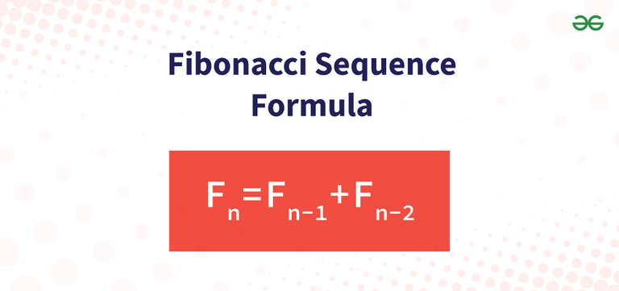

## Table of Contents

## What are Fibonacci Arcs?

Fibonacci Arcs are a tool used in technical analysis, which is a method traders use to predict future price movements in financial markets. They are drawn on a price chart to help identify potential support and resistance levels. To create Fibonacci Arcs, a trader selects three points on a chart that represent a significant price move: a start point, a high or low point, and an end point. The arcs are then drawn from the start point through the high or low point, extending to the end point, creating three curved lines.

These arcs are based on Fibonacci ratios, which are numbers derived from the Fibonacci sequence. The most common ratios used in the arcs are 38.2%, 50%, and 62.8%. Traders believe that prices might reverse or pause when they reach these arcs. By watching how prices interact with the arcs, traders can make decisions about buying or selling. While Fibonacci Arcs can be helpful, they are not always accurate and should be used along with other analysis tools.

## How are Fibonacci Arcs used in technical analysis?

Fibonacci Arcs are used in technical analysis to help traders predict where prices might go next. They are drawn on a chart using three points: a start point, a high or low point, and an end point. These points are chosen based on a big price move that has happened. The arcs are curved lines that start at the first point, go through the high or low point, and end at the third point. There are usually three arcs, each based on different Fibonacci ratios: 38.2%, 50%, and 62.8%.

Traders watch how the price of a stock or other asset moves near these arcs. If the price touches or gets close to an arc, it might mean the price could change direction or pause there. For example, if the price hits the 38.2% arc and starts to go up, a trader might decide to buy. If the price hits the 62.8% arc and starts to go down, a trader might decide to sell. But, Fibonacci Arcs are just one tool, and they don't always work. Traders often use them along with other tools to make better decisions.

## What is the basic formula for calculating Fibonacci Arcs?

To calculate Fibonacci Arcs, you first need to pick three points on a price chart: a start point, a high or low point, and an end point. These points should represent a significant price move. Once you have these points, you draw three arcs from the start point through the high or low point, extending to the end point. Each arc is based on a different Fibonacci ratio: 38.2%, 50%, and 62.8%.

The formula for drawing these arcs involves using the distance between the start point and the high or low point. For the 38.2% arc, you multiply this distance by 0.382. For the 50% arc, you multiply by 0.5. For the 62.8% arc, you multiply by 0.618. These calculations help determine how far the arcs should extend from the high or low point to the end point. The arcs are then drawn as curved lines on the chart, helping traders see where the price might change direction or pause.

## How do you identify the key points for drawing Fibonacci Arcs?

To draw Fibonacci Arcs, you need to find three important points on a price chart. These points are the start point, the high or low point, and the end point. The start point is where a big price move begins. The high or low point is the highest or lowest price reached during that move. The end point is where the big price move ends. These points should show a clear trend, like a strong up or down move in the price.

Once you have these three points, you can draw the Fibonacci Arcs. You start at the start point, go through the high or low point, and end at the end point. The arcs are curved lines that help show where the price might change direction or pause. They are based on special numbers called Fibonacci ratios, which are 38.2%, 50%, and 62.8%. By watching how the price moves near these arcs, traders can make better decisions about buying or selling.

## What are the common Fibonacci ratios used in creating Fibonacci Arcs?

When creating Fibonacci Arcs, traders use special numbers called Fibonacci ratios. These ratios help draw the arcs on a price chart. The most common Fibonacci ratios used are 38.2%, 50%, and 62.8%. These numbers come from the Fibonacci sequence, which is a series of numbers where each number is the sum of the two before it.

To draw the arcs, you start at a point where a big price move begins, go through the highest or lowest point of that move, and end where the move finishes. The 38.2% arc is drawn by multiplying the distance from the start to the high or low point by 0.382. The 50% arc uses 0.5, and the 62.8% arc uses 0.618. These arcs help traders see where the price might change direction or pause, making it easier to decide when to buy or sell.

## Can you explain the step-by-step process of plotting Fibonacci Arcs on a chart?

To plot Fibonacci Arcs on a chart, first find three key points on the price chart that show a big move in the price. The first point is where the big move starts, the second point is the highest or lowest price during the move, and the third point is where the big move ends. These points should show a clear trend, like a strong up or down move in the price.

Once you have these three points, you can start drawing the arcs. Begin at the first point, draw a curve through the second point (the high or low), and extend it to the third point. You will draw three arcs in total, each based on a different Fibonacci ratio: 38.2%, 50%, and 62.8%. To find where the arcs should go, multiply the distance from the first point to the second point by 0.382 for the first arc, by 0.5 for the second arc, and by 0.618 for the third arc. These arcs help show where the price might change direction or pause, making it easier for traders to decide when to buy or sell.

## How do Fibonacci Arcs differ from Fibonacci Retracement and Fibonacci Fans?

Fibonacci Arcs, Fibonacci Retracement, and Fibonacci Fans are all tools used in technical analysis to predict where prices might go next, but they are drawn differently and used for different purposes. Fibonacci Arcs are curved lines drawn on a chart using three points: a start point, a high or low point, and an end point. These arcs help traders see where the price might change direction or pause. The arcs are based on Fibonacci ratios like 38.2%, 50%, and 62.8%, which come from the Fibonacci sequence. Traders use these arcs to spot potential support and resistance levels where the price might react.

Fibonacci Retracement, on the other hand, uses straight horizontal lines to show where the price might pull back to after a big move. Like Fibonacci Arcs, it uses the same three points: a start point, a high or low point, and an end point. But instead of drawing curves, it draws lines at the same Fibonacci levels (38.2%, 50%, and 62.8%) to show where the price might find support or resistance. Traders watch these levels to see if the price will bounce back or continue moving in the same direction.

Fibonacci Fans are another tool that uses straight lines, but these lines are drawn at angles from the start point through the high or low point. These lines also use the Fibonacci ratios to predict where the price might go next. The lines help traders see potential trend lines where the price might find support or resistance. Unlike the curved lines of Fibonacci Arcs, Fibonacci Fans use straight lines to show where the price might change direction or continue its trend. Each of these tools helps traders make better decisions, but they are used in different ways to analyze the price movements on a chart.

## What are some practical examples of Fibonacci Arcs in trading?

Imagine a trader looking at a stock chart for a company like Apple. They see that the stock price started at $100, then went up to a high of $150 before dropping back down to $120. The trader picks these three points to draw Fibonacci Arcs. They draw three curved lines from the $100 point through the $150 high, extending to the $120 point. These arcs are drawn at the 38.2%, 50%, and 62.8% levels. As the stock price moves, the trader watches to see if it touches or gets close to these arcs. If the price hits the 38.2% arc and starts to go up again, the trader might decide it's a good time to buy, thinking the price will keep going up.

In another example, a trader is looking at the price chart of gold. They see that the price of gold started at $1,800, dropped to a low of $1,600, and then rose back to $1,700. The trader uses these three points to draw Fibonacci Arcs. They start drawing from $1,800 through the $1,600 low, extending to the $1,700 point. The arcs are drawn at the same Fibonacci levels: 38.2%, 50%, and 62.8%. As the price of gold moves, the trader keeps an eye on these arcs. If the price touches the 62.8% arc and starts to go down again, the trader might decide to sell, thinking the price will keep dropping.

## How can traders interpret the signals provided by Fibonacci Arcs?

When traders use Fibonacci Arcs, they are looking for signs that the price of a stock or other asset might change direction or pause. The arcs are drawn on a chart using three points: where a big price move starts, the highest or lowest point during the move, and where the move ends. Each arc represents a different Fibonacci level, like 38.2%, 50%, and 62.8%. If the price touches or gets close to one of these arcs, it might mean the price could start to go the other way or stop moving for a bit. For example, if the price hits the 38.2% arc and starts to go up, a trader might think it's a good time to buy, hoping the price will keep going up.

Traders also need to be careful because Fibonacci Arcs don't always work. They should use these arcs along with other tools to make better decisions. If the price touches the 62.8% arc and starts to go down, a trader might think it's a good time to sell, expecting the price to keep dropping. By watching how the price moves near these arcs, traders can get a sense of where the price might go next. But they need to remember that the market can be unpredictable, and no tool can predict the future perfectly.

## What are the limitations and potential pitfalls of using Fibonacci Arcs?

Fibonacci Arcs can be helpful for traders, but they have some limitations. One big problem is that they don't always work. Just because the price touches an arc doesn't mean it will change direction or stop moving. The market can be unpredictable, and sometimes the price will keep going past the arcs without reacting. This can lead traders to make wrong guesses about where the price will go next. Also, Fibonacci Arcs are based on [picking](/wiki/asset-class-picking) three points on a chart, and different traders might pick different points. This means that the arcs can look different on different charts, which can make it hard to agree on where the price might react.

Another issue is that traders might rely too much on Fibonacci Arcs and not use other tools to check their ideas. Using only one tool can be risky because it might not give a full picture of what's happening in the market. Traders should always use Fibonacci Arcs along with other tools like trend lines, other Fibonacci tools, or even news about the company or the economy. This helps them make better decisions and not miss important information. It's also important to remember that past price movements don't always predict the future, so traders should be careful and not expect the arcs to work perfectly every time.

## How can one adjust the sensitivity of Fibonacci Arcs to improve their effectiveness?

To make Fibonacci Arcs more helpful, traders can change how they pick the three points on the chart. If the arcs seem too sensitive and the price keeps going past them without reacting, traders might want to choose points that cover a longer time period. This can make the arcs less sensitive and more likely to catch big price moves. On the other hand, if the arcs are not sensitive enough and the price changes direction before reaching them, traders can pick points that are closer together. This makes the arcs more sensitive and better at spotting smaller price moves.

Another way to adjust the sensitivity of Fibonacci Arcs is by using different Fibonacci levels. The usual levels are 38.2%, 50%, and 62.8%, but traders can also use other levels like 23.6% or 78.6%. Adding more levels can make the arcs more sensitive and give more chances for the price to react. Traders can also combine Fibonacci Arcs with other tools like trend lines or other Fibonacci tools to get a better idea of where the price might go next. By trying different settings and watching how the price moves, traders can find the best way to use Fibonacci Arcs for their trading.

## What advanced techniques can be used to combine Fibonacci Arcs with other technical indicators for better analysis?

To get better at using Fibonacci Arcs, traders can mix them with other tools like moving averages. A moving average is a line on the chart that shows the average price over a certain time. If the price touches a Fibonacci Arc and is also close to a moving average, it can be a stronger sign that the price might change direction. For example, if the price hits the 38.2% arc and is also near a 50-day moving average, a trader might feel more confident about buying or selling. By using both tools together, traders can see more clearly where the price might go next.

Another good way to use Fibonacci Arcs is with the Relative Strength Index (RSI). The RSI is a number between 0 and 100 that shows if a stock is overbought or oversold. If the price touches a Fibonacci Arc and the RSI is over 70 (overbought) or under 30 (oversold), it can be a strong hint that the price might change direction soon. For instance, if the price hits the 62.8% arc and the RSI is over 70, a trader might think it's a good time to sell. By combining Fibonacci Arcs with the RSI, traders can get a better idea of when to make their moves.

## References & Further Reading

[1]: Bergstra, J., Bardenet, R., Bengio, Y., & Kégl, B. (2011). ["Algorithms for Hyper-Parameter Optimization."](https://dl.acm.org/doi/10.5555/2986459.2986743) Advances in Neural Information Processing Systems 24.

[2]: ["Advances in Financial Machine Learning"](https://www.amazon.com/Advances-Financial-Machine-Learning-Marcos/dp/1119482089) by Marcos Lopez de Prado

[3]: ["Evidence-Based Technical Analysis: Applying the Scientific Method and Statistical Inference to Trading Signals"](https://www.amazon.com/Evidence-Based-Technical-Analysis-Scientific-Statistical/dp/0470008741) by David Aronson

[4]: ["Machine Learning for Algorithmic Trading"](https://github.com/stefan-jansen/machine-learning-for-trading) by Stefan Jansen

[5]: ["Quantitative Trading: How to Build Your Own Algorithmic Trading Business"](https://www.amazon.com/Quantitative-Trading-Build-Algorithmic-Business/dp/1119800064) by Ernest P. Chan