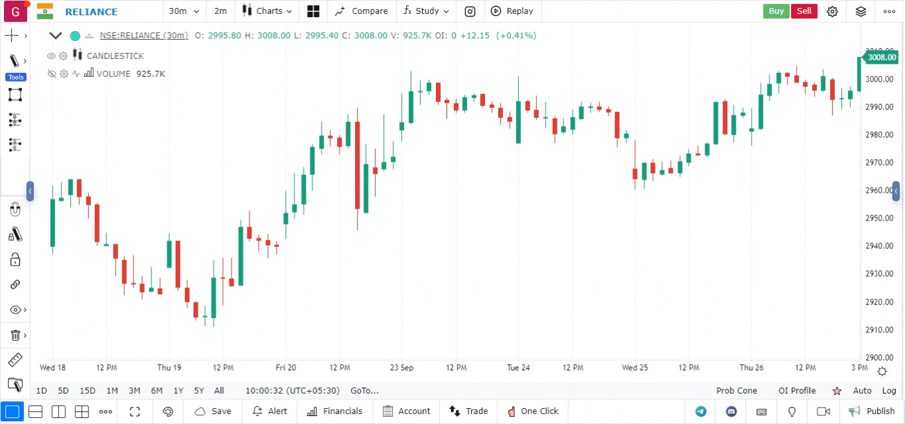

The world of stock trading is constantly evolving, and traders are continually seeking new methods and tools to gain an edge. One such tool that has gained popularity is the Fibonacci Channel, a technical analysis instrument used to estimate potential support and resistance levels in the price movements of stocks, commodities, and currencies. The Fibonacci Channel is valued for its ability to provide insights into future price directions by applying the mathematical properties of the Fibonacci sequence to financial markets.

Algorithmic trading, commonly referred to as algo trading, is a modern approach where computer algorithms execute trades at precise moments based on pre-set criteria. This method is increasingly integrating tools like the Fibonacci Channel to optimize trading strategies by automating buying and selling actions at opportune times. Algo trading incorporates various technical analysis tools to enhance decision-making, reduce the influence of human emotion, and improve the speed and accuracy of trade execution.



In this article, we'll explore the use of the Fibonacci Channel in algorithmic trading and its significance in technical analysis. By examining how this tool can be used to anticipate market movements and improve trading strategies, we aim to provide a comprehensive understanding of its role and benefits in contemporary financial markets.

## Table of Contents

## What is a Fibonacci Channel?

A Fibonacci Channel is a technical analysis tool marked by a sequence of parallel lines drawn diagonally across a stock chart to signify potential support and resistance levels. These channels differ from Fibonacci retracement lines, which are set horizontally, as they project a visual framework for potential future price trajectories by taking the chart's existing price trend into account.

The Fibonacci Channel builds upon the principles of the Fibonacci sequence—a series where each number is the sum of the two preceding ones (e.g., 0, 1, 1, 2, 3, 5, 8, etc.)—by using certain percentage levels derived from these numbers, specifically 23.6%, 38.2%, 61.8%, and 100%. Traders apply these percentage levels to the vertical distance of the initial trend line segment to draw parallel lines that potentially signal areas where the market may reverse or pause, thus serving as crucial decision-making zones for traders.

To establish a Fibonacci Channel, the trader first identifies a baseline trend in the market, selecting key swing highs and lows as anchors for the primary channel line. Subsequent channel lines are placed using Fibonacci-derived percentages, providing resistance in an upward trend and support in a downward trend. This anticipates the areas where market prices may consolidate or reverse, aiding traders in decision-making processes related to entry and exit points in trading. This tool, therefore, closely aligns with the core strategies of Fibonacci retracement, yet extends and contextualizes them for application to ongoing price trends.

## How to Draw a Fibonacci Channel

To draw a Fibonacci Channel, traders must first determine the prevailing market trend, which could be an uptrend or downtrend. Identifying the trend direction is crucial as it dictates the points used for initiating the channel. 

For an uptrend, the process begins with selecting two key points: a low point (point A) and a subsequent higher swing low (point B) on the price chart. These points establish the primary trend line, which acts as the baseline of the Fibonacci Channel. From here, parallel lines are drawn emanating from point A, corresponding to specific Fibonacci ratios such as 23.6%, 38.2%, 61.8%, and 100%. These percentage levels are derived from the Fibonacci sequence, reflecting their significance in predicting potential support and resistance zones within the channel.

Conversely, in a downtrend, the trader identifies an initial high point (point A) and a later lower swing high (point B). These points facilitate the drawing of a descending trend line, providing the channel’s framework. Similar to the uptrend, Fibonacci levels are applied in parallel to this trend line to estimate future price boundaries.

The application of these levels can be manually calculated or automated using trading software that allows customization. In Python, a basic outline for drawing Fibonacci Channels might involve plotting these channels using a library such as Matplotlib:

```python
import matplotlib.pyplot as plt

# Example data points
prices = [100, 105, 110, 115, 120, 125, 130, 126, 122, 118]
x_values = range(len(prices))

# Recognizing trendline key points
point_A = (0, prices[0])  # Low point in an uptrend
point_B = (4, prices[4])  # Higher swing low

# Plotting the primary trend line
plt.plot([point_A[0], point_B[0]], [point_A[1], point_B[1]], label='Trend Line')

# Calculate Fibonacci levels
fib_levels = [0.236, 0.382, 0.618, 1.0]
for f in fib_levels:
    fib_line = [(1 - f) * prices[0] + f * prices[4]] * len(prices)
    plt.plot(x_values, fib_line, linestyle='--', label=f'Fibonacci level {f*100:.1f}%')

plt.plot(x_values, prices, label='Price', marker='o')
plt.legend()
plt.title('Fibonacci Channels Example')
plt.xlabel('Time')
plt.ylabel('Price')
plt.show()
```

Incorporating Fibonacci Channels in analysis provides traders with an enhanced visual structure, aiding the identification of potential market reversals or continuations. While their placement may include a degree of subjectivity, when combined thoughtfully with other indicators, these channels can offer a strategic edge in trading.

## Using Fibonacci Channels in Algo Trading

Algorithmic trading strategies often integrate Fibonacci Channels as a means to enhance the precision and efficacy of trading executions. By leveraging technical analysis, predefined support and resistance levels within Fibonacci Channels serve as crucial indicators for triggering automated buy or sell orders. This automated decision-making streamlines the trading process by reducing human intervention and emotional biases, leading to more efficient market operations.

In the context of Fibonacci Channels, these levels correspond to specific ratios derived from the Fibonacci sequence, commonly set at 23.6%, 38.2%, 61.8%, and 100%. By employing these ratios, [algorithmic trading](/wiki/algorithmic-trading) systems can predict potential [breakout](/wiki/breakout-trading) points where the market may reverse or continue its trend, allowing for calculated entry and [exit](/wiki/exit-strategy) points. This enhances trend-following strategies, aligning the automated trades with the anticipated market direction.

Python-based algorithmic trading platforms, such as QuantConnect, can be used to implement Fibonacci Channels. Here is a simplified example using Python:

```python
import numpy as np
import matplotlib.pyplot as plt

def calculate_fibonacci_channels(prices, point1, point2):
    diff = prices[point2] - prices[point1]
    fib_levels = [0.236, 0.382, 0.618, 1.000]
    channels = {level: prices[point1] + diff * level for level in fib_levels}
    return channels

# Example usage
prices = np.array([100, 105, 110, 107, 115, 120, 116, 118])
channels = calculate_fibonacci_channels(prices, 0, 4)
print("Fibonacci Channels:", channels)
```

In this script, `calculate_fibonacci_channels` is a function to compute Fibonacci Channel lines between two data points in a price series. This framework can be expanded upon to inform an automated trading system, executing trades when the price approaches these calculated channels.

Fibonacci Channels thus provide a systematic approach to discern market trends, offering algorithmic traders an informed basis to automate decisions. By facilitating quick reactions to market changes, they allow traders to exploit short-term inefficiencies, potentially improving overall trade profitability. However, like any technical tool, the effectiveness of Fibonacci Channels is amplified when combined with other indicators, ensuring a more robust and holistic trading strategy.

## Advantages and Limitations

Fibonacci Channels offer traders a valuable tool for predicting price movements and setting up trades. Their primary advantage lies in their ability to provide a clear graphical representation of potential support and resistance levels within a trend. This visualization facilitates the anticipation of price movements, allowing traders to make informed decisions about entry and exit points. 

In practical applications, Fibonacci Channels can help outline possible price targets and stop-loss levels, which are crucial for effective risk management. By guiding the determination of these critical levels, they can help traders structure their trades more strategically and potentially enhance profitability. 

However, a significant limitation of Fibonacci Channels is their inherent subjectivity. The construction of these channels heavily relies on the trader's discretion in selecting the initial points of the channel, which can lead to inconsistent results across different analysts. This aspect of subjectivity can introduce variability in interpreting support and resistance levels, thus reducing the reliability of predictions.

To mitigate these limitations, it is advisable for traders to augment Fibonacci Channels with other technical indicators. Combining them with tools such as moving averages, RSI (Relative Strength Index), or MACD (Moving Average Convergence Divergence) can provide additional confirmation and help validate the signals generated by the Fibonacci Channel. This integration not only enhances the overall robustness of a trading strategy but also adds a layer of validation that can help alleviate the issues brought about by subjective channel placement. 

Ultimately, while Fibonacci Channels can offer insight into potential market trends, their effective application requires a balanced approach that incorporates a variety of analytical tools, thereby increasing the chance of yielding successful trade outcomes.

## Integrating Fibonacci Channels with Other Indicators

Traders improve the effectiveness of Fibonacci Channels by integrating them with other technical indicators such as moving averages and trend lines. This integration aims to confirm trends and bolster the reliability of signals indicated by Fibonacci Channels. 

Moving averages, particularly simple and exponential moving averages, smooth out price data, providing a clearer picture of the market trend. When used alongside Fibonacci Channels, moving averages can help confirm the direction of a trend. For instance, if a price is oscillating upward and a Fibonacci Channel indicates support, a moving average might signal a continuation of that uptrend if the price remains above the average. Traders often use crossover strategies in moving averages to validate signals from Fibonacci Channels. 

Trend lines are another popular tool that traders use in conjunction with Fibonacci Channels. They are drawn on charts to connect sequential highs or lows, providing a visual representation of the direction and strength of a trend. By integrating trend lines with Fibonacci Channels, traders can verify potential breakout points or reversals. The confluence of a Fibonacci level with a trend line increases the probability of a significant reaction in price, thereby enabling traders to make more informed decisions.

Combining these indicators can be done programmatically. For instance, in Python, a trader might use libraries such as `numpy` for mathematical calculations and `pandas` for managing financial data. A simple example of combining these indicators using Python might involve calculating a moving average and checking its alignment with the Fibonacci Channel levels:

```python
import pandas as pd
import numpy as np

# Sample price data
data = pd.DataFrame({'Price': [101, 103, 107, 105, 110, 108, 112]})

# Calculate a simple moving average
data['SMA'] = data['Price'].rolling(window=3).mean()

# Placeholder function for Fibonacci levels (assuming pre-calculated levels)
def fibonacci_levels():
    return [105, 108, 110]

# Check alignment of price with Fibonacci levels
for index, row in data.iterrows():
    sma = row['SMA']
    price = row['Price']
    fib_levels = fibonacci_levels()

    if sma and price > sma and price in fib_levels:
        print(f"Index {index}: Price {price} aligns with SMA and Fibonacci level")
```

This sample code computes a simple moving average and checks if the current price aligns with any hypothetical Fibonacci levels. Such integrations provide a deeper insight into market dynamics, helping traders harness more robust trading strategies.

## Conclusion

Fibonacci Channels offer a powerful addition to the toolkit of traders involved in both manual and algorithmic trading. They provide a structured approach to identifying potential support and resistance levels that are crucial in deciding entry and exit points. While the subjective nature of drawing these channels might pose a challenge, their efficacy in projecting market trends and price movements remains significant. The channels' reliance on the Fibonacci sequence—a mathematical series with natural significance—adds a layer of depth to technical analysis.

The primary limitation of Fibonacci Channels is their subjectivity. Different traders may interpret market data differently, potentially leading to varied conclusions about channel placement and resulting decisions. This subjectivity requires traders to exercise caution and possibly corroborate channel-derived insights with additional indicators to enhance accuracy and consistency.

For traders aiming to optimize their strategies, combining Fibonacci Channels with other technical indicators is advisable. Such integration could involve tools like moving averages or [momentum](/wiki/momentum) oscillators, which may validate the trends suggested by the channels, reinforcing the strength of the signals generated. This combination of methodologies can enhance decision-making processes, enabling traders to better navigate market complexities and exploit opportunities for profitable trades.

In conclusion, while the subjective nature of Fibonacci Channels requires careful handling, their ability to forecast market trends and price movements makes them an invaluable asset for traders. By aligning these channels with other analytical tools, traders stand to gain a strategic edge, increasing the potential for capturing more lucrative trading opportunities.

## References & Further Reading

[1]: Connors, L., & Alvarez, C. (2009). ["Short Term Trading Strategies That Work: A Quantified Guide to Trading Stocks and ETFs."](https://www.amazon.com/Short-Term-Trading-Strategies-That/dp/0981923909) Bettinger Books.

[2]: Lopez de Prado, M. (2018). ["Advances in Financial Machine Learning."](https://www.amazon.com/Advances-Financial-Machine-Learning-Marcos/dp/1119482089) Wiley.

[3]: Chan, E. (2009). ["Quantitative Trading: How to Build Your Own Algorithmic Trading Business."](https://github.com/ftvision/quant_trading_echan_book) Wiley.

[4]: Aronson, D. R. (2006). ["Evidence-Based Technical Analysis: Applying the Scientific Method and Statistical Inference to Trading Signals."](https://www.amazon.com/Evidence-Based-Technical-Analysis-Scientific-Statistical/dp/0470008741) Wiley.

[5]: Jansen, S. (2020). ["Machine Learning for Algorithmic Trading: Master the Fundamentals of Trading Strategies."](https://github.com/stefan-jansen/machine-learning-for-trading) Packt Publishing.