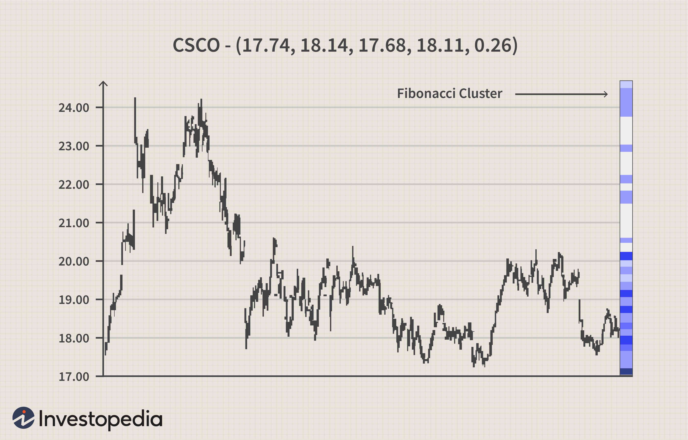

In the ever-evolving world of trading, where technological advancements and data analytics continually redefine strategies, algorithmic trading has emerged as a crucial tool for traders seeking precision and efficiency. Among the arsenal of techniques employed in algorithmic trading, Fibonacci clusters have gained prominence. This method, deeply rooted in the principles of Fibonacci retracement and extension levels, offers traders a systematic way to identify critical points in the market, such as support and resistance areas.

Fibonacci clusters involve the convergence of multiple Fibonacci retracement and extension levels around a specific price point, creating zones that may indicate potential pivots in market trends. Retracement levels, such as 23.6%, 38.2%, 61.8%, and the commonly used 50%, are calculated based on the assumption that markets will often retrace a predictable portion of a move, after which they will continue in the original direction. Extended levels like 161.8% and 261.8% predict the continuation of price movements beyond the initial swing, providing traders with targets for potential exits or extensions of the trade.



The popularity of Fibonacci clusters is attributed to their potential in providing high-probability trading opportunities. By identifying these clusters, traders can potentially predict market movements more accurately and mitigate risks, thus formulating strategies around these critical price zones. However, like any sophisticated tool, Fibonacci clusters come with their limitations. Their effectiveness can be contingent on market conditions and the subjective nature of identifying relevant price swings can result in varying results among different traders. Additionally, their utility is maximized only when integrated into a broader trading strategy that includes multiple forms of analysis.

This article aims to explore Fibonacci clusters extensively, focusing on their application in algorithmic trading strategies, their strengths and potential drawbacks. By examining these aspects, traders can gain insights into how to incorporate Fibonacci clusters into their trading approaches effectively, while also recognizing the importance of a balanced strategy that combines various analytical tools for improved trading outcomes.

## Table of Contents

## Understanding Fibonacci Clusters

A Fibonacci cluster is identified when multiple Fibonacci retracement or extension levels align closely around a specific price area. These clusters are seen as critical for price movements, acting as potential support or resistance zones. The use of Fibonacci retracement levels is common in this context, employing key percentage levels such as 23.6%, 38.2%, 61.8%, 78.6%, and the more subjective 50%. These levels correspond to potential retracement points where the market might reverse its current trend.

Moreover, Fibonacci extensions are used to forecast the continuation of a price move following a retracement. Prominent extension levels include 61.8%, 100%, 161.8%, 200%, and 261.8%. When these levels are plotted on a price chart, their convergence at a particular price level can highlight zones where the odds of a price movement changing direction are higher. 

Traders using Fibonacci clusters typically overlay these levels from various price swings or trends to identify areas with a high likelihood of significant trading activity. By doing so, they aim to pinpoint clusters that correspond to high-probability trading zones. These zones reflect accumulated confluence from different time frames or overlapping Fibonacci levels, thereby validating the cluster's significance in the context of trading strategies. This approach is often complemented by statistical tools and models to enhance precision in detecting relevant clusters and optimizing trading outcomes.

## The Role of Fibonacci Clusters in Algorithmic Trading

In [algorithmic trading](/wiki/algorithmic-trading), Fibonacci clusters play a pivotal role by providing structured data that can be leveraged to anticipate market trends. Algorithms incorporate Fibonacci clusters to automate decisions surrounding entry and [exit](/wiki/exit-strategy) points, optimizing trade setups by identifying support and resistance levels with precision.

The quantifiable nature of Fibonacci clusters enables algorithms to forecast potential market movements or price reversals. This is crucial for traders aiming to refine their strategies by using data-driven insights to inform their decisions. By pinpointing likely turning points in the market, these algorithms aid in executing trades with minimal emotional bias, enhancing the objectivity of trading decisions.

Traders employ Fibonacci clusters in algorithmic models primarily to improve their trade timing and risk management. By relying on identified clusters, algorithms can set up rules for initiating or liquidating positions. This setup is especially beneficial in volatile markets where human judgment might falter due to psychological factors.

For instance, an algorithm might be constructed to trigger a buy order when a Fibonacci cluster aligns with other bullish indicators, such as an RSI (Relative Strength Index) crossing above a certain threshold, or a moving average crossover. This multi-indicator approach reduces the likelihood of false signals, ensuring that trades are placed based on robust analytical foundations.

Moreover, programmers can design trading algorithms to execute the following pseudocode logic:

```python
def trade_decision(price_data, fibonacci_levels, rsi_data):
    for price_point in price_data:
        if price_point in fibonacci_levels:
            if rsi_data[price_point] > 70:
                return "Execute Sell Order"
            elif rsi_data[price_point] < 30:
                return "Execute Buy Order"
    return "Hold Position"
```

This code snippet outlines a basic algorithmic decision-making process involving Fibonacci levels: if the price meets a Fibonacci cluster and the RSI indicates an overbought condition (e.g., RSI > 70), the algorithm would execute a sell order, whereas an oversold condition (e.g., RSI < 30) would trigger a buy.

In summary, Fibonacci clusters in algorithmic trading provide a systematic and empirical approach to managing trades. By integrating these clusters into algorithms, traders can derive actionable insights and execute strategies with heightened confidence, grounded in statistical and mathematical frameworks rather than emotional impulses.

## Limitations of Fibonacci Clusters in Trading

Despite their usefulness, Fibonacci clusters are not without limitations, which are important to consider for their effective application in trading.

Firstly, it is crucial to note that not all Fibonacci clusters lead to significant price changes. Market dynamics, driven by various factors beyond technical analysis, can often overlook these levels. This can result in [fibonacci](/wiki/fibonacci-trading-strategy) forecasts that fail to play out as expected, highlighting the necessity of additional market analysis and caution in relying solely on Fibonacci clusters.

Secondly, the abundance of Fibonacci levels can contribute to a considerable amount of noise within the data. Traders frequently employ Fibonacci retracement levels such as 23.6%, 38.2%, 50%, 61.8%, and 78.6%, and extension levels like 61.8%, 100%, and 161.8%, among others. The convergence of these numerous levels can generate overlapping or conflicting signals, making it challenging to discern which level is most reliable or effective. This can lead to uncertainty, particularly when different clusters indicate different potential outcomes for price movements.

Additionally, the process of drawing Fibonacci levels is inherently subjective. Traders can choose to anchor these levels to price highs, lows, or even closing prices, depending on personal preference or specific strategies. This customization introduces variability and may result in inconsistent outcomes across different traders using the same method. Such subjectivity can compromise the objectivity that algorithmic trading seeks to achieve.

Thus, relying solely on Fibonacci clusters without confirmation from other technical indicators or fundamental market analysis can lead to false signals. This limitation emphasizes the importance of integrating Fibonacci analysis with other components, such as Relative Strength Index (RSI), Moving Average Convergence Divergence (MACD), or moving averages, to improve the reliability of trading decisions. Employing a multi-faceted approach to market analysis can mitigate the risks associated with standalone reliance on Fibonacci clusters.

## Best Practices for Using Fibonacci Clusters

Combining Fibonacci clusters with complementary technical indicators is essential for enhancing the reliability of trading signals in algorithmic strategies. Techniques such as the Relative Strength Index (RSI), Moving Average Convergence Divergence (MACD), and moving averages provide additional layers of confirmation. For instance, when a Fibonacci cluster aligns with an overbought or oversold condition indicated by the RSI, it may signal a more robust trading opportunity.

It is crucial to confirm Fibonacci clusters with price action and other market indicators before committing to a trade. Observing candlestick patterns, [volume](/wiki/volume-trading-strategy) changes, or trend lines in conjunction with Fibonacci levels can provide context and validation. This practice helps mitigate false signals and ensures a higher probability of successful trades.

Extensive testing of algorithms that integrate Fibonacci clusters is crucial across diverse market conditions. This involves [backtesting](/wiki/backtesting) and forward testing strategies to ensure their robustness and adaptability. Traders can use platforms like MetaTrader or Python libraries such as pandas and NumPy for backtesting. A simple Python script for backtesting might look like this:

```python
import pandas as pd
import numpy as np

def backtest_strategy(data, fib_clusters, indicator_signal):
    # Assume data is a DataFrame with price and indicator columns
    profit_loss = 0
    for index, row in data.iterrows():
        if fib_clusters[index] and indicator_signal[index] == 'Buy':
            # Simulate a buy action
            profit_loss += row['price'] - data.iloc[index-1]['price'] # Simplified P/L calculation
        elif fib_clusters[index] and indicator_signal[index] == 'Sell':
            # Simulate a sell action
            profit_loss += data.iloc[index-1]['price'] - row['price'] # Simplified P/L calculation
    return profit_loss

# Example data
data = pd.DataFrame({'price': np.random.randn(100), 'indicator_signal': np.random.choice(['Buy', 'Sell'], 100)})
fib_clusters = np.random.choice([True, False], 100)

result = backtest_strategy(data, fib_clusters, data['indicator_signal'])
print(f'Total Profit/Loss: {result}')
```

Remaining adaptable is crucial in maintaining an edge in trading. Even robust Fibonacci cluster strategies must be regularly reviewed and adjusted to respond to new developments or data in the market. As market dynamics evolve, being open to refining algorithms and incorporating emerging indicators ensures the strategy remains relevant and effective.

In conclusion, implementing best practices for using Fibonacci clusters involves a multifaceted approach. By integrating them with other technical indicators, validating with price action, rigorously testing algorithms, and staying adaptable, traders can enhance the efficacy of their algorithmic strategies and potentially improve trading outcomes.

## Conclusion

Fibonacci clusters offer traders a sophisticated tool for identifying potential areas of price reversal or continuation. These clusters are formed by the convergence of multiple Fibonacci retracement and extension levels, indicating zones of high probability for market turning points. While powerful, Fibonacci clusters require careful integration within a broader trading strategy. Relying solely on these clusters can lead to unreliable signals, so they're most effective when combined with other analytical tools like Relative Strength Index (RSI), Moving Average Convergence Divergence (MACD), and moving averages.

Understanding the limitations of Fibonacci clusters is crucial to maximizing their benefits. Not all clusters result in significant price movements; therefore, traders need to be judicious in their application. The subjective nature of selecting high and low points for drawing Fibonacci levels can introduce variability, making confirmation through additional indicators or price action critical to the strategy's success.

Algorithmic trading platforms enhance the application of Fibonacci clusters by allowing traders to adopt a more disciplined and strategic approach. Algorithms can systematically calculate and overlay Fibonacci levels across multiple timeframes, detect clusters, and execute trades with minimal emotional interference. Testing these algorithms extensively in diverse market conditions ensures robustness and adaptability, contributing to a more reliable trading process.

In conclusion, while Fibonacci clusters present a valuable opportunity for trading precision, their effectiveness lies in their judicious integration with comprehensive market analysis. By acknowledging their limitations and leveraging algorithmic tools, traders can enhance their ability to predict market movements more accurately.

## References & Further Reading

[1]: "Fibonacci Analysis: Identifying High Probability Trades" by Constance Brown

[2]: Pesavento, L., and Jouflas, L. (2009). ["Fibonacci Trading: How to Master the Time and Price Advantage"](https://www.amazon.com/Trade-What-You-See-Recognition/dp/047010676X), John Wiley & Sons.

[3]: "Technical Analysis Using Multiple Timeframes" by Brian Shannon

[4]: Murphy, J.J. (1999). ["Technical Analysis of the Financial Markets: A Comprehensive Guide to Trading Methods and Applications"](https://archive.org/details/technicalanalysi0000murp), New York Institute of Finance.

[5]: "Trading Price Action Trends" by Al Brooks