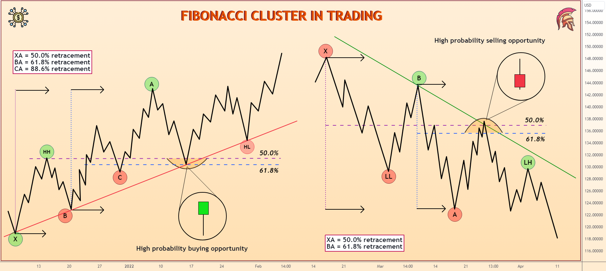

## Table of Contents

## What are Fibonacci numbers?

Fibonacci numbers are a special sequence of numbers where each number is the sum of the two numbers that come before it. The sequence starts with 0 and 1. So, the next number in the sequence is 0 + 1 = 1. Then, it's 1 + 1 = 2, followed by 1 + 2 = 3, and so on. This pattern continues, creating the sequence: 0, 1, 1, 2, 3, 5, 8, 13, 21, and so on.

These numbers are named after Leonardo of Pisa, who was also known as Fibonacci. He introduced these numbers to the Western world in his book "Liber Abaci" in the year 1202. Fibonacci numbers appear in many areas of nature, like the arrangement of leaves on a stem or the pattern of seeds in a sunflower. They are also used in mathematics, computer science, and even in financial markets to predict trends.

## How are Fibonacci numbers calculated?

Fibonacci numbers start with 0 and 1. To find the next number, you add the two numbers that come right before it. So, after 0 and 1, the next number is 0 + 1 which equals 1. Then, you add 1 and 1 to get 2. The next number is 1 + 2 which equals 3. You keep doing this to make the whole sequence.

You can write this sequence as a formula too. If you call the first number F(0), it's 0. The second number, F(1), is 1. For any number after that, like F(n), you can say F(n) = F(n-1) + F(n-2). This means to find the nth number, you add the (n-1)th number and the (n-2)th number. This way, you can find any Fibonacci number you want.

## What are Fibonacci clusters?

Fibonacci clusters are areas on a chart where different Fibonacci levels come together. Traders use these levels, like 38.2%, 50%, and 61.8%, to guess where the price of something might go next. When these levels from different time periods line up at the same spot, it makes a Fibonacci cluster. Traders think these spots are extra important because many people might be looking at the same levels.

These clusters can help traders decide when to buy or sell. If a lot of Fibonacci levels meet at one price, traders might think it's a good time to make a move. But, it's not perfect. Sometimes the price doesn't do what the cluster predicts. So, traders use Fibonacci clusters along with other tools to make better guesses about the market.

## How are Fibonacci clusters identified in data?

To find Fibonacci clusters in data, you start by looking at the price movements over different time periods. You draw lines on a chart that show where the price might go based on Fibonacci levels like 38.2%, 50%, and 61.8%. These lines are drawn from different highs and lows on the chart. When these lines from different time periods come together at the same spot, that's where you find a Fibonacci cluster.

Traders use these clusters to see where the price might stop or change direction. If many Fibonacci lines meet at one price, it might be a strong point where a lot of traders will be watching. This can help traders decide when to buy or sell, but it's not a sure thing. They often use other tools too, to make better guesses about what the market will do next.

## What is the significance of Fibonacci clusters in financial markets?

Fibonacci clusters are important in financial markets because they show where a lot of traders might be looking at the same time. When many Fibonacci levels from different time periods come together at one spot, it makes a cluster. Traders think these spots are extra important because they believe many other traders will be watching the same levels. This can make the price more likely to stop or change direction at these points.

Traders use Fibonacci clusters to help them decide when to buy or sell. If a cluster shows up at a certain price, it might be a good time to make a trade. But, Fibonacci clusters are not perfect. Sometimes the price doesn't do what the cluster predicts. That's why traders use other tools along with Fibonacci clusters to make better guesses about the market.

## Can Fibonacci clusters be applied to other fields besides finance?

Yes, Fibonacci clusters can be used in other areas too, not just finance. For example, in biology, scientists can use Fibonacci clusters to study patterns in nature. Things like the way leaves grow on a stem or the way seeds are arranged in a sunflower often follow Fibonacci numbers. When these patterns come together at certain points, it can help scientists understand how plants grow and why they look the way they do.

In art and design, Fibonacci clusters can help make things look good. Artists and designers use Fibonacci numbers to create patterns that people find pleasing to look at. When these patterns come together in certain spots, it can make a piece of art or a design more interesting and balanced. So, Fibonacci clusters can be useful in many different fields, not just in trading money.

## What are the common tools used to identify Fibonacci clusters?

To find Fibonacci clusters, traders use special tools called charting software. These programs help draw lines on a chart that show where the price might go based on Fibonacci levels like 38.2%, 50%, and 61.8%. Traders look at the price history and draw these lines from different highs and lows on the chart. When these lines from different time periods meet at the same spot, it makes a Fibonacci cluster.

Another tool that helps is a Fibonacci calculator. This tool can quickly figure out the Fibonacci levels for you, so you don't have to do the math yourself. It makes it easier to see where the clusters might be. Traders often use these tools together with other things like trend lines and moving averages to make better guesses about where the price might go next.

## How do Fibonacci clusters influence trading strategies?

Fibonacci clusters help traders decide when to buy or sell things like stocks or currencies. When a lot of Fibonacci lines from different times come together at one price, it makes a cluster. Traders think these spots are important because many other traders might be looking at the same levels. If the price reaches a cluster, traders might think it's a good time to make a trade. They might buy if they think the price will go up from there, or sell if they think it will go down.

But, Fibonacci clusters are not perfect. Sometimes the price doesn't do what the cluster predicts. That's why traders use other tools too, like trend lines and moving averages. These tools help them make better guesses about the market. By looking at everything together, traders can make smarter choices about when to buy or sell.

## What are the limitations of using Fibonacci clusters in analysis?

Using Fibonacci clusters to predict where the price will go has some problems. One big problem is that these clusters don't always work. The price might not stop or change direction where the cluster says it will. This can make traders lose money if they rely too much on the clusters. Also, Fibonacci levels are based on past prices, but the market can change a lot because of new news or events. So, what happened before might not happen again.

Another issue is that many traders use the same Fibonacci levels. If everyone is looking at the same spots, it can make the price move in ways that are hard to predict. Also, finding the right highs and lows to draw the Fibonacci lines can be tricky. If you pick the wrong points, the clusters won't be in the right place. That's why traders use other tools like trend lines and moving averages to help them make better guesses about the market.

## How can the accuracy of Fibonacci cluster predictions be improved?

To make Fibonacci cluster predictions more accurate, traders can use other tools along with the clusters. For example, they can look at trend lines and moving averages to see if they match up with the clusters. If a lot of different tools point to the same price, it might be a stronger sign that the price will stop or change direction there. Traders can also use things like support and resistance levels to help them decide if a cluster is a good spot to make a trade.

Another way to improve the accuracy is to be careful about which highs and lows to use when drawing the Fibonacci lines. Picking the right points is important because if you use the wrong ones, the clusters won't be in the right place. Traders can also look at longer time periods to see if the clusters show up in the same spots over time. By using all these methods together, traders can make smarter guesses about where the price might go next.

## What advanced mathematical concepts underpin the theory of Fibonacci clusters?

Fibonacci clusters are based on the Fibonacci sequence, which is a series of numbers where each number is the sum of the two numbers before it. The sequence starts with 0 and 1, and the next number is 0 + 1 = 1, then 1 + 1 = 2, and so on. These numbers are used to find special levels in data, like 38.2%, 50%, and 61.8%, which come from dividing one number in the sequence by the next number. When these levels from different time periods come together at the same spot, it makes a Fibonacci cluster.

The math behind these levels is connected to something called the golden ratio, which is about 1.618. This ratio shows up a lot in nature and art. In trading, the golden ratio helps find the Fibonacci levels. When traders see these levels lining up at the same price, they think it might be an important spot where the price could stop or change direction. But, since the market can be unpredictable, traders use other math tools like trend lines and moving averages to make their guesses more accurate.

## How do Fibonacci clusters interact with other technical analysis indicators?

Fibonacci clusters work together with other tools that traders use to guess where the price might go. One common tool is trend lines, which are lines drawn on a chart to show the direction the price is moving. When a Fibonacci cluster lines up with a trend line, it can be a strong sign that the price might stop or change direction at that spot. Traders also look at moving averages, which are lines that show the average price over a certain time. If a moving average and a Fibonacci cluster meet at the same price, it can make the cluster more important.

Another tool that works well with Fibonacci clusters is support and resistance levels. These are prices where the price often stops or turns around. If a Fibonacci cluster shows up at the same price as a support or resistance level, it can make the spot even more important. Traders use all these tools together to make better guesses about the market. By looking at how these different tools line up with each other, traders can decide when to buy or sell with more confidence.

## References & Further Reading

[1]: "Fibonacci Analysis: Identifying High Probability Trades" by Constance Brown

[2]: Pesavento, L., and Jouflas, L. (2009). ["Fibonacci Trading: How to Master the Time and Price Advantage"](https://www.amazon.com/Trade-What-You-See-Recognition/dp/047010676X), John Wiley & Sons.

[3]: "Technical Analysis Using Multiple Timeframes" by Brian Shannon

[4]: Murphy, J.J. (1999). ["Technical Analysis of the Financial Markets: A Comprehensive Guide to Trading Methods and Applications"](https://archive.org/details/technicalanalysi0000murp), New York Institute of Finance.

[5]: "Trading Price Action Trends" by Al Brooks