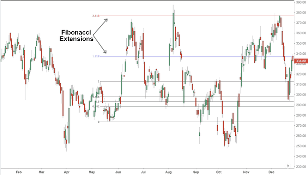

Fibonacci extensions are a critical component of technical analysis used widely by traders to predict potential price movements and identify reversal zones in financial markets. Rooted in the mathematical principles of the Fibonacci sequence, these extensions provide a structured method to project future price levels based on previous market trends. Traders find these tools particularly beneficial as they endeavor to pinpoint critical levels of support and resistance, enhancing their ability to make informed trading decisions.

The Fibonacci sequence, from which these extensions derive, is a series of numbers where each is the sum of the two preceding ones. This sequence introduces ratios such as 61.8%, 100%, 161.8%, among others, which are pivotal in calculating potential price targets in trading frameworks. By applying these ratios, traders can make educated predictions about the extent of market moves, allowing them to better strategize entry and exit points.



Algorithmic trading systems frequently incorporate Fibonacci extensions to refine decision-making processes. Automating these calculations helps traders consistently apply technical analysis principles divorced from the emotional biases that often plague manual trading decisions. Algorithms can rapidly compute and adjust positions based on predefined Fibonacci levels, ensuring a systematic approach to trading.

The significance of Fibonacci extensions lies not only in their mathematical foundation but also in their practical application across various asset classes including stocks, forex, and cryptocurrencies. Traders seeking to integrate these extensions into their strategies will benefit from understanding both their computational aspects and their interpretative impact on market trends. The integration of Fibonacci extensions into a trader's analytical toolkit can significantly aid in forecasting price targets and managing the inherent risks in trading. Through a comprehensive understanding of these extensions, traders are able to approach market movements with a strategic edge, making them indispensable for those looking to enhance their technical analysis prowess.

## Table of Contents

## Understanding Fibonacci Extensions

Fibonacci extensions are leveraged in technical analysis to estimate the potential reach of a price movement following a retracement. They are constructed using the Fibonacci numerical sequence, a series where each number is the sum of the two preceding ones, prominently featuring ratios derived from this sequence.

The process of creating Fibonacci extensions does not rely on a rigid formula; instead, it requires traders to select three pivotal points on a price chart: a starting point (A), a peak (B), and a retracement endpoint (C). These points are crucial for calculating and plotting the extension levels. For instance, the 61.8% level can be constructed by taking the price difference between points B and A and extending it beyond point C by 61.8% of this distance.

Commonly used Fibonacci extension levels include 61.8%, 100%, 161.8%, 200%, and 261.8%. These percentages are derived from key ratios associated with the Fibonacci sequence, such as 0.618 (the golden ratio) and 1.618 (the inverse of the golden ratio), as well as whole number extensions.

Fibonacci extensions prove especially useful when traditional support and resistance levels are ambiguous or difficult to identify. Their significance extends beyond financial markets, as Fibonacci ratios appear naturally in various elements of nature and life, thereby reinforcing their perceived reliability and usefulness in market analysis. This natural occurrence fuels traders' belief in their applicability to financial markets, where they seek to recognize patterns and anticipate movements.

These extensions can be effectively employed across multiple timeframes, catering to both short-term day traders and long-term investors. Furthermore, their versatility allows application across a spectrum of asset classes, including stocks, Forex, and cryptocurrencies. This adaptability underscores the flexibility and utility of Fibonacci extensions in a trader's toolkit.

## Creating Fibonacci Extensions

Creating Fibonacci extensions involves identifying key price movements to determine future price targets beyond initial retracement levels. This process starts by pinpointing significant price swings on a chart, specifically choosing the relevant high and low points that define the range of interest.

Once the critical points are established, traders apply specific Fibonacci ratios to the identified price movement to map out extension levels. Commonly used ratios for extensions include 61.8%, 100%, 161.8%, 200%, and 261.8%. These ratios are derived from Fibonacci numbers and offer insights into potential future price actions. The formula for calculating an extension level is as follows:

$$
\text{Extension Level} = \text{Price at Low} + (\text{Price at High} - \text{Price at Low}) \times \text{Extension Ratio}
$$

For example, to calculate the 161.8% Fibonacci extension level, one would subtract the low price from the high price, multiply the result by 1.618, and then add this value to the low price. This calculation provides a projection of how far the price is expected to extend beyond the current swing high.

Visualizing these extension levels on a trading chart is critical for strategic planning. It enables traders to set precise entry and [exit](/wiki/exit-strategy) points, designating areas for take-profit or stop-loss orders. This foresight aids in optimizing trading strategies, ensuring potential gains are maximized while losses are minimized.

Modern trading platforms offer various tools to facilitate the creation of Fibonacci extensions. These platforms often provide integrated solutions that allow traders to chart these levels with ease. By utilizing software tools, such as those available in MetaTrader, TradingView, or Python libraries like Matplotlib and Pandas, traders can enhance the practical application of Fibonacci extensions. Below is a simple Python example demonstrating how to plot Fibonacci extensions using Matplotlib:

```python
import matplotlib.pyplot as plt

# Define high, low, and extension ratios
price_low = 100
price_high = 150
ratios = [0, 0.618, 1.0, 1.618, 2.0, 2.618]

# Calculate extension levels
extensions = [price_low + (price_high - price_low) * ratio for ratio in ratios]

# Plotting using Matplotlib
plt.figure(figsize=(10, 6))
plt.plot([0, 1], [price_low, price_high], 'k-', lw=2, label='Price Movement')
for i, ext in enumerate(extensions):
    plt.hlines(ext, xmin=0, xmax=1, linestyles='dashed', colors='r')
    plt.text(0.5, ext, f'{ratios[i]*100:.1f}%', fontsize=9, ha='center', va='bottom')

plt.title('Fibonacci Extensions')
plt.ylabel('Price')
plt.legend()
plt.grid(True)
plt.show()
```

This example provides a visual representation of Fibonacci extensions, making it easier for traders to interpret potential market movements based on mathematically derived levels. By integrating such analytical tools, traders can effectively predict price actions and manage risk through enhanced technical analysis.

## Fibonacci Extensions in Algorithmic Trading

Algorithmic trading systems have revolutionized the way traders approach financial markets, and one of their key components is the integration of Fibonacci extensions. These extensions are harnessed to automate the identification of potential entry and exit points, leveraging the mathematical precision inherent in Fibonacci ratios.

Embedding Fibonacci extensions within trading algorithms allows traders to systematically predict price movements. By using historical price data, traders identify price swings, calculate extension levels, and use these insights to adjust their positions. For instance, if a trader identifies a significant price movement between a high and low and calculates the 161.8% Fibonacci extension level, this can serve as a potential price target for taking profit.

The application of Fibonacci extensions in algorithms ensures consistency in trading strategies, reducing the dependence on subjective decision-making. This is particularly beneficial, as it minimizes emotional bias and enhances the reliability of decision processes. When algorithms apply technical analysis principles consistently, they can evaluate market conditions effectively, leading to sound trading decisions.

Moreover, [backtesting](/wiki/backtesting) is an essential feature of [algorithmic trading](/wiki/algorithmic-trading). By testing strategies that incorporate Fibonacci extensions on historical data, traders can refine the accuracy and effectiveness of their models. Backtesting provides valuable insights into how well a strategy might perform under various market conditions, thereby offering opportunities to optimize the strategy before live deployment.

Fibonacci extensions can be further strengthened by integrating them with other technical indicators. Volume analysis and moving averages are commonly used in conjunction with Fibonacci levels to enhance the robustness of trading strategies. For example, a trader might use a moving average crossover as an additional confirmation for entering a trade at a Fibonacci extension level. This multi-indicator approach can increase the confidence in trade setups and help manage potential risks more effectively.

The adaptability of algorithmic trading strategies incorporating Fibonacci extensions is particularly relevant in volatile market conditions. By continuously monitoring market data and adjusting to new information, algorithms can respond swiftly to fluctuating market dynamics. This adaptability ensures that trading strategies remain relevant and effective, even in rapidly changing environments.

In summary, the integration of Fibonacci extensions within algorithmic trading not only improves the prediction of price movements but also enhances the precision and adaptability of trading strategies. By employing these extensions alongside other indicators and leveraging backtesting techniques, traders can develop sophisticated models that align with their trading objectives.

## Fibonacci Extensions vs. Fibonacci Retracements

Fibonacci extensions and retracements both find their roots in the Fibonacci sequence and are integral to technical analysis, yet they cater to distinct aspects of trading strategies. Retracement levels are utilized to gauge the potential depth of a price pullback within an existing trend. These levels suggest areas where the price might reverse or pause during a temporary market correction. Typically identified using key Fibonacci ratios like 23.6%, 38.2%, 50%, and 61.8%, retracements help traders pinpoint potential entry points for initiating trades aligned with the larger trend.

In contrast, Fibonacci extensions are employed to project potential price targets beyond the standard retracement levels. Extension levels such as 61.8%, 100%, 161.8%, 200%, and 261.8% serve to estimate how far the price might extend following a retracement phase. This predictive utility aids traders in determining optimal exit points by assessing where the price might find resistance or support after resuming the dominant trend.

The comprehension of these techniques enables traders to formulate comprehensive strategies, enhancing their capability to follow and identify trends effectively. Integration with other analytical tools, such as candlestick patterns or [momentum](/wiki/momentum) indicators, further strengthens the reliability of these techniques. For instance, observing a candlestick reversal pattern at a key Fibonacci retracement level can boost the confidence in making a trade decision.

To proficiently apply both Fibonacci extensions and retracements, traders must keenly recognize and interpret price waves and patterns. This recognition aids in accurately plotting Fibonacci levels, ensuring the chosen points on a chart reflect the actual market dynamics. Mastery of these tools requires a blend of technical skills and intuitive judgment, crucial for navigating complex market environments and optimizing trade execution.

## Limitations of Using Fibonacci Extensions

Fibonacci extensions are a widely recognized tool in technical analysis; however, they have certain limitations that traders must consider to ensure accurate and effective trading strategies. One of the primary assumptions behind Fibonacci extensions is that past price behaviors tend to repeat in the future. This presumption can lead to erroneous forecasts when market conditions deviate from historical patterns. Consequently, relying solely on Fibonacci extensions without incorporating other forms of analysis may result in imprecise predictions and potentially unfavorable trading outcomes.

External market factors significantly influence the reliability of Fibonacci extensions. Economic announcements, geopolitical events, and unforeseen news can cause abrupt price movements that fall outside the expectations set by Fibonacci projections. These events can alter market sentiment and [liquidity](/wiki/liquidity-risk-premium), dramatically affecting price behavior and invalidating Fibonacci-based predictions.

To enhance the accuracy of trading strategies, traders are encouraged to complement Fibonacci extensions with additional technical indicators. Tools such as moving averages, the Relative Strength Index (RSI), or the Moving Average Convergence Divergence (MACD) can provide valuable confirmation and insight into market trends, ultimately leading to more informed trading decisions. This multi-faceted approach enables traders to cross-verify signals and improve the robustness of their analyses.

Moreover, a comprehensive risk management plan is essential when utilizing Fibonacci extensions within trading systems. Risk management involves setting stop-loss orders, determining position sizes, and establishing risk-reward ratios to mitigate potential losses. By adopting a disciplined approach to risk management, traders can safeguard their capital and maintain profitability, even when market conditions deviate from Fibonacci forecasts.

In summary, while Fibonacci extensions are a powerful analytical tool, they should not be used in isolation. Integration with other technical indicators and a strong risk management plan can mitigate the limitations inherent in their standalone application, thereby enhancing decision-making and optimizing trading performance.

## Conclusion

Fibonacci extensions offer traders a robust method for predicting future price movements and establishing strategic points in their trading strategies. By leveraging the mathematical foundation of the Fibonacci sequence, these extensions provide a structured approach to analyzing market trends and potential reversals. When integrated into algorithmic trading frameworks, Fibonacci extensions can enhance the precision and efficiency of technical analysis, allowing traders to automate decision-making processes and improve trading performance.

Understanding the core principles and applications of Fibonacci extensions enables traders to better anticipate market trajectories and optimize their trading outcomes. Despite the potential benefits, traders are advised to use Fibonacci extensions cautiously, integrating them with comprehensive analysis techniques and rigorous risk management strategies. This ensures that predictions account for the multifaceted nature of financial markets, which are influenced by numerous factors beyond historical price data.

Mastering the use of Fibonacci extensions can position traders to identify and capitalize on market trends more effectively, aligning their trading actions with broader strategic objectives. Continuous exploration of advanced extensions and their integration across diverse asset classes such as stocks, [forex](/wiki/forex-system), and cryptocurrencies may further refine their practical applications. As traders deepen their understanding and application of these tools, they enhance their ability to navigate complex market environments, ultimately contributing to more informed and successful trading decisions.

## References & Further Reading

[1]: ["Technical Analysis of the Financial Markets: A Comprehensive Guide to Trading Methods and Applications"](https://www.amazon.com/Technical-Analysis-Financial-Markets-Comprehensive/dp/0735200661) by John J. Murphy

[2]: ["Fibonacci Analysis"](https://www.investopedia.com/ask/answers/05/fibonacciretracement.asp) by Constance Brown

[3]: ["Algorithmic Trading: Winning Strategies and Their Rationale"](https://www.amazon.com/Algorithmic-Trading-Winning-Strategies-Rationale-ebook/dp/B00CY5HC0U) by Ernest P. Chan

[4]: ["Quantitative Technical Analysis: An Integrated Approach to Trading System Development and Trading Management"](https://www.amazon.com/Quantitative-Technical-Analysis-integrated-development/dp/0979183855) by Howard B. Bandy

[5]: ["Fibonacci and Gann Applications in Financial Markets: Practical Applications of Natural and Synthetic Ratios in Technical Analysis"](https://archive.org/details/fibonaccigannapp0000macl) by George MacLean