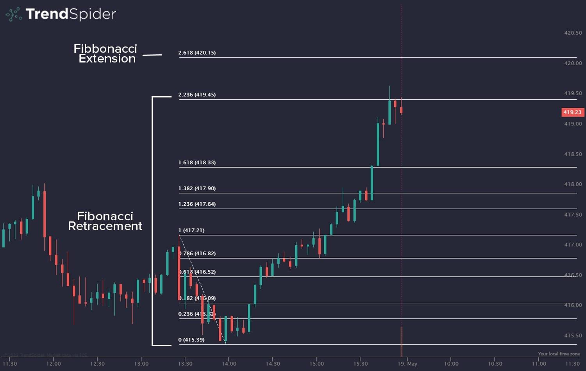

## Table of Contents

## What are Fibonacci extensions?

Fibonacci extensions are tools used in trading to predict where prices might go in the future. They are based on the Fibonacci sequence, a series of numbers where each number is the sum of the two before it. In trading, these extensions help traders find levels where the price could move to after a trend has started. The main levels used are 127.2%, 161.8%, and 261.8%. These percentages come from the Fibonacci sequence and are used to draw lines on a chart to show where the price might reach.

To use Fibonacci extensions, a trader first identifies a significant price move, usually from a low to a high or vice versa. They then draw the extension levels from the start of the move to the end, and extend them beyond the end point. For example, if a stock goes from $10 to $20, the 161.8% extension level would be calculated from $10 to $20 and then extended to $32.36. Traders watch these levels because they believe the price might stop or reverse at these points. This can help them decide when to buy or sell.

## How do Fibonacci extensions differ from Fibonacci retracements?

Fibonacci extensions and Fibonacci retracements are both tools used in trading, but they serve different purposes. Fibonacci retracements help traders find levels where the price might pull back to after it has moved in one direction. These levels are usually between 23.6%, 38.2%, 50%, 61.8%, and 78.6%. Traders use these levels to decide when to buy if the price is going up or sell if the price is going down, expecting the price to bounce back from these retracement levels.

On the other hand, Fibonacci extensions are used to predict where the price might go after it has already started moving in a certain direction. The main extension levels are 127.2%, 161.8%, and 261.8%. Traders draw these levels from the start of a significant price move to its end and then extend them beyond the end point. This helps them guess where the price might reach in the future, giving them a target to aim for when deciding to take profits or set new positions.

## What is the historical background of Fibonacci extensions?

The idea of Fibonacci extensions comes from the Fibonacci sequence, which was first talked about by Leonardo of Pisa, also known as Fibonacci, in the early 13th century. He wrote about it in his book "Liber Abaci" in 1202. The sequence starts with 0 and 1, and each number after that is the sum of the two numbers before it. People started to see that this sequence showed up a lot in nature, like in the way leaves grow on stems or the patterns on pinecones. This made the sequence very interesting to mathematicians and scientists.

In the world of trading, Fibonacci extensions were developed much later, in the 20th century. Traders began to use the ratios from the Fibonacci sequence to help them predict where prices might go in the future. They found that certain levels, like 127.2%, 161.8%, and 261.8%, often acted as points where prices would stop or change direction. These levels were calculated by extending the Fibonacci ratios beyond the initial price move. Over time, these extension levels became a popular tool for traders looking to set targets for their trades.

## How are Fibonacci extension levels calculated?

Fibonacci extension levels are calculated by using the Fibonacci sequence, which starts with 0 and 1, and each number after that is the sum of the two numbers before it. In trading, we use the ratios that come from this sequence to find out where the price might go next. To calculate these levels, you start by finding a big price move, from a low to a high or a high to a low. Let's say the price moved from $10 to $20. You take the difference between these two points, which is $10.

Next, you use the Fibonacci ratios to extend this move. The main levels used are 127.2%, 161.8%, and 261.8%. To find the 161.8% extension level, you multiply the difference ($10) by 1.618 and add it to the end point of the move ($20). So, $10 times 1.618 equals $16.18, and when you add that to $20, you get $36.18. This means the 161.8% extension level is at $36.18. You do the same thing for the other levels, using 1.272 for the 127.2% level and 2.618 for the 261.8% level. This helps traders guess where the price might go after it has already started moving in a certain direction.

## What are the most commonly used Fibonacci extension levels?

The most commonly used Fibonacci extension levels are 127.2%, 161.8%, and 261.8%. These numbers come from the Fibonacci sequence, which is a series of numbers where each number is the sum of the two before it. In trading, these levels help traders guess where the price might go after it has started moving in a certain direction.

To use these levels, traders look at a big price move, like from a low to a high or a high to a low. They then use the difference between these points to calculate where the price might go next. For example, if the price moved from $10 to $20, the 161.8% extension level would be at $36.18. Traders watch these levels because they believe the price might stop or change direction at these points, helping them decide when to buy or sell.

## In what types of markets are Fibonacci extensions typically used?

Fibonacci extensions are used in many different types of markets, but they are most common in the stock market, [forex](/wiki/forex-system) market, and [cryptocurrency](/wiki/cryptocurrency) market. These tools help traders guess where prices might go next, no matter what they are trading. Whether it's stocks, currencies, or digital coins, Fibonacci extensions can be useful for finding target prices.

In the stock market, traders use Fibonacci extensions to figure out where a stock's price might go after it has already started moving up or down. This can help them decide when to sell their stocks for a profit or when to buy more. In the forex market, where people trade different currencies, these extensions help traders set goals for how much they think one currency will rise or fall against another. And in the world of cryptocurrencies, which can be very up and down, Fibonacci extensions give traders a way to predict where prices might go in this fast-moving market.

## How can Fibonacci extensions be applied in trading strategies?

Fibonacci extensions can be a big help in trading strategies because they give traders a way to guess where prices might go next. After a big price move, traders use these extensions to find levels like 127.2%, 161.8%, and 261.8%. These levels can show where the price might stop or change direction. For example, if a stock goes from $10 to $20, a trader might use the 161.8% level to see that the price could go up to $36.18. This helps them decide when to sell their stocks to make a profit or when to buy more if they think the price will keep going up.

Traders can use Fibonacci extensions in different ways depending on the market they are trading in. In the stock market, they might use these levels to set goals for how much a stock's price could rise or fall. In the forex market, where people trade currencies, these extensions help traders figure out where one currency might go against another. And in the world of cryptocurrencies, which can be very up and down, Fibonacci extensions give traders a way to predict where prices might go in this fast-moving market. By using these levels, traders can make better choices about when to buy or sell, helping them make more money.

## What are the limitations and potential pitfalls of using Fibonacci extensions?

Using Fibonacci extensions can be tricky because they are not always right. They are just a guess based on numbers from the Fibonacci sequence. Sometimes the price does not stop or change direction at the levels you expect, like 127.2%, 161.8%, or 261.8%. This can make traders lose money if they rely too much on these levels without looking at other things, like what the market is doing or what news might affect prices. It's important to use Fibonacci extensions with other tools and not just by themselves.

Another problem is that different traders might draw the Fibonacci levels in different ways, which can lead to confusion. If one trader starts the Fibonacci extension from a different point than another trader, they will get different levels. This can make it hard to agree on where the price might go next. Also, because these levels are based on past price moves, they might not work well in markets that are very up and down or when big news changes things quickly. So, while Fibonacci extensions can be helpful, traders need to be careful and use them along with other ways to understand the market.

## Can Fibonacci extensions be combined with other technical analysis tools?

Yes, Fibonacci extensions can be combined with other technical analysis tools to make better guesses about where prices might go. Traders often use these extensions with tools like trend lines, moving averages, and support and resistance levels. For example, if a Fibonacci extension level lines up with a strong resistance level, it might be a good place to think the price will stop or change direction. By using these tools together, traders can see more clearly where the market might be headed and make smarter choices about when to buy or sell.

Another way to use Fibonacci extensions with other tools is with chart patterns and indicators like the Relative Strength Index (RSI) or the Moving Average Convergence Divergence (MACD). If a Fibonacci extension level matches up with a [breakout](/wiki/breakout-trading) from a chart pattern or a signal from an indicator, it can give traders more confidence in their predictions. This mix of tools helps traders see the bigger picture and not just rely on one thing, making their trading strategies stronger and more likely to work well.

## How do professional traders interpret Fibonacci extension levels differently from beginners?

Professional traders use Fibonacci extension levels in a more careful and smart way than beginners. They know that these levels are just one part of the puzzle and not the whole answer. So, they mix Fibonacci extensions with other tools like trend lines, moving averages, and chart patterns. They look at the big picture of the market, including news and what other traders are doing. This helps them make better guesses about where prices might go next. Professionals also understand that different people might draw the Fibonacci levels in different ways, so they are careful not to rely too much on just one set of levels.

Beginners, on the other hand, might think that Fibonacci extension levels are magic numbers that always work. They might focus too much on these levels without looking at other important things in the market. This can lead them to make bad choices about when to buy or sell. Beginners might not know that the levels can be drawn in different ways, which can cause confusion. They often need more time and practice to learn how to use Fibonacci extensions in a way that helps them make money, rather than just following the levels blindly.

## What advanced techniques can be used to enhance the accuracy of Fibonacci extensions?

Professional traders use some smart tricks to make Fibonacci extensions work better. One trick is to mix them with other tools like trend lines, moving averages, and chart patterns. For example, if a Fibonacci extension level lines up with a strong resistance level, it might be a good place to think the price will stop or change direction. They also look at the big picture of the market, including news and what other traders are doing. This helps them make better guesses about where prices might go next. Professionals know that different people might draw the Fibonacci levels in different ways, so they are careful not to rely too much on just one set of levels.

Another way to make Fibonacci extensions more accurate is to use them with indicators like the Relative Strength Index (RSI) or the Moving Average Convergence Divergence (MACD). If a Fibonacci extension level matches up with a breakout from a chart pattern or a signal from an indicator, it can give traders more confidence in their predictions. This mix of tools helps traders see the bigger picture and not just rely on one thing, making their trading strategies stronger and more likely to work well. By using these advanced techniques, traders can get a better idea of where the market might be headed and make smarter choices about when to buy or sell.

## How have Fibonacci extensions evolved with the advent of algorithmic trading?

With the rise of [algorithmic trading](/wiki/algorithmic-trading), Fibonacci extensions have become even more important. Computers can now quickly find and use Fibonacci levels to help make trading decisions. This means that trading programs can look at lots of data very fast and use Fibonacci extensions to guess where prices might go next. This has made trading faster and more accurate because computers can do the math and draw the levels much quicker than people can.

Even though computers help a lot, traders still need to be careful. They use Fibonacci extensions along with other tools like moving averages and chart patterns to make sure their guesses are good. By mixing these tools, traders can make better choices about when to buy or sell. This way, they can use the power of computers but still keep an eye on the bigger picture of the market.

## How can one create Fibonacci Extensions?

Creating Fibonacci extensions involves identifying key price movements to determine future price targets beyond initial retracement levels. This process starts by pinpointing significant price swings on a chart, specifically choosing the relevant high and low points that define the range of interest.

Once the critical points are established, traders apply specific Fibonacci ratios to the identified price movement to map out extension levels. Commonly used ratios for extensions include 61.8%, 100%, 161.8%, 200%, and 261.8%. These ratios are derived from Fibonacci numbers and offer insights into potential future price actions. The formula for calculating an extension level is as follows:

$$
\text{Extension Level} = \text{Price at Low} + (\text{Price at High} - \text{Price at Low}) \times \text{Extension Ratio}
$$

For example, to calculate the 161.8% Fibonacci extension level, one would subtract the low price from the high price, multiply the result by 1.618, and then add this value to the low price. This calculation provides a projection of how far the price is expected to extend beyond the current swing high.

Visualizing these extension levels on a trading chart is critical for strategic planning. It enables traders to set precise entry and [exit](/wiki/exit-strategy) points, designating areas for take-profit or stop-loss orders. This foresight aids in optimizing trading strategies, ensuring potential gains are maximized while losses are minimized.

Modern trading platforms offer various tools to facilitate the creation of Fibonacci extensions. These platforms often provide integrated solutions that allow traders to chart these levels with ease. By utilizing software tools, such as those available in MetaTrader, TradingView, or Python libraries like Matplotlib and Pandas, traders can enhance the practical application of Fibonacci extensions. Below is a simple Python example demonstrating how to plot Fibonacci extensions using Matplotlib:

```python
import matplotlib.pyplot as plt

# Define high, low, and extension ratios
price_low = 100
price_high = 150
ratios = [0, 0.618, 1.0, 1.618, 2.0, 2.618]

# Calculate extension levels
extensions = [price_low + (price_high - price_low) * ratio for ratio in ratios]

# Plotting using Matplotlib
plt.figure(figsize=(10, 6))
plt.plot([0, 1], [price_low, price_high], 'k-', lw=2, label='Price Movement')
for i, ext in enumerate(extensions):
    plt.hlines(ext, xmin=0, xmax=1, linestyles='dashed', colors='r')
    plt.text(0.5, ext, f'{ratios[i]*100:.1f}%', fontsize=9, ha='center', va='bottom')

plt.title('Fibonacci Extensions')
plt.ylabel('Price')
plt.legend()
plt.grid(True)
plt.show()
```

This example provides a visual representation of Fibonacci extensions, making it easier for traders to interpret potential market movements based on mathematically derived levels. By integrating such analytical tools, traders can effectively predict price actions and manage risk through enhanced technical analysis.

## References & Further Reading

[1]: ["Technical Analysis of the Financial Markets: A Comprehensive Guide to Trading Methods and Applications"](https://www.amazon.com/Technical-Analysis-Financial-Markets-Comprehensive/dp/0735200661) by John J. Murphy

[2]: ["Fibonacci Analysis"](https://www.investopedia.com/ask/answers/05/fibonacciretracement.asp) by Constance Brown

[3]: ["Algorithmic Trading: Winning Strategies and Their Rationale"](https://www.amazon.com/Algorithmic-Trading-Winning-Strategies-Rationale-ebook/dp/B00CY5HC0U) by Ernest P. Chan

[4]: ["Quantitative Technical Analysis: An Integrated Approach to Trading System Development and Trading Management"](https://www.amazon.com/Quantitative-Technical-Analysis-integrated-development/dp/0979183855) by Howard B. Bandy

[5]: ["Fibonacci and Gann Applications in Financial Markets: Practical Applications of Natural and Synthetic Ratios in Technical Analysis"](https://archive.org/details/fibonaccigannapp0000macl) by George MacLean