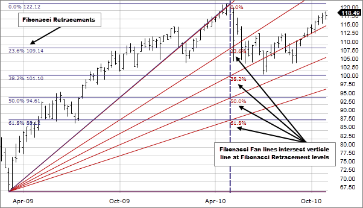

## Table of Contents

## What is a Fibonacci Fan?

A Fibonacci Fan is a tool used in technical analysis to predict future price movements in financial markets. It is based on the Fibonacci sequence, a series of numbers where each number is the sum of the two preceding ones. The tool uses these numbers to create diagonal lines on a chart, which are called Fibonacci lines. These lines help traders see where prices might go next by showing potential support and resistance levels.

To use a Fibonacci Fan, a trader first picks two points on a chart, usually the start and end of a significant price move. The tool then draws three diagonal lines from the second point, extending outwards. These lines are drawn at angles based on key Fibonacci ratios, like 38.2%, 50%, and 63.8%. Traders watch these lines to see if prices will bounce off them or break through them, which can signal whether to buy or sell.

## How is a Fibonacci Fan constructed?

To make a Fibonacci Fan, you start by picking two important points on a price chart. These points are usually the highest and lowest points of a big price move. The first point is where the price starts moving a lot, and the second point is where that move ends. Once you have these two points, you can draw the fan.

From the second point, you draw three diagonal lines that spread out like a fan. These lines are set at special angles that come from the Fibonacci sequence. The angles are based on the ratios 38.2%, 50%, and 63.8%. These lines help traders guess where the price might go next. If the price touches or bounces off these lines, it can tell traders whether it's a good time to buy or sell.

## What is the significance of the Fibonacci sequence in a Fibonacci Fan?

The Fibonacci sequence is important in a Fibonacci Fan because it helps traders predict where prices might go next. The sequence is a series of numbers where each number is the sum of the two before it, like 0, 1, 1, 2, 3, 5, and so on. In a Fibonacci Fan, we use special numbers from this sequence, called Fibonacci ratios, to draw lines on a price chart. These ratios, like 38.2%, 50%, and 63.8%, come from dividing numbers in the sequence.

These lines, drawn at the Fibonacci angles, help traders see where the price might find support or resistance. If the price touches or bounces off these lines, it can signal whether it's a good time to buy or sell. By using the Fibonacci sequence, traders can make better guesses about future price movements and make smarter trading decisions.

## In which financial markets is a Fibonacci Fan commonly used?

A Fibonacci Fan is often used in the stock market. Traders look at stock price charts and use the Fibonacci Fan to find good times to buy or sell stocks. They draw the fan on the chart to see where the stock price might stop or turn around. This helps them make better decisions about when to trade.

It's also used in the [forex](/wiki/forex-system) market, where people trade different currencies. Forex traders use the Fibonacci Fan to predict where currency prices might go next. They draw the lines on their charts and watch to see if the prices hit these lines. This can tell them when to enter or [exit](/wiki/exit-strategy) trades.

In the commodities market, like trading oil or gold, the Fibonacci Fan is used too. Traders in this market also draw the fan on their charts to find support and resistance levels for commodity prices. This helps them figure out the best times to buy or sell these goods.

## How do traders use Fibonacci Fans to identify potential support and resistance levels?

Traders use Fibonacci Fans to find out where the price of a stock, currency, or commodity might stop or turn around. They start by [picking](/wiki/asset-class-picking) two important points on the price chart, usually the highest and lowest points of a big price move. Then, they draw three diagonal lines from the second point, spreading out like a fan. These lines are set at special angles based on the Fibonacci sequence, using ratios like 38.2%, 50%, and 63.8%. When the price of the stock, currency, or commodity gets close to these lines, traders watch carefully. If the price touches or bounces off one of these lines, it might mean the price will stop going down and start going up, or stop going up and start going down.

By watching these lines, traders can guess where the price might find support or resistance. Support is when the price stops going down and starts going up again. Resistance is when the price stops going up and starts going down again. If the price hits a Fibonacci Fan line and starts to go the other way, traders might decide it's a good time to buy or sell. For example, if the price bounces off a 38.2% line and starts going up, a trader might buy, thinking the price will keep going up. If the price breaks through a 63.8% line and keeps going down, a trader might sell, thinking the price will keep falling.

## What are the key Fibonacci ratios used in a Fibonacci Fan?

In a Fibonacci Fan, traders use special numbers called Fibonacci ratios to draw lines on a price chart. These ratios come from the Fibonacci sequence and help traders guess where the price might go next. The most important ratios used in a Fibonacci Fan are 38.2%, 50%, and 63.8%. These numbers help draw the lines that spread out like a fan from a point on the chart.

Traders draw three lines at these angles: one at 38.2%, another at 50%, and the last one at 63.8%. These lines show where the price might find support or resistance. Support is when the price stops going down and starts going up again. Resistance is when the price stops going up and starts going down again. By watching these lines, traders can make better guesses about when to buy or sell.

## Can you explain the process of drawing a Fibonacci Fan on a price chart?

To draw a Fibonacci Fan on a price chart, you first need to pick two important points on the chart. These points are usually the highest and lowest points of a big price move. The first point is where the price starts moving a lot, and the second point is where that move ends. Once you have these two points, you can start drawing the fan. From the second point, you draw three diagonal lines that spread out like a fan. These lines are set at special angles based on the Fibonacci sequence.

The angles of these lines are based on key Fibonacci ratios: 38.2%, 50%, and 63.8%. The first line is drawn at a 38.2% angle, the second at a 50% angle, and the third at a 63.8% angle. These lines help traders guess where the price might go next. If the price touches or bounces off one of these lines, it might mean the price will stop going down and start going up, or stop going up and start going down. By watching these lines, traders can make better decisions about when to buy or sell.

## How does a Fibonacci Fan differ from other Fibonacci tools like Fibonacci Retracement and Fibonacci Extension?

A Fibonacci Fan is different from other Fibonacci tools like Fibonacci Retracement and Fibonacci Extension because of how it's drawn and what it's used for. A Fibonacci Fan is drawn with diagonal lines that spread out like a fan from a point on the chart. These lines help traders see where the price might stop or turn around. The angles of these lines are based on Fibonacci ratios like 38.2%, 50%, and 63.8%. Traders use the fan to guess where the price might find support or resistance in the future.

On the other hand, Fibonacci Retracement uses horizontal lines to show where the price might pull back to after a big move. These lines are also based on Fibonacci ratios, but they're drawn between the highest and lowest points of a price move. Traders look at these lines to see if the price will bounce off them and keep going in the same direction. Fibonacci Extension is used to predict how far a price move might go beyond its previous high or low. It uses lines that extend past the end of the price move, also based on Fibonacci ratios. Traders use these lines to guess where the price might go after breaking through a high or low point.

## What are some common mistakes traders make when using Fibonacci Fans?

One common mistake traders make when using Fibonacci Fans is picking the wrong points to start drawing the fan. The fan needs to be drawn from the highest and lowest points of a big price move. If traders choose the wrong points, the lines won't be in the right places, and their guesses about where the price will go next will be off. Another mistake is not using the right Fibonacci ratios. The fan should be drawn at angles of 38.2%, 50%, and 63.8%. If traders use different ratios, the lines won't help them predict price movements as well.

Another mistake is relying too much on the Fibonacci Fan without looking at other things that can affect the price. Traders should use the fan along with other tools and information, like news about the company or market trends. If they only use the fan, they might miss important signs that the price is about to change. Also, some traders might not watch the fan lines carefully enough. They need to see if the price touches or bounces off the lines to make good trading decisions. If they don't pay attention, they might miss good times to buy or sell.

## How can the accuracy of a Fibonacci Fan be improved in technical analysis?

To make a Fibonacci Fan more accurate, traders need to pick the right points to start drawing it. These points should be the highest and lowest of a big price move. If you choose the wrong points, the lines won't be in the right places, and your guesses about where the price will go next will be off. It's also important to use the right Fibonacci ratios when drawing the fan. The angles should be set at 38.2%, 50%, and 63.8%. Using different ratios can mess up your predictions.

Another way to improve the accuracy of a Fibonacci Fan is by not relying on it alone. Traders should use the fan along with other tools and information, like news about the company or market trends. This way, they can get a fuller picture of what might happen to the price. Also, traders need to watch the fan lines carefully. They should see if the price touches or bounces off the lines to make good trading decisions. If they pay close attention, they can spot good times to buy or sell.

## What are the limitations of using Fibonacci Fans in trading?

Using Fibonacci Fans in trading can have some problems. One big issue is that they can be hard to use right. If you pick the wrong points to start drawing the fan, the lines won't be in the right places. This can make your guesses about where the price will go next not very good. Also, if you don't use the right Fibonacci numbers, like 38.2%, 50%, and 63.8%, your predictions can be off. It's easy to make mistakes with these tools, which can lead to bad trading choices.

Another problem is that Fibonacci Fans don't work alone. They need to be used with other tools and information. If you only use the fan, you might miss important signs that the price is about to change. Things like news about the company or what's happening in the market can affect the price a lot. So, you need to look at everything, not just the fan. Also, sometimes the price might not follow the fan lines at all. This can make the fan less useful and make it hard to know when to buy or sell.

## How do advanced traders combine Fibonacci Fans with other technical indicators for more robust analysis?

Advanced traders often use Fibonacci Fans along with other technical indicators to get a better picture of the market. They might use moving averages, which are lines on a chart that show the average price over time. If a price touches a Fibonacci Fan line and also crosses a moving average, it can be a stronger sign that the price might stop or turn around. Traders also look at the Relative Strength Index (RSI), which tells them if a stock is overbought or oversold. If the price hits a Fibonacci Fan line and the RSI shows the stock is overbought or oversold, it can help traders decide if it's a good time to buy or sell.

Another way advanced traders use Fibonacci Fans is by combining them with trend lines and chart patterns. Trend lines are straight lines drawn on a chart to show the direction of the price. If a price bounces off a Fibonacci Fan line and also follows a trend line, it can give a clearer signal about where the price might go next. Chart patterns, like head and shoulders or triangles, can also help. If a price touches a Fibonacci Fan line and forms a certain pattern, it can be a more reliable sign of future price movements. By using Fibonacci Fans with these other tools, traders can make more informed decisions and improve their chances of success in the market.

## References & Further Reading

[1]: "Fibonacci Analysis" by Constance Brown. A comprehensive book focusing on Fibonacci applications in trading.

[2]: "Technical Analysis of the Financial Markets" by John J. Murphy. A classic text covering various technical analysis tools, including Fibonacci Fans.

[3]: Investopedia. ["Fibonacci Retracement."](https://www.investopedia.com/terms/f/fibonacciretracement.asp) An article explaining the concept of Fibonacci Retracements and their application in trading.

[4]: "The New Trading for a Living" by Alexander Elder. Discusses different trading strategies and technical indicators, including Fibonacci tools.

[5]: TradingView. ["Fibonacci Fan."](https://www.tradingview.com/chart/BTCUSDT.P/GkKKUnuO-Fibonacci-Fan-Explained-Guide-Part-20/) A guide to understanding and employing Fibonacci Fans on TradingView’s charting platform.

[6]: "Algorithmic Trading: Winning Strategies and Their Rationale" by Ernie Chan. An introduction to algorithmic trading strategies, including the integration of technical analysis tools like Fibonacci Fans.