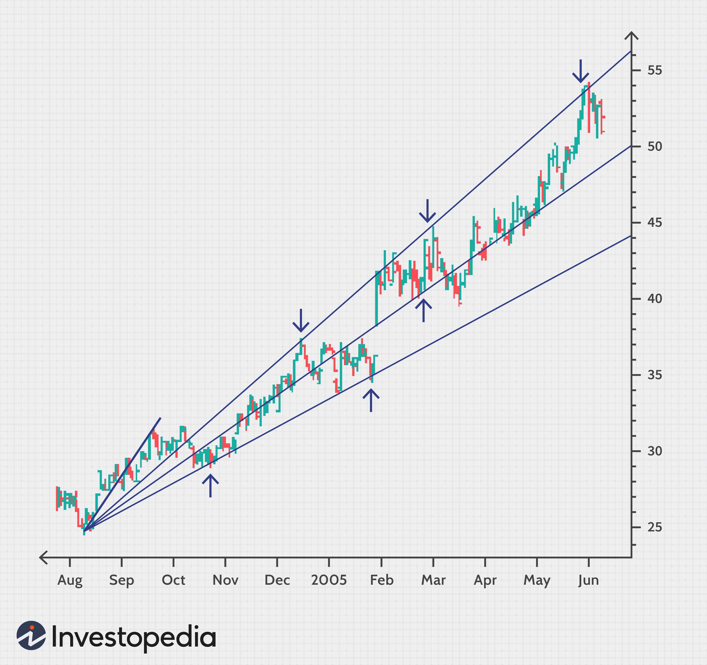

Technical analysis is essential in financial markets, helping traders navigate complex decision-making processes. Among various tools, Fibonacci Fans stand out for their unique mathematical foundation, tracing back centuries to Leonardo of Pisa, known as Fibonacci. This tool applies the Fibonacci sequence—or series—in a way that highlights potential support and resistance levels on price charts, serving as a compass for traders to understand market dynamics and potential price movements.

This article examines how Fibonacci Fan technical analysis is integrated into algorithmic trading strategies. Algorithmic trading leverages computer programs to execute trades based on predefined criteria. By incorporating Fibonacci Fans, traders can automate the identification of strategic entry and exit points, enhancing precision and efficiency. The overlap of Fibonacci's mathematical principles with cutting-edge technology presents a powerful combination to optimize trading outcomes.



Through exploring the feasibility and practicality of Fibonacci Fan charts, this section will cover their foundational aspects and significance in financial trading. The goal is to illustrate how this blend of classic mathematical tools with modern trading algorithms can provide traders with a competitive edge. Whether it is the Fibonacci ratios, which are pivotal in forming the fan's structure, or the strategic implementation in automated systems, integrating these concepts is vital to optimizing trade execution and timing.

## Table of Contents

## Understanding Fibonacci Fans

A Fibonacci Fan is an analytical tool used in technical analysis, consisting of a set of trendlines drawn from a significant trough or peak on a price chart. These trendlines are plotted using key Fibonacci ratios—23.6%, 38.2%, 50%, and 61.8%—to help identify potential support and resistance levels within market trends. This technique leverages the mathematical properties of the Fibonacci sequence, which are frequently found in natural patterns and financial markets.

To construct a Fibonacci Fan, it starts by selecting a significant low (trough) or high (peak) on a price chart and drawing a baseline trendline connecting another relevant point, such as a subsequent high or low. From this baseline, lines are projected at angles determined by Fibonacci ratios. The geometric representation is a series of rays or "fans" that visually depict potential zones of price retracement or continuation. These lines serve as guides where prices could potentially reverse or halt, offering traders critical insights into market behavior.

The effectiveness of Fibonacci Fans lies in their ability to represent market dynamics graphically. As prices move, they often adhere to these fan lines, thereby serving as predictive tools for future price movements. Traders utilize these lines to make informed predictions about where support and resistance might be found. For example, if a stock price approaches a fan line after moving downward, it might indicate a potential support level where the price could bounce back.

Understanding how to accurately draw and interpret Fibonacci Fans is crucial for conducting thorough technical analysis. When plotting Fibonacci Fans, a common approach sets the initial price point (usually a low or high) as a reference. The resulting fan lines are then drawn at specific angles corresponding to the Fibonacci ratios from this fixed point. This method provides a forecast of possible market reactions, allowing traders to plan entry and [exit](/wiki/exit-strategy) points for their trades effectively.

Interpreting these patterns involves recognizing that prices typically move in waves, making support and resistance levels key components of strategy formulation. Successful deployment of Fibonacci Fans requires not only identifying correct swing highs and lows from which to draw the fans but also considering them in tandem with other technical indicators for a comprehensive trading strategy. Effective use of these tools enhances a trader's ability to anticipate market movements and adjust positions accordingly to maximize profitability.

## Fibonacci Series and Ratio

The Fibonacci sequence is a series of numbers where each number is the sum of the two preceding ones, beginning with 0 and 1. Mathematically, this can be expressed as $F(n) = F(n-1) + F(n-2)$ with initialization $F(0) = 0$ and $F(1) = 1$. The sequence develops into a numerical pattern: 0, 1, 1, 2, 3, 5, 8, 13, and so forth. The unique property of this series is its inherent ratios, particularly as the sequence progresses, approximating what is known as the golden ratio, 1.6180339887..., often denoted by the Greek letter phi (Φ).

In natural phenomena, these proportions manifest in various systems, from the arrangement of leaves around a stem to the branching of trees. Their ubiquity extends into art and architecture, arising in shapes and forms perceived as aesthetically pleasing. This natural occurrence of the Fibonacci sequence and its ratios underpins its application in diverse fields, including financial markets.

In finance, the Fibonacci ratios—especially the golden ratio—are utilized to predict potential price movements and retracement levels in the market. These ratios are generally expressed as percentages: 23.6%, 38.2%, 50%, 61.8%, and 100%. They can be applied along both price and time axes to infer potential support and resistance levels, allowing traders to make more informed decisions.

For example, a trader might analyze a recent high and low on a stock price chart to apply Fibonacci retracements and identify price levels where reversals might occur. Implementing these calculations into a trading strategy, the retracement tool can look like:

```python
def fibonacci_retracement(high, low):
    diff = high - low
    levels = {
        "23.6%": high - diff * 0.236,
        "38.2%": high - diff * 0.382,
        "50.0%": high - diff * 0.5,
        "61.8%": high - diff * 0.618,
        "100%":  low
    }
    return levels

# Example usage
high = 100  # high point of the price
low = 80    # low point of the price
print(fibonacci_retracement(high, low))
```
This function calculates the Fibonacci retracement levels based on given high and low points, which can be strategically utilized to predict price action. Understanding the mathematical foundation of these tools helps traders appreciate these ratios’ predictive powers, grounding trading strategies in principles that have stood the test of time. By applying Fibonacci ratios to financial charts, traders gain insights into potential price targets and pivot points, enhancing their ability to navigate market fluctuations effectively.

## Applying Fibonacci Fans in Algorithmic Trading

Algorithmic trading, a hallmark of modern financial markets, utilizes computer programs to automatically execute trading strategies based on pre-defined algorithms. By integrating Fibonacci Fans into these algorithmic frameworks, traders can automatically place buy and sell orders at predefined Fibonacci-based support and resistance levels. This approach leverages the potential of Fibonacci ratios to predict and respond to market price movements with high precision.

Fibonacci Fan's trendlines, based on Fibonacci ratios such as 23.6%, 38.2%, 50%, and 61.8%, assist traders in identifying key levels on a price chart. These levels often serve as potential points of support and resistance where price direction may change. By embedding these calculations into algorithms, systems can scan vast datasets swiftly to recognize historical patterns that match current conditions.

For instance, a Python script can analyze a trading instrument's historical data to calculate Fibonacci-based levels and automatically place trades when the price nears these levels. Here is a simplified example of how such a script might identify these opportunities:

```python
import pandas as pd

def fibonacci_fan(levels, data):
    results = []
    high_price = data.max()
    low_price = data.min()
    diff = high_price - low_price
    for level in levels:
        fan_line = high_price - level * diff
        results.append((level, fan_line))
    return results

# Define Fibonacci levels
fibonacci_levels = [0.236, 0.382, 0.5, 0.618]

# Historical price data
price_data = pd.Series([...])  # replace [...] with your actual data

# Calculate Fibonacci Fan levels
fan_results = fibonacci_fan(fibonacci_levels, price_data)
print(fan_results)
```

This snippet constructs key levels and helps automate the detection process vital for executing trades when prices approach the identified support or resistance zones. This real-time analysis reduces latency and enhances the execution of trades, potentially capturing short-term trading opportunities that manual analysis might miss.

Real-time algorithms can process incoming data streams to continuously adjust trading signals based on current market conditions. This provides traders with a proactive edge, optimizing market timing and execution. Automated trading systems thus align traditional technical analysis with advanced technological solutions, creating a synergy to improve trading efficacy.

## Case Study: Fibonacci Fans vs. Gann Fans

Both Fibonacci Fans and Gann Fans are integral tools in technical analysis, utilized to forecast market trends and price movements. Their efficacy, however, stems from distinct mathematical foundations and principles.

Fibonacci Fans are constructed using Fibonacci ratios derived from the Fibonacci sequence. This method involves plotting a baseline trendline from a significant peak or trough on a price chart, and then drawing additional lines at key Fibonacci levels, such as 23.6%, 38.2%, 50%, and 61.8%. These lines serve as potential support and resistance zones, helping traders identify possible reversal points within the market. The naturalistic grounding of Fibonacci ratios, often observed in various natural phenomena, appeals to traders seeking a deeper connection between mathematical theory and market behavior.

In contrast, Gann Fans rely on the geometric angles and the relationship between price and time. Created by W.D. Gann, this technique uses angles like the 1x1 (45-degree angle), 1x2, 2x1, etc., to represent different support and resistance levels. The idea is that a trend will not change direction until a key angle is broken. Gann's approach is heavily based on the principle that markets move in predictable cycles following geometric relationships. This method suggests that the angle of the line is critical; for example, a 1x1 angle represents a move of one unit of price for one unit of time, establishing a balanced market trend.

Debates among traders concerning the effectiveness of these techniques are common. Some prefer Fibonacci Fans for their mathematical elegance and historical roots in natural phenomena, whereas others opt for Gann Fans due to the structured approach to time and price geometry. 

To assess their practical applications, consider a scenario where both tools are applied to a historical market data set:

1. **Fibonacci Fans**: Deploy a Python script to calculate Fibonacci retracement levels and plot the fans.
   ```python
   import matplotlib.pyplot as plt
   import numpy as np

   # Sample price data
   prices = [100, 105, 102, 107, 110, 106]
   peaks = [110]  # Example peak for drawing the fan

   # Calculate Fibonacci levels
   fib_ratios = [0.236, 0.382, 0.5, 0.618]
   fib_levels = [p - (fib * (peaks[0] - prices[-1])) for fib in fib_ratios]

   # Plotting Fibonacci Fans
   plt.plot(prices, label='Price Data')
   for level in fib_levels:
       plt.axhline(y=level, linestyle='--', label=f'Fib Level {level:.2f}')
   plt.legend()
   plt.show()
   ```

2. **Gann Fans**: For a comparative analysis, compute angles from a significant high or low and integrate these into algorithmic models for price forecasting. This requires a precise understanding of the unit movement per angle to project future price trajectories accurately.

Understanding the key similarities and differences between Fibonacci Fans and Gann Fans aids traders in aligning these tools with their specific market strategies. While both techniques aim to identify pivotal points in market movements, the choice between them might hinge on the trader's comfort with mathematical models versus geometric analyses, or their interpretation of market data within the context of natural cycles versus calculated angles. 

Ultimately, the selection of either method may depend on personal preference or the specific market context, underscoring the broader principle that no one tool guarantees success, but rather a combination of insights and strategies tailored to individual trading objectives will yield the best results.

## Conclusion

Fibonacci Fans provide traders with a distinct view of market behavior by leveraging mathematical ratios that are not only historical but also naturally occurring. These ratios, often observed in nature, find significant application in financial markets, offering clues to support and resistance levels, which are crucial for decision-making in trading environments. By employing Fibonacci Fans in [algorithmic trading](/wiki/algorithmic-trading), traders can enhance the precision and responsiveness of their strategies. Algorithmic trading allows for the rapid processing and analysis of historical and real-time market data, making it possible to identify Fibonacci patterns and execute trades with a level of accuracy and speed unattainable through manual trading alone.

The integration of Fibonacci Fans into automated trading systems represents a powerful convergence of traditional technical analysis and modern technological advancements. This hybrid approach grants traders a competitive edge in financial markets characterized by high [volatility](/wiki/volatility-trading-strategies) and rapid changes. By continuously learning and adapting Fibonacci techniques within their strategies, traders can significantly improve their market understanding and performance. This adaptive learning ensures that traders remain relevant and effective as market conditions evolve.

The enduring relevance of Fibonacci Fans highlights both the timelessness of the mathematical principles underpinning them and the ongoing evolution in trading technologies. As markets continue to change and new technologies emerge, the integration of classic methodologies like Fibonacci Fans into contemporary practices underscores the importance of blending established knowledge with innovative approaches. This synergy not only enhances the effectiveness of trading strategies but also helps traders navigate the complexities of modern financial markets more effectively.

## References & Further Reading

[1]: "Fibonacci Analysis" by Constance Brown. A comprehensive book focusing on Fibonacci applications in trading.

[2]: "Technical Analysis of the Financial Markets" by John J. Murphy. A classic text covering various technical analysis tools, including Fibonacci Fans.

[3]: Investopedia. ["Fibonacci Retracement."](https://www.investopedia.com/terms/f/fibonacciretracement.asp) An article explaining the concept of Fibonacci Retracements and their application in trading.

[4]: "The New Trading for a Living" by Alexander Elder. Discusses different trading strategies and technical indicators, including Fibonacci tools.

[5]: TradingView. ["Fibonacci Fan."](https://www.tradingview.com/chart/BTCUSDT.P/GkKKUnuO-Fibonacci-Fan-Explained-Guide-Part-20/) A guide to understanding and employing Fibonacci Fans on TradingView’s charting platform.

[6]: "Algorithmic Trading: Winning Strategies and Their Rationale" by Ernie Chan. An introduction to algorithmic trading strategies, including the integration of technical analysis tools like Fibonacci Fans.