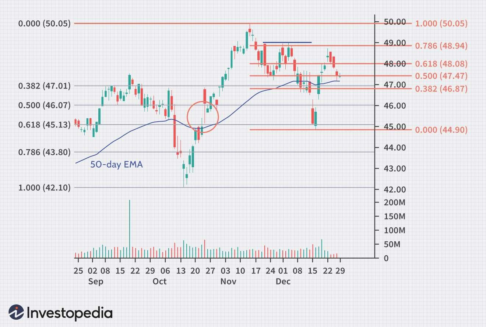

## Table of Contents

## What is the Fibonacci sequence and how does it relate to trading?

The Fibonacci sequence is a series of numbers where each number is the sum of the two numbers that come before it. It starts with 0 and 1, so the sequence goes like this: 0, 1, 1, 2, 3, 5, 8, 13, and so on. People find this sequence interesting because it appears in many places in nature, like the way leaves grow on a stem or the pattern of seeds in a sunflower.

In trading, the Fibonacci sequence is used to predict where prices might go next. Traders use something called Fibonacci retracement levels, which are based on the ratios from the sequence, like 38.2%, 50%, and 61.8%. These levels help traders guess where a price might stop dropping before it starts going up again, or vice versa. It's not a perfect tool, but many traders find it helpful to make decisions about when to buy or sell.

## How are Fibonacci retracement levels used in trading?

Fibonacci retracement levels help traders figure out where a price might go next. They draw lines on a chart between a high point and a low point of a price movement. These lines are at specific percentages like 23.6%, 38.2%, 50%, 61.8%, and 78.6%. These percentages come from the Fibonacci sequence. Traders think that the price might stop or change direction at these levels.

When a price is going up or down, traders watch these levels closely. If the price is going up and then starts to drop, it might stop dropping at one of these Fibonacci levels. That could be a good time to buy. If the price is going down and then starts to go up, it might stop going up at one of these levels. That could be a good time to sell. It's not always right, but it gives traders a way to guess what might happen next.

## What are Fibonacci extension levels and how do traders use them?

Fibonacci extension levels are another tool traders use to guess where a price might go after it has already moved a lot. They are drawn on a chart past the high or low point of a price move. The common levels used are 127.2%, 161.8%, and 261.8%. These levels come from the Fibonacci sequence, just like the retracement levels.

Traders use these extension levels to find targets for where a price might go next. If a price is going up and breaks past its last high, traders might look at the extension levels to see where it might stop. If it's going down and breaks past its last low, they'll look at the extension levels to see where it might stop falling. It's like setting goals for where the price could reach, helping traders decide when to take profits or cut losses.

## Can you explain the concept of Fibonacci time zones in trading?

Fibonacci time zones are another tool traders use to guess when a price might change direction. They are based on the Fibonacci sequence, just like retracement and extension levels. To use them, traders draw vertical lines on a chart at specific time intervals that follow the Fibonacci numbers. These lines start from a major high or low point in the price movement and spread out to the right.

Traders watch these time zones to see if the price might react at these points. If the price hits a time zone and then starts to move differently, it could mean that the time zone is working as a signal. It's not always right, but it can help traders decide when to buy or sell by giving them a sense of when a change might happen.

## How do traders combine Fibonacci levels with other technical indicators?

Traders often use Fibonacci levels together with other tools to make better guesses about where prices might go. One common way is to use Fibonacci retracement levels with moving averages. A moving average is a line on a chart that shows the average price over a certain number of days. If a price hits a Fibonacci level and also touches a moving average, traders might think it's a stronger sign that the price will change direction. This can help them feel more sure about when to buy or sell.

Another way traders combine Fibonacci levels is with something called the Relative Strength Index (RSI). The RSI is a number that goes from 0 to 100 and shows if a price is overbought or oversold. If a price hits a Fibonacci level and the RSI is also at a key point, like over 70 or under 30, it can make the signal stronger. Traders look for these matches to help them decide when to make a trade. By using Fibonacci levels with other tools, traders can get a better picture of what might happen next with the price.

## What are the common mistakes traders make when using Fibonacci tools?

One common mistake traders make when using Fibonacci tools is relying on them too much. They might think that just because a price hits a Fibonacci level, it will always change direction. But the market doesn't always follow these levels perfectly. Traders should use Fibonacci tools as a guide, not a rule. It's important to look at other things like the overall trend, news, and other technical indicators to make better guesses about where the price might go.

Another mistake is not setting the Fibonacci levels right. If traders don't start their Fibonacci retracement from the right high and low points, the levels won't be accurate. It's easy to get the starting points wrong, especially in a busy market. Traders need to take their time to find the correct high and low points to make sure their Fibonacci levels are useful. Also, some traders forget to update their Fibonacci levels as the market changes. Keeping the levels up to date can help traders stay on track with the current market movement.

## How can Fibonacci arcs be applied in trading strategies?

Fibonacci arcs are another tool traders use to guess where a price might go. They are drawn on a chart as curved lines that start from a major high or low point. These curves are at specific percentages like 38.2%, 50%, and 61.8%, which come from the Fibonacci sequence. Traders watch these arcs to see if the price will change direction when it touches one of the curves. If the price hits an arc and then starts to move differently, it might mean that the arc is a good signal for when to buy or sell.

Traders use Fibonacci arcs together with other tools to make better guesses. For example, if a price hits a Fibonacci arc and also touches a moving average, it can be a stronger sign that the price will change direction. Traders might feel more sure about making a trade when these tools agree. But, it's important not to rely too much on just one tool like Fibonacci arcs. The market doesn't always follow these arcs perfectly, so traders need to look at the overall trend and other indicators to make the best decisions.

## What is the significance of the golden ratio in Fibonacci trading?

The golden ratio, which is about 1.618, is a special number that comes from the Fibonacci sequence. It's called the golden ratio because it shows up a lot in nature and art. In trading, this number is important because it helps traders guess where prices might go next. They use the golden ratio to draw lines on a chart called Fibonacci retracement levels. These levels are at 38.2%, 50%, and 61.8%, which are all related to the golden ratio. Traders think that prices might stop or change direction at these levels.

Traders use the golden ratio to find good times to buy or sell. For example, if a price is going up and then starts to drop, it might stop dropping at one of these levels based on the golden ratio. That could be a good time to buy. If the price is going down and then starts to go up, it might stop going up at one of these levels. That could be a good time to sell. The golden ratio isn't perfect, but it gives traders a way to make guesses about the market.

## How do professional traders validate Fibonacci levels for more accurate predictions?

Professional traders often use other tools to check if their Fibonacci levels are right. They might use moving averages, which show the average price over time, to see if the price is likely to change direction at a Fibonacci level. If the price hits a Fibonacci level and also touches a moving average, it can be a stronger sign that the price will change. They also look at the Relative Strength Index (RSI), which tells if a price is overbought or oversold. If the RSI is at a key point when the price hits a Fibonacci level, it can make the signal stronger. By using these other tools, traders can feel more sure about their guesses.

Another way professional traders make their Fibonacci levels more accurate is by looking at the bigger picture. They don't just focus on one small part of the chart. They look at the overall trend and how the market has been moving over a longer time. This helps them pick the right high and low points to start their Fibonacci levels. If they choose the wrong starting points, the levels won't be accurate. So, they take their time to find the correct points and keep updating their levels as the market changes. This way, they can make better predictions about where the price might go next.

## Can Fibonacci fans enhance trading decisions, and if so, how?

Fibonacci fans can help traders make better choices about when to buy or sell. They are drawn on a chart as diagonal lines that start from a major high or low point. These lines are at specific percentages like 38.2%, 50%, and 61.8%, which come from the Fibonacci sequence. Traders watch these lines to see if the price will change direction when it touches one of them. If the price hits a fan line and then starts to move differently, it can be a good sign that the price might go up or down soon.

Traders use Fibonacci fans along with other tools to make their guesses more accurate. For example, if a price hits a Fibonacci fan line and also touches a moving average, it can be a stronger sign that the price will change direction. Traders might feel more sure about making a trade when these tools agree. But, it's important not to rely too much on just one tool like Fibonacci fans. The market doesn't always follow these lines perfectly, so traders need to look at the overall trend and other indicators to make the best decisions.

## What are some advanced Fibonacci trading strategies used by experts?

Experts often use a mix of Fibonacci tools to make better guesses about where prices might go. They might start with Fibonacci retracement levels to find where a price might stop dropping before it goes up again. Then, they use Fibonacci extensions to guess where the price might go after it starts moving again. They also use Fibonacci time zones to guess when a change in price might happen. By combining these tools, traders can get a fuller picture of what the market might do next. They also look at other things like moving averages and the Relative Strength Index (RSI) to make their guesses even stronger. This way, they can feel more sure about when to buy or sell.

Another advanced strategy is to use Fibonacci arcs and fans together. Fibonacci arcs are curved lines that start from a major high or low point and show where the price might change direction. Fibonacci fans are diagonal lines that also start from a major high or low point and can help traders see where the price might go. When the price hits both an arc and a fan line at the same time, it can be a strong signal that the price is about to change. Experts also pay attention to the bigger picture of the market. They don't just focus on one small part of the chart. They look at the overall trend and how the market has been moving over a longer time. This helps them pick the right high and low points to start their Fibonacci levels and keep their guesses accurate.

## How does one backtest and optimize Fibonacci-based trading systems?

To backtest a Fibonacci-based trading system, traders use old price data to see how well their guesses would have worked in the past. They set up their Fibonacci levels, like retracement, extension, arcs, and fans, on a chart of past prices. Then, they check if the price changed direction at these levels. Traders also use other tools like moving averages and the RSI to see if they make the guesses stronger. By looking at how well the system did in the past, traders can tell if their Fibonacci levels are useful for guessing where prices might go next.

To optimize a Fibonacci-based trading system, traders change the settings to see if they can make their guesses better. They might try different high and low points to start their Fibonacci levels, or they might change the percentages they use. They keep testing these changes with old price data to see which ones work best. Traders also look at how the market has been moving over a longer time to make sure their guesses fit the bigger picture. By trying different things and seeing what works, traders can make their Fibonacci-based system more accurate and helpful for making decisions about when to buy or sell.

## References & Further Reading

[1]: Bergstra, J., Bardenet, R., Bengio, Y., & Kégl, B. (2011). ["Algorithms for Hyper-Parameter Optimization."](https://dl.acm.org/doi/10.5555/2986459.2986743) Advances in Neural Information Processing Systems 24.

[2]: ["Advances in Financial Machine Learning"](https://www.amazon.com/Advances-Financial-Machine-Learning-Marcos/dp/1119482089) by Marcos Lopez de Prado

[3]: ["Evidence-Based Technical Analysis: Applying the Scientific Method and Statistical Inference to Trading Signals"](https://www.amazon.com/Evidence-Based-Technical-Analysis-Scientific-Statistical/dp/0470008741) by David Aronson

[4]: ["Machine Learning for Algorithmic Trading"](https://github.com/stefan-jansen/machine-learning-for-trading) by Stefan Jansen

[5]: ["Quantitative Trading: How to Build Your Own Algorithmic Trading Business"](https://www.amazon.com/Quantitative-Trading-Build-Algorithmic-Business/dp/1119800064) by Ernest P. Chan