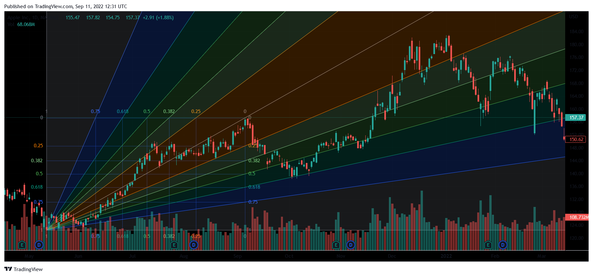

In the fast-paced world of trading, gaining a competitive edge can make all the difference in achieving profitability. As financial markets continue to evolve, traders seek innovative techniques and strategies to stay ahead. This article explores some of the most effective trading methodologies, specifically focusing on Fibonacci trading and algorithmic trading. These approaches have captured the interest of traders due to their potential to enhance trading outcomes through the integration of mathematical analysis and technological advancements.

Fibonacci trading relies on a mathematical sequence by Leonardo Fibonacci, where each number is the sum of the two preceding ones. This sequence is fundamental in identifying potential support and resistance levels within the financial markets. Traders use Fibonacci retracement and extension levels to make informed decisions about when to enter or exit trades, leveraging patterns that may indicate future price movements.



Conversely, algorithmic trading employs sophisticated computer programs to automate trade execution based on predefined criteria. This technique maximizes speed and precision, optimizing complex trading strategies and allowing traders to capitalize on market opportunities that may be missed through manual processes. By incorporating backtesting and real-time data analysis, algorithmic trading has become a cornerstone of modern trading strategies.

The aim of this article is to provide traders with insights into these methodologies, enabling them to refine their strategies and optimize their trading approach for enhanced profitability.

## Table of Contents

## Understanding Fibonacci Trading

Fibonacci trading is based on a mathematical concept introduced by Leonardo Fibonacci, a renowned mathematician from the 13th century. At the heart of this trading methodology is the Fibonacci sequence, a series of numbers where each number is the sum of the two preceding ones, typically starting with 0 and 1. The sequence is: 0, 1, 1, 2, 3, 5, 8, 13, and so on. This sequence gives rise to the Fibonacci ratios used in trading, such as 23.6%, 38.2%, 50%, 61.8%, and 100%, important for identifying potential price levels.

In trading, these Fibonacci ratios are used to determine support and resistance levels, which are critical concepts in technical analysis. Support levels indicate a point where a security's price may stop falling and begin to rise, while resistance levels indicate an area where the price may stop rising and start falling. 

Traders apply Fibonacci retracement levels to deduce potential reversal points by measuring the distance between two extreme points on a price chart, usually a peak and a trough. Retracements are then plotted in percentages of this range, with the 38.2% and 61.8% levels often considered significant reversal points. For example, a trader looking to buy a security might wait until the price pulls back to a 38.2% or 61.8% retracement level before placing a buy order. 

Fibonacci extensions, another crucial aspect, are used to estimate potential price targets and levels beyond the known support or resistance, based on previous price movements. The common extension levels include 161.8%, 261.8%, and 423.6%. For example, after the price has retraced to a significant Fibonacci level, it may continue to move in the direction of the primary trend to reach these extension levels.

Traders leverage these retracement and extension levels to strategically enter or [exit](/wiki/exit-strategy) trades, aiming for more informed and effective decision-making. By employing Fibonacci techniques, traders can better anticipate market changes, ultimately enhancing their ability to capture profitable opportunities.

## Strategies Using Fibonacci Levels

Fibonacci levels are a critical component of technical analysis, utilized by traders to make informed decisions based on historical price movements. Two notable strategies within this framework are the Fibonacci Flush and the Parabola Pop. These techniques highlight how Fibonacci retracement levels can be integrated into trading strategies for identifying potential opportunities in the market.

The Fibonacci Flush strategy is centered on the premise of identifying support and resistance levels that align with Fibonacci retracement points. Traders implementing this strategy focus on the retracement levels, commonly set at 23.6%, 38.2%, 50%, 61.8%, and 78.6%, to anticipate possible price reversals or continuations. By analyzing price action as it approaches these levels, traders can determine optimal entry and exit points for trades. For example, when a price retraces to a Fibonacci level and stalls, showing signs of resistance or support, traders might consider that point as a cue to enter a trade. This technique plays a pivotal role in managing risk, as it allows for setting stop-loss orders just beyond the retracement level, offering a favorable risk-reward ratio.

Conversely, the Parabola Pop strategy exploits breakouts at Fibonacci retracement levels, particularly for traders seeking early entry points into trending markets. This approach involves monitoring price action for a decisive [breakout](/wiki/breakout-trading) beyond a Fibonacci level, which can indicate a robust trend continuation. When a price sharply breaks through a retracement level, traders might interpret it as a confirmation of market [momentum](/wiki/momentum), prompting an entry. This method can be particularly advantageous in capturing the early phases of strong trends, allowing traders to capitalize on extended price movements.

Both the Fibonacci Flush and Parabola Pop exemplify the adaptability of Fibonacci tools in detecting potential price movements. By leveraging historical data and recognizing patterns at Fibonacci levels, traders can refine their analysis and improve the precision of their trading strategies.

## Algorithmic Trading: Automation for Precision

Algorithmic trading, often referred to as algo trading, leverages technology to automate trading activities by executing buy and sell orders at precise moments determined by predefined criteria. This automation enhances trading efficiency by introducing speed and precision unreachable by human capabilities, making it a critical strategy in modern financial markets.

By employing computer algorithms, traders can exploit slight market inefficiencies through rapid trades. Algorithms follow detailed instructions, allowing transactions to occur in milliseconds — a speed that significantly reduces the latency from signal to execution. This near-instantaneous reaction to market changes enables traders to capitalize on short-lived opportunities that manual trading would likely miss.

Algorithmic trading is not only about execution speed but also about the capacity to handle complex strategies. For instance, high-frequency trading ([HFT](/wiki/high-frequency-trading-strategies)) strategies, which execute massive volumes of orders at lightning speed, rely heavily on [algorithmic trading](/wiki/algorithmic-trading). These strategies would be impossible to implement manually due to their complexity and the [volume](/wiki/volume-trading-strategy) of data they process.

A crucial component of successful algorithmic trading is [backtesting](/wiki/backtesting), which involves modeling algorithms against historical data to evaluate their performance. Accurate backtesting helps traders understand potential risks and rewards of a trading strategy before committing real capital. Python, with its extensive libraries like Pandas and NumPy, is widely used for backtesting and analyzing trading strategies:

```python
import pandas as pd
import numpy as np

def backtest_strategy(data, strategy):
    results = []
    for i in range(1, len(data)):
        result = strategy(data[i-1], data[i])
        results.append(result)
    return np.mean(results)

# Example strategy: Moving average crossover
def moving_average_crossover(prev, current):
    short_avg = prev['Close'].rolling(window=10).mean()
    long_avg = prev['Close'].rolling(window=50).mean()
    if short_avg > long_avg:
        return (current['Close'] - prev['Close']) / prev['Close']
    else:
        return 0

data = pd.read_csv('historical_data.csv')
performance = backtest_strategy(data, moving_average_crossover)
print(f'Average return: {performance}')
```

Optimizing algorithms is another critical aspect where [machine learning](/wiki/machine-learning) can also play a role, by enhancing predictive models and generating more robust rulesets for trading. Such optimizations ensure that trading strategies remain effective even as market conditions evolve.

Moreover, algorithmic trading thrives on real-time data. Access to live data feeds permits algorithms to react instantly to market changes, providing up-to-the-minute analysis of market trends and enabling strategic decision-making based on current information. This real-time processing assures that trading decisions leverage the freshest possible market information.

In conclusion, algorithmic trading is a vital tool for modern traders seeking efficiency and precision. By automating the trade execution process and enabling sophisticated strategies through backtesting and real-time data utilization, algorithmic trading offers a refined approach to maximizing trading outcomes.

## Combining Fibonacci and Algorithmic Trading

Integrating Fibonacci retracement levels into algorithmic trading frameworks offers traders a potent method to automate and refine their decision-making processes. This strategic integration allows for the combination of historical mathematical analysis and modern computational power, enabling traders to execute trades with precision and confidence.

Fibonacci retracement levels are derived from the Fibonacci sequence, with key levels such as 23.6%, 38.2%, 50%, 61.8%, and 100%. These levels help identify potential reversal points in the market, serving as predictive indicators of where price corrections might occur. Incorporating these levels into algorithmic trading involves coding these indicators into algorithms that can assess market data in real time.

A Python implementation might involve using popular libraries like Pandas and NumPy to handle data and calculations, alongside a trading API for executing trades. Example code to calculate Fibonacci retracement levels might resemble the following:

```python
import pandas as pd
import numpy as np

def calculate_fibonacci_retracement(prices):
    max_price = np.max(prices)
    min_price = np.min(prices)
    diff = max_price - min_price

    levels = {
        'level_23.6': max_price - 0.236 * diff,
        'level_38.2': max_price - 0.382 * diff,
        'level_50': max_price - 0.5 * diff,
        'level_61.8': max_price - 0.618 * diff
    }
    return levels

# Example usage
prices = pd.Series([...])  # Replace with actual price data
fib_levels = calculate_fibonacci_retracement(prices)
```

Once these levels are identified, they can be integrated into trading algorithms to create buy or sell signals. For instance, an algorithm may automatically place a buy order when prices approach a 50% retracement level and a sell order when the price nears the 61.8% retracement level.

The true strength of combining Fibonacci retracement with algorithmic trading lies in the automation and accuracy it affords. These algorithms can be backtested against historical data to assess their effectiveness and further optimized to suit different market conditions. This iterative process of refining algorithms based on Fibonacci levels enables the adaptation of trading strategies to dynamic market environments.

Moreover, traders can employ machine learning models to enhance these algorithms, training them with historical data to fine-tune prediction accuracy. Algorithmic trading platforms can thus integrate Fibonacci-based strategies with sophisticated machine learning techniques, using models like regression analysis or neural networks to predict pricing movements with higher precision.

In conclusion, the fusion of Fibonacci retracement levels and algorithmic trading forms a robust approach to maximize trading profitability. By leveraging the predictive power of Fibonacci indicators through automated systems, traders can navigate the complexities of financial markets with enhanced strategic capability.

## Final Notes

Efficient trading strategies often involve a blend of traditional analysis methods and modern technologies, creating a comprehensive approach that can adapt to various market conditions. Fibonacci analysis, with its roots in the mathematical sequence identified by Leonardo Fibonacci, offers traders a way to predict potential support and resistance levels. This technique allows for better timing of market entries and exits by predicting where price movements might stall or reverse.

On the other hand, algorithmic trading introduces the precision and efficiency of technology into trading. By automating buy and sell orders based on predefined criteria, traders can react to market changes quicker than manual processes allow. Algorithms can process vast amounts of data and execute complex strategies with minimal delay, which is essential in the fast-moving trading environment.

The combination of Fibonacci analysis and algorithmic trading provides traders with a robust framework. By integrating Fibonacci retracement levels into algorithmic strategies, traders can automate decisions based on reliable mathematical models. This integration can be achieved by incorporating Fibonacci levels into the code, guiding the algorithm to make trades at calculated points of market resistance or support.

```python
def calculate_fibonacci_levels(price_low, price_high):
    """Calculate Fibonacci retracement levels."""
    diff = price_high - price_low
    levels = {
        "23.6%": price_high - 0.236 * diff,
        "38.2%": price_high - 0.382 * diff,
        "50%": price_high - 0.5 * diff,
        "61.8%": price_high - 0.618 * diff
    }
    return levels
```

This synthesis of traditional and modern techniques allows traders to better anticipate market movements. By mastering these two approaches, traders can tailor their strategies to suit individual trading styles, leading to optimized and potentially more profitable trading outcomes. As market conditions evolve, the ability to adapt through a mixture of these methodologies can be a significant advantage, enhancing the trader's ability to capitalize on market opportunities effectively.

## References & Further Reading

[1]: Bergstra, J., Bardenet, R., Bengio, Y., & Kégl, B. (2011). ["Algorithms for Hyper-Parameter Optimization."](https://dl.acm.org/doi/10.5555/2986459.2986743) Advances in Neural Information Processing Systems 24.

[2]: ["Advances in Financial Machine Learning"](https://www.amazon.com/Advances-Financial-Machine-Learning-Marcos/dp/1119482089) by Marcos Lopez de Prado

[3]: ["Evidence-Based Technical Analysis: Applying the Scientific Method and Statistical Inference to Trading Signals"](https://www.amazon.com/Evidence-Based-Technical-Analysis-Scientific-Statistical/dp/0470008741) by David Aronson

[4]: ["Machine Learning for Algorithmic Trading"](https://github.com/stefan-jansen/machine-learning-for-trading) by Stefan Jansen

[5]: ["Quantitative Trading: How to Build Your Own Algorithmic Trading Business"](https://www.amazon.com/Quantitative-Trading-Build-Algorithmic-Business/dp/1119800064) by Ernest P. Chan