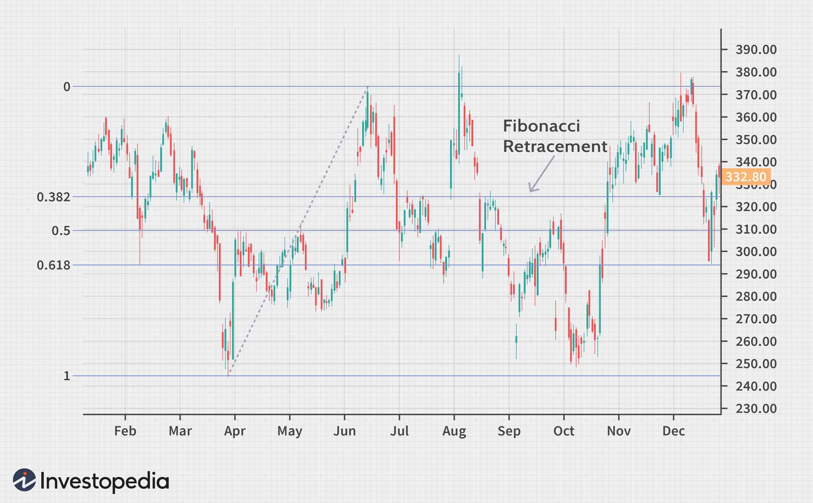

## Table of Contents

## What are Fibonacci numbers and how are they used in trading?

Fibonacci numbers are a sequence of numbers where each number is the sum of the two numbers that come before it. It starts with 0 and 1, so the sequence goes like this: 0, 1, 1, 2, 3, 5, 8, 13, and so on. These numbers are named after Leonardo Fibonacci, who introduced them to the Western world. People find them interesting because they appear in nature, like in the arrangement of leaves on a stem or the pattern of seeds in a sunflower.

In trading, Fibonacci numbers are used to predict where the price of a stock or other asset might go next. Traders use something called Fibonacci retracement levels, which are based on ratios derived from the Fibonacci sequence. These levels help traders guess where the price might pull back to before it continues in the original direction. For example, if a stock price goes up and then starts to fall, a trader might use Fibonacci levels to decide where to buy the stock, hoping it will go up again. It's not a perfect method, but many traders find it helpful.

## What is a moving average and why is it important in technical analysis?

A moving average is a tool that traders use to smooth out price data over a certain period of time. It's like taking the average price of a stock over the last few days, weeks, or months. By doing this, it helps to show the overall direction of the price, making it easier to see trends without getting distracted by small ups and downs.

In technical analysis, moving averages are important because they help traders make decisions about when to buy or sell. For example, if a short-term moving average crosses above a long-term moving average, it might be a signal that the price is going to go up, which could be a good time to buy. On the other hand, if the short-term average crosses below the long-term average, it might mean the price is going to go down, suggesting it could be a good time to sell. This way, moving averages help traders see the bigger picture and make more informed choices.

## How do Fibonacci Moving Averages differ from traditional moving averages?

Fibonacci Moving Averages are a special kind of moving average that use numbers from the Fibonacci sequence. In regular moving averages, you might use the average price over a set number of days, like 10 or 20. But with Fibonacci Moving Averages, you pick time periods that are based on Fibonacci numbers, like 5, 8, 13, or 21 days. This is because some traders believe that these numbers can help them find important trends in the market better than other numbers.

The main difference between Fibonacci Moving Averages and traditional moving averages is the choice of time periods. While traditional moving averages can use any number of days, Fibonacci Moving Averages stick to the Fibonacci numbers. This can change how the moving average line looks on a chart and might help traders spot trends or reversals that they might miss with regular moving averages. Both types of moving averages help smooth out price data, but the Fibonacci version adds an extra layer of number magic that some traders find useful.

## What are the common Fibonacci levels used in calculating Fibonacci Moving Averages?

When using Fibonacci Moving Averages, traders often pick time periods based on common Fibonacci numbers. These numbers are 5, 8, 13, 21, 34, 55, and 89. Each of these numbers is the sum of the two numbers before it, following the Fibonacci sequence. By using these specific time periods, traders hope to find important patterns in the price movements of stocks or other assets.

The reason traders use these particular numbers is that they believe the Fibonacci sequence has a special connection to how markets move. They think these numbers can help them see trends or turning points in the market more clearly than other numbers. So, instead of using random numbers for their moving averages, they stick to these Fibonacci numbers to try and get an edge in their trading.

## How do you calculate a Fibonacci Moving Average?

To calculate a Fibonacci Moving Average, you start by [picking](/wiki/asset-class-picking) a time period from the Fibonacci sequence. Common choices are 5, 8, 13, 21, 34, 55, or 89 days. Let's say you pick 13 days. Then, you take the closing prices of the stock or asset for the last 13 days and add them up. After that, you divide the total by 13 to find the average price over those 13 days. This gives you one point on your Fibonacci Moving Average line.

You repeat this process every day, always using the most recent 13 days. So, the next day, you drop the oldest price and add the newest one, then calculate the new average. As you keep doing this, you build a line on your chart that shows the average price over the last 13 days, updated daily. This line helps you see the overall direction of the price without getting distracted by small ups and downs. By using Fibonacci numbers for the time period, some traders believe they can spot important trends or turning points in the market more easily.

## What are the advantages of using Fibonacci Moving Averages over standard moving averages?

Fibonacci Moving Averages can help traders spot important trends or turning points in the market better than standard moving averages. This is because they use special numbers from the Fibonacci sequence, like 5, 8, 13, or 21 days, instead of random numbers. Some traders believe these numbers have a special connection to how markets move, so using them might help them see patterns that they might miss with regular moving averages.

Another advantage is that Fibonacci Moving Averages can make it easier for traders to make decisions. When traders see the moving average line based on Fibonacci numbers, they might feel more confident about when to buy or sell. This is because the Fibonacci sequence is thought to be linked to nature and other patterns, so traders might trust these numbers more than others. Even though it's not a perfect method, many traders find that using Fibonacci Moving Averages helps them understand the market better.

## Can Fibonacci Moving Averages be used for any trading instrument?

Yes, Fibonacci Moving Averages can be used for any trading instrument, like stocks, [forex](/wiki/forex-system), commodities, or cryptocurrencies. They help traders see the overall direction of the price over time, no matter what they are trading. By using numbers from the Fibonacci sequence, traders hope to spot important trends or turning points in the market more easily.

Even though Fibonacci Moving Averages are popular, they are not perfect. They work best when used with other tools and methods to make trading decisions. But because they can be applied to any trading instrument, many traders find them useful for understanding how prices are moving and making better choices about when to buy or sell.

## How can Fibonacci Moving Averages help in identifying trend reversals?

Fibonacci Moving Averages can help traders spot when a trend might be turning around. They do this by using special numbers from the Fibonacci sequence, like 5, 8, 13, or 21 days, to calculate the average price over time. When the price of a stock or another asset starts moving in the opposite direction of the Fibonacci Moving Average line, it could be a sign that the trend is changing. For example, if the price was going up but then starts to go below the moving average line, it might mean the trend is about to reverse and start going down.

Traders often look at how the price interacts with the Fibonacci Moving Average line to make decisions. If the price crosses the line and keeps moving away from it, that's a strong hint that a trend reversal is happening. By watching these moving averages, traders can get an early warning that the market might be changing direction, which can help them decide when to buy or sell. Even though it's not a perfect method, using Fibonacci Moving Averages can give traders a useful tool to spot trend reversals and make better trading choices.

## What are some common trading strategies that incorporate Fibonacci Moving Averages?

One common trading strategy that uses Fibonacci Moving Averages is the crossover strategy. In this strategy, traders watch for when a short-term Fibonacci Moving Average, like one based on 8 days, crosses over a longer-term one, like one based on 21 days. If the short-term average moves above the long-term average, it might be a good time to buy because it suggests the price could go up. On the other hand, if the short-term average moves below the long-term average, it might be a good time to sell because it suggests the price could go down. By using Fibonacci numbers, traders hope to spot these crossovers more accurately and make better trading decisions.

Another strategy is using Fibonacci Moving Averages to find support and resistance levels. Traders look at where the price of a stock or asset touches or bounces off the Fibonacci Moving Average line. If the price keeps bouncing off the line without breaking through it, that line can act as a support level if the price is going up, or a resistance level if the price is going down. When the price finally breaks through the line, it might be a sign that the trend is changing. Traders use this information to decide when to enter or [exit](/wiki/exit-strategy) trades, hoping to catch the start of a new trend or avoid losses when a trend reverses.

## How do you optimize the parameters of Fibonacci Moving Averages for different market conditions?

Optimizing the parameters of Fibonacci Moving Averages means choosing the right Fibonacci numbers to use for different market conditions. In a fast-moving market, where prices change quickly, traders might use shorter time periods like 5 or 8 days. This helps them react faster to changes in the market. On the other hand, in a slower-moving market, where prices don't change as quickly, traders might use longer time periods like 21 or 34 days. This helps them see the bigger trends without getting distracted by small ups and downs. By trying out different Fibonacci numbers, traders can find the ones that work best for the current market conditions.

Traders also need to keep an eye on how well their chosen Fibonacci Moving Averages are working. If the market starts to change, like becoming more volatile or calming down, they might need to adjust their parameters. For example, if the market gets more volatile, a trader might switch from using a 13-day moving average to an 8-day one to stay on top of the rapid price changes. By regularly testing and adjusting the Fibonacci numbers they use, traders can make sure their moving averages stay helpful and accurate for making trading decisions.

## What are the limitations and potential pitfalls of using Fibonacci Moving Averages?

Using Fibonacci Moving Averages can have some limitations. One big problem is that they can give false signals. Sometimes, the price might cross over the moving average line, making it look like the trend is changing, but then it goes right back to where it was. This can trick traders into making bad choices, like buying or selling at the wrong time. Also, Fibonacci Moving Averages are based on past prices, so they can be slow to catch up with what's happening right now in the market. This means traders might miss out on quick changes in the market if they rely too much on these averages.

Another potential pitfall is that Fibonacci Moving Averages might not work well in all kinds of markets. They can be more useful in markets that move in clear trends, but in markets that jump around a lot, they might not help much. Traders also need to be careful not to depend only on Fibonacci Moving Averages. They work best when used with other tools and methods, like looking at the overall market or using other types of moving averages. If traders use them by themselves, they might miss important information and make worse trading decisions.

## How can Fibonacci Moving Averages be combined with other technical indicators for enhanced analysis?

Fibonacci Moving Averages can be used together with other technical indicators to make better trading decisions. One popular way to do this is by using them with the Relative Strength Index (RSI). The RSI helps traders see if a stock or asset is overbought or oversold. If the RSI shows that a stock is overbought and the price is moving away from the Fibonacci Moving Average, it might be a good time to sell. On the other hand, if the RSI shows the stock is oversold and the price is moving back toward the Fibonacci Moving Average, it might be a good time to buy. By looking at both the Fibonacci Moving Average and the RSI, traders can get a clearer picture of what's happening in the market.

Another useful combination is using Fibonacci Moving Averages with the Moving Average Convergence Divergence (MACD). The MACD helps traders see the strength and direction of a trend. When the MACD line crosses above the signal line, it can be a buy signal, and when it crosses below, it can be a sell signal. By watching how the price interacts with the Fibonacci Moving Average at the same time, traders can confirm these signals. For example, if the MACD gives a buy signal and the price is moving above the Fibonacci Moving Average, it adds more confidence to the decision to buy. Using these two indicators together can help traders spot good trading opportunities and avoid making mistakes based on just one piece of information.

## What is the Fibonacci Moving Average?

The Fibonacci Moving Average (FMA) incorporates the Fibonacci sequence into the calculation of exponential moving averages (EMAs), creating a nuanced tool for technical analysis. Unlike traditional moving averages that utilize fixed lookback periods, the FMA uses periods derived from Fibonacci numbers, such as 5, 8, 13, 21, and so forth. This approach aims to identify significant points of support and resistance, especially over long-term trends.

The Fibonacci sequence begins with 0 and 1, with each subsequent number being the sum of the two preceding ones. This sequence is foundational in mathematics, often associated with naturally occurring patterns. In the context of FMAs, these numbers become lookback periods, adapting traditional moving average calculations to potentially more relevant market cycles.

A standard EMA is computed using the formula:

$$
\text{EMA} = (\text{K} \times (\text{C} - \text{P})) + \text{P}
$$

where:
- $\text{K}$ is the smoothing constant, calculated as $\frac{2}{n+1}$, with $n$ being the lookback period,
- $\text{C}$ is the current price, and
- $\text{P}$ is the previous EMA value.

By selecting Fibonacci numbers as values for $n$, the Fibonacci Moving Average fine-tunes moments where price reactions are more statistically significant than those highlighted by classical moving averages. This methodology makes the FMA particularly useful for trend-following strategies, as it tends to align with natural cyclical patterns, thus uncovering potential reversal points and enduring trends not as easily detected by regular moving averages.

In summary, the FMA distinguishes itself by employing the Fibonacci sequence to set its parameters, providing a different lens through which traders can evaluate market dynamics, emphasizing on long-term price movement continuations and reversals at pivotal support and resistance levels.

## How do you calculate a Fibonacci Moving Average?

To calculate a Fibonacci Moving Average (FMA), it is essential to understand both the Fibonacci sequence and the formula for an Exponential Moving Average (EMA). The Fibonacci sequence begins with the numbers 0, 1, and continues by adding the two most recent numbers to generate the next (e.g., 0, 1, 1, 2, 3, 5, 8, and so forth). These numbers serve as the lookback periods for calculating the FMA.

The Exponential Moving Average is a weighted moving average that gives more significance to recent prices. It is formulated as:

$$
\text{EMA} = (K \times (C - P)) + P
$$

where:
- $C$ is the current price,
- $P$ is the previous EMA value,
- $K$ is the smoothing constant, calculated as $\frac{2}{n+1}$, with $n$ being the number of periods (a Fibonacci number in the case of FMA).

To compute the Fibonacci Moving Average, select a series of Fibonacci numbers as lookback periods. For example, using 5, 8, and 13, one can calculate EMAs over these periods. Here is a simplified Python code snippet to calculate an FMA using selected Fibonacci numbers as lookback periods:

```python
def calculate_ema(prices, period):
    ema = [sum(prices[:period]) / period]  # Simple average for the first EMA
    multiplier = 2 / (period + 1)

    for price in prices[period:]:
        ema.append((price - ema[-1]) * multiplier + ema[-1])

    return ema

def fibonacci_moving_average(prices, fibonacci_periods):
    fma = {}
    for period in fibonacci_periods:
        fma[period] = calculate_ema(prices, period)

    return fma

# Example usage:
prices = [10, 11, 13, 12, 15, 14, 16, 18, 20, 19, 18, 17, 15]
fibonacci_periods = [5, 8, 13]
fma = fibonacci_moving_average(prices, fibonacci_periods)
```

This function `calculate_ema()` determines the EMA for a defined period, initiating with a simple average of the first 'period' number of prices. The `fibonacci_moving_average()` function then calculates the EMAs for each of the specified Fibonacci periods, providing key insights into support and resistance levels when analyzed over high and low price data. This approach enables traders to integrate Fibonacci Moving Averages into their strategy for more nuanced trend analysis.

## References & Further Reading

[1]: ["Fibonacci and Lucas Numbers with Applications"](https://onlinelibrary.wiley.com/doi/book/10.1002/9781118033067) by Thomas Koshy

[2]: Hurst, L. (2015). ["Fibonacci Trading: How to Master the Time and Price Advantage."](https://books.google.com/books/about/Fibonacci_Trading_How_to_Master_the_Time.html?id=raWcnlo6d-oC) Wiley Trading.

[3]: Gann, W.D. (1949). ["45 Years in Wall Street"](https://books.google.com/books/about/45_Years_In_Wall_Street.html?id=EiqbDAAAQBAJ).

[4]: Pring, M.J. (2002). ["Technical Analysis Explained: The Successful Investor's Guide to Spotting Investment Trends and Turning Points."](https://www.amazon.com/Technical-Analysis-Explained-Fifth-Successful/dp/0071825177) McGraw-Hill.

[5]: Colby, R.W., & Meyers, T.A. (2000). ["The Encyclopedia of Technical Market Indicators, Second Edition."](https://www.amazon.com/Encyclopedia-Technical-Market-Indicators-Second/dp/0070120579) McGraw-Hill Education.

[6]: Baumohl, B. (2012). ["The Secrets of Economic Indicators: Hidden Clues to Future Economic Trends and Investment Opportunities"](https://www.amazon.com/Secrets-Economic-Indicators-Investment-Opportunities/dp/0132932075) Pearson FT Press.