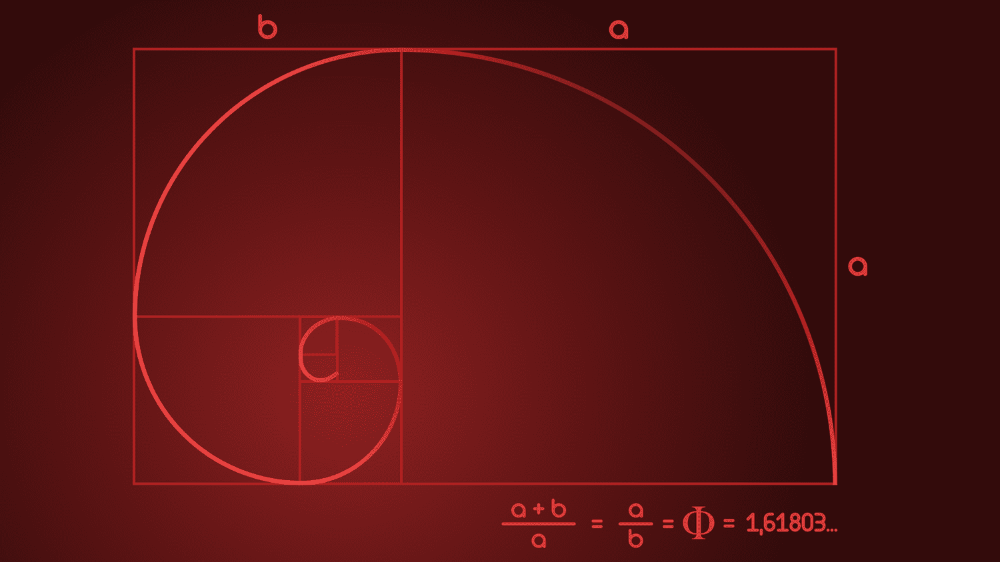

Fibonacci numbers, initially introduced by the Italian mathematician Leonardo of Pisa, known as Fibonacci, capture a unique intersection between mathematics and natural phenomena. Originating from a simple sequence beginning with 0 and 1, each subsequent number is derived as the sum of the two preceding numbers. This sequence not only unveils intrinsic mathematical beauty but also mirrors patterns found in nature, such as the arrangement of leaves and the branching of trees, underscoring its widespread significance.

In the financial sector, particularly in algorithmic trading, Fibonacci numbers have emerged as a compelling tool for predicting market behavior. As traders continuously seek more robust methodologies to forecast price movements, the historical patterns and natural sequences offered by Fibonacci numbers present potential insights. These numbers are utilized to identify critical levels of support and resistance, helping traders to understand and anticipate market fluctuations.



By integrating Fibonacci numbers into trading algorithms, financial analysts attempt to harness the recurring patterns these numbers suggest. This article will explore the dual role of Fibonacci numbers: not only as a research tool for mathematical models but also as a practical application in refining algorithmic trading strategies. Through the lens of both mathematical theory and financial practice, Fibonacci numbers demonstrate their versatile applicability across diverse domains.

## Table of Contents

## Understanding Fibonacci Numbers

The Fibonacci sequence is a series of numbers where each number is the sum of the two preceding ones, typically starting with 0 and 1. Mathematically, it can be represented as:

$$
F(n) = F(n-1) + F(n-2)
$$

where $F(0) = 0$ and $F(1) = 1$. This sequence progresses as 0, 1, 1, 2, 3, 5, 8, 13, 21, and so forth.

A vital aspect of the Fibonacci sequence is its connection to the golden ratio, often denoted by the Greek letter $\phi$ (phi). The golden ratio is an irrational number approximately equal to 1.618033988749895. As Fibonacci numbers increase, the ratio of consecutive terms tends to converge to the golden ratio. This can be expressed as:

$$
\lim_{n \to \infty} \frac{F(n+1)}{F(n)} = \phi
$$

The golden ratio and Fibonacci numbers are frequently observed in various areas, underscoring their importance beyond mathematics. In architecture, the Parthenon and other ancient structures exhibit proportions that approximate the golden ratio, creating an aesthetically pleasing balance. Artists have also employed the golden ratio to achieve harmony and balance in their compositions, as seen in works by Leonardo da Vinci and others.

Nature showcases Fibonacci numbers through the arrangement of leaves, the branching of trees, and the spirals of shells and galaxies. For example, the arrangement of seeds in a sunflower often follows a Fibonacci pattern, maximizing packing efficiency. In finance, Fibonacci numbers are instrumental in technical analysis, aiding in predicting trends and price movements.

Therefore, Fibonacci numbers and the golden ratio are far more than mathematical curiosities—they serve as key elements in diverse fields, illustrating the inherent connection between mathematics and the world around us.

## Fibonacci Numbers in Mathematics

Fibonacci numbers, represented by the sequence $F_0 = 0, F_1 = 1, F_2 = 1, F_3 = 2, \ldots$, continue with $F_n = F_{n-1} + F_{n-2}$. This sequence's fundamental property is its recursive nature, where each number is generated by summing the preceding two. Among its significant mathematical connections is the relationship with the golden ratio, $\phi$, approximately equal to 1.618. 

The limit of the ratio of consecutive Fibonacci numbers approaches the golden ratio: 
$$

\lim_{n \to \infty} \frac{F_{n+1}}{F_n} = \phi 
$$
This convergence explains why the golden ratio frequently appears alongside Fibonacci numbers across various disciplines such as biology and architecture.

Fibonacci numbers also intersect with Pascal's triangle, notable for its binomial coefficients. Observing diagonals of Pascal's triangle reveals sums of Fibonacci numbers. Moreover, Fibonacci numbers satisfy the following binomial coefficient identity:
$$

F_{n} = \sum_{k=0}^{\lfloor (n-1)/2 \rfloor} \binom{n-k-1}{k} 
$$
indicating their appearance in combinatorial contexts and sequence relations.

Moreover, Fibonacci numbers feature prominently in complex mathematical models and theorems. For example, they are utilized in the investigation of integer sequences and their applications in approximations and series expansions. In particular, combinatorial identities, graph theory, and number theory often reference Fibonacci numbers to uncover deeper mathematical structures and patterns. This underscores their intrinsic value in both theoretical and applied mathematical research, offering a tool for analyzing naturally occurring sequences and abstract mathematical problems.

## Algorithmic Trading Overview

Algorithmic trading, commonly known as algo trading, utilizes computer programs to execute financial trades based on specific strategies. These strategies are pre-defined and often incorporate a range of technical indicators, historical data analysis, and complex mathematical models. The core advantage of [algorithmic trading](/wiki/algorithmic-trading) is its ability to process vast quantities of data at speeds unattainable by human traders, thereby optimizing trade execution and maximizing potential gains.

Technical indicators form a critical component of algorithmic trading. These indicators help traders identify market trends and make informed decisions. Popular indicators include moving averages, relative strength index (RSI), and Bollinger Bands, among others. These are mathematical calculations that are applied to price or [volume](/wiki/volume-trading-strategy) data, enabling the identification of buy and sell signals.

Historical data analysis is another essential facet of algo trading. By examining past market data, such as price movements and trading volumes, traders can identify patterns and trends that may recur in the future. This analysis often involves statistical methods and [machine learning](/wiki/machine-learning) techniques to predict future price movements with greater accuracy.

Mathematical models play a pivotal role in formulating strategies within algorithmic trading. These models take into account a host of variables, including market [volatility](/wiki/volatility-trading-strategies), asset correlations, and risk management parameters. One such mathematical concept increasingly adopted by traders is the Fibonacci retracement. This tool is based on the Fibonacci sequence, a series of numbers where each term is the sum of the two preceding ones, leading to ratios such as 23.6%, 38.2%, and 61.8% that are used to identify potential support and resistance levels in asset prices.

Here is a simple example illustrating how a Fibonacci retracement might be integrated into a trading algorithm using Python:

```python
import numpy as np

def fibonacci_retracement_levels(price_high, price_low):
    # Fibonacci retracement ratios
    ratios = [0.236, 0.382, 0.5, 0.618]

    # Calculate differences
    price_difference = price_high - price_low

    # Compute retracement levels
    retracements = [price_high - r * price_difference for r in ratios]

    return retracements

# Example usage
high_price = 150.0
low_price = 120.0
levels = fibonacci_retracement_levels(high_price, low_price)
print("Fibonacci retracement levels:", levels)
```

This hypothetical function calculates various Fibonacci retracement levels between a defined high and low price of an asset, helping identify potential price points where the asset might encounter support or resistance.

Overall, the integration of techniques and tools within algorithmic trading allows for more nuanced and adaptable strategies, aligning market predictions closely with comprehensive data analysis and mathematical insights. As algorithmic models continue to evolve, they promise to further enrich traders' ability to predict and respond to market conditions.

## Fibonacci Numbers in Algorithmic Trading

Fibonacci retracement levels play a crucial role in the dynamics of algorithmic trading by helping traders identify potential support and resistance points in price charts. These retracement levels are derived from key Fibonacci ratios: 23.6%, 38.2%, 50%, and 61.8%. The widespread use of these ratios is grounded in the observation that financial markets often experience price retracement levels consistent with these percentages after a significant movement in price. This can provide traders with a framework for predicting possible reversals or continuations in market trends.

In practice, traders employ Fibonacci tools to enhance the precision of their trades, primarily by strategically determining entry and [exit](/wiki/exit-strategy) points. A common strategy involves plotting Fibonacci retracement levels between two significant price points, such as a recent high and low. Once the levels are defined, the market price tends to react by forming temporary support (price level where a downtrend was halted due to buying interest) or resistance (price level where an uptrend stalled due to selling interest) at these levels.

For example, if a stock price moves from $100 (low) to $150 (high), drawing a Fibonacci retracement might involve the Python code:

```python
# Python example of calculating Fibonacci retracement levels

def calculate_retracement_levels(high, low):
    difference = high - low
    return {
        '23.6%': high - difference * 0.236,
        '38.2%': high - difference * 0.382,
        '50.0%': high - difference * 0.500,
        '61.8%': high - difference * 0.618
    }

high_price = 150
low_price = 100

retracement_levels = calculate_retracement_levels(high_price, low_price)
print(retracement_levels)
```

This script would yield the following retracement levels:

- 23.6%: $138.20
- 38.2%: $130.90
- 50.0%: $125.00
- 61.8%: $119.10

These levels offer actionable insights, helping traders anticipate and react to market movements. While useful on their own, Fibonacci retracement levels gain enhanced accuracy and significance when combined with other technical indicators, such as moving averages, MACD, or RSI. By corroborating signals from various indicators, traders can make informed decisions, optimizing their strategies and potentially increasing their profitability.

In summary, Fibonacci numbers provide valuable tools in algorithmic trading, aiding in the anticipation of market price movements through calculated support and resistance levels. However, for effective and reliable trading outcomes, these tools should be integrated with complementary indicators and strategies.

## Fibonacci Tools in Trading Platforms

Many trading platforms, including widely used ones like MetaTrader, integrate tools based on Fibonacci numbers. These tools, such as Fibonacci retracements, arcs, fans, and extensions, are integral to technical analysis and strategic decision-making in trading.

**Fibonacci Retracements** are perhaps the most frequently used tool. They are derived from horizontal lines that indicate potential support and resistance levels. These levels are based on Fibonacci ratios: 23.6%, 38.2%, 50%, and 61.8%. These percentages are calculated from plotting points in a price chart, determining where reversals might potentially occur following a significant price change. They are essential in identifying the vertical support and resistance combination, where traders hypothesize that a retracement will occur before the trend continues.

**Fibonacci Arcs** are circular overlays that can enrich the trader's understanding of support and resistance levels. They consist of three arcs drawn from a baseline at 38.2%, 50%, and 61.8%. Traders use them to anticipate areas of support and resistance as price levels evolve over time, taking into account not only price but also time, thus offering a more dynamic analysis angle.

**Fibonacci Fans** involve using diagonal lines based on Fibonacci ratios drawn from a high point to a low point. These fans help traders assess the strength of price movements and possible areas of trend reversal. The fan lines can indicate potential levels where price movements might pause or reverse.

**Fibonacci Extensions** are used for determining price targets in trading trends. Unlike retracements which focus on correction of a price move, extensions focus on continuation, helping traders estimate how far a price is likely to move following a retracement. Extensions are plotted as levels beyond the standard 100% retracement and include 161.8%, 261.8%, and 423.6%, enabling the setting of future support and resistance levels.

The application of these tools aids traders in measuring market trends and predicting potential turning points—critical elements in optimizing trading strategies. The mathematical basis of these Fibonacci tools provides a structured approach to evaluating prospective trading scenarios, ensuring that decisions are backed by historical and numerical analysis rather than mere speculation. As part of a broader strategy, they can significantly enhance the precision of trading decisions when combined with other technical analysis indicators.

## Advantages and Limitations of Fibonacci Numbers in Trading

Fibonacci numbers offer several advantages in trading, most notably their ease of use and the universal applicability across various asset classes and timeframes. Traders appreciate the simplicity of Fibonacci retracement levels, which involve plotting potential support and resistance areas that are derived from Fibonacci ratios like 23.6%, 38.2%, 50%, and 61.8%. These levels require minimal computational effort, making them accessible even to novice traders. Moreover, their adaptability allows them to be employed in different market conditions and with diverse financial instruments, ranging from stocks and commodities to currencies and indices.

However, despite their widespread use, Fibonacci tools come with certain limitations. One significant limitation is the necessity of combining them with other technical indicators for more accurate market analysis. While Fibonacci levels provide potential areas of price reversal or continuation, they do not account for all market variables. As a result, relying solely on Fibonacci levels can lead to misleading signals, especially in highly volatile or trending markets.

Market volatility presents another challenge for Fibonacci-based strategies. In rapidly fluctuating markets, price movements can easily overshoot Fibonacci levels, rendering them less reliable. This necessitates the use of supplementary indicators such as moving averages, trend lines, or oscillators to validate potential reversal points suggested by Fibonacci tools.

Moreover, the subjective nature of selecting swing highs and lows for plotting retracement levels can introduce bias, as different traders might draw these levels differently, leading to varying interpretations and conclusions.

In summary, while Fibonacci numbers and their associated tools offer valuable insights for traders, they should be integrated into a broader analytical framework. By combining them with other technical analysis tools and considering overall market sentiment, traders can enhance their decision-making process and achieve a more balanced assessment of market conditions.

## Conclusion

Fibonacci numbers serve multiple roles, ranging from purely mathematical constructs to practical tools in financial trading. In mathematics, they provide insights into patterns such as the golden ratio and manifest in complex models and theorems. Translated to trading, these numbers help simplify the daunting task of market analysis by providing traders with a structured approach to predict price movements.

In algorithmic trading, Fibonacci numbers augment traders' strategies by enabling accurate market forecasts. By applying Fibonacci retracement levels—derived from key ratios like 23.6%, 38.2%, 50%, and 61.8%—traders can identify potential points of resistance and support within the price charts. This methodology aids in anticipating market behavior, setting entry and exit points, and adjusting strategies as market conditions evolve.

The application of Fibonacci numbers in trading platforms signifies the synergy between mathematical principles and trading algorithms. Utilizing Fibonacci tools within these platforms allows traders to measure trends and predict market shifts, providing strategic advantages in decision-making. However, while these tools offer valuable insights, they should be used in conjunction with other indicators to ensure robust and reliable trading strategies.

In conclusion, the integration of Fibonacci numbers into trading underscores the powerful interplay between natural mathematical phenomena and financial markets, enhancing trading precision through their predictive capabilities. This relationship underscores the adaptability of mathematical concepts to real-world financial scenarios, providing a bridge between abstract theory and empirical application.

## References & Further Reading

[1]: Fibonacci, L. (2002). ["Liber Abaci."](https://archive.org/details/laurence-sigler-fibonaccis-liber-abaci-2003) Translated by Laurence Sigler, Springer.

[2]: Pring, M.J. (2002). ["Technical Analysis Explained."](https://www.amazon.com/Technical-Analysis-Explained-Fifth-Successful/dp/0071825177) McGraw-Hill.

[3]: Frost, A.J., & Prechter, R.R. (2005). ["Elliott Wave Principle: Key to Market Behavior."](https://archive.org/details/elliottwaveprinc0000fros) New Classics Library.

[4]: Tharp, V.K. (2013). ["Trading Beyond the Matrix: The Red Pill for Traders and Investors."](https://vantharpinstitute.com/product/trading-beyond-the-matrix-the-red-pill-for-traders-and-investors/) Wiley.

[5]: Murphy, J.J. (1999). ["Technical Analysis of the Financial Markets: A Comprehensive Guide to Trading Methods and Applications."](https://archive.org/details/technicalanalysi0000murp) New York Institute of Finance.