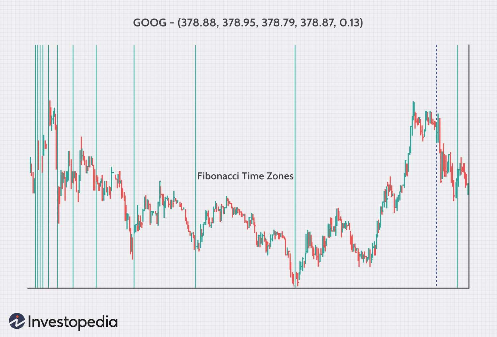

## Table of Contents

## What are Fibonacci numbers and how are they defined?

Fibonacci numbers are a special set of numbers where each number is the sum of the two numbers that come before it. They start with 0 and 1. So, the sequence goes like this: 0, 1, 1, 2, 3, 5, 8, 13, and so on. If you want to find the next number in the sequence, you just add the last two numbers together.

These numbers were first talked about by a man named Leonardo of Pisa, who was also called Fibonacci. He wrote about them in a book he published in the year 1202. People use Fibonacci numbers in many different areas, like math, nature, and even art. For example, you can see patterns that follow the Fibonacci sequence in the way some plants grow their leaves or in the spirals of a pinecone.

## How can Fibonacci numbers be calculated?

You can calculate Fibonacci numbers in a few simple ways. One way is to start with the first two numbers, which are 0 and 1. Then, to get the next number, you just add the last two numbers together. So, after 0 and 1, the next number is 1 (because 0 + 1 = 1). The number after that is 2 (because 1 + 1 = 2). You keep doing this to get more numbers in the sequence.

Another way to calculate Fibonacci numbers is by using a formula. This formula is called Binet's formula. It uses a special number called the golden ratio, which is about 1.618. The formula is a bit tricky, but it helps you find any Fibonacci number directly without having to add up all the numbers before it. If you want to find the nth Fibonacci number, you plug n into the formula, and it gives you the answer. This method is faster if you need a number far along in the sequence.

## What is the significance of Fibonacci numbers in mathematics?

Fibonacci numbers are important in math because they show up in many different places. They are a special sequence where each number is the sum of the two numbers before it, starting with 0 and 1. This pattern is not just interesting; it also helps us understand how things grow and change. For example, in math, Fibonacci numbers can help solve problems about counting and patterns. They are also used in number theory, which is the study of whole numbers and their properties.

Another reason Fibonacci numbers are significant is because they connect to other areas of math, like algebra and geometry. The ratio between numbers in the Fibonacci sequence gets closer and closer to the golden ratio, which is about 1.618. This golden ratio is found in art, architecture, and nature, making Fibonacci numbers a bridge between math and the world around us. By studying Fibonacci numbers, mathematicians can explore and discover new things about how numbers work and how they relate to the patterns we see every day.

## Can you provide examples of Fibonacci numbers in nature?

Fibonacci numbers can be seen in many parts of nature. One place you can find them is in the way some plants grow their leaves. If you look at a plant, you might see that the leaves are arranged in a special pattern. This pattern often follows the Fibonacci sequence. For example, some plants have 3 leaves, some have 5, and others have 8. These numbers are all part of the Fibonacci sequence. This arrangement helps the plant get more sunlight and grow better.

Another example is in the spirals of pinecones and sunflowers. If you count the number of spirals going one way and then the other way, you will often find numbers from the Fibonacci sequence. For instance, a pinecone might have 8 spirals going one way and 13 going the other way. Sunflowers also have seeds arranged in spirals, and the numbers of these spirals are usually Fibonacci numbers. This pattern helps the plant pack as many seeds as possible into a small space.

You can also see Fibonacci numbers in the way some animals grow. For example, the number of petals on a flower often follows the Fibonacci sequence. A lily might have 3 petals, a buttercup might have 5, and some asters might have 13. Even the way some seashells grow follows this pattern. The spiral shape of a nautilus shell gets bigger by following the Fibonacci sequence, which makes the shell strong and beautiful.

## How have Fibonacci numbers been used in art and architecture?

Fibonacci numbers have been used in art and architecture because they relate to the golden ratio, which many people think is very pleasing to look at. The golden ratio is about 1.618 and is found by dividing a Fibonacci number by the one before it. In art, some artists use the golden ratio to decide where to place things in their paintings or sculptures. They think it makes the art more balanced and beautiful. For example, the famous artist Leonardo da Vinci used the golden ratio in his painting "The Last Supper." He placed the figures and objects in a way that follows this ratio, making the painting more harmonious to the eye.

In architecture, the golden ratio and Fibonacci numbers are used to design buildings that look good and feel right. One famous example is the Parthenon in Greece. The architects used the golden ratio to decide the size and placement of different parts of the building. This makes the Parthenon look very balanced and pleasing. Another example is the spiral staircase in the Vatican Museums, which follows the Fibonacci sequence. The steps get bigger in a way that matches the sequence, making the staircase not only functional but also beautiful to look at.

## What are some basic applications of Fibonacci numbers in computer science?

In computer science, Fibonacci numbers are often used to teach and learn about programming. One common way is through writing code to generate Fibonacci numbers. This helps people practice using loops and recursion, which are important programming techniques. For example, a beginner might write a simple program that prints out the first ten Fibonacci numbers. This task teaches them how to think about sequences and how to write code that follows a pattern.

Another use of Fibonacci numbers in computer science is in algorithms and data structures. Some algorithms use Fibonacci numbers to solve problems more efficiently. For example, the Fibonacci heap is a special kind of data structure used in certain algorithms to manage data in a way that makes operations faster. This is useful in things like network routing or finding the shortest path in a map. By understanding how Fibonacci numbers work, computer scientists can design better and faster ways to process and manage information.

## How can Fibonacci numbers be used as a tool in financial analysis?

In financial analysis, Fibonacci numbers are used in a method called Fibonacci retracement. This method helps traders predict where the price of a stock or other financial asset might go next. They do this by drawing lines on a chart at certain points that are based on Fibonacci numbers. These points are often where the price might stop falling and start going up again, or vice versa. Traders look at these lines to decide when to buy or sell. It's like using a map to find good spots to make trades.

Another way Fibonacci numbers are used in finance is through Fibonacci extensions. This tool helps traders guess how far a price might rise after it starts going up again. They use Fibonacci numbers to draw lines on a chart that show where the price could reach in the future. This can help traders plan their investments and decide when to take profits. Both retracement and extension use the idea that prices often move in patterns that can be predicted using Fibonacci numbers.

## What advanced algorithms exist for generating large Fibonacci numbers?

To generate large Fibonacci numbers, one common method is the "matrix exponentiation" algorithm. This method uses the fact that Fibonacci numbers can be calculated using a special kind of math called matrix multiplication. By turning the problem into a matrix, computers can use fast ways to multiply matrices to find big Fibonacci numbers quickly. This is much faster than adding up all the numbers one by one, especially when you need a number that is far along in the sequence. This method is good for numbers that are so big they would take a long time to calculate by adding them up.

Another advanced method is the "fast doubling" algorithm. This way of finding Fibonacci numbers uses a trick where you double the numbers to find the next ones in the sequence. It starts with the first few Fibonacci numbers and then uses a formula to quickly find much bigger ones. This method is also much faster than the simple way of adding up all the numbers, and it's easier to understand than matrix exponentiation. It's a good choice when you need to find very large Fibonacci numbers without using too much computer power.

## How do Fibonacci numbers relate to the golden ratio and its applications?

Fibonacci numbers are closely related to the golden ratio. The golden ratio is a special number that is about 1.618. You can find it by dividing a Fibonacci number by the one before it. As you go further along in the Fibonacci sequence, this ratio gets closer and closer to the golden ratio. This connection is important because the golden ratio is seen as very pleasing to the eye and is used in many different areas, like art, architecture, and even nature.

In art and architecture, the golden ratio helps make things look balanced and beautiful. Artists and architects use it to decide where to place things in their work. For example, in the famous painting "The Last Supper" by Leonardo da Vinci, the golden ratio helps make the painting look harmonious. In buildings like the Parthenon in Greece, the golden ratio is used to make the design pleasing to look at. The connection between Fibonacci numbers and the golden ratio helps people use math to create beauty in the world around us.

## What are the current research trends involving Fibonacci numbers in theoretical mathematics?

In theoretical mathematics, one current research trend involving Fibonacci numbers is their connection to other number sequences and patterns. Researchers are looking at how Fibonacci numbers relate to other famous sequences, like the Lucas numbers, which are similar to Fibonacci numbers but start with 2 and 1 instead of 0 and 1. They are also studying how Fibonacci numbers appear in different kinds of math problems, like those in algebra and number theory. This helps mathematicians find new ways to solve problems and discover new patterns in numbers.

Another trend is using Fibonacci numbers to understand more about fractals and chaos theory. Fractals are shapes that look the same no matter how much you zoom in or out, and they often show up in nature. Researchers are finding that Fibonacci numbers can help explain the patterns in fractals. In chaos theory, which looks at how small changes can lead to big differences, Fibonacci numbers can help predict how things might change over time. By studying these connections, mathematicians are learning more about how the world works and how numbers can help us understand it better.

## How are Fibonacci numbers utilized in modern cryptographic systems?

In modern cryptographic systems, Fibonacci numbers can be used to help make codes harder to break. One way they do this is by using Fibonacci numbers in algorithms that mix up data. These algorithms use the special pattern of Fibonacci numbers to shuffle the data in a way that makes it very hard for someone to figure out the original message without the right key. This helps keep information safe when it's sent over the internet or stored on computers.

Another way Fibonacci numbers are used in cryptography is in generating keys. Keys are like secret codes that only the people who are supposed to see the message know. By using Fibonacci numbers to create these keys, the system can make them very long and hard to guess. This makes it much safer because even if someone tries to crack the code, the Fibonacci pattern makes it much harder for them to find the right key.

## What are the potential future research directions involving Fibonacci numbers?

One potential future research direction involving Fibonacci numbers could be exploring their use in new areas of science and technology. As we learn more about the world, we might find that Fibonacci numbers can help us understand things like how cells grow or how to design better computers. Scientists might look at how these numbers can be used to make new medicines or improve how we use energy. By studying Fibonacci numbers, researchers could discover new ways to solve problems and make life better.

Another direction could be looking at how Fibonacci numbers work in different kinds of math. Researchers might find new connections between Fibonacci numbers and other math ideas, like geometry or calculus. They could also look at how these numbers can help solve hard math problems faster. This could lead to new math tools and ways of thinking that help us understand the world in new ways. As we keep learning, Fibonacci numbers might help us find answers to questions we haven't even thought of yet.

## What is the understanding of Fibonacci Numbers?

The Fibonacci sequence is a series of numbers where each number is the sum of the two preceding ones, typically starting with 0 and 1. Mathematically, it can be represented as:

$$
F(n) = F(n-1) + F(n-2)
$$

where $F(0) = 0$ and $F(1) = 1$. This sequence progresses as 0, 1, 1, 2, 3, 5, 8, 13, 21, and so forth.

A vital aspect of the Fibonacci sequence is its connection to the golden ratio, often denoted by the Greek letter $\phi$ (phi). The golden ratio is an irrational number approximately equal to 1.618033988749895. As Fibonacci numbers increase, the ratio of consecutive terms tends to converge to the golden ratio. This can be expressed as:

$$
\lim_{n \to \infty} \frac{F(n+1)}{F(n)} = \phi
$$

The golden ratio and Fibonacci numbers are frequently observed in various areas, underscoring their importance beyond mathematics. In architecture, the Parthenon and other ancient structures exhibit proportions that approximate the golden ratio, creating an aesthetically pleasing balance. Artists have also employed the golden ratio to achieve harmony and balance in their compositions, as seen in works by Leonardo da Vinci and others.

Nature showcases Fibonacci numbers through the arrangement of leaves, the branching of trees, and the spirals of shells and galaxies. For example, the arrangement of seeds in a sunflower often follows a Fibonacci pattern, maximizing packing efficiency. In finance, Fibonacci numbers are instrumental in technical analysis, aiding in predicting trends and price movements.

Therefore, Fibonacci numbers and the golden ratio are far more than mathematical curiosities—they serve as key elements in diverse fields, illustrating the inherent connection between mathematics and the world around us.

## References & Further Reading

[1]: Fibonacci, L. (2002). ["Liber Abaci."](https://archive.org/details/laurence-sigler-fibonaccis-liber-abaci-2003) Translated by Laurence Sigler, Springer.

[2]: Pring, M.J. (2002). ["Technical Analysis Explained."](https://www.amazon.com/Technical-Analysis-Explained-Fifth-Successful/dp/0071825177) McGraw-Hill.

[3]: Frost, A.J., & Prechter, R.R. (2005). ["Elliott Wave Principle: Key to Market Behavior."](https://archive.org/details/elliottwaveprinc0000fros) New Classics Library.

[4]: Tharp, V.K. (2013). ["Trading Beyond the Matrix: The Red Pill for Traders and Investors."](https://vantharpinstitute.com/product/trading-beyond-the-matrix-the-red-pill-for-traders-and-investors/) Wiley.

[5]: Murphy, J.J. (1999). ["Technical Analysis of the Financial Markets: A Comprehensive Guide to Trading Methods and Applications."](https://archive.org/details/technicalanalysi0000murp) New York Institute of Finance.