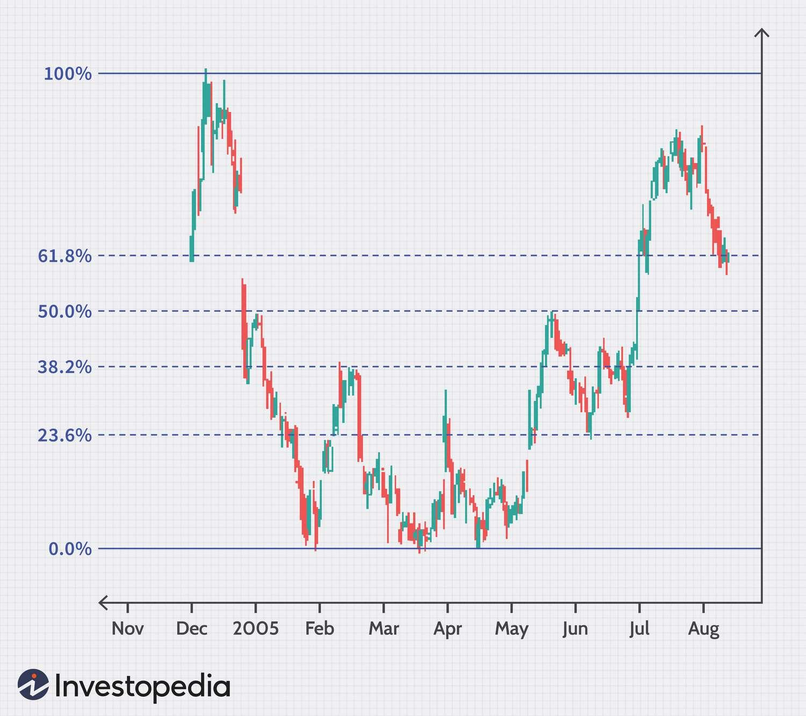

## Table of Contents

## What is Fibonacci retracement and how is it used in financial analysis?

Fibonacci retracement is a tool used in technical analysis to predict potential levels where a stock price might find support or resistance. It is based on the Fibonacci sequence, a series of numbers where each number is the sum of the two preceding ones. In financial analysis, these numbers are converted into percentages, specifically 23.6%, 38.2%, 50%, 61.8%, and 100%, which are then used to identify potential reversal points in the price of an asset. Traders draw horizontal lines at these percentages between two significant price points, usually a high and a low, to see where the price might retrace before continuing in the original direction.

In practice, if a stock price rises from $10 to $20, and then starts to fall back, a trader using Fibonacci retracement would look at the levels between $10 and $20 to predict where the price might stop falling and start rising again. For example, the 38.2% retracement level would be at $16.16 (38.2% of the $10 difference between $10 and $20), and the 61.8% level would be at $13.82. If the price hits one of these levels and then starts to move back up, it might suggest that the price has found support at that Fibonacci level. While not always accurate, many traders find these levels useful as part of their overall analysis strategy.

## How do you calculate Fibonacci retracement levels?

To calculate Fibonacci retracement levels, you first need to identify the high and low points of a price movement. Let's say a stock goes from $10 to $20. The difference between these two points is $10. You then apply Fibonacci ratios to this difference to find the retracement levels. The key Fibonacci ratios are 23.6%, 38.2%, 50%, 61.8%, and 100%. To find the 38.2% retracement level, you multiply the $10 difference by 38.2% (or 0.382), which gives you $3.82. You then subtract this from the high point of $20, which gives you a retracement level of $16.18.

For the other levels, you do the same thing but with different percentages. The 23.6% level would be $20 - ($10 * 0.236) = $17.64. The 50% level would be $20 - ($10 * 0.5) = $15. The 61.8% level would be $20 - ($10 * 0.618) = $13.82. And the 100% level would be $20 - ($10 * 1) = $10. These levels help traders see where the price might stop falling and start going up again. It's like drawing lines on a chart to guess where the price might bounce back.

## What are the key Fibonacci retracement levels used by traders?

Traders use key Fibonacci retracement levels to guess where a stock price might stop falling and start going back up. The most common levels are 23.6%, 38.2%, 50%, 61.8%, and 100%. These numbers come from the Fibonacci sequence, a special set of numbers where each number is the sum of the two before it. Traders look at these levels because they think the price might find support or resistance at these points.

To use these levels, traders find the highest and lowest points of a price move. Let's say a stock goes from $10 to $20. They calculate the difference, which is $10, and then use the Fibonacci percentages to find retracement levels. For example, the 38.2% level would be $20 minus ($10 times 0.382), which equals $16.18. If the price hits this level and starts going up again, traders might see it as a sign that the price has found support there. While these levels don't always work, many traders find them helpful in their analysis.

## Can you explain the significance of the 38.2%, 50%, and 61.8% levels in Fibonacci retracement?

The 38.2%, 50%, and 61.8% levels in Fibonacci retracement are important because they help traders guess where a stock price might stop falling and start going back up. These numbers come from the Fibonacci sequence, a special set of numbers where each number is the sum of the two before it. When traders use these levels, they look at the biggest up or down move in a stock's price and then use these percentages to find points where the price might bounce back. For example, if a stock goes from $10 to $20, the 38.2% level would be at $16.18, the 50% level at $15, and the 61.8% level at $13.82. Traders watch these levels closely because they think the price might find support or resistance at these points.

The 38.2% level is often seen as a shallow retracement, meaning the price hasn't fallen back much from its high. If the price hits this level and starts going up again, it might mean the stock is still strong. The 50% level is right in the middle and is not actually a Fibonacci number, but traders use it because it's easy to understand and often works well. The 61.8% level is considered a deeper retracement, and if the price bounces back from here, it might show that the stock is still in a good trend but had a bigger pullback. While these levels don't always work, many traders find them helpful in figuring out where to buy or sell a stock.

## How do traders apply Fibonacci retracement to identify potential support and resistance levels?

Traders use Fibonacci retracement to guess where a stock's price might stop falling and start going back up, or where it might stop going up and start falling again. They do this by looking at the biggest up or down move in the stock's price and then using special percentages from the Fibonacci sequence to draw lines on a chart. These percentages are 23.6%, 38.2%, 50%, 61.8%, and 100%. For example, if a stock goes from $10 to $20, traders will calculate these levels to see where the price might find support or resistance. If the price hits one of these levels and then changes direction, it might be a good spot to buy or sell.

When traders see the price of a stock hitting one of these Fibonacci levels, they pay close attention. For instance, if the price falls to the 38.2% level and then starts going up again, traders might think the stock has found support at that point. On the other hand, if the price rises to the 61.8% level and then starts falling, they might see it as resistance. These levels help traders decide when to enter or [exit](/wiki/exit-strategy) a trade. While these levels don't always work, many traders find them useful as part of their overall strategy to predict where the stock price might go next.

## What are some common mistakes beginners make when using Fibonacci retracement?

Beginners often make a few common mistakes when using Fibonacci retracement. One big mistake is not choosing the right high and low points to start with. The Fibonacci levels only work well if you pick the highest high and the lowest low in the price move you're looking at. If you pick the wrong points, the levels you draw won't be accurate, and you might miss where the price could turn around.

Another mistake is relying too much on Fibonacci levels alone. These levels are just one tool, and they don't always predict the price correctly. Beginners sometimes forget to use other tools like trend lines, moving averages, or other indicators to check their guesses. It's important to use Fibonacci retracement along with other analysis methods to make better trading decisions.

## How can Fibonacci retracement be integrated with other technical analysis tools?

Fibonacci retracement can be used together with other technical analysis tools to make better guesses about where a stock's price might go. For example, traders often use trend lines along with Fibonacci levels. If a stock's price hits a Fibonacci level and also touches a trend line, it might be a stronger sign that the price will bounce back or keep going in the same direction. Another tool traders use with Fibonacci retracement is moving averages. If a stock's price reaches a Fibonacci level and is also near a moving average, it could be a good time to buy or sell because the moving average can show the overall trend of the stock.

Another way to use Fibonacci retracement with other tools is by looking at chart patterns. For instance, if a stock's price hits a Fibonacci level and forms a pattern like a "double bottom" or "head and shoulders," it might give a clearer signal about what the price will do next. Traders also use indicators like the Relative Strength Index (RSI) or the Moving Average Convergence Divergence (MACD) to confirm what the Fibonacci levels are showing. If the RSI shows the stock is oversold when it hits a Fibonacci level, it might be a good time to buy. By combining Fibonacci retracement with these other tools, traders can make more informed decisions about when to enter or exit a trade.

## What are the psychological aspects of Fibonacci levels in trading?

Fibonacci levels play a big role in trading because they affect how traders think and feel. These levels are like magnets for traders because many of them believe in the power of the Fibonacci sequence. When a stock's price gets close to one of these levels, traders start to pay more attention. They might feel more confident about buying or selling at these points because they think other traders will do the same thing. This shared belief can actually make the levels work better, as more traders act on them, creating a self-fulfilling prophecy.

The psychological aspect also comes from the fear and greed that traders feel. When a stock's price hits a Fibonacci level and starts to move back up, traders might feel less scared and more hopeful, thinking the price has found a good spot to bounce back. On the flip side, if the price keeps going past a Fibonacci level, traders might feel more worried and start selling, thinking the price will keep falling. So, these levels not only help traders guess where the price might go, but they also play with their emotions, making trading a mix of numbers and feelings.

## How does the effectiveness of Fibonacci retracement vary across different financial markets?

The effectiveness of Fibonacci retracement can change depending on which financial market you're looking at. In the stock market, where lots of traders use these levels, they can be pretty useful. Many traders watch the same Fibonacci levels, so when a stock's price hits one of these levels, it can cause a lot of buying or selling, making the levels work better. But in markets like [forex](/wiki/forex-system), where there are big players like banks and governments moving money around, Fibonacci levels might not be as strong because these big players might not care about the levels as much as smaller traders do.

In markets like commodities, where the prices can be affected by things like weather or global events, Fibonacci retracement might not be as reliable. For example, if a big storm hits a major oil-producing area, the price of oil might move a lot and not care about Fibonacci levels. But in more stable markets, like some currency pairs in forex or certain stocks, Fibonacci retracement can be more effective because the price movements are more predictable and influenced by traders watching the same levels. So, the key is to understand the market you're trading in and see how well Fibonacci levels work there.

## Can you discuss any empirical studies that have tested the validity of Fibonacci retracement in trading?

Some researchers have looked into whether Fibonacci retracement really works in trading. One study by researchers at the University of Liverpool in 2010 tested if Fibonacci levels could predict stock price movements better than just guessing. They looked at a lot of stock data and found that the 38.2%, 50%, and 61.8% levels did seem to work a bit better than random chance. But, the study also said that these levels didn't work all the time and that other things like big news or events could make the levels less useful.

Another study by researchers at the University of California in 2015 looked at the forex market. They wanted to see if traders using Fibonacci levels made more money than those who didn't. The study found that traders who used Fibonacci retracement did a bit better, but not by a lot. The researchers pointed out that while Fibonacci levels can be helpful, they should be used with other tools like trend lines and moving averages to make better trading decisions. Both studies show that Fibonacci retracement can be useful, but it's not a magic tool that always works.

## What advanced techniques can be used to enhance the accuracy of Fibonacci retracement?

One way to make Fibonacci retracement more accurate is to use it with other tools like trend lines and moving averages. When a stock's price hits a Fibonacci level and also touches a trend line, it can be a stronger sign that the price will bounce back or keep going. Moving averages can show the overall trend of the stock, so if the price is near a moving average and a Fibonacci level at the same time, it might be a good time to buy or sell. Another technique is to look at chart patterns, like a "double bottom" or "head and shoulders," when the price hits a Fibonacci level. These patterns can give a clearer signal about what the price will do next.

Another advanced technique is to use Fibonacci extensions along with retracement levels. Extensions help traders guess where the price might go after it bounces back from a retracement level. For example, if the price hits the 61.8% retracement level and starts going up again, traders might use the 161.8% extension level to see where the price might reach next. Using both retracement and extension levels together can give a fuller picture of where the price might go. Also, paying attention to the [volume](/wiki/volume-trading-strategy) of trades when the price hits a Fibonacci level can help. If the volume is high when the price hits a level, it might be a stronger sign that the level is important.

## How do professional traders adjust Fibonacci levels based on market volatility and trends?

Professional traders often adjust Fibonacci levels based on how much the market is moving around, which is called [volatility](/wiki/volatility-trading-strategies). When the market is really jumpy and prices are changing a lot, traders might use wider ranges for their Fibonacci levels. This means they might look at levels like 23.6% and 78.6% instead of just the usual ones like 38.2% and 61.8%. By doing this, they give the price more room to move without thinking it has broken through a level. If the market is calm and not moving much, traders might stick to the usual Fibonacci levels because the price is more likely to hit those exact points.

Traders also change their Fibonacci levels based on the overall trend of the market. If the market is going up strong, they might focus more on the lower Fibonacci levels like 38.2% and 50% because they expect the price to bounce back quickly from these points. But if the market is going down or not moving much, they might pay more attention to higher levels like 61.8% and 78.6%. This way, they can better guess where the price might find support or resistance based on the direction the market is going. Adjusting Fibonacci levels like this helps traders make better decisions in different market conditions.

## References & Further Reading

[1]: Pring, M.J. (2002). ["Technical Analysis Explained."](https://www.amazon.com/Technical-Analysis-Explained-Fifth-Successful/dp/0071825177) McGraw Hill.

[2]: Murphy, J.J. (1999). ["Technical Analysis of the Financial Markets."](https://www.amazon.com/Technical-Analysis-Financial-Markets-Comprehensive/dp/0735200661) New York Institute of Finance.

[3]: Lo, A.W., & MacKinlay, A.C. (1999). ["A Non-Random Walk Down Wall Street."](https://www.jstor.org/stable/j.ctt7tccx) Princeton University Press.

[4]: Frost, A.J., & Prechter, R.R. (2005). ["Elliott Wave Principle: Key to Market Behavior."](https://www.amazon.com/Elliott-Wave-Principle-Market-Behavior/dp/0932750753) New Classics Library.

[5]: Connors, L., & Alvarez, C. (2010). ["Short Term Trading Strategies That Work."](https://www.amazon.com/Short-Term-Trading-Strategies-That-ebook/dp/B007RSLN7M) TradingMarkets Publishing.