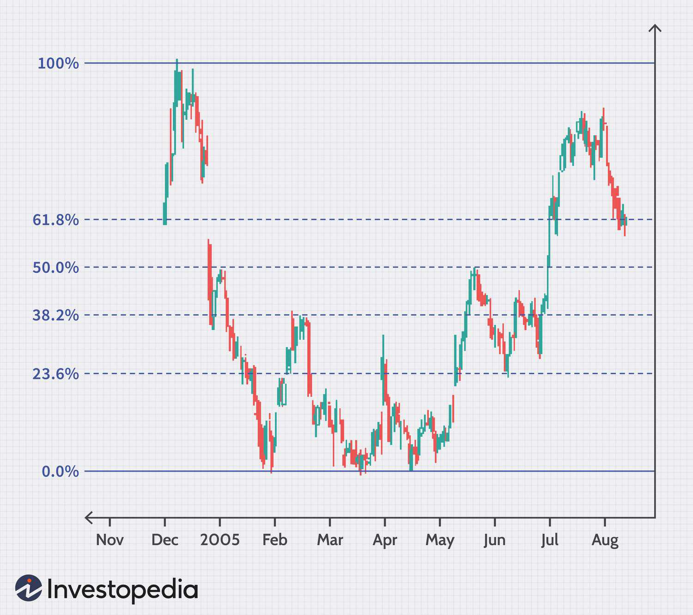

## Table of Contents

## What are Fibonacci retracement levels?

Fibonacci retracement levels are tools used in technical analysis to predict where the price of a stock or other asset might find support or resistance. They are based on the Fibonacci sequence, a series of numbers where each number is the sum of the two preceding ones. In trading, these levels are calculated as percentages and drawn on a chart to show where the price could potentially reverse. The key Fibonacci retracement levels are 23.6%, 38.2%, 50%, 61.8%, and 78.6%.

Traders use these levels to identify potential entry and exit points for their trades. For example, if a stock's price has been rising and then starts to fall, a trader might look at the Fibonacci levels to see where the price might stop falling and start rising again. The 61.8% level is often considered the most important because it is the golden ratio, which appears frequently in nature and is thought to have special significance in financial markets. By understanding these levels, traders can make more informed decisions about when to buy or sell.

## How are Fibonacci retracement levels calculated?

Fibonacci retracement levels are calculated by taking two extreme points on a stock chart, usually a major peak and a major trough, and then dividing the vertical distance between these two points by the key Fibonacci ratios. The main ratios used are 23.6%, 38.2%, 50%, 61.8%, and 78.6%. To find these levels, you first measure the distance from the low point to the high point. Then, you multiply this distance by each of the Fibonacci ratios and subtract the result from the high point to find the retracement levels.

For example, if a stock moves from a low of $100 to a high of $200, the vertical distance is $100. To find the 38.2% retracement level, you multiply $100 by 0.382 to get $38.20. Subtract this from the high of $200, and you get a retracement level of $161.80. This means that if the stock price falls from $200, it might find support at $161.80. The other levels are calculated similarly, using the other Fibonacci ratios. This helps traders predict where the price might go next.

## What is the significance of the Fibonacci sequence in financial markets?

The Fibonacci sequence is important in financial markets because it helps traders predict where the price of a stock might go next. Traders use numbers from the Fibonacci sequence to find special levels on a price chart. These levels are called Fibonacci retracement levels. They show where the price might stop falling and start going up again, or where it might stop rising and start falling. Traders look at these levels to decide when to buy or sell a stock.

The main Fibonacci levels used in trading are 23.6%, 38.2%, 50%, 61.8%, and 78.6%. These percentages come from the Fibonacci sequence. For example, if a stock's price goes from $100 to $200, traders might watch the price to see if it stops falling at around $161.80, which is the 38.2% retracement level. By understanding these levels, traders can make better guesses about where the price might go next. This can help them make smarter decisions about buying and selling stocks.

## How do traders use Fibonacci retracement levels in technical analysis?

Traders use Fibonacci retracement levels in technical analysis to help them decide when to buy or sell a stock. They look at a stock's price chart and find the highest and lowest points the price has reached. Then, they draw lines on the chart at the Fibonacci levels, which are 23.6%, 38.2%, 50%, 61.8%, and 78.6%. These lines show where the price might stop going down and start going up again, or where it might stop going up and start going down. Traders use these lines to find good times to buy or sell a stock.

For example, if a stock's price goes from $100 to $200 and then starts to fall, a trader might look at the Fibonacci levels to see where the price might stop falling. If the price falls to $161.80, which is the 38.2% level, and then starts to go up again, the trader might decide to buy the stock at that point. This helps traders make better guesses about where the price might go next and make smarter decisions about buying and selling stocks.

## What are the key Fibonacci retracement levels used by traders?

Traders use Fibonacci retracement levels to predict where a stock's price might stop falling or rising. The main levels they look at are 23.6%, 38.2%, 50%, 61.8%, and 78.6%. These levels come from the Fibonacci sequence, a special set of numbers that appear in nature and are used in trading.

To find these levels, traders measure the distance between a stock's highest and lowest price points. They then use the Fibonacci percentages to draw lines on the chart. For example, if a stock goes from $100 to $200, the 38.2% level would be at $161.80. Traders watch these levels to decide when to buy or sell the stock, hoping to make good guesses about where the price might go next.

## Can Fibonacci retracement levels predict market movements?

Fibonacci retracement levels can help traders make guesses about where a stock's price might go next, but they can't predict market movements perfectly. Traders use these levels to see where the price might stop falling or rising. They look at the highest and lowest points on a price chart and draw lines at special percentages, like 23.6%, 38.2%, 50%, 61.8%, and 78.6%. These lines help traders decide when to buy or sell a stock. For example, if a stock's price falls to a certain level and then starts to go up again, a trader might buy at that point, hoping the price will keep going up.

However, these levels are just tools and don't guarantee that the price will move in a certain way. Many other things can affect the market, like news, company earnings, and what other traders are doing. So, while Fibonacci retracement levels can be helpful, they should be used with other tools and information to make better trading decisions. Traders often combine these levels with other kinds of analysis to get a fuller picture of what might happen next in the market.

## How do Fibonacci retracement levels interact with other technical indicators?

Fibonacci retracement levels are often used together with other technical indicators to help traders make better decisions about buying and selling stocks. One common way to use them is with trend lines. Traders might draw a trend line to show the direction of the price movement and then use Fibonacci levels to find points where the price might change direction. For example, if a stock is going up and hits a Fibonacci level, traders might look to see if the price bounces off that level and keeps going up, or if it breaks through and starts to fall. By combining Fibonacci levels with trend lines, traders can get a clearer picture of what might happen next.

Another way Fibonacci levels work with other indicators is with moving averages. Moving averages smooth out price data to show the overall direction of the trend. Traders might use a moving average to see if the price is above or below it, and then use Fibonacci levels to find specific points where the price might change. For instance, if a stock's price is above a moving average and hits a Fibonacci level, traders might see this as a good time to buy, expecting the price to keep going up. By using Fibonacci levels along with moving averages, traders can make more informed guesses about where the price might go next.

## What are common mistakes traders make when using Fibonacci retracement levels?

One common mistake traders make when using Fibonacci retracement levels is relying on them too much. Traders might think these levels will always predict where the price will go next, but that's not true. The market can be unpredictable, and many things can affect the price, like news or what other traders are doing. So, it's important to use Fibonacci levels along with other tools and information, like trend lines or moving averages, to get a better idea of what might happen.

Another mistake is not [picking](/wiki/asset-class-picking) the right high and low points to draw the Fibonacci levels. If traders choose the wrong points, the levels they draw will be in the wrong places, and their predictions will be off. It's important to look at the whole chart and pick the most important high and low points. This way, the Fibonacci levels will be more accurate and helpful in making trading decisions.

## How can Fibonacci retracement levels be applied to different time frames?

Fibonacci retracement levels can be used on different time frames, like short-term charts that show prices over a few minutes or hours, and long-term charts that show prices over days, weeks, or even months. Traders look at the highest and lowest points on the chart for the time frame they are interested in. For example, if a trader is looking at a daily chart, they would find the highest and lowest prices over several days and use those to draw the Fibonacci levels. On the other hand, if they are looking at a 5-minute chart, they would find the highest and lowest prices in that shorter time frame. This way, traders can use Fibonacci levels to make guesses about where the price might go next, no matter what time frame they are looking at.

The key is to match the time frame with the trading strategy. Short-term traders, who buy and sell quickly, might use Fibonacci levels on a 15-minute or 1-hour chart to find quick entry and exit points. They are looking for small price movements that happen fast. Long-term traders, who hold onto stocks for a longer time, might use Fibonacci levels on a daily or weekly chart to find bigger trends and longer-lasting price movements. By using Fibonacci levels on different time frames, traders can adjust their strategies to fit their goals and the time they want to spend trading.

## What are the psychological aspects of trading with Fibonacci retracement levels?

Trading with Fibonacci retracement levels involves a lot of psychology. Traders often feel more confident when they see the price of a stock hitting a Fibonacci level. They think these levels are special because they come from the Fibonacci sequence, which is found in nature. This can make traders feel like they are making smarter guesses about where the price might go next. But, if the price doesn't move the way they expect, it can make them feel unsure and stressed. They might start to doubt their decisions and feel worried about losing money.

It's important for traders to stay calm and not let their emotions control their decisions. Sometimes, traders might see a Fibonacci level and decide to buy or sell a stock quickly without thinking about other things that could affect the price. This can lead to bad choices. To trade well with Fibonacci levels, traders need to use them along with other tools and information, like trend lines or moving averages. This helps them make more balanced decisions and not rely too much on one thing. By staying patient and using a mix of tools, traders can handle the ups and downs of the market better.

## How do professional traders integrate Fibonacci retracement levels into their overall trading strategy?

Professional traders often use Fibonacci retracement levels as one part of their overall trading strategy. They look at the highest and lowest points on a price chart and draw lines at special percentages like 23.6%, 38.2%, 50%, 61.8%, and 78.6%. These lines help them guess where the price might stop falling or rising. But, they don't just rely on these levels alone. They combine them with other tools like trend lines and moving averages to get a fuller picture of the market. This way, they can make more informed decisions about when to buy or sell a stock.

For example, a professional trader might see that a stock's price is going up and hits a Fibonacci level. They would then check if the price bounces off that level and keeps going up, or if it breaks through and starts to fall. They might also look at a moving average to see if the price is above or below it, which can give them more clues about the trend. By using Fibonacci levels along with other indicators, professional traders can better predict where the price might go next. This helps them stay calm and make smart choices, even when the market is unpredictable.

## What are advanced techniques for using Fibonacci retracement levels in algorithmic trading?

In [algorithmic trading](/wiki/algorithmic-trading), advanced techniques for using Fibonacci retracement levels involve automating the process of identifying and acting on these levels. Traders can write algorithms that automatically calculate the Fibonacci levels based on the highest and lowest points of a stock's price over a specific time frame. These algorithms can then generate buy or sell signals when the price hits these levels. For example, if the price of a stock falls to a 38.2% Fibonacci level and then starts to rise again, the algorithm might trigger a buy signal. This automation helps traders make quick decisions without having to watch the market all the time.

Another advanced technique is to combine Fibonacci levels with other technical indicators within the algorithm. Traders might program their algorithms to look at moving averages, trend lines, or [momentum](/wiki/momentum) indicators along with Fibonacci levels. This way, the algorithm can make more accurate predictions by considering multiple factors. For instance, if a stock's price hits a Fibonacci level and is also above a moving average, the algorithm might see this as a stronger signal to buy. By integrating Fibonacci retracement levels with other tools, algorithmic traders can create more robust trading strategies that adapt to changing market conditions.

## What is Fibonacci Retracement?

Fibonacci retracement is a popular technical analysis tool used by traders to predict potential reversal points in the financial markets. It is based on the Fibonacci sequence, a series of numbers where each number is the sum of the two preceding ones: 0, 1, 1, 2, 3, 5, 8, and so on. This sequence is named after Leonardo of Pisa, known as Fibonacci, an Italian mathematician from the Middle Ages who introduced these numbers to the Western world through his work "Liber Abaci."

The essence of Fibonacci retracement in financial markets lies in the belief that prices tend to retrace a predictable portion of a move before continuing in the original direction. The retracement levels are defined as percentages of the price range from a significant peak to a trough (or vice versa). They commonly include 23.6%, 38.2%, 50%, 61.8%, and sometimes 76.4%. These percentages are derived from ratios found in the Fibonacci sequence.

To calculate the Fibonacci retracement levels, one begins by identifying a trend's high and low points on a price chart. Subsequently, the following formula for each retracement level can be applied:

$$
\text{Retracement Level} = \text{High} - (\text{High} - \text{Low}) \times \text{Percentage Level}
$$

The 61.8% level is considered the "golden ratio" and is of particular interest because of its prevalence in various natural phenomena, architecture, and art. The 38.2% and 50% levels are also significant, being frequently used by traders to identify potential support and resistance areas.

On price charts, Fibonacci retracement is visually represented by horizontal lines at each of the calculated retracement levels. These lines indicate possible levels of support during a downtrend or resistance during an uptrend. Traders use these retracements to determine strategic entry and [exit](/wiki/exit-strategy) points within the existing trend. 

For example, consider a stock price that rises from $100 to $150. If the stock begins to fall, traders may expect it to find support around the $129 level (150 - (50 \times 0.38)), which is the 38.2% Fibonacci retracement level. While this tool does not guarantee specific outcomes, it is valued for its ability to suggest areas where price action might reverse temporarily before resuming in the direction of the established trend.

## References & Further Reading

[1]: Bergstra, J., Bardenet, R., Bengio, Y., & Kégl, B. (2011). ["Algorithms for Hyper-Parameter Optimization."](https://papers.nips.cc/paper/4443-algorithms-for-hyper-parameter-optimization) Advances in Neural Information Processing Systems 24.

[2]: ["Advances in Financial Machine Learning"](https://www.amazon.com/Advances-Financial-Machine-Learning-Marcos/dp/1119482089) by Marcos Lopez de Prado

[3]: ["Evidence-Based Technical Analysis: Applying the Scientific Method and Statistical Inference to Trading Signals"](https://www.amazon.com/Evidence-Based-Technical-Analysis-Scientific-Statistical/dp/0470008741) by David Aronson

[4]: ["Machine Learning for Algorithmic Trading"](https://github.com/stefan-jansen/machine-learning-for-trading) by Stefan Jansen

[5]: ["Quantitative Trading: How to Build Your Own Algorithmic Trading Business"](https://www.amazon.com/Quantitative-Trading-Build-Algorithmic-Business/dp/1119800064) by Ernest P. Chan