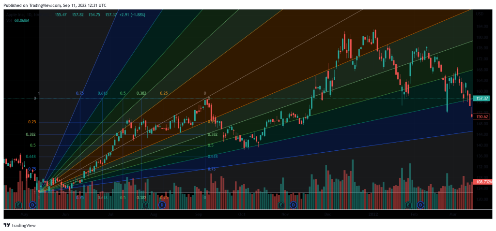

Fibonacci retracement is a widely utilized technical analysis tool among traders seeking to identify potential support and resistance levels in financial markets. Based on the Fibonacci sequence, this technique reflects significant proportions that are not only apparent in various natural phenomena but also resonate within financial markets. The sequence, discovered by Leonardo Fibonacci in the 13th century, involves a series of numbers where each number is the sum of the two preceding ones, typically starting from 0 and 1: 0, 1, 1, 2, 3, 5, 8, 13, and so forth. The ratios derived from this sequence, particularly 61.8%, 38.2%, and 23.6%, are of substantial interest to traders. These ratios are calculated by dividing a number in the sequence by the number immediately following it (e.g., 21/34 ≈ 0.618) or by numbers further down the sequence.

Incorporating Fibonacci retracement levels into trading strategies can offer valuable insights into market trends and potential points of reversal. Traders plot horizontal lines at these significant Fibonacci levels after identifying the high and low values on a price chart. These levels serve as reference points indicating where an asset's price might experience a reversal or continuation of its previous trend. By analyzing these retracement levels, traders can better predict the strength and duration of market trends, allowing for more informed trading decisions.



This article aims to explore the intricacies of using Fibonacci retracement in technical analysis and its advancement through algorithmic trading strategies. Algorithmic trading involves using computer programs to analyze market data and execute trades, thereby enhancing the speed and efficiency of market operations. The integration of Fibonacci retracement levels into algorithmic trading tools enables a systematic approach to trading, reducing human error and emotional biases. In subsequent sections, the basics of Fibonacci retracement, its significance in trading contexts, and the role of algorithms in enhancing trading strategies through this tool will be thoroughly examined.

## Table of Contents

## Understanding Fibonacci Retracement Levels

Fibonacci retracement levels are crucial components in technical analysis, used prominently by traders to forecast potential support and resistance areas on price charts. These levels are derived from the Fibonacci sequence, an integer sequence defined recursively where each number is the sum of the two preceding ones, typically starting with 0 and 1. Fundamental to this technique are certain ratios obtained by dividing Fibonacci numbers, resulting in percentages like 23.6%, 38.2%, 50%, 61.8%, and 78.6%. These ratios represent potential reversal zones in asset prices, signaling where a market might change direction.

When a significant price movement occurs in a financial market, traders measure the distance or length of that move and divide it by the key Fibonacci ratios. This process necessitates drawing horizontal lines on the price chart at these ratio levels of the price range. For example, if a stock price moves from $100 to $150, the Fibonacci retracement levels would be drawn at intervals defined by these ratios. Traders predict that these levels will act as support if the market is correcting downwards, or as resistance if the market is correcting upwards.

Accurately plotting these levels involves identifying a significant peak (high) and trough (low) in a price movement. Once these points are established, the Fibonacci retracement levels can be drawn, allowing traders to interpret which level may serve as future support or resistance. This technique hinges on the belief that historical price patterns and levels tend to repeat themselves, providing a psychological basis for market movements that the Fibonacci sequence captures wisely.

The ability to correctly apply and interpret Fibonacci retracement levels is a skill that traders develop over time. It demands an understanding of chart trends, the ability to choose significant price points, and knowledge of potential market psychology. Traders often utilize these retracement levels in combination with other indicators like moving averages or trend lines, to corroborate trading signals and improve decision-making accuracy.

In conclusion, the application of Fibonacci retracement levels provides traders with crucial insights into potential market reversals and continuations, bolstering the analytical framework necessary for successful trading in financial markets.

## Importance of Fibonacci Retracement in Technical Analysis

Fibonacci retracement is a crucial tool used in technical analysis by traders aiming to ascertain potential reversals in asset prices. The primary function of this technique is to provide clarity on likely price movement directions, thus equipping traders with the knowledge necessary to make well-informed decisions. By identifying critical levels of support and resistance, Fibonacci retracement enables traders to better predict where price movements may occur and manage associated risks more efficiently.

The reliability of Fibonacci retracement is grounded in its consistency when compared to historical price data. As asset prices fluctuate, they often exhibit [fractal](/wiki/fractal-indicators) patterns in line with Fibonacci ratios, reflecting natural tendencies in financial markets. These ratios, primarily 23.6%, 38.2%, 50%, 61.8%, and 78.6%, serve as markers within price charts, helping traders predict where corrections might occur. The theory posits that after an asset experiences a significant price movement, it will retrace a portion of that movement before continuing in its original direction. This characteristic is particularly pronounced in trending markets, where price corrections frequently respect Fibonacci retracement levels, providing traders with reliable entry and [exit](/wiki/exit-strategy) points.

Traders find additional value in combining Fibonacci retracement with other technical indicators to bolster the accuracy of their forecasts. Tools such as moving averages, the Moving Average Convergence Divergence (MACD), and the Relative Strength Index (RSI) often complement Fibonacci levels by confirming signals and validating potential price reversal points. Such combinations can enhance trading strategies, allowing traders to cross-verify signals and minimize the risk of false predictions.

Using Fibonacci retracement effectively requires an understanding of both its strengths and limitations within the context of technical analysis. Its simplicity and ability to be applied universally across various markets make it a preferred tool among traders, yet its effectiveness can be reliant on market conditions and prevailing trends. Therefore, to maximize its utility, traders must integrate Fibonacci retracement with a comprehensive array of technical analyses and market indicators, ensuring a holistic approach to trading strategies.

## Incorporating Fibonacci Retracement in Trading Strategies

To incorporate Fibonacci retracement effectively in trading strategies, traders typically begin by identifying significant price trends. At its core, this process involves plotting retracement levels between the high and low points of a given trend. These levels, derived from the key Fibonacci ratios of 23.6%, 38.2%, 50%, 61.8%, and 78.6%, offer valuable insights into potential reversal points in the asset's price trajectory.

Once the retracement levels are plotted, traders can use them to establish critical decision points for their trades. These include setting entry points for buying or selling assets, determining stop-loss orders to mitigate risk, and choosing take-profit points to secure gains. The art of selecting these points lies in aligning them with the retracement levels where historical price behavior suggests a likelihood of reversal or continuation.

To enhance the reliability of these levels, traders often combine Fibonacci retracement with other technical indicators such as Moving Averages, the Moving Average Convergence Divergence (MACD), and the Relative Strength Index (RSI). For instance, when a Fibonacci level coincides with a point where a moving average intersects the price, or where the MACD or RSI indicates overbought or oversold conditions, the probability of an accurate signal increases. These confluences add layers of confirmation, reducing the likelihood of false signals.

Understanding the influence of market conditions on retracement levels is paramount for optimizing trading strategies. In volatile or trending markets, these levels might be respected differently compared to stable markets. Traders need to remain adaptive, assessing how shifts in market sentiment or macroeconomic factors might affect the reliability of these retracement levels.

Incorporating such technical tools requires not only knowledge of their theoretical framework but also practical experience in market dynamics. Traders who master the integration of Fibonacci retracement into their trading arsenal can potentially enhance their ability to navigate complex market movements with precision.

## Algorithmic Trading and Fibonacci Retracement

Algorithmic trading employs computer programs to execute trades with precision based on predefined criteria, often leveraging technical analysis methods such as Fibonacci retracement. Fibonacci retracement levels, which are derived from the mathematical sequence discovered by Leonardo Fibonacci, are frequently integrated into [algorithmic trading](/wiki/algorithmic-trading) systems to provide systematic and objective trading signals.

Automation in algorithmic trading allows the rapid identification and application of Fibonacci retracement levels, enabling programs to respond to market fluctuations more swiftly than human traders. This speed advantage facilitates capitalizing on transient market opportunities and executing trades at optimal moments.

An essential feature of these algorithms is the capacity for [backtesting](/wiki/backtesting). By simulating trading strategies on historical data, algorithms can evaluate the efficacy of incorporating Fibonacci retracement levels across varied market conditions. This historical analysis helps identify patterns of market behavior where Fibonacci retracement proves most valuable, optimizing strategies for future deployments.

Moreover, algorithmic trading eliminates the emotional biases often present in human decision-making. By adhering strictly to pre-set rules, which can include Fibonacci levels as critical decision points, algorithms maintain consistency in their operations. This systematic approach minimizes the risk of emotion-driven and impulsive trades, potentially enhancing overall trading performance.

Developers face the challenge of ensuring that their algorithms remain adaptable to the ever-changing landscape of financial markets. Continuous refinement is necessary as market dynamics evolve, requiring regular updates and recalibrations of the algorithms to sustain their effectiveness. This adaptability ensures that the trading systems can consistently leverage Fibonacci retracement within their strategy frameworks, maintaining their relevance and utility in a dynamic trading environment.

Incorporating Fibonacci retracement into algorithmic trading frameworks not only streamlines the process of identifying crucial market levels but also complements the computational efficiency and emotional objectivity inherent in algorithmic systems, thus providing a formidable toolset for contemporary traders.

## Advantages and Limitations of Fibonacci Retracement in Trading

Fibonacci retracement is a widely adopted tool in technical analysis, valued primarily for its simplicity and adaptability across multiple markets. One pronounced advantage of Fibonacci retracement is its straightforward application, allowing traders to quickly identify potential levels of support and resistance. These levels – often set at key ratios of 23.6%, 38.2%, 50%, 61.8%, and 78.6% derived from the Fibonacci sequence – are universally applicable, making the tool useful in various asset classes, from stocks and commodities to currencies.

The ease of recognizing these predefined levels aids traders in making swift and informed decisions, giving them a strategic edge in volatile markets. However, the methodology is not without its limitations. Sole reliance on Fibonacci retracement could lead to overlooked market signals or incorrect assumptions about potential reversals. For instance, false breakouts can occur if traders anticipate market reversals simply due to the presence of a Fibonacci level without considering broader market dynamics.

Market conditions and prevailing trends significantly influence the effectiveness of Fibonacci retracement. In trending markets, Fibonacci levels can help identify price oscillations within the trend. Conversely, during periods of strong directional movement or market anomaly, these levels might not provide reliable reversal signals, leading to potential misjudgments.

To mitigate these risks, traders are advised to use Fibonacci retracement in conjunction with other technical analyses and market indicators. For example, combining Fibonacci levels with moving averages, [volume](/wiki/volume-trading-strategy) indicators, or [momentum](/wiki/momentum) oscillators like the Relative Strength Index (RSI) can validate trends and improve predictive accuracy. This multi-faceted approach helps in cross-verifying potential support and resistance levels and enhances the reliability of trading signals.

In summary, while Fibonacci retracement offers a simplistic yet powerful framework for technical analysis, its effectiveness is contingent on market conditions and its integration with other analytic tools. Balancing these elements allows traders to harness Fibonacci retracement's full potential while minimizing its limitations.

## Conclusion

Fibonacci retracement is a valuable tool for traders looking to predict price movements and identify trading opportunities. By using these retracement levels, traders can gain significant insights into market behavior and identify potential points of reversal. The mathematical nature of Fibonacci levels, derived from the Fibonacci sequence, aligns well with natural patterns and market trends, providing a solid foundation for technical analysis.

When Fibonacci retracement is effectively combined with algorithmic trading strategies, it offers a dynamic and efficient approach to trading. Algorithmic trading can automatically identify and react to Fibonacci levels, minimizing the delay and the emotional factors associated with manual trading. This integration allows for rapid execution of trades based on predefined criteria, ensuring that traders can capitalize on market changes as they occur. Utilizing programming languages like Python, traders can develop algorithms that incorporate Fibonacci retracement alongside other indicators to optimize trading performance. For example, using the `numpy` and `pandas` libraries in Python, historical price data can be analyzed to establish optimal entry and exit points:

```python
import numpy as np
import pandas as pd

def calculate_fibonacci_levels(price_series):
    max_price = price_series.max()
    min_price = price_series.min()
    diff = max_price - min_price
    return {
        "23.6%": max_price - diff * 0.236,
        "38.2%": max_price - diff * 0.382,
        "50.0%": max_price - diff * 0.5,
        "61.8%": max_price - diff * 0.618,
        "78.6%": max_price - diff * 0.786
    }
```

Traders should balance the use of Fibonacci levels with other analytic tools to enhance their trading strategies. This could include the integration of moving averages, RSI, or MACD to corroborate signals provided by Fibonacci retracement. Such a holistic approach allows traders to verify the validity of these signals in a broader market context, thereby improving the accuracy and effectiveness of their trading strategies.

Continued learning and adaptation are key to mastering Fibonacci retracement and integrating it into successful trading practices. Financial markets are dynamic, with varying conditions that can affect the reliability of Fibonacci levels. As such, traders should remain adaptive, constantly evaluating their strategies in light of new data and market developments. By staying informed and flexible, traders can refine their use of Fibonacci retracement to maintain a competitive edge in the market.

## References & Further Reading

[1]: ["Fibonacci Analysis"](https://www.investopedia.com/ask/answers/05/fibonacciretracement.asp) by Constance Brown

[2]: ["Technical Analysis of the Financial Markets: A Comprehensive Guide to Trading Methods and Applications"](https://www.amazon.com/Technical-Analysis-Financial-Markets-Comprehensive/dp/0735200661) by John J. Murphy

[3]: ["High-Probability Trading Strategies: Entry to Exit Tactics for the Forex, Futures, and Stock Markets"](https://www.wiley.com/en-us/High+Probability+Trading+Strategies%3A+Entry+to+Exit+Tactics+for+the+Forex%2C+Futures%2C+and+Stock+Markets-p-9780470181669) by Robert C. Miner

[4]: ["Algorithmic Trading: Winning Strategies and Their Rationale"](https://www.wiley.com/en-us/Algorithmic+Trading%3A+Winning+Strategies+and+Their+Rationale-p-9781118460146) by Ernest P. Chan

[5]: Chernobai, A., Rachev, S. T., & Fabozzi, F. J. (2007). ["Empirical Distribution and the Use of Moving Averages in Algorithmic Trading."](https://onlinelibrary.wiley.com/doi/book/10.1002/9781119201922) SSRN Electronic Journal.

[6]: ["Trading Systems and Methods, + Website (5th Edition)"](https://www.oreilly.com/library/view/trading-systems-and/9781118236031/) by Perry J. Kaufman