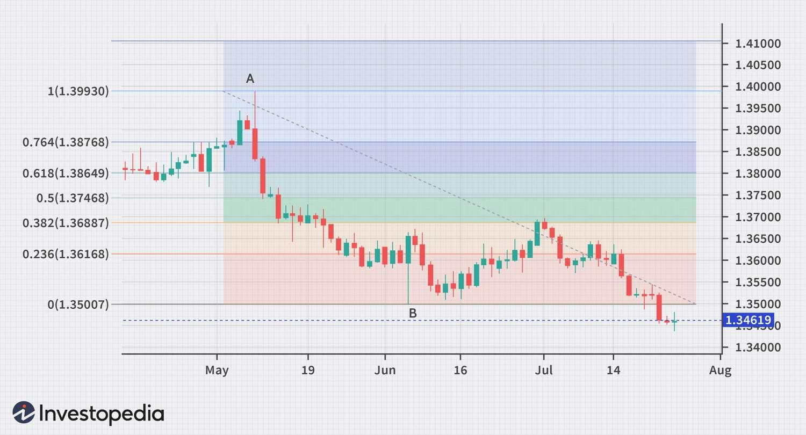

## Table of Contents

## What is Fibonacci retracement and how is it used in trading?

Fibonacci retracement is a tool used in trading to identify potential levels of support and resistance. It is based on the Fibonacci sequence, a series of numbers where each number is the sum of the two preceding ones. In trading, these numbers are turned into percentages, mainly 23.6%, 38.2%, 50%, 61.8%, and 100%, which represent how much of a previous price move the market has retraced. Traders draw these levels on a chart from the high to the low of a price movement to see where the price might find support or resistance.

Traders use Fibonacci retracement levels to decide where to enter or exit trades. For example, if a stock price rises from $10 to $20 and then starts to fall, a trader might watch the 61.8% retracement level, which would be at $13.80. If the price bounces off this level, the trader might see it as a good point to buy, expecting the price to go up again. On the other hand, if the price breaks through this level, it might suggest that the price will continue to fall, and the trader might decide to sell or not buy at all. By using these levels, traders can make more informed decisions based on historical price movements.

## How do you plot Fibonacci retracement levels on a chart?

To plot Fibonacci retracement levels on a chart, you first need to identify a significant price move, either an uptrend or a downtrend. For an uptrend, you would find the lowest point (the swing low) and the highest point (the swing high) of the move. For a downtrend, you do the opposite, finding the highest point first and then the lowest point. Once you have these two points, you can use a charting tool or software that has a Fibonacci retracement feature. You click on the swing low and drag the tool to the swing high for an uptrend, or from the swing high to the swing low for a downtrend. The software will then automatically draw horizontal lines on the chart at the key Fibonacci levels: 23.6%, 38.2%, 50%, 61.8%, and 100%.

These lines represent potential areas where the price might find support or resistance. Traders watch these levels closely because they believe the price might reverse or pause at these points. For example, if the price is falling and reaches the 61.8% level, traders might expect it to stop there and start going up again. If it does, they might decide to buy. If the price keeps falling past the 61.8% level, traders might think it will keep going down and decide to sell or wait for a better time to buy. By plotting these levels, traders can make better decisions about when to enter or [exit](/wiki/exit-strategy) trades based on where the price might go next.

## What are the key Fibonacci retracement levels and their significance?

The key Fibonacci retracement levels are 23.6%, 38.2%, 50%, 61.8%, and 100%. These percentages come from the Fibonacci sequence, where each number is the sum of the two before it. Traders use these levels to find places on a chart where the price might stop falling and start going up again, or stop going up and start falling. The levels help traders decide when to buy or sell.

The 23.6% and 38.2% levels are often seen as shallow retracements. If the price only falls to these levels after going up a lot, it might mean the price will keep going up soon. The 50% level is not a true Fibonacci ratio, but traders use it because it's the middle point between the high and low prices. The 61.8% level is a deep retracement and is watched closely by traders. If the price falls to this level and then starts going up, it could be a good time to buy. The 100% level means the price has gone all the way back to where it started, which might mean the price trend has changed completely.

## Can you explain the concept of Fibonacci extensions and their role in trading?

Fibonacci extensions are another tool traders use to figure out where a price might go after it starts moving again. They help predict how far the price might go in the same direction as the last big move. To use them, you need to find the start of a price move, the end of that move, and then the point where the price starts moving again. From there, you can draw lines on the chart at certain percentages like 61.8%, 100%, 161.8%, and 261.8%. These percentages come from the Fibonacci sequence, just like with retracements.

Traders watch these extension levels to decide when to take profits or set new targets. For example, if a stock goes up from $10 to $20 and then pulls back a bit before going up again, a trader might look at the 161.8% extension level. If that level is at $22.36, the trader might plan to sell the stock when it reaches that price, hoping to make a profit. By using Fibonacci extensions, traders can set goals for how much they think the price will rise or fall, helping them make better trading decisions.

## How do traders use Fibonacci retracement levels to identify potential support and resistance?

Traders use Fibonacci retracement levels to find places on a chart where the price might stop falling and start going up again, or stop going up and start falling. These levels are like invisible lines on the chart that show where the price could find support or resistance. Support is when the price stops falling and starts going up, and resistance is when the price stops going up and starts falling. Traders draw these lines from the highest point to the lowest point of a price move, or the other way around, and then look at the key levels: 23.6%, 38.2%, 50%, 61.8%, and 100%. If the price reaches one of these levels and then bounces back, traders might think it's a good time to buy or sell.

For example, if a stock goes up from $10 to $20 and then starts falling, traders might watch the 61.8% retracement level, which would be at $13.80. If the price falls to $13.80 and then starts going up again, traders might see this as a sign to buy the stock, thinking the price will keep going up. On the other hand, if the price keeps falling past $13.80, traders might think it will keep going down and decide to sell or wait for a better time to buy. By using these levels, traders can make more informed decisions about when to enter or exit trades based on where the price might find support or resistance.

## What are some common Fibonacci trading strategies for beginners?

A simple Fibonacci trading strategy for beginners is to use Fibonacci retracement levels to find good times to buy or sell. Imagine a stock goes up from $10 to $20 and then starts to fall back down. You can draw lines on the chart at the 23.6%, 38.2%, 50%, 61.8%, and 100% levels. If the price falls to the 61.8% level, which is $13.80, and then starts going up again, you might decide to buy the stock. You think the price will keep going up from there. But if the price keeps falling past $13.80, you might decide to sell or wait for a better time to buy.

Another easy strategy is to use Fibonacci extensions to set goals for how much the price might go up or down. Let's say a stock goes up from $10 to $20 and then pulls back a bit before going up again. You can draw lines on the chart at the 61.8%, 100%, 161.8%, and 261.8% levels. If the 161.8% level is at $22.36, you might plan to sell the stock when it reaches that price, hoping to make a profit. By using these levels, you can have a clear idea of where the price might go next and make better trading decisions.

## How can Fibonacci retracement be combined with other technical indicators for better results?

Combining Fibonacci retracement with other technical indicators can help traders make better decisions. One common way is to use Fibonacci levels along with moving averages. A moving average is a line on the chart that shows the average price over a certain time. If the price bounces off a Fibonacci level like 61.8% and also touches a moving average, it can be a stronger sign that the price might go up again. This can give traders more confidence to buy at that point.

Another useful combination is using Fibonacci retracement with the Relative Strength Index (RSI). The RSI is a tool that shows if a stock is overbought or oversold. If the price reaches a Fibonacci level and the RSI shows the stock is oversold, it might be a good time to buy. On the other hand, if the price hits a Fibonacci level and the RSI shows the stock is overbought, it might be a good time to sell. By looking at both Fibonacci levels and the RSI, traders can get a better idea of when to enter or exit a trade.

## What are the psychological aspects of Fibonacci levels in trading?

Fibonacci levels can affect how traders think and feel about the market. When many traders see the same Fibonacci levels on their charts, they start to believe these levels are important. If a lot of traders think the price will stop falling at the 61.8% level, they might all start buying at that point. This can make the price actually go up because so many people are buying at the same time. It's like a self-fulfilling prophecy where the belief in the levels makes them work.

This shared belief can also make traders feel more confident in their decisions. When the price hits a Fibonacci level and starts to move in the expected direction, traders feel good about their choice to buy or sell. But if the price doesn't do what they expected, it can make them feel unsure or even scared. This emotional roller coaster can affect how they trade in the future, making them more cautious or more aggressive depending on their past experiences with Fibonacci levels.

## How do you adjust Fibonacci retracement levels for different market conditions?

Adjusting Fibonacci retracement levels for different market conditions can help traders make better decisions. In a strong uptrend, where the price is going up a lot, you might focus more on the shallower retracement levels like 23.6% and 38.2%. These levels are closer to the high price, so if the price only falls to these levels before going up again, it shows the uptrend is still strong. But in a weaker market, where the price is not going up as much, you might look at deeper retracement levels like 61.8%. If the price falls to this level and then goes up, it could mean the market is still trying to go up, even if it's not as strong.

In a downtrend, where the price is falling a lot, you might pay more attention to the 61.8% and 100% levels. If the price falls to these levels and keeps going down, it shows the downtrend is strong. But if the price bounces back up from these levels, it might mean the downtrend is getting weaker. By adjusting which Fibonacci levels you watch based on how strong the market is, you can get a better idea of where the price might go next and make smarter trading choices.

## Can you discuss the effectiveness of Fibonacci retracement in various financial markets?

Fibonacci retracement levels can work well in different financial markets like stocks, [forex](/wiki/forex-system), and commodities. In the stock market, traders often use these levels to find good times to buy or sell. For example, if a stock goes up a lot and then starts to fall, traders might watch the 61.8% level to see if the price will stop falling and go up again. If it does, they might decide to buy the stock. In the forex market, where currencies are traded, Fibonacci levels can also help traders find where the price might find support or resistance. This can be useful because forex markets can be very volatile, and knowing where the price might stop can help traders make better decisions.

The effectiveness of Fibonacci retracement can vary depending on the market and how many traders are using it. In markets where a lot of people use Fibonacci levels, like major stock indices or popular currency pairs, these levels can become self-fulfilling prophecies. If many traders believe the price will stop at a certain level and start buying or selling there, it can actually make the price move in that direction. But in less popular markets, where fewer traders are using Fibonacci, these levels might not work as well. Traders should always use other tools and indicators along with Fibonacci retracement to get a better overall picture of the market and make more informed trading decisions.

## What are some advanced Fibonacci trading techniques used by expert traders?

Expert traders often use a technique called Fibonacci confluence, where they look for places on the chart where different Fibonacci levels line up with other technical indicators. For example, if the 61.8% retracement level matches up with a key moving average or a trendline, it can make that level even more important. Traders believe that when multiple indicators point to the same price level, it's a stronger sign that the price might stop there and start moving in the other direction. This can help them decide when to buy or sell with more confidence.

Another advanced technique is using Fibonacci time zones to predict when the price might change direction. Fibonacci time zones are vertical lines on the chart that are spaced out based on the Fibonacci sequence. Traders draw these lines from a significant high or low point on the chart and watch where the price hits these lines. If the price starts to move differently around a Fibonacci time zone, it might mean that the price is about to change direction. By combining Fibonacci retracement levels with Fibonacci time zones, expert traders can get a better idea of both when and where the price might move next, helping them make smarter trading decisions.

## How can one backtest and optimize Fibonacci trading strategies for better performance?

Backtesting and optimizing Fibonacci trading strategies involves looking at past price data to see how well the strategy would have worked. You can use special software or a trading platform that lets you go back in time and see what would have happened if you used your Fibonacci levels to buy or sell. For example, you might look at a stock that went up from $10 to $20 and then fell back to the 61.8% level at $13.80. If you see that the price often bounced back up from this level in the past, it could be a good sign that your strategy works. You can keep track of how often your strategy made money and how often it lost money, and then make changes to make it better.

To optimize your Fibonacci strategy, you can try different things to see what works best. You might change which Fibonacci levels you watch, like focusing more on the 38.2% level instead of the 61.8% level, or you might combine Fibonacci levels with other tools like moving averages or the RSI. By testing these changes on past data, you can see if they make your strategy more successful. The goal is to find the best way to use Fibonacci levels so you can make more money and lose less when you trade in the future.

## References & Further Reading

[1]: ["Fibonacci Analysis"](https://www.investopedia.com/ask/answers/05/fibonacciretracement.asp) by Constance Brown

[2]: ["Technical Analysis of the Financial Markets: A Comprehensive Guide to Trading Methods and Applications"](https://www.amazon.com/Technical-Analysis-Financial-Markets-Comprehensive/dp/0735200661) by John J. Murphy

[3]: ["High-Probability Trading Strategies: Entry to Exit Tactics for the Forex, Futures, and Stock Markets"](https://www.wiley.com/en-us/High+Probability+Trading+Strategies%3A+Entry+to+Exit+Tactics+for+the+Forex%2C+Futures%2C+and+Stock+Markets-p-9780470181669) by Robert C. Miner

[4]: ["Algorithmic Trading: Winning Strategies and Their Rationale"](https://www.wiley.com/en-us/Algorithmic+Trading%3A+Winning+Strategies+and+Their+Rationale-p-9781118460146) by Ernest P. Chan

[5]: Chernobai, A., Rachev, S. T., & Fabozzi, F. J. (2007). ["Empirical Distribution and the Use of Moving Averages in Algorithmic Trading."](https://onlinelibrary.wiley.com/doi/book/10.1002/9781119201922) SSRN Electronic Journal.

[6]: ["Trading Systems and Methods, + Website (5th Edition)"](https://www.oreilly.com/library/view/trading-systems-and/9781118236031/) by Perry J. Kaufman