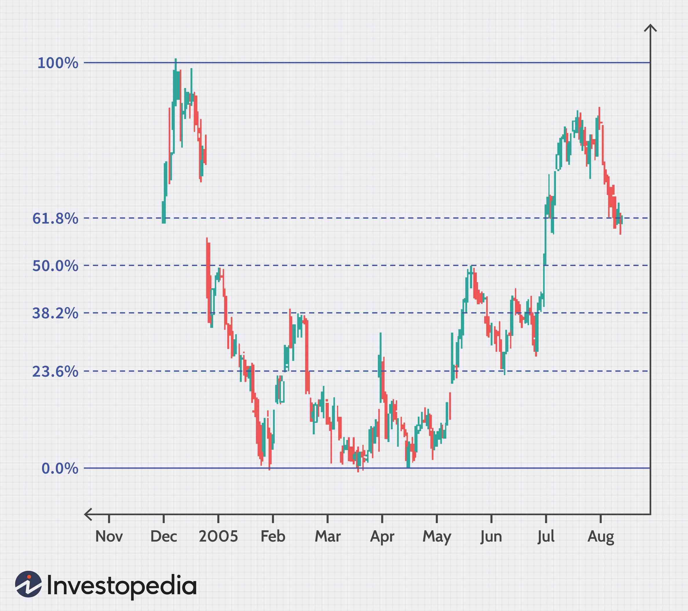

Fibonacci retracement is a popular tool in technical analysis used to predict potential areas of support and resistance by utilizing horizontal lines. These lines correspond to the key Fibonacci levels before the price continues in the original direction. The primary Fibonacci levels are derived from the Fibonacci sequence, named after the Italian mathematician Leonardo of Pisa, known as Fibonacci. The sequence itself is a series of numbers where each number is the sum of the two preceding ones, starting from 0 and 1. The ratios used for analysis—23.6%, 38.2%, and 61.8%—are derived from this sequence due to their tendency to reflect support/resistance levels in financial markets.

The significance of Fibonacci ratios lies in their consistency across various market conditions, making them a common choice among traders who seek guidance in predicting future price movements. Markets, whether forex, stocks, or commodities, often exhibit levels where prices retract before continuing along their trend. By applying these ratios, analysts aim to identify these potential levels where a price retracement might change its course, thereby informing buy or sell decisions.



Algorithmic trading involves the use of computer algorithms to automate trading strategies. This practice is increasingly prevalent in modern financial markets due to its efficiency, precision, and capacity to process vast amounts of data much faster than manual trading methods. Algorithms can be programmed to execute trades when certain technical indicators reach specified levels, thus reducing human error and emotional interference in trading decisions.

This article aims to explore the intersection of Fibonacci retracement and algorithmic trading. It will examine how the identification of Fibonacci levels can be translated into algorithmic rules to automate trading decisions, thereby combining the mathematical precision of Fibonacci analysis with the computational power of algorithms. The articles will also discuss the historical application of Fibonacci retracement, the dynamics of algorithmic trading in today’s markets, and how the integration of the two may enhance trading strategies.

The topics covered throughout the article will include an understanding of Fibonacci retracement; the role of Fibonacci ratios in market analysis; an introduction to algorithmic trading; methods of integrating Fibonacci retracement into trading algorithms; real-world case studies; and future trends in Fibonacci and algorithmic trading. The interplay between these analytic techniques and algorithmic trading presents opportunities for new trading strategies that leverage historical mathematical insights with cutting-edge technology.

## Table of Contents

## Understanding Fibonacci Retracement

The Fibonacci sequence, named after the Italian mathematician Leonardo of Pisa, more famously known as Fibonacci, is an integer sequence characterized by each number being the sum of the two preceding ones. It begins with 0 and 1, resulting in the sequence: 0, 1, 1, 2, 3, 5, 8, 13, and so on. Mathematically, it can be defined as:

$$
F(n) = F(n-1) + F(n-2)
$$

with initial conditions $F(0) = 0$ and $F(1) = 1$. This sequence has immense historical significance, spanning applications from natural systems to market theory due to its unique property of mathematical beauty and proportion.

Fibonacci retracement is a technical analysis tool used to predict potential support and resistance levels in financial markets. Derived from the Fibonacci sequence, key levels are calculated by taking two extreme points, known as high and low, in a chart and dividing the vertical distance by key Fibonacci ratios: 23.6%, 38.2%, 50%, 61.8%, and 78.6%. These levels indicate potential price reversal zones, guiding traders to anticipate market behavior.

- **23.6% Level**: Often seen as an immediate correction level after a strong price move. It reflects minor pullbacks.
- **38.2% Level**: A more substantial correction level, often marking the first major pullback.
- **50% Level**: Not a Fibonacci ratio but included due to its market significance as a median retracement.
- **61.8% Level**: Known as the "Golden Ratio" level, suggesting a stronger reversal point.
- **78.6% Level**: Typically signals a deeper retracement, nearing the previous trend's start.

Traders employ Fibonacci retracement by identifying these key levels to make informed predictions about future price movements. For instance, in an upward trending market, retracement lines can act as support where prices are likely to bounce back. Conversely, in downward trends, these lines serve as resistance, indicating potential price decline zones.

A historical example includes the retracement applied to the S&P 500 index. During significant bullish or bearish market phases, Fibonacci levels have projected areas of price consolidation or reversal, assisting traders in decision-making processes.

Despite its utility, Fibonacci retracement has pros and cons. One advantage is its simplicity and ease of use, allowing traders to apply it across various markets like stocks, [forex](/wiki/forex-system), and commodities. It also helps in determining entry and [exit](/wiki/exit-strategy) points effectively. However, its subjective nature is a drawback, as traders need to select the correct high and low points. Furthermore, these retracement levels are not always effective, especially during volatile market conditions. This subjectivity requires discipline and combined use of other technical analysis tools to increase reliability.

In conclusion, understanding and applying Fibonacci retracement in trading helps identify key market levels, offering significant insight into potential market reversals. Still, traders must consider its limitations and complement it with other analytical methods to minimize risk and maximize reward.

## The Role of Fibonacci Ratios in Market Analysis

Fibonacci ratios, which are derived from the Fibonacci sequence, play a significant role in technical market analysis. The Fibonacci sequence is a series of numbers where each number is the sum of the two preceding ones, typically starting with 0 and 1. Mathematically, this sequence is represented as $F(n) = F(n-1) + F(n-2)$. From this sequence, several key ratios are derived, most notably 23.6%, 38.2%, 50%, 61.8%, and 78.6%. These ratios are calculated by dividing a number in the Fibonacci series by another number in the sequence, for instance, the 61.8% ratio—often used in retracement levels—originates from dividing a Fibonacci number by its subsequent number, e.g., $\lim_{{n \to \infty}}\frac{F(n)}{F(n+1)} = 0.618034$.

Applying these ratios in financial markets helps traders identify potential reversal levels where prices may retrace before continuing in the primary direction. In the forex market, Fibonacci retracements are frequently used to decipher support and resistance levels. Similarly, in stock markets, these levels assist in predicting potential pivot points where market trends may change direction. For commodities, these retracement levels aid traders in evaluating correction levels based on recent price movements.

Historical case studies demonstrate the predictive power of Fibonacci ratios. For example, during the 2009 stock market recovery post-global financial crisis, Fibonacci retracement levels were used by traders to identify crucial support and resistance areas in major indices such as the S&P 500. Traders observed how the 61.8% retracement level became a decisive point for market reversals, showcasing the significance of Fibonacci levels in market prediction.

Comparing Fibonacci retracement with other technical analysis tools, such as moving averages and Relative Strength Index (RSI), reveals distinct advantages and limitations. While moving averages smooth out price data to identify trends, Fibonacci retracements specifically target potential points of reversal. Meanwhile, RSI offers insights into overbought or oversold conditions. Unlike these tools, Fibonacci retracement emphasizes historical price levels, anticipating where price movements might pause or reverse, thus providing a geometric perspective absent in [momentum](/wiki/momentum)-based indicators.

In summary, Fibonacci ratios offer a unique framework for market analysis across various financial sectors, identifying levels that often correspond to significant market activity, and complement other technical tools by predicting potential points of price reversal.

 to Algorithmic Trading

Algorithmic trading, often referred to as algo trading, is the use of computer programs to automate trading activities and strategies. By predefining rules based on timing, price, quantity, or any mathematical model, traders can execute orders at speeds and frequencies unachievable by humans. This automation has revolutionized financial markets, increasing their efficiency and accessibility.

Algorithmic trading's significance has grown over the years, with its strategies accounting for a substantial portion of market transactions. According to a study by the Securities and Exchange Commission (SEC), [algorithmic trading](/wiki/algorithmic-trading) was responsible for approximately 50% of stock market transactions in the United States. This dominance underscores its role in shaping market dynamics and influencing price discovery.

**Types of Algorithms Used in Trading:**

1. **Market-Making Algorithms:** These algorithms provide liquidity to the markets by continuously quoting buy and sell prices. This helps in narrowing the bid-ask spread, ensuring that there is minimal price discrepancy over time. Market makers earn through the bid-ask spread, maintaining sufficient inventory to manage risks from price swings.

2. **Trend-Following Algorithms:** These strategies capitalize on the movement of market prices in a particular direction over time. Classic techniques involve the use of moving averages or channel breakouts. If a stock price moves above a moving average, the algorithm might execute a buy order. Trend-following does not forecast prices; instead, it seeks to ride the wave of a trend until its exhaustion.

3. **Arbitrage Algorithms:** These algorithms exploit the price differences of the same asset in different markets. By simultaneously buying low and selling high, traders can lock in profits with minimal risk. Arbitrage strategies often require rapid execution speeds and are popular in markets with high transaction volumes.

**Advantages and Challenges of Algo Trading:**

**Advantages:**

- **Speed and Precision:** Algorithms can process vast amounts of data and execute orders in microseconds. This capability is crucial in high-frequency trading, where milliseconds can yield significant competitive advantages.

- **Reduction of Human Error:** Automation eliminates emotional decision-making from trading, ensuring that strategies are executed as planned.

- **Backtesting Capabilities:** Algorithms can be programmed to simulate trading strategies using historical data, providing insights into their potential effectiveness before capital is risked.

**Challenges:**

- **Complexity and Maintenance:** Developing and maintaining robust trading algorithms require significant expertise in both programming and financial markets. Bugs or small errors can lead to substantial financial losses.

- **Market Volatility and Flash Crashes:** Algo trading can exacerbate market volatility, as seen in events like the 2010 Flash Crash, where automated trading systems contributed to a rapid market downturn.

**Regulatory Considerations and Impact on Market Dynamics:**

Regulators have increasingly scrutinized algorithmic trading due to its potential to disrupt financial markets. In the United States, the Commodity Futures Trading Commission (CFTC) and the SEC have developed rules to oversee automated trading activities. These regulations aim to ensure fairness, transparency, and stability in the markets.

One key regulatory requirement is pre-trade risk control, which seeks to prevent erroneous orders from reaching the market. Additionally, there are obligations for firms to have robust risk management processes and systems that can handle stress tests and extreme market conditions.

Algorithmic trading continues to evolve with advances in technology and data analysis. Its integration into financial systems is likely to grow, driven by innovations in [artificial intelligence](/wiki/ai-artificial-intelligence) and [machine learning](/wiki/machine-learning), which promise to enhance the predictive capabilities of trading algorithms. However, with this progress comes the need for ongoing regulatory oversight to mitigate risks and ensure the stability and integrity of financial markets.

## Integrating Fibonacci Retracement with Algorithmic Trading

Integrating Fibonacci retracement with algorithmic trading offers a sophisticated approach to financial market analysis, leveraging historical price trends to inform automated decision-making. Here, we explore how to code Fibonacci retracement levels into trading algorithms, examine the benefits of real-time application, and address common pitfalls.

### Coding Fibonacci Retracement Levels

Fibonacci retracement levels, used to predict potential reversal points in markets, are derived from the Fibonacci sequence. These levels typically include 23.6%, 38.2%, 50%, 61.8%, and 78.6%. To code these levels into a trading algorithm, we start by identifying a significant price movement, either upward or downward. Then, the retracement levels are calculated using this movement. Below is an example using Python:

```python
def calculate_fibonacci_levels(high, low):
    difference = high - low
    levels = {
        '23.6%': high - difference * 0.236,
        '38.2%': high - difference * 0.382,
        '50%': high - difference * 0.500,
        '61.8%': high - difference * 0.618,
        '78.6%': high - difference * 0.786,
    }
    return levels

# Example usage
high_price = 150
low_price = 100
fibonacci_levels = calculate_fibonacci_levels(high_price, low_price)
print(fibonacci_levels)
```

### Benefits of Real-Time Fibonacci Analysis

Using algorithms to apply Fibonacci analysis in real-time trading confers several advantages. Firstly, algorithms can process large amounts of data quickly and consistently, identifying potential retracement levels faster than manual analysis. This speed allows traders to capitalize on short-lived market opportunities. Additionally, algorithms can operate continuously, ensuring that no market movement is missed, which is particularly crucial in high-frequency trading environments.

Furthermore, automating Fibonacci analysis eliminates human error and emotional bias, fostering a disciplined approach to trading. Algorithms can be backtested on historical data, honing their effectiveness before real-world deployment.

### Examples of Fibonacci-Based Trading Strategies

Several strategies integrate Fibonacci retracement into high-frequency trading. One common approach is the trend-following strategy, where an algorithm identifies retracement levels within a prevailing trend and executes trades based on these levels, buying on retracements within an uptrend and selling on retracements within a downtrend.

Another strategy involves using Fibonacci retracement levels to set stop-loss and take-profit points in momentum trading. Here, the algorithm calculates retracement levels to dynamically adjust these points as the market price changes, optimizing risk management.

### Common Pitfalls and Mitigation

Despite their benefits, trading algorithms using Fibonacci retracement can encounter challenges. One common pitfall is overfitting, where an algorithm is tailored too closely to historical data, reducing its effectiveness in real-time market conditions. To mitigate this, it is essential to employ cross-validation techniques and avoid overly complex models that might not generalize well.

Another challenge is the false signal, where markets may briefly touch Fibonacci levels without true intention to reverse trend. Incorporating additional technical indicators, such as moving averages or RSI (Relative Strength Index), can help confirm retracement signals and enhance algorithm reliability.

Finally, market [volatility](/wiki/volatility-trading-strategies) can render Fibonacci levels less predictive. Algorithms should be adaptable, incorporating volatility metrics to adjust sensitivity to retracement levels dynamically, ensuring robustness across different market conditions.

By integrating Fibonacci retracement into algorithmic trading frameworks, traders can leverage historical price structures to inform dynamic and disciplined trading strategies. With careful implementation and ongoing refinement, these systems hold the potential to significantly improve trading performance.

## Case Studies and Real-World Applications

Successful implementation of Fibonacci algo-trading strategies by hedge funds is often highlighted to illustrate the potential of blending traditional technical analysis with advanced technological tools. Hedge funds have historically utilized these strategies to enhance precision in market entry and exit points. For example, Renaissance Technologies, known for its quantitative strategy-driven investment approach, has been reported to employ Fibonacci retracement as part of a diversified portfolio of trading algorithms. While the specific algorithms are proprietary, the integration likely involves coding the Fibonacci levels into a larger framework that evaluates numerous other factors, enabling the high-frequency trading operations that the fund is renowned for.

Nevertheless, not all implementations of Fibonacci-based algorithms achieve success. Lessons from failed Fibonacci-based trading algorithms emphasize the importance of context and adaptability. Some hedge funds discovered that rigid reliance on Fibonacci retracement without considering broader market conditions led to suboptimal trading decisions. Market anomalies or sudden geopolitical events can disrupt patterns that Fibonacci analysis would otherwise suggest. This highlights the need for a more holistic approach in algorithmic design, integrating [fundamental analysis](/wiki/fundamental-analysis) and real-time news sentiment to adjust strategies dynamically.

Insights from professional traders further affirm the nuanced application of Fibonacci retracement in algo trading. Many traders view Fibonacci levels as psychological markers rather than deterministic predictors. This perspective underlines the importance of using Fibonacci retracement in conjunction with other technical indicators such as moving averages, Relative Strength Index (RSI), and Bollinger Bands. Practical experiences shared by traders indicate that monitoring multiple signals provides a more robust framework for decision-making in algorithmic trading environments.

For those interested in coding Fibonacci retracement into their algorithms, Python is often the preferred language due to its ease of use and extensive libraries for quantitative finance. A basic implementation might involve using a library like `numpy` for numerical operations and `pandas` for handling time-series data:

```python
import numpy as np
import pandas as pd

# Example price data
prices = pd.Series([100, 105, 102, 108, 112, 107, 115])

# Calculate Fibonacci retracement levels
def fibonacci_retracement(low, high):
    diff = high - low
    levels = [high - diff * ratio for ratio in [0.236, 0.382, 0.500, 0.618, 0.786]]
    return levels

low, high = min(prices), max(prices)
fibo_levels = fibonacci_retracement(low, high)

print("Fibonacci retracement levels:", fibo_levels)
```

In summary, while Fibonacci retracement can provide valuable insights into market psychology, its integration into algorithmic trading demands a sophisticated approach that accounts for market variability and complements other analytical techniques. The future of Fibonacci-based algorithmic trading will likely involve further enhancements through artificial intelligence, offering adaptive learning models that refine trading decisions in ever-evolving financial landscapes.

## Future Trends in Fibonacci and Algo Trading

Artificial intelligence (AI) is playing an increasingly pivotal role in the development and implementation of Fibonacci-based trading algorithms. AI's capabilities in pattern recognition, data analysis, and adaptive learning provide significant enhancements to these trading strategies. Machine learning models can analyze historical price data to identify recurring Fibonacci retracement patterns that may not be immediately apparent to human traders. By leveraging AI, traders can fine-tune algorithms to better predict market movements and adjust strategies in real-time, enhancing decision-making processes and improving profitability.

Looking forward, the integration of technical analysis, including Fibonacci tools, with algorithmic trading is expected to deepen. As market data and computational power continue to expand, algorithms can process larger volumes of information at greater speeds, allowing for more sophisticated trading strategies. This convergence will likely lead to a more systematic approach in trading, where decision-making is increasingly driven by complex algorithms rather than intuition alone. This shift holds the potential to increase market efficiency but may also intensify competition among traders using similar strategies.

Emerging technologies such as quantum computing and blockchain are also poised to impact Fibonacci and algorithmic trading. Quantum computing, with its immense processing capabilities, could revolutionize the speed and complexity of calculations, enabling more intricate Fibonacci-based algorithms. Meanwhile, blockchain technology may offer enhanced security and transparency in trade execution, fostering trust in automated trading environments.

Potential regulatory changes present both challenges and opportunities for Fibonacci algorithmic trading. As governments and financial watchdogs around the globe assess the implications of high-frequency and AI-driven trading, they may introduce new regulations to ensure market stability and protect investors. These regulations could mandate increased transparency in algorithmic operations or impose limitations on algorithmic trading practices. However, a well-regulated environment might encourage broader adoption and trust in algorithm-driven strategies, including those incorporating Fibonacci retracements, thereby transforming them from a niche tool to a standard component of the trader's toolkit.

In conclusion, the future of Fibonacci and algorithmic trading is poised for significant growth, driven by advancements in AI, computational technologies, and evolving regulatory landscapes. As these elements converge, traders who effectively harness these tools stand to gain a competitive edge in increasingly data-driven financial markets.

## Conclusion

Fibonacci retracement has proven to be a valuable tool in technical analysis, offering insights into potential support and resistance levels in various financial markets. The integration of these levels into algorithmic trading strategies opens up new avenues for traders seeking to enhance their decision-making processes with historical and mathematical underpinnings. By analyzing price movements through the lens of Fibonacci ratios, algorithms can potentially execute trades with increased precision and timing, optimizing the chances for success.

Despite its benefits, the integration of Fibonacci retracement within algorithmic trading systems requires careful consideration. The inherent assumptions underlying Fibonacci analysis—that market movements often adhere to the predefined levels of retracement—need to be critically evaluated, as markets can be irrational and influenced by diverse factors beyond historical price data. The development of robust trading algorithms that incorporate Fibonacci levels necessitates thorough [backtesting](/wiki/backtesting) and simulations to mitigate potential pitfalls and adapt to market dynamics.

For traders interested in exploring Fibonacci-based algorithmic trading strategies, experimenting with different combinations and settings can lead to valuable insights. Utilizing platforms such as MetaTrader or languages like Python can facilitate this exploration. Python libraries like `TA-Lib` can be specifically helpful in implementing technical analysis tools, including Fibonacci retracement.

Further reading for those keen on expanding their understanding of technical analysis and algorithmic trading can include [books](/wiki/algo-trading-books) such as "Technical Analysis of the Financial Markets" by John J. Murphy and "Algorithmic Trading: Winning Strategies and Their Rationale" by E.P. Chan. Online resources from platforms like Investopedia and specialized trading courses can also offer foundational knowledge and advanced techniques.

In conclusion, while Fibonacci retracement provides a promising framework for algorithmic trading, its effectiveness relies heavily on strategic implementation and continuous adaptation to evolving market conditions. As artificial intelligence and machine learning technologies continue to evolve, they present an exciting opportunity to refine and enhance these strategies, potentially leading to more sophisticated and adaptive trading systems in the future. Encouraged by these prospects, traders are called to actively engage in learning and experimenting, contributing to the ever-evolving landscape of financial markets.

## References & Further Reading

[1]: Murphy, J. J. (1999). ["Technical Analysis of the Financial Markets: A Comprehensive Guide to Trading Methods and Applications"](https://archive.org/details/technicalanalysi0000murp). New York Institute of Finance.

[2]: Chan, E. P. (2009). ["Quantitative Trading: How to Build Your Own Algorithmic Trading Business"](https://github.com/ftvision/quant_trading_echan_book). John Wiley & Sons.

[3]: Pring, M. J. (2002). ["Technical Analysis Explained: The Successful Investor's Guide to Spotting Investment Trends and Turning Points"](https://www.amazon.com/Technical-Analysis-Explained-Fifth-Successful/dp/0071825177). McGraw-Hill Education.

[4]: Aronson, D. R. (2007). ["Evidence-Based Technical Analysis: Applying the Scientific Method and Statistical Inference to Trading Signals"](https://www.amazon.com/Evidence-Based-Technical-Analysis-Scientific-Statistical/dp/0470008741). Wiley Trading.

[5]: Lopez de Prado, M. (2018). ["Advances in Financial Machine Learning"](https://books.google.com/books/about/Advances_in_Financial_Machine_Learning.html?id=oU9KDwAAQBAJ). Wiley.

[6]: Jansen, S. (2018). ["Machine Learning for Algorithmic Trading: Predictive Models to Extract Signals from Market and Alternative Data for Systematic Trading Strategies with MATLAB and Python"](https://en.wikipedia.org/wiki/Mark_Jansen). Packt Publishing.