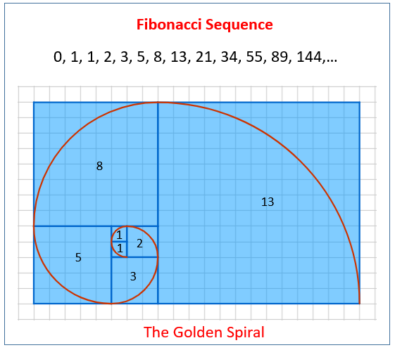

## Table of Contents

## What is the Fibonacci sequence?

The Fibonacci sequence is a series of numbers where each number is the sum of the two numbers that come before it. It starts with 0 and 1, so the sequence goes like this: 0, 1, 1, 2, 3, 5, 8, 13, and so on. This pattern continues forever, and you can find the next number by adding the last two numbers together.

People often see the Fibonacci sequence in nature, like in the way leaves grow on stems or the pattern of seeds in a sunflower. It's also used in math and computer science to solve problems and create algorithms. The sequence is named after Leonardo Fibonacci, an Italian mathematician who wrote about it in the early 1200s.

## How is the Fibonacci sequence generated?

The Fibonacci sequence is made by starting with the numbers 0 and 1. After that, you keep adding the last two numbers to get the next number in the sequence. So, you start with 0 and 1. Then, you add 0 and 1 to get 1. Next, you add 1 and 1 to get 2. Then, you add 1 and 2 to get 3. You keep doing this to make the sequence longer.

You can write this out as a formula too. If you call the numbers in the sequence F(n), where n is their place in the sequence, then F(0) = 0 and F(1) = 1. For any number after that, F(n) = F(n-1) + F(n-2). This means that to find the fifth number in the sequence, you add the third number and the fourth number together. This rule helps you find any number in the Fibonacci sequence, no matter how far you go.

## What are the first ten numbers in the Fibonacci sequence?

The first ten numbers in the Fibonacci sequence are 0, 1, 1, 2, 3, 5, 8, 13, 21, and 34. You start with 0 and 1. Then, you add the last two numbers to get the next number.

So, you add 0 and 1 to get 1. Then, you add 1 and 1 to get 2. Next, you add 1 and 2 to get 3. After that, you add 2 and 3 to get 5. Then, you add 3 and 5 to get 8. Next, you add 5 and 8 to get 13. After that, you add 8 and 13 to get 21. Finally, you add 13 and 21 to get 34. That's how you get the first ten numbers in the sequence.

## Where can the Fibonacci sequence be observed in nature?

You can see the Fibonacci sequence in nature in many places. One place is in the way plants grow. For example, the number of petals on a flower often follows the Fibonacci sequence. Sunflowers have seeds that are arranged in a pattern that follows the sequence. This helps the seeds pack together tightly so they can fit more seeds in the center of the flower. Pinecones and pineapples also have scales or bumps that follow the Fibonacci numbers, making them look more organized and efficient.

Another place you can see the Fibonacci sequence is in the way branches grow on trees or leaves grow on stems. If you count the number of times a branch splits off from the main stem, you might find it follows the Fibonacci sequence. Leaves are often arranged in a spiral around the stem, and the number of leaves in each turn of the spiral can be a Fibonacci number. This helps the leaves get more sunlight and space to grow. So, the Fibonacci sequence helps plants grow in a way that makes them strong and healthy.

## What is the golden ratio?

The golden ratio is a special number that you can find in math, art, and nature. It's about 1.618 and is often called "phi." You get the golden ratio when you divide a line into two parts so that the longer part divided by the shorter part is the same as the whole line divided by the longer part. This makes a special proportion that people think looks good and balanced.

In nature, you can see the golden ratio in the way some things grow. For example, the spiral patterns in a pinecone or the way petals are arranged in a flower often follow the golden ratio. In art, people like to use the golden ratio to make paintings and buildings look nice. They think it makes things more pleasing to look at because it's a pattern that shows up a lot in the world around us.

## How is the golden ratio related to the Fibonacci sequence?

The golden ratio and the Fibonacci sequence are connected in a special way. If you take any two numbers in the Fibonacci sequence that are next to each other and divide the bigger number by the smaller number, you get a number that gets closer and closer to the golden ratio as you go further along in the sequence. For example, if you divide 3 by 2, you get 1.5. If you divide 8 by 5, you get 1.6. The more you go along the sequence, the closer the answer gets to the golden ratio of about 1.618.

This connection shows up in nature and art. In nature, things like the spiral of a seashell or the way branches grow on a tree follow both the Fibonacci sequence and the golden ratio. In art, people use the golden ratio to make things look good because it's a pattern that's found a lot in nature. So, the Fibonacci sequence helps us see the golden ratio in the world around us.

## How can you calculate the golden ratio using Fibonacci numbers?

To calculate the golden ratio using Fibonacci numbers, you take any two numbers next to each other in the Fibonacci sequence. You divide the bigger number by the smaller number. As you go further along in the sequence, the answer gets closer and closer to the golden ratio. For example, if you divide 3 by 2, you get 1.5. If you divide 8 by 5, you get 1.6. The more you go along the sequence, the closer the answer gets to the golden ratio, which is about 1.618.

This way of calculating the golden ratio shows how the Fibonacci sequence and the golden ratio are connected. The golden ratio is a special number that people find in nature and use in art because it looks good and balanced. By using Fibonacci numbers, you can see how this special number shows up in the world around us.

## What is the significance of the golden ratio in art and architecture?

The golden ratio is important in art and architecture because it helps make things look good and balanced. People think that using the golden ratio makes art and buildings more pleasing to the eye. For example, in paintings, artists might use the golden ratio to decide where to put important parts of the picture. This makes the painting look more interesting and balanced. In architecture, builders might use the golden ratio to decide the size and shape of different parts of a building. This can make the building look more beautiful and harmonious.

You can see the golden ratio in famous buildings and artworks. For example, the Parthenon in Greece is said to follow the golden ratio in its design. The way the columns and the roof are sized and placed might use this special number to make the building look good. In art, the famous painting "Mona Lisa" by Leonardo da Vinci is thought to use the golden ratio too. The way her face and body are placed in the painting might follow this ratio to make her look more pleasing and balanced. So, the golden ratio is a tool that artists and architects use to make their work look better and more appealing.

## How does the golden ratio appear in the human body?

The golden ratio can be seen in the human body in different ways. People have found that some parts of the body follow this special number. For example, if you measure the distance from your shoulder to your fingertips and then from your elbow to your fingertips, the ratio of these two lengths is close to the golden ratio. Also, the length of your hand compared to the length of your forearm can show the golden ratio too. These measurements help show how the golden ratio appears in the way our bodies are built.

In the face, the golden ratio can also be seen. People have noticed that the ratio of the length of the face to the width of the face is sometimes close to the golden ratio. Also, the distance from the top of the head to the bottom of the eyebrows compared to the distance from the bottom of the eyebrows to the bottom of the chin can follow this ratio. These patterns make people think that the golden ratio is a part of what makes faces look good and balanced. So, the golden ratio is not just in math and nature, but it can also be seen in the human body.

## What are some mathematical properties of the Fibonacci sequence?

The Fibonacci sequence has some special math properties. One important property is that each number in the sequence is the sum of the two numbers before it. This means that if you know any two numbers in the sequence, you can find the next number by adding them together. For example, if you start with 0 and 1, the next number is 1 because 0 + 1 = 1. Then, the next number is 2 because 1 + 1 = 2. This pattern goes on forever.

Another property of the Fibonacci sequence is that it gets closer to the golden ratio as you go further along. If you take any two numbers next to each other in the sequence and divide the bigger number by the smaller number, the answer gets closer to about 1.618, which is the golden ratio. For example, if you divide 3 by 2, you get 1.5. If you divide 8 by 5, you get 1.6. The more you go along the sequence, the closer the answer gets to the golden ratio. This shows how the Fibonacci sequence and the golden ratio are connected.

## How does the Fibonacci sequence relate to the golden spiral?

The Fibonacci sequence helps make the golden spiral. You start by drawing squares with sizes that follow the Fibonacci numbers. So, you draw a square that is 1 unit by 1 unit, then another square that is 1 unit by 1 unit next to it. Then, you draw a square that is 2 units by 2 units next to those two squares. You keep going, drawing squares that are 3 units by 3 units, 5 units by 5 units, and so on. When you put these squares together, they make a pattern that grows bigger and bigger.

After you have the squares, you draw a spiral that goes through the corners of each square. This spiral is called the golden spiral because it follows the golden ratio. The golden ratio is a special number that is about 1.618. The way the spiral curves and grows bigger follows this special number. So, the Fibonacci sequence helps make the golden spiral, which you can see in things like seashells and galaxies.

## What are some advanced applications of the Fibonacci sequence and golden ratio in fields like finance or computer science?

In finance, the Fibonacci sequence and golden ratio are used in a way called Fibonacci retracement. This helps people who trade stocks and other things guess where prices might go next. They look at how far a price has gone up or down and use Fibonacci numbers to find places where the price might stop or change direction. For example, if a stock price goes up and then starts to go down, traders might use Fibonacci numbers to find levels where the price could stop going down and start going up again. This helps them decide when to buy or sell things, making their guesses about the future a bit more accurate.

In computer science, the Fibonacci sequence is used in algorithms and data structures. One way it's used is in the Fibonacci heap, which is a special kind of data structure. It helps make certain computer programs run faster by organizing information in a way that follows the Fibonacci sequence. This can be useful in things like finding the shortest path in a map or sorting a big list of numbers. The golden ratio also shows up in computer graphics and design, where it helps make things look good and balanced, just like in art and architecture.

## What is the relationship between the Fibonacci Sequence and the Golden Ratio in mathematics?

The Fibonacci sequence is a captivating mathematical construct that begins with the numbers 0 and 1. Each subsequent number in the sequence is the sum of the two preceding numbers, forming an infinite progression: 0, 1, 1, 2, 3, 5, 8, 13, 21, and so on. Mathematically, this can be expressed as:

$$
F(n) = F(n-1) + F(n-2)
$$

where $F(0) = 0$ and $F(1) = 1$.

As this sequence evolves, the ratio of consecutive Fibonacci numbers ($F(n+1)/F(n)$) converges towards an irrational constant known as the Golden Ratio, denoted by the Greek letter $\phi$ (phi). This value is approximately equal to 1.6180339887. The Golden Ratio can be derived using the quadratic equation:

$$
x^2 = x + 1
$$

Solving for $x$, we find:

$$
x = \frac{1 \pm \sqrt{5}}{2}
$$

Of which the positive solution $x = \frac{1 + \sqrt{5}}{2} \approx 1.618$ represents the Golden Ratio.

This ratio is celebrated for its visually pleasing properties, appearing across various natural phenomena, architectures like the Parthenon in Greece, famous artworks including those by Leonardo da Vinci, and even in the spirals of shells and galaxies. It is often associated with notions of symmetry and aesthetics, making it a subject of interest in various fields beyond mathematics.

Beyond its intriguing beauty, the Fibonacci sequence and the Golden Ratio possess practical applications in finance, particularly in the analysis of market trends. Traders and analysts often use these mathematical principles to predict potential support and resistance levels in financial markets, as these concepts tend to reflect natural human behavior patterns and psychological levels in trading activities. Understanding these mathematical foundations can provide a quantitative angle to evaluate market dynamics, enhancing the strategic decision-making process in trading.

## References & Further Reading

1. **Books:**
   - *“Technical Analysis of the Financial Markets”* by John J. Murphy: This comprehensive guide details various technical analysis indicators, including Fibonacci retracement and extension levels.
   - *“Fibonacci Trading: How to Master the Time and Price Advantage”* by Carolyn Boroden: This book offers practical guidance on applying Fibonacci strategies in trading.

2. **Academic Papers:**
   - R. E. Fisher and J. A. Osborn, “An Examination of the Fibonacci Sequence and its Relationship to Stock Market Movements,” Journal of Financial Economics, vol. 36, no. 2, 1998. This paper explores the application of the Fibonacci sequence in predicting stock market behaviors.
   - Lamberton, D., & Lapeyre, B. *“Introduction to Stochastic Calculus Applied to Finance,”* Springer, 1996. The text provides an in-depth view of stochastic processes applied to financial markets, offering context for understanding more complex indicators such as the Fibonacci sequence.

3. **Online Resources:**
   - *Investopedia: Fibonacci and the Golden Ratio in Stock Trading*. This article provides an easily accessible introduction to Fibonacci levels and their applications in trading.
   - *Khan Academy: Fibonacci Sequence*. A comprehensive educational resource explaining the mathematics and implications of the Fibonacci sequence and the Golden Ratio.
   - Python documentation on libraries such as NumPy and Pandas for implementing financial models incorporating Fibonacci techniques.

4. **Software Tools and Libraries:**
   - **MetaTrader 4/5**: Popular trading platforms that offer built-in Fibonacci tools for chart analysis.
   - **Python Packages**: Libraries like NumPy for numerical calculations and Matplotlib for data visualization can be employed to create scripts for analyzing Fibonacci retracement in markets. For example, using Python:

     ```python
     import numpy as np
     import matplotlib.pyplot as plt

     def fibonacci_retracement(price_high, price_low):
         levels = [0.236, 0.382, 0.5, 0.618, 0.786]
         fib_levels = [(price_high - (price_high - price_low) * level) for level in levels]
         return fib_levels

     high_price = 150
     low_price = 100
     print(fibonacci_retracement(high_price, low_price))
     ```

This compilation of [books](/wiki/algo-trading-books), articles, and tools serves as a foundation for those looking to deepen their understanding and application of the Fibonacci sequence and Golden Ratio in trading.

