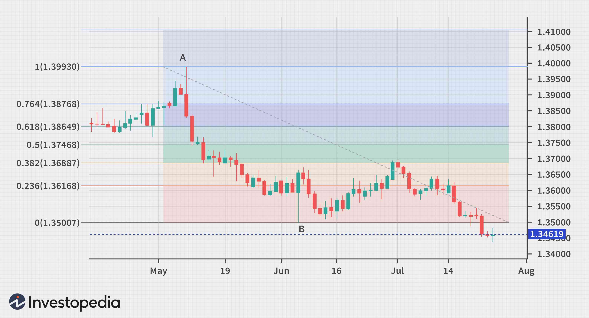

In the fast-paced world of trading, finding a reliable strategy can make a significant difference between profit and loss. Among the multitude of tools available, the Fibonacci sequence and the Golden Ratio have garnered attention for their mathematical elegance and practical applications in financial markets. The Fibonacci sequence begins with the numbers 0 and 1, with each subsequent number being the sum of the two preceding ones. Mathematically expressed, it follows the recursive formula:

$$
F(n) = F(n-1) + F(n-2)
$$



As this sequence progresses, the ratio of consecutive Fibonacci numbers tends to converge towards the irrational number known as the Golden Ratio, approximately 1.618, often denoted by the Greek letter φ (phi). This ratio is not only revered for its aesthetic properties but also due to its frequent appearance in nature, architecture, and art.

This article discusses the intersection of the Fibonacci sequence, the Golden Ratio, and algorithmic trading, offering insights into how these ancient mathematical principles can be leveraged for modern trading strategies. By examining the sequence's mathematical foundations and historical context, we uncover its significant value to traders and financial analysts. Our aim is to arm you with a comprehensive understanding and actionable insights that will enhance your trading toolkit, providing a competitive edge in the dynamic landscape of financial markets.

## Table of Contents

## Understanding the Mathematics: Fibonacci Sequence and Golden Ratio

The Fibonacci sequence is a captivating mathematical construct that begins with the numbers 0 and 1. Each subsequent number in the sequence is the sum of the two preceding numbers, forming an infinite progression: 0, 1, 1, 2, 3, 5, 8, 13, 21, and so on. Mathematically, this can be expressed as:

$$
F(n) = F(n-1) + F(n-2)
$$

where $F(0) = 0$ and $F(1) = 1$.

As this sequence evolves, the ratio of consecutive Fibonacci numbers ($F(n+1)/F(n)$) converges towards an irrational constant known as the Golden Ratio, denoted by the Greek letter $\phi$ (phi). This value is approximately equal to 1.6180339887. The Golden Ratio can be derived using the quadratic equation:

$$
x^2 = x + 1
$$

Solving for $x$, we find:

$$
x = \frac{1 \pm \sqrt{5}}{2}
$$

Of which the positive solution $x = \frac{1 + \sqrt{5}}{2} \approx 1.618$ represents the Golden Ratio.

This ratio is celebrated for its visually pleasing properties, appearing across various natural phenomena, architectures like the Parthenon in Greece, famous artworks including those by Leonardo da Vinci, and even in the spirals of shells and galaxies. It is often associated with notions of symmetry and aesthetics, making it a subject of interest in various fields beyond mathematics.

Beyond its intriguing beauty, the Fibonacci sequence and the Golden Ratio possess practical applications in finance, particularly in the analysis of market trends. Traders and analysts often use these mathematical principles to predict potential support and resistance levels in financial markets, as these concepts tend to reflect natural human behavior patterns and psychological levels in trading activities. Understanding these mathematical foundations can provide a quantitative angle to evaluate market dynamics, enhancing the strategic decision-making process in trading.

## Fibonacci Sequence in Algorithmic Trading

Fibonacci levels serve as critical tools in [algorithmic trading](/wiki/algorithmic-trading) for identifying potential reversal zones within markets. These levels are derived from percentages of the Fibonacci sequence, which include 23.6%, 38.2%, 50%, 61.8%, and 78.6%. They assist in predicting pivotal support and resistance zones, providing a framework for anticipating market fluctuations effectively.

Traders employ Fibonacci retracement tools to forecast where price pullbacks may encounter resistance before continuing in the original direction of the trend. Conversely, Fibonacci extension tools help project price movements beyond standard retracement levels, identifying potential target prices for continued trends.

Algorithmic trading systems integrate these Fibonacci-based levels to trigger buy or sell signals. For example, a system might execute a buy order when the price retraces to the 38.2% level, expecting a bounce back towards the original trend. These predefined mathematical levels enhance trading efficiency by allowing traders to capitalize on natural price movements governed by human psychology, which often reflects Fibonacci-esque patterns.

Here is a Python example illustrating how Fibonacci retracement levels may be calculated:

```python
def fibonacci_retracement(high, low):
    diff = high - low
    retracement_levels = {
        '23.6%': high - 0.236 * diff,
        '38.2%': high - 0.382 * diff,
        '50.0%': high - 0.500 * diff,
        '61.8%': high - 0.618 * diff,
        '78.6%': high - 0.786 * diff
    }
    return retracement_levels

# Example usage:
high_price = 200.0
low_price = 150.0
levels = fibonacci_retracement(high_price, low_price)
print(levels)
```

By implementing these Fibonacci techniques, traders can quantitatively evaluate market conditions and enhance their strategies. This quantitative assessment aids in refining market predictions and crafting more resilient trading strategies that respond adeptly to market dynamics. Leveraging such insights improves decision-making processes and enables traders to gain a competitive edge.

## Practical Insights into Fibonacci Techniques for Trading

Fibonacci retracement and extension levels are essential tools for identifying potential support and resistance zones in trading. These levels, derived from the Fibonacci sequence, help traders predict where a market might reverse its trend or where it might face resistance. By using these mathematical concepts, traders can enhance their strategies by pinpointing key price areas that are likely to prompt market action.

Traders often enhance the predictive power of Fibonacci levels by combining them with other technical indicators such as trend lines and moving averages. Trend lines help identify the overall direction of the market, while moving averages smooth out price data to identify common trends. The combination of these tools allows traders to analyze the market from multiple perspectives, increasing the accuracy of their predictions.

For example, when a Fibonacci retracement level coincides with a moving average or a trend line, it might signal a stronger support or resistance area. Traders look for these confluences to make more informed decisions. In practice, if a stock's price approaches a Fibonacci retracement level that aligns with a long-term moving average or a rising trend line, it could suggest a stronger likelihood of a price reversal or continuation. This multi-dimensional analysis provides traders with increased confidence in their trading strategy.

In modern trading environments, the use of software and scripting languages such as Python has greatly facilitated the automation of Fibonacci calculations. These tools allow for rapid analysis of market data, enabling traders to quickly identify Fibonacci levels and execute trades based on predefined criteria. Python, in particular, offers extensive libraries such as pandas and NumPy, which can efficiently handle and analyze large datasets, making it easier for traders to integrate Fibonacci techniques into their automated trading systems.

Here's an example of how Python can be used to calculate Fibonacci retracement levels:

```python
import numpy as np

# Assuming historical prices
prices = [100, 150, 130, 180, 160, 210]  # Example price points

# Calculate retracement levels
def calculate_fibonacci_retracements(high, low):
    difference = high - low
    levels = {
        '23.6%': high - difference * 0.236,
        '38.2%': high - difference * 0.382,
        '61.8%': high - difference * 0.618,
    }
    return levels

# Identify high and low from prices
high_price = max(prices)
low_price = min(prices)

# Calculate and display retracement levels
retracement_levels = calculate_fibonacci_retracements(high_price, low_price)
for level, value in retracement_levels.items():
    print(f"Fibonacci {level} retracement level: {value:.2f}")
```

This script calculates common Fibonacci retracement levels based on a given range of historical prices. Traders can further enhance this script by integrating it with live market data sources, allowing for real-time trading decisions.

By incorporating these advanced techniques, traders can develop more robust and nuanced trading strategies, benefiting from the rich interplay of mathematical concepts and technological tools.

## Advanced Considerations: Machine Learning and Fibonacci

Recent advancements in technology have facilitated the integration of [machine learning](/wiki/machine-learning) with Fibonacci techniques, enhancing trading models significantly. Machine learning algorithms, particularly those based on supervised and unsupervised learning paradigms, have the ability to process extensive datasets to unveil intricate patterns and correlations which conventional analysis might overlook.

Machine learning's ability to analyze large volumes of historical market data allows it to recognize specific patterns associated with Fibonacci levels. These algorithms can detect recurring price behaviors near Fibonacci retracement and extension levels, thereby improving the timing and accuracy of market entry and [exit](/wiki/exit-strategy) points. This predictive capability is crucial in volatile markets where price reversals and trends can have substantial impact.

Combining machine learning with Fibonacci indicators enables traders to refine their market forecasts with increased precision. For example, using machine learning models like neural networks or support vector machines, traders can classify market conditions and predict future price movements more reliably than using Fibonacci tools alone. By continuously learning and adapting to evolving market conditions, these models provide updated insights into market behavior, allowing traders to adjust strategies promptly.

Python, a popular programming language in the fields of data science and algorithmic trading, offers numerous libraries like pandas for data manipulation and scikit-learn for implementing machine learning models. Here's a simple example to illustrate how Fibonacci retracement levels might be incorporated into a basic machine learning model for predicting market trends:

```python
import pandas as pd
from sklearn.model_selection import train_test_split
from sklearn.ensemble import RandomForestClassifier

# Load historical market data
data = pd.read_csv('market_data.csv')

# Feature engineering: Calculate Fibonacci retracement levels
def calculate_fibonacci_levels(prices):
    max_price = prices.max()
    min_price = prices.min()
    diff = max_price - min_price
    return {
        '23.6%': min_price + diff * 0.236,
        '38.2%': min_price + diff * 0.382,
        '50.0%': min_price + diff * 0.500,
        '61.8%': min_price + diff * 0.618,
        '78.6%': min_price + diff * 0.786,
    }

# Prepare dataset with Fibonacci levels as features
data['Fibo_23.6'] = calculate_fibonacci_levels(data['Close'])['23.6%']
data['Fibo_38.2'] = calculate_fibonacci_levels(data['Close'])['38.2%']
# Add more Fibonacci levels as needed

# Define target variable (e.g., price increase)
data['Target'] = (data['Close'].shift(-1) > data['Close']).astype(int)

# Split data into training and testing sets
X_train, X_test, y_train, y_test = train_test_split(data[['Close', 'Fibo_23.6', 'Fibo_38.2']], data['Target'], test_size=0.2, random_state=42)

# Train the model
model = RandomForestClassifier()
model.fit(X_train, y_train)

# Predict and evaluate
predictions = model.predict(X_test)
accuracy = (predictions == y_test).mean()
print(f"Model accuracy: {accuracy:.2f}")
```

The synthesis of machine learning and Fibonacci techniques marks a promising enhancement in algorithmic trading, bolstering the ability to predict market trends with increased accuracy. This approach not only amplifies the robustness of trading strategies but also paves the way for continued innovation as more data becomes available and computational techniques evolve.

## Conclusion

The Fibonacci sequence and Golden Ratio serve as foundational elements in both natural and mathematical contexts, offering substantial practical applications in finance. These concepts, characterized by the recursive nature of the Fibonacci sequence $F(n) = F(n-1) + F(n-2)$ and the aesthetically pleasing properties of the Golden Ratio $\phi \approx 1.618$, enhance traders' ability to predict market trends with improved accuracy. By incorporating these mathematical tools into their analyses, traders can potentially refine their strategies and achieve superior trading outcomes.

The integration of traditional mathematical concepts like the Fibonacci sequence with cutting-edge technologies such as machine learning heralds a new era in algorithmic trading. Machine learning algorithms have the capability to process significant amounts of historical and real-time market data. This allows for a sophisticated analysis that can detect patterns and correlations, areas where traditional techniques might falter. By leveraging these patterns in conjunction with Fibonacci indicators, models can be optimized for greater precision in market forecasting, thus adapting more effectively to evolving market conditions.

Traders are encouraged to incorporate these robust strategies into their trading activities. Exploring the synergy between time-tested mathematical principles and modern technology can unlock new potentials, offering a strategic edge in the competitive landscape of financial markets. Embracing these advancements, underpinned by the deep-seated relationship between mathematics and finance, can propel traders toward innovative and lucrative opportunities.

## References & Further Reading

1. **Books:**
   - *“Technical Analysis of the Financial Markets”* by John J. Murphy: This comprehensive guide details various technical analysis indicators, including Fibonacci retracement and extension levels.
   - *“Fibonacci Trading: How to Master the Time and Price Advantage”* by Carolyn Boroden: This book offers practical guidance on applying Fibonacci strategies in trading.

2. **Academic Papers:**
   - R. E. Fisher and J. A. Osborn, “An Examination of the Fibonacci Sequence and its Relationship to Stock Market Movements,” Journal of Financial Economics, vol. 36, no. 2, 1998. This paper explores the application of the Fibonacci sequence in predicting stock market behaviors.
   - Lamberton, D., & Lapeyre, B. *“Introduction to Stochastic Calculus Applied to Finance,”* Springer, 1996. The text provides an in-depth view of stochastic processes applied to financial markets, offering context for understanding more complex indicators such as the Fibonacci sequence.

3. **Online Resources:**
   - *Investopedia: Fibonacci and the Golden Ratio in Stock Trading*. This article provides an easily accessible introduction to Fibonacci levels and their applications in trading.
   - *Khan Academy: Fibonacci Sequence*. A comprehensive educational resource explaining the mathematics and implications of the Fibonacci sequence and the Golden Ratio.
   - Python documentation on libraries such as NumPy and Pandas for implementing financial models incorporating Fibonacci techniques.

4. **Software Tools and Libraries:**
   - **MetaTrader 4/5**: Popular trading platforms that offer built-in Fibonacci tools for chart analysis.
   - **Python Packages**: Libraries like NumPy for numerical calculations and Matplotlib for data visualization can be employed to create scripts for analyzing Fibonacci retracement in markets. For example, using Python:

     ```python
     import numpy as np
     import matplotlib.pyplot as plt

     def fibonacci_retracement(price_high, price_low):
         levels = [0.236, 0.382, 0.5, 0.618, 0.786]
         fib_levels = [(price_high - (price_high - price_low) * level) for level in levels]
         return fib_levels

     high_price = 150
     low_price = 100
     print(fibonacci_retracement(high_price, low_price))
     ```

This compilation of [books](/wiki/algo-trading-books), articles, and tools serves as a foundation for those looking to deepen their understanding and application of the Fibonacci sequence and Golden Ratio in trading.

