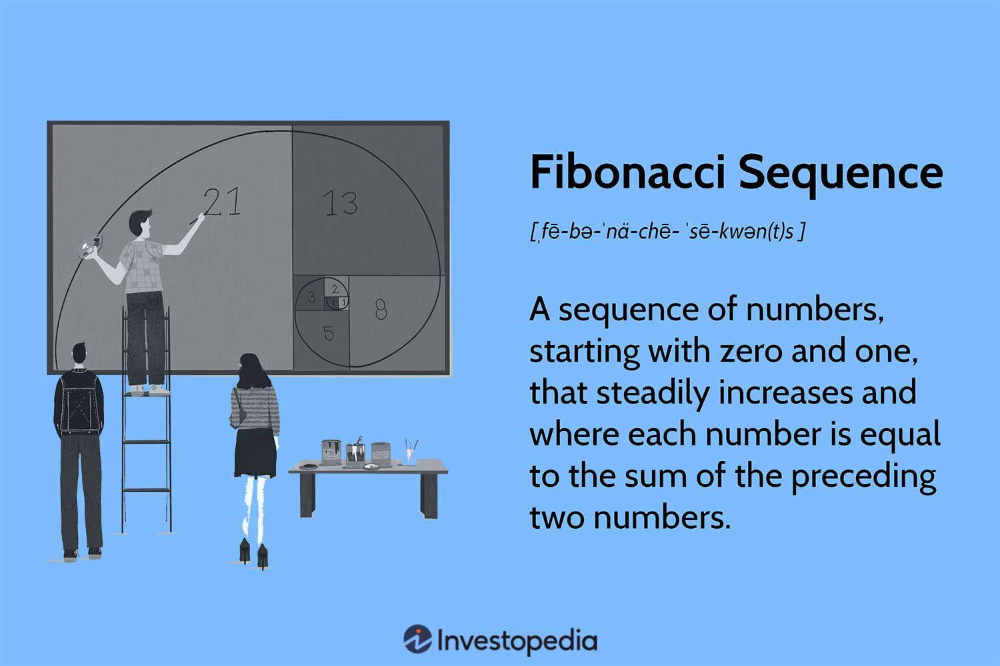

Number theory, a fundamental branch of pure mathematics, explores the properties and relationships of numbers, particularly integers. It forms the backbone for many mathematical concepts, one of which is the Fibonacci sequence. Named after the Italian mathematician Leonardo of Pisa, known as Fibonacci, this sequence begins with the numbers 0 and 1, and each subsequent number is the sum of the two preceding ones. Despite its simple formulation, the Fibonacci sequence leads to profound insights in mathematics, including connections to the golden ratio, denoted by the Greek letter phi (φ), approximately equal to 1.618. This relationship is evident as the ratio of successive Fibonacci numbers converges to the golden ratio.

The Fibonacci sequence is not just of theoretical interest. Its presence in various natural phenomena, such as the branching of trees, the arrangement of leaves on a stem, and the spirals of shells, highlights its ubiquitous nature. However, the sequence's utility extends beyond nature and academia into the financial markets, particularly in algorithmic trading. Traders use Fibonacci ratios to predict potential reversal points in financial markets, making it a vital tool for those looking to anticipate market behavior.



In the subsequent sections of this article, readers will explore the foundational concepts of number theory and the Fibonacci sequence, delve into their mathematical intricacies, and understand their real-world applications in algorithmic trading. From understanding how Fibonacci retracement levels guide traders to exploring advanced techniques in quantitative finance, this article offers insights that bridge theoretical mathematics with practical trading strategies.

## Table of Contents

## The Basis of Number Theory and Fibonacci Sequence

Number theory, one of the oldest branches of mathematics, traces its roots back to ancient civilizations, notably the Greeks and the Indians. Its study revolves around the properties and relationships of numbers, particularly integers. The fascination with number sequences, prime numbers, and the fundamental nature of numbers led to developments in various other fields, including algebra and analysis.

The Fibonacci sequence, named after Leonardo of Pisa, known as Fibonacci, is a sequence that has intrigued mathematicians for centuries. Fibonacci introduced the sequence to Western mathematics through his 1202 book, "Liber Abaci," although it was previously described in Indian mathematics. The sequence is defined by the recurrence relation:

$$
F(n) = F(n-1) + F(n-2)
$$

with the initial conditions $F(0) = 0$ and $F(1) = 1$. This results in a series starting as 0, 1, 1, 2, 3, 5, 8, 13, 21, and so on.

Fibonacci numbers appear in various natural phenomena. For instance, the arrangement of leaves on a stem, the pattern of florets in a flower, and the fruit spirals of pinecones all exhibit patterns and numbers that correspond to the Fibonacci sequence. This sequence's prevalence in nature is often attributed to the efficiency it provides in terms of growth patterns and energy distribution.

A fascinating mathematical property of the Fibonacci sequence is its connection to the golden ratio $\phi$, approximately 1.6180339887. As the Fibonacci sequence progresses, the ratio of consecutive Fibonacci numbers approaches the golden ratio. This is expressed mathematically as:

$$
\lim_{n \to \infty} \frac{F(n+1)}{F(n)} = \phi
$$

This connection also manifests in geometry, notably in the dimensions of the golden rectangle, which have been historically employed in art and architecture to achieve aesthetic proportions. The golden ratio is observed in numerous architectural structures, such as the Parthenon and modern skyscrapers, and is believed to create a harmonious balance that is pleasing to the eye.

In summary, the Fibonacci sequence not only serves as a classic topic of interest in number theory but also finds its remarkable resonances across natural and human-made environments due to its inherent mathematical properties and its underlying principle of growth and harmony.

## Fibonacci Sequence in Mathematics

The Fibonacci sequence is a series of numbers where each number is the sum of the two preceding ones, often starting with 0 and 1. Mathematically, it is expressed as:

$$
F(n) = F(n-1) + F(n-2)
$$

with initial conditions $F(0) = 0$ and $F(1) = 1$. This sequence has fascinating mathematical properties and a captivating relationship with the golden ratio, denoted by the Greek letter $\phi$ (phi), approximately 1.618.

### Mathematical Properties

One of the remarkable features of the Fibonacci sequence is its connection with the golden ratio. The ratio of successive Fibonacci numbers $F(n+1)/F(n)$ converges to the golden ratio as n approaches infinity. This relationship can be shown by solving the Fibonacci recurrence relation through the characteristic equation approach, yielding:

$$
\phi = \frac{1 + \sqrt{5}}{2}
$$

The closed-form expression, known as Binet's formula, for calculating the nth Fibonacci number using the golden ratio is:

$$
F(n) = \frac{\phi^n - (1-\phi)^n}{\sqrt{5}}
$$

The Fibonacci sequence's appearance in number theory primarily involves its divisibility properties, relationships with prime numbers, and connections to other mathematical sequences. Fibonacci numbers also have interesting divisibility rules, for example, any third Fibonacci number is even, and every fourth Fibonacci number is a multiple of 3.

### Natural Phenomena and Architecture

Fibonacci numbers frequently appear in natural phenomena, illustrating patterns of growth or distribution. In biology, for example, the arrangement of leaves around a stem, or the pattern of seeds in a sunflower, often follows Fibonacci numbers. The Fibonacci sequence is evident in the branching patterns of trees, the arrangement of pine cones, and the reproductive patterns of various organisms.

In architecture, Fibonacci numbers and the golden ratio have been used since ancient times to create aesthetically pleasing structures. Many historical buildings, including the Parthenon in Greece, are believed to incorporate the golden ratio in their design proportions. Renaissance artists and architects like Leonardo Da Vinci employed the golden ratio to achieve balance and harmony in their works.

The mathematical elegance and natural occurrence of the Fibonacci sequence and the golden ratio underscore their importance not only in number theory but also in various fields from botany to art and architecture. These ubiquitous patterns show the intrinsic link between mathematics and the world around us, demonstrating how numerical sequences can manifest in both natural and human-made structures.

## Fibonacci Sequence in Algorithmic Trading

Fibonacci retracement levels are vital components in the toolkit of [algorithmic trading](/wiki/algorithmic-trading), particularly due to their ability to identify potential reversal points in financial markets. These levels are derived from the Fibonacci sequence, a series of numbers where each number is the sum of the two preceding ones. In trading, Fibonacci retracement levels are horizontal lines representing the possible levels of support and resistance where a financial asset might reverse its directional movement. Common retracement levels include 23.6%, 38.2%, 50%, 61.8%, and 78.6%, corresponding to specific ratios derived from the Fibonacci series.

Algorithmic trading systems leverage these Fibonacci levels to predict market behavior by quantifying past price movements. The process involves selecting two extremes on a price chart, typically a peak and a trough, and dividing the vertical distance by the key Fibonacci ratios. By doing so, algorithmic trading systems can generate signals to either enter or [exit](/wiki/exit-strategy) trades based on whether price action approaches or reverses at these levels.

For example, the integration of Fibonacci retracement tools with algorithms allows traders to systematically open positions when prices pull back to a Fibonacci level and show signs of reversing. This method is valuable for confirming entry and exit points by combining algorithms with other indicators, such as moving averages or oscillators, to enhance prediction accuracy.

Moreover, Fibonacci extension tools are utilized in algorithmic trading to identify future price targets. While retracement levels forecast potential areas of correction, extension levels indicate where the price could extend following a retracement or consolidation phase. Fibonacci extensions are calculated by extending the sequence ratios beyond 100%, aimed at providing potential exit points for profitable trades or areas to watch for trend continuation.

Algorithmic traders use these tools by developing scripts and trading models. A typical Python implementation might set up thresholds for these Fibonacci levels and automate trade signals as follows:

```python
def fibonacci_levels(high, low):
    diff = high - low
    levels = {
        '23.6%': high - diff * 0.236,
        '38.2%': high - diff * 0.382,
        '50%': high - diff * 0.5,
        '61.8%': high - diff * 0.618,
        '78.6%': high - diff * 0.786
    }
    return levels

high_price = 150.00
low_price = 100.00

fib_levels = fibonacci_levels(high_price, low_price)
print(fib_levels)
```

In this Python function, `fibonacci_levels`, the inputs are the high and low prices of a given asset within a defined period. The script calculates the retracement levels and can then be integrated into broader trading algorithms to automate trading decisions based on these calculated points.

Through this systematic approach, Fibonacci retracement and extension tools offer algorithmic traders a strategy to anticipate market developments, balancing historical analysis with real-time execution for maximizing trading efficiency in various financial markets such as stocks, [forex](/wiki/forex-system), and commodities.

## Practical Insights into Fibonacci Techniques

Incorporating Fibonacci techniques with other technical analysis tools can enhance trading strategies by providing a multi-dimensional approach to market prediction. Combining different Fibonacci tools helps traders identify key levels of support and resistance, potential reversal points, and trend continuation areas.

Fibonacci Arcs, Fans, and Time Zones are among the powerful technical indicators derived from the Fibonacci sequence. Each has its unique way of projecting price movements and time cycles. 

**Fibonacci Arcs** are used to identify potential support and resistance levels based on the arc pattern formed by drawing arcs from a defined trend line. The arcs represent predictive levels where price reversals may occur. To construct Fibonacci Arcs, a line is drawn between two points, typically the significant high and low of a price move. Then, arcs are drawn, centering on the second point, at the Fibonacci levels (23.6%, 38.2%, 50%, 61.8%, and 100%).

**Fibonacci Fans** extend trend lines beginning at a major high or low across several key Fibonacci levels. These fans create a series of angled lines that serve as dynamic support and resistance. Like arcs, fans start with a significant price move, but the lines are drawn across the chart at different angles, corresponding to Fibonacci ratios.

**Fibonacci Time Zones** are vertical lines based on Fibonacci ratios applied over time rather than price. Starting from a significant price move, these zones predict potential turning points or areas where important market action might take place in the future.

Combining these techniques can be advantageous in several financial markets, including stocks, forex, and commodities. For example, in the stock market, traders might use Fibonacci Arcs and Fans together to confirm levels of support and resistance when price approaches previous high or low points. In forex, Fibonacci Time Zones can be instrumental in anticipating market sentiment shifts following economic news releases or political events. In the commodities market, these techniques help in dissecting cyclical price movements which are influenced by supply-demand trends and seasonalities.

When integrating Fibonacci techniques with other technical indicators like moving averages, relative strength index (RSI), or MACD, their predictive power is amplified. This combination can help filter out false signals and provide a clearer picture of market dynamics. For instance, a trader could use a convergence of a Fibonacci Arc with a 200-day moving average to increase confidence in a reversal signal.

Utilizing script languages like Python can automate the deployment of these Fibonacci techniques within trading algorithms. Here's a simple Python code snippet that calculates Fibonacci retracement levels for a given price high and low:

```python
def fibonacci_retracement_levels(high, low):
    diff = high - low
    levels = {
        "Level 0%": high,
        "Level 23.6%": high - 0.236 * diff,
        "Level 38.2%": high - 0.382 * diff,
        "Level 50%": high - 0.500 * diff,
        "Level 61.8%": high - 0.618 * diff,
        "Level 100%": low,
    }
    return levels

# Example Usage
print(fibonacci_retracement_levels(150, 100))
```

This code snippet can be integrated into more complex trading algorithms to automate the identification of strategic entry and exit points across various markets.

In summary, the use of Fibonacci techniques in conjunction with other analytical tools provides traders with valuable insights into market behavior. By applying these tools across different financial sectors, traders gain a wide spectrum of forecasting capabilities, essential for making informed decisions in dynamic market environments.

## Advanced Considerations in Algorithmic Trading

Fibonacci sequences have long been integral to financial markets, particularly in algorithmic trading, where their mathematical properties can be utilized to develop sophisticated strategies. Advanced uses of Fibonacci sequences often involve integrating them with [machine learning](/wiki/machine-learning) algorithms to refine trading decisions and improve predictive accuracy.

Machine learning enhances Fibonacci techniques by identifying patterns that may not be visible through traditional analysis. Algorithms, such as neural networks and decision trees, can be trained to recognize and predict market trends using Fibonacci retracement and extension levels. The predictive power of these algorithms is further bolstered by their ability to process vast datasets and uncover nuanced correlations and trends. One common application is using supervised learning models to predict asset price movements based on historical data, Fibonacci levels, and other market indicators.

For example, Python's powerful libraries such as TensorFlow and scikit-learn can be employed to create machine learning models that incorporate Fibonacci indicators. Consider a simple implementation using scikit-learn for incorporating Fibonacci levels:

```python
import numpy as np
import pandas as pd
from sklearn.model_selection import train_test_split
from sklearn.ensemble import RandomForestRegressor

# Load and prepare data
data = pd.read_csv('market_data.csv')
X = data[['feature1', 'feature2', 'fibonacci_level']]  # Including Fibonacci level as a feature
y = data['asset_price']

# Split the data into training and test sets
X_train, X_test, y_train, y_test = train_test_split(X, y, test_size=0.2, random_state=42)

# Train a Random Forest model
model = RandomForestRegressor(n_estimators=100, random_state=42)
model.fit(X_train, y_train)

# Predict and evaluate the model
predictions = model.predict(X_test)
print(predictions)
```

In practice, incorporating machine learning with Fibonacci sequences enables traders to develop complex models that can adapt to changing market conditions with greater precision. Additionally, software such as MetaTrader, TradingView, and various proprietary trading platforms offer built-in tools to implement Fibonacci-based strategies. These platforms often provide [backtesting](/wiki/backtesting) capabilities to test how well these strategies would have performed using historical data, thus allowing traders to refine their approach before deploying them in live markets.

Understanding and deploying these advanced strategies require both mathematical knowledge and technical proficiency. As technology continues to advance, the integration of machine learning with classical mathematical approaches like Fibonacci will likely yield further innovations in [quantitative trading](/wiki/quantitative-trading) strategies.

## Conclusion

The Fibonacci sequence, a mathematical series where each number is the sum of the two preceding ones, is more than an abstract concept; it serves as a bridge between pure mathematics and practical applications like algorithmic trading. This sequence not only underpins many natural phenomena and architectural marvels but also acts as a powerful tool in financial markets. The ability of the Fibonacci sequence to predict market behavior through retracement levels and extensions is invaluable for traders looking to identify potential reversal points and trends.

The ongoing research and development in this field reflect the growing interest in leveraging mathematical theories for practical use. New methodologies in algorithmic trading increasingly incorporate Fibonacci techniques, enhancing their precision and effectiveness. For instance, advanced algorithms are integrating machine learning with Fibonacci principles to make more informed trading decisions, optimizing outcomes across various market conditions. 

As we continue to understand and harness these mathematical concepts, the opportunities for innovation multiply. Traders and researchers alike are encouraged to explore the numerous resources and tools available to apply these insights. Tools such as Python libraries can be used to create algorithms that incorporate Fibonacci techniques alongside other analytical methods to refine trading strategies. 

In conclusion, the Fibonacci sequence exemplifies the union of mathematics and finance, offering robust strategies for modern trading scenarios. Continued exploration and application of these principles promise not only better trading efficiency but also further discoveries at the intersection of these two disciplines. As technology evolves, so too does the potential to apply these insights to real-world challenges, making the study of Fibonacci techniques a worthwhile endeavor for both novice and experienced traders.

## References & Further Reading

[1]: Knott, R. (n.d.). ["Fibonacci Number in Nature."](https://r-knott.surrey.ac.uk/Fibonacci/fib.html) University of Surrey.

[2]: Dunlap, R. A. (1997). ["The Golden Ratio and Fibonacci Numbers."](https://archive.org/details/goldenratiofibon0000dunl) World Scientific.

[3]: Sedgewick, R., & Flajolet, P. (2013). ["An Introduction to the Analysis of Algorithms."](https://aofa.cs.princeton.edu/home/) Addison-Wesley.

[4]: Pring, M. J. (2002). ["Technical Analysis Explained: The Successful Investor’s Guide to Spotting Investment Trends and Turning Points."](https://www.amazon.com/Technical-Analysis-Explained-Fifth-Successful/dp/0071825177) McGraw-Hill Education.

[5]: Fibonacci, L. (2002). ["Liber Abaci."](https://www.fq.math.ca/Papers1/42-1/quarthoradam04review.pdf) Springer.

[6]: Shalev-Shwartz, S., & Ben-David, S. (2014). ["Understanding Machine Learning: From Theory to Algorithms."](https://www.cs.huji.ac.il/~shais/UnderstandingMachineLearning/understanding-machine-learning-theory-algorithms.pdf) Cambridge University Press.