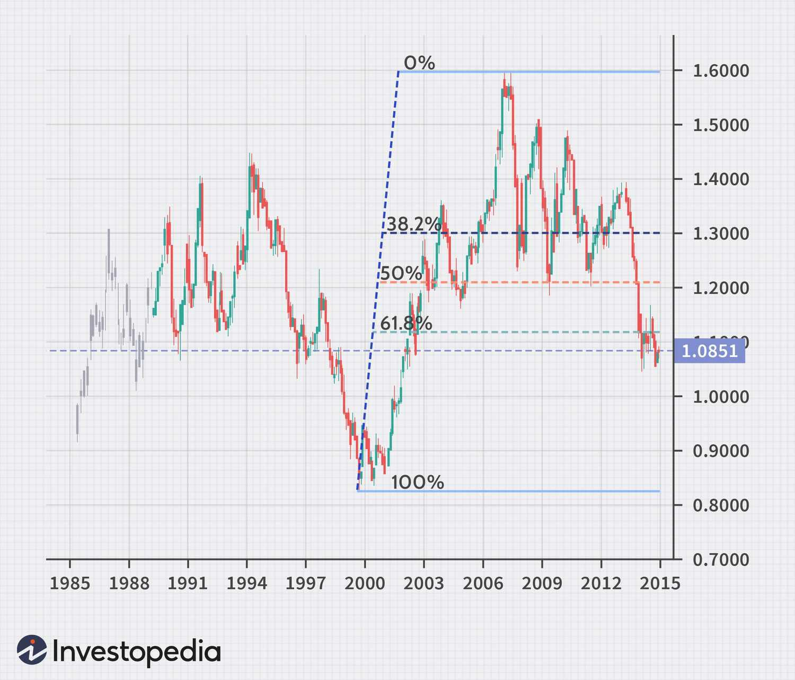

## Table of Contents

## What is the Fibonacci sequence and how is it used in Forex trading?

The Fibonacci sequence is a series of numbers where each number is the sum of the two numbers before it. It starts with 0 and 1, and then the sequence goes like this: 0, 1, 1, 2, 3, 5, 8, 13, and so on. People find this sequence interesting because it appears in many places in nature, like in the arrangement of leaves on a stem or the pattern of seeds in a sunflower. In math, the sequence is used to create the Fibonacci ratios, which are used to predict future movements in numbers or prices.

In Forex trading, traders use the Fibonacci ratios to help them decide when to buy or sell currencies. They use these ratios to find levels on a chart where the price might change direction. For example, if the price of a currency goes up and then starts to fall, traders might look at the Fibonacci levels to guess where the price might stop falling and start going up again. This can help them make better decisions about when to enter or exit a trade. While it's not a perfect method and doesn't always work, many traders find it useful as part of their overall strategy.

## How do you identify Fibonacci retracement levels on a Forex chart?

To identify Fibonacci retracement levels on a Forex chart, you first need to pick a significant price move. This could be a big up move or a big down move. Once you have that, you draw a line from the start of the move to the end of the move. This line is called the Fibonacci retracement tool. After you draw this line, the tool automatically puts horizontal lines on the chart at certain percentages. These percentages are based on the Fibonacci sequence and are usually 23.6%, 38.2%, 50%, 61.8%, and 100%.

These horizontal lines show where the price might stop and turn around. Traders watch these levels closely. For example, if the price goes up and then starts to fall, traders will look at the 61.8% level to see if the price might stop falling there and start going up again. If the price does stop at one of these levels, it could be a good time to buy or sell. But remember, these levels don't always work perfectly, so traders use them along with other tools to make their decisions.

## What are the key Fibonacci levels used in Forex trading?

In Forex trading, the key Fibonacci levels that traders pay attention to are 23.6%, 38.2%, 50%, 61.8%, and 100%. These levels are based on the Fibonacci sequence, a series of numbers where each number is the sum of the two before it. Traders use these percentages to find points on a chart where the price might change direction. They are called retracement levels because they show how much of a previous move the price has retraced or pulled back.

Traders often focus on the 38.2% and 61.8% levels the most. The 38.2% level is seen as a shallow retracement, meaning the price hasn't pulled back very far from its previous move. If the price stops around this level, traders might think the original trend will continue. On the other hand, the 61.8% level is considered a deeper retracement. If the price reaches this level, it might mean the trend is weaker, and traders will watch to see if the price bounces back or keeps falling. While these levels can be helpful, they don't always predict the price perfectly, so traders use them along with other tools.

## How can Fibonacci extensions be used to predict potential price targets in Forex?

Fibonacci extensions help Forex traders guess where the price might go next after a big move. They use the same Fibonacci numbers to find these targets. Traders pick a big price move, draw a line from the start to the end of that move, and then add extension levels beyond the end of the move. The common extension levels are 127.2%, 161.8%, and 261.8%. These levels show where the price might reach if it keeps moving in the same direction.

Traders watch these extension levels to see if the price hits them. If the price reaches one of these levels and then starts to change direction, it could be a good time to take profits or enter a new trade in the opposite direction. For example, if the price goes up and hits the 161.8% extension level, traders might sell their position there, thinking the price will start to fall. While these levels don't always work perfectly, they give traders a way to set goals for where the price might go next.

## What is the difference between Fibonacci retracement and Fibonacci extension in Forex trading?

Fibonacci retracement and Fibonacci extension are tools used by Forex traders to predict where the price might go next, but they work in different ways. Fibonacci retracement helps traders find levels where the price might stop falling or rising and start moving in the opposite direction. Traders use it to spot possible entry or exit points for their trades. They draw a line from the start to the end of a big price move and then look at the retracement levels, which are usually at 23.6%, 38.2%, 50%, 61.8%, and 100%. If the price hits one of these levels and then changes direction, it might be a good time to buy or sell.

On the other hand, Fibonacci extension helps traders guess where the price might go after it continues moving in the same direction. It's used to find potential price targets beyond the end of a big move. Traders draw a line from the start to the end of the move and then look at extension levels, which are commonly at 127.2%, 161.8%, and 261.8%. If the price reaches one of these levels, it could be a good time to take profits or enter a new trade in the opposite direction. Both tools use the same Fibonacci numbers but focus on different parts of the price movement.

## How do you combine Fibonacci levels with other technical indicators for better trading decisions?

To make better trading decisions in Forex, traders often combine Fibonacci levels with other technical indicators. One common way to do this is to use Fibonacci retracement levels along with trend lines. If the price hits a Fibonacci level and also touches a trend line, it can be a strong sign that the price might change direction. Traders also use moving averages with Fibonacci levels. For example, if the price hits a Fibonacci retracement level and is also close to a moving average, it can give traders more confidence that the price will bounce back from that level.

Another useful combination is using Fibonacci levels with [momentum](/wiki/momentum) indicators like the Relative Strength Index (RSI) or the Moving Average Convergence Divergence (MACD). If the price reaches a Fibonacci level and the RSI shows that the price is overbought or oversold, it can help traders decide if it's a good time to buy or sell. For example, if the price hits a 61.8% retracement level and the RSI is over 70, it might mean the price is overbought and could fall soon. By using Fibonacci levels together with other indicators, traders can get a clearer picture of where the price might go next and make more informed trading decisions.

## Can you explain the concept of Fibonacci time zones and their application in Forex trading?

Fibonacci time zones are another tool traders use in Forex trading, and they're based on the Fibonacci sequence, just like retracement and extension levels. Instead of looking at price levels, Fibonacci time zones focus on time. Traders draw vertical lines on their chart at certain time intervals, which are calculated using the Fibonacci sequence. These intervals start from a major high or low point in the price movement and spread out into the future. The idea is that these time zones might show when the price could change direction or make a big move.

In Forex trading, traders use Fibonacci time zones to guess when important changes in the price might happen. For example, if there's a big price move, traders might draw Fibonacci time zones starting from the point where the move began. They then watch the price as it reaches each time zone. If the price starts to change direction or make a big move around one of these zones, it can be a signal to buy or sell. While Fibonacci time zones don't always predict the price perfectly, they give traders another way to think about when the price might move next, and they can be used along with other tools to make better trading decisions.

## How does the Fibonacci fan tool work and when should it be used in Forex trading?

The Fibonacci fan tool helps Forex traders find where the price might go next. It uses lines that spread out like a fan from a big price move. You start by drawing a line from the beginning to the end of a big move, up or down. Then, the tool adds three diagonal lines at angles based on the Fibonacci ratios of 38.2%, 50%, and 61.8%. These lines show where the price might find support or resistance as it moves. Traders watch these lines to see if the price changes direction when it hits one of them.

Traders use the Fibonacci fan when they want to guess where the price might go after a big move. If the price hits one of the fan lines and then bounces back, it could be a good time to buy or sell. For example, if the price goes up and then starts to fall, traders will watch the fan lines to see if the price stops falling at one of them and starts going up again. While the Fibonacci fan doesn't always work perfectly, it gives traders another way to think about where the price might go next, and they can use it along with other tools to make better trading decisions.

## What are some common mistakes traders make when using Fibonacci techniques in Forex?

One common mistake traders make when using Fibonacci techniques in Forex is relying too much on them. Fibonacci levels are just one tool, and they don't always work. Traders might think the price will always stop or turn around at a Fibonacci level, but that's not true. It's important to use Fibonacci levels along with other tools like trend lines, moving averages, and momentum indicators to get a better picture of where the price might go next.

Another mistake is not [picking](/wiki/asset-class-picking) the right starting and ending points for the Fibonacci tool. If traders don't choose the right points for a big price move, the Fibonacci levels won't be accurate. It's important to pick the highest high and the lowest low of the move to get the best results. Also, traders sometimes forget that markets can be unpredictable, and even if the price hits a Fibonacci level, it might not change direction right away. So, it's good to be patient and look at the bigger picture before making a trade.

## How can advanced traders use Fibonacci arcs to enhance their trading strategy?

Advanced traders can use Fibonacci arcs to find where the price might go next after a big move. Fibonacci arcs are curved lines that come from a big price move. To use them, traders draw a line from the start to the end of the move, and then the tool adds three arcs at 38.2%, 50%, and 61.8% of the move's length. These arcs show where the price might find support or resistance. If the price hits one of these arcs and then changes direction, it can be a good time to buy or sell.

Traders can use Fibonacci arcs along with other tools to make better trading decisions. For example, if the price hits a Fibonacci arc and is also close to a trend line or a moving average, it can give traders more confidence that the price will bounce back from that level. While Fibonacci arcs don't always work perfectly, they give traders another way to think about where the price might go next. By combining them with other indicators, advanced traders can get a clearer picture of the market and make more informed trades.

## What role does the Fibonacci cluster play in identifying strong support and resistance levels?

Fibonacci clusters help traders find strong support and resistance levels in Forex trading. A Fibonacci cluster happens when different Fibonacci tools, like retracement levels, extensions, and arcs, all point to the same price level. When many Fibonacci lines come together at one spot, it makes that level very important. Traders think that if the price hits a cluster, it's more likely to stop and change direction there. This can be a good place to buy or sell.

Traders use Fibonacci clusters along with other tools to make better decisions. If the price reaches a cluster and also touches a trend line or a moving average, it can give traders more confidence that the level is strong. While clusters don't always work perfectly, they give traders a way to see where many different Fibonacci tools agree. This can help traders find the best spots for support and resistance and make more informed trades.

## How can you backtest and optimize Fibonacci trading strategies for Forex markets?

To backtest and optimize Fibonacci trading strategies for Forex markets, traders start by looking at past price data. They use a computer program or a trading platform that lets them draw Fibonacci levels on old charts. Traders pick big price moves from the past and see if the price stopped or changed direction at the Fibonacci levels. They do this many times with different moves to see if the Fibonacci levels work well. If the levels often predict where the price will go, it's a good sign that the strategy could work in the future.

To make the strategy even better, traders might change things like which Fibonacci levels they use or how they combine them with other tools. They test different ways of using the Fibonacci levels to see which way works best. For example, they might find that the 61.8% level works better than the 38.2% level for their trading style. Traders also use other tools like trend lines or moving averages to see if they help make the Fibonacci strategy more accurate. By testing and changing the strategy over and over, traders can find the best way to use Fibonacci levels in their Forex trading.

## What is the significance of Fibonacci numbers in trading and how can they be understood?

Fibonacci numbers form a sequence where each number is the sum of the two preceding ones, starting from 0 and 1. This sequence, defined as:

$$
F(n) = F(n-1) + F(n-2)
$$

with initial conditions $F(0) = 0$ and $F(1) = 1$, is prevalent in various natural patterns and structures, finding applications across numerous fields, including forex trading.

In [forex](/wiki/forex-system) trading, Fibonacci levels assist in identifying possible points of support and resistance. These levels are computed using specific Fibonacci ratios derived from the sequence, notably 23.6%, 38.2%, 50%, and 61.8%. These ratios are calculated by dividing figures in the Fibonacci sequence.

These Fibonacci ratios play a pivotal role in technical analysis, providing insights into potential reversals in price movements. The concept of using Fibonacci retracement in trading is based on the idea that markets will retrace a predictable portion of a move, after which they continue to move in the original direction. For instance, if a currency pair moves significantly up or down, it will often retrace a portion of the move before resuming in the original direction.

To apply Fibonacci levels in trading, traders typically use the Fibonacci retracement tool. This involves identifying a significant price movement, either upward or downward, and then measuring the retracement levels based on Fibonacci ratios. Traders anticipate that prices will change direction around these levels, helping set entry and [exit](/wiki/exit-strategy) points more effectively. For example, a trader observing an uptrend might place the Fibonacci retracement tool from the bottom to the peak of the movement. The key Fibonacci levels—lines drawn based on these ratios—can then be used to predict potential reversal points as the price retreats.

By incorporating Fibonacci levels into their analysis, traders align themselves with historical market tendencies, using mathematically derived points to guide their trading decisions. This technique provides a structured approach to predicting price action, which is critical for achieving better timing in trade executions.

## What are Fibonacci Retracement and Extension: Tools for Traders?

Fibonacci retracement is a method employed by traders to identify potential levels where price corrections might conclude before resuming the primary trend. By plotting Fibonacci retracement lines from a recent high to low in a downtrend or from low to high in an uptrend, traders can anticipate possible areas of support and resistance. These levels are determined by Fibonacci ratios such as 23.6%, 38.2%, 50%, and 61.8%, which reflect potential retracement levels within the price movement.

The calculation of these Fibonacci retracement levels follows these steps:

1. Identify the recent significant swing high and swing low.
2. Calculate the difference (or range) between the high and low.
3. Multiply this range by the Fibonacci ratios (e.g., 0.236 for 23.6%).
4. Subtract the result from the swing high for resistance levels in a downtrend or add the result to the swing low for support levels in an uptrend.

For example, consider a scenario where the swing high is 150 and the swing low is 100 in a downtrend. The range is 150 - 100 = 50. The 23.6% retracement level would be:

$$
\text{Retracement} = 150 - (50 \times 0.236) = 150 - 11.8 = 138.2
$$

Fibonacci extensions, conversely, assist traders in forecasting potential price targets upon trend continuation. These extension levels are plotted beyond the normal range and are useful in identifying security price targets after retracements have concluded and the original trend resumes. Common Fibonacci extension levels include 61.8%, 100%, 161.8%, and 261.8%.

These tools are critical in constructing effective trading strategies by pinpointing key levels where significant price reactions might occur. The strategic use of Fibonacci retracement and extensions helps traders set entry and exit points more effectively within the market, facilitating informed decision-making processes.

## How can Fibonacci Analysis be applied in Algorithmic Trading?

Algorithmic trading employs complex algorithms capable of analyzing vast amounts of market data to execute trades at remarkable speeds and volumes. Integrating Fibonacci analysis into such systems enhances their effectiveness by introducing a systematic framework based on mathematical principles. Fibonacci numbers, utilized in identifying potential support and resistance levels, provide a foundational basis for algorithmic strategies. Incorporating these levels into algorithms ensures trades are aligned with vital technical levels, offering traders a structured approach to decision-making.

Fibonacci retracement and extension levels can be integrated into [algorithmic trading](/wiki/algorithmic-trading) using automatic calculation and drawing algorithms. This automation allows traders to focus on strategic insights rather than manual calculations, enhancing both the accuracy and speed of trading decisions. For instance, an algorithm can programmatically plot retracement levels between a significant swing high and low, using the formula:

$$
\text{Level} = \text{High} - (\text{High} - \text{Low}) \times \text{Ratio}
$$

where Ratio corresponds to common Fibonacci levels such as 23.6%, 38.2%, 50%, or 61.8%.

In practice, traders can implement these calculations using Python libraries such as Pandas for data manipulation and Matplotlib for visualization. An algorithm might resemble:

```python
import pandas as pd
import matplotlib.pyplot as plt

def fibonacci_retracement(data, high, low):
    levels = [high - (high - low) * ratio for ratio in [0.236, 0.382, 0.5, 0.618]]
    return levels

# Example usage:
data = pd.read_csv('market_data.csv')  # Assuming CSV with market data
high = max(data['Price'])
low = min(data['Price'])
fib_levels = fibonacci_retracement(data, high, low)

plt.plot(data['Price'])
for level in fib_levels:
    plt.axhline(y=level, color='r', linestyle='--')
plt.show()
```

Additionally, Fibonacci levels assist algorithms in automating entry and exit points by reducing emotional biases often encountered in manual trading. This can result in more consistent execution aligned with predefined strategic goals. Advanced algorithms refine trading strategies further by integrating Fibonacci analysis with other indicators, thereby confirming potential setups with higher probability of success. Utilizing historical price data and pattern recognition, these algorithms can simulate trade scenarios, optimizing outcomes continually.

Integrating Fibonacci analysis not only aids in precise entry and exit timing but also significantly improves execution efficiency by reducing human intervention. By systematically applying mathematical principles to complex trading environments, traders can leverage algorithmic trading to achieve a disciplined and effective approach, ultimately enhancing profitability while mitigating risks.

## References & Further Reading

[1]: Fisher, R. J. (1994). ["Fibonacci Applications and Strategies for Traders"](https://archive.org/details/fibonacciapplica00fisc_0). Wiley.

[2]: Lopez de Prado, M. (2018). ["Advances in Financial Machine Learning"](https://www.amazon.com/Advances-Financial-Machine-Learning-Marcos/dp/1119482089). Wiley.

[3]: Aronson, D. R. (2006). ["Evidence-Based Technical Analysis: Applying the Scientific Method and Statistical Inference to Trading Signals"](https://www.amazon.com/Evidence-Based-Technical-Analysis-Scientific-Statistical/dp/0470008741). Wiley.

[4]: Jansen, S. (2020). ["Machine Learning for Algorithmic Trading: Predictive Models to Extract Signals from Market and Alternative Data for Systematic Trading Strategies"](https://www.amazon.com/Machine-Learning-Algorithmic-Trading-alternative/dp/1839217715). Packt Publishing.

[5]: Chan, E. P. (2008). ["Quantitative Trading: How to Build Your Own Algorithmic Trading Business"](https://github.com/ftvision/quant_trading_echan_book). Wiley.

[6]: Conors, L. N., & Alvarez, C. R. (2010). ["Short-Term Trading Strategies That Work: A Quantitative Guide to Trading Stocks and ETFs"](https://www.amazon.com/Short-Term-Trading-Strategies-That/dp/0981923909). TradingMarkets Publishing Group.

[7]: Baumohl, B. (2012). ["The Secrets of Economic Indicators: Hidden Clues to Future Economic Trends and Investment Opportunities"](https://www.amazon.com/Secrets-Economic-Indicators-Investment-Opportunities/dp/0132932075). Pearson Education.