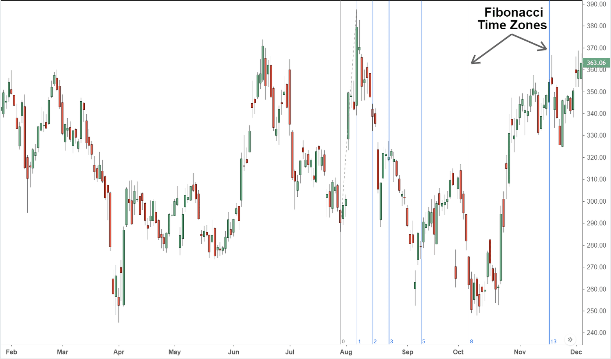

## Table of Contents

## What are Fibonacci Time Zones and how do they relate to trading?

Fibonacci Time Zones are a tool used in technical analysis for trading. They are based on the Fibonacci sequence, a series of numbers where each number is the sum of the two before it. In trading, these zones help predict when price movements might happen. Traders draw vertical lines on a chart at intervals based on the Fibonacci sequence. These lines represent potential times when the price of a stock or other asset might change direction or move significantly.

Traders use Fibonacci Time Zones to spot possible future turning points in the market. By looking at past price movements and applying the Fibonacci sequence, they can guess when the next big move might occur. This can help them decide when to buy or sell. However, it's important to remember that while Fibonacci Time Zones can be useful, they are not always accurate. Traders often use them along with other tools and indicators to make better trading decisions.

## How are Fibonacci Time Zones calculated in trading?

Fibonacci Time Zones are calculated by using the Fibonacci sequence to mark time intervals on a trading chart. The Fibonacci sequence starts with 0 and 1, and each number after that is the sum of the two numbers before it. So, the sequence goes like this: 0, 1, 1, 2, 3, 5, 8, 13, 21, and so on. To use this in trading, you pick a starting point on the chart, usually a significant high or low point in the price movement. From that point, you draw vertical lines at intervals that follow the Fibonacci sequence. For example, if you start at day 0, the next lines would be at day 1, day 2, day 3, day 5, day 8, and so on.

These vertical lines help traders see when the price might change direction or move a lot. The idea is that these time zones can show when important price movements are likely to happen. Traders look at past price data to see if these time zones match up with past changes in price. If they do, traders might expect similar changes to happen at these times in the future. However, it's important to remember that Fibonacci Time Zones are just one tool, and they don't always predict the future perfectly. Traders often use them along with other tools to make better decisions.

## What is the historical background of Fibonacci Time Zones in financial markets?

The idea of Fibonacci Time Zones comes from the work of Leonardo Fibonacci, a mathematician from the 13th century. He found a special sequence of numbers, now called the Fibonacci sequence, where each number is the sum of the two numbers before it. This sequence shows up in many places in nature, like the way leaves grow on plants or the shape of a snail's shell. Traders started using these numbers in the stock market in the late 20th century, believing that the same patterns that appear in nature could help predict price movements in the market.

In the financial markets, Fibonacci Time Zones became popular as part of technical analysis, a way to study past market data to guess what might happen next. Traders began using these time zones in the 1970s and 1980s, along with other tools like Fibonacci retracements and extensions. They thought that by marking time on charts using the Fibonacci sequence, they could spot when big price changes might happen. Over time, these time zones became a common tool among traders, even though they don't always work perfectly. Traders still use them today, often with other methods, to try and make better trading decisions.

## Can you explain the basic principles behind using Fibonacci Time Zones for market analysis?

Fibonacci Time Zones are a way to predict when the price of a stock or other asset might change a lot. They use a special pattern of numbers called the Fibonacci sequence. You start by picking a point on a chart where the price did something big, like going up a lot or dropping down. Then, you draw lines on the chart at times that follow the Fibonacci sequence. These lines help you see when the price might move a lot again. The idea is that these times, called Fibonacci Time Zones, can show you when to expect big changes in the market.

Traders look at past price movements to see if these time zones match up with times when the price changed a lot before. If they do, traders might think the same thing could happen again at these times in the future. But, it's important to know that Fibonacci Time Zones don't always work perfectly. They are just one tool that traders use along with other methods to make better guesses about the market. By using Fibonacci Time Zones with other tools, traders can try to make smarter choices about when to buy or sell.

## How do traders apply Fibonacci Time Zones to identify potential support and resistance levels?

Traders use Fibonacci Time Zones to guess when the price of a stock or other asset might change a lot. They start by picking a point on a chart where the price did something big, like hitting a high or low. Then, they draw lines on the chart at times that follow the Fibonacci sequence. These lines help them see when the price might move a lot again. The idea is that these times, called Fibonacci Time Zones, can show where the price might find support or resistance. Support is when the price stops going down and starts going up, and resistance is when the price stops going up and starts going down.

Traders look at past price movements to see if these time zones match up with times when the price hit support or resistance before. If they do, traders might think the same thing could happen again at these times in the future. They watch the price as it gets close to these zones. If the price starts to go up when it hits a time zone, that might be a support level. If the price starts to go down when it hits a time zone, that might be a resistance level. But, it's important to know that Fibonacci Time Zones don't always work perfectly. Traders use them along with other tools to make better guesses about where support and resistance might be.

## What are the common mistakes traders make when using Fibonacci Time Zones?

One common mistake traders make when using Fibonacci Time Zones is relying on them too much. They might think that just because the price hit a time zone in the past, it will do the same thing again. But the market can be unpredictable, and these zones don't always work. Traders need to use other tools and look at more information to make good decisions. If they only use Fibonacci Time Zones, they might miss important signs that the market is about to do something different.

Another mistake is not adjusting the starting point correctly. The starting point for drawing the Fibonacci Time Zones should be a big high or low in the price. If traders pick the wrong starting point, the zones won't line up with the right times. This can make their predictions wrong. Traders need to take time to find the best starting point and make sure it matches with big price movements in the past.

## How can Fibonacci Time Zones be integrated with other technical analysis tools?

Traders often use Fibonacci Time Zones along with other tools to make better guesses about the market. One common way is to use them with Fibonacci retracement levels. Fibonacci retracement levels help traders see where the price might go up or down after a big move. By drawing both Fibonacci Time Zones and retracement levels on the same chart, traders can see not just when the price might change, but also how much it might change. This can help them decide when to buy or sell more accurately.

Another tool that works well with Fibonacci Time Zones is trend lines. Trend lines show the direction the price is moving, either up or down. When a Fibonacci Time Zone lines up with a trend line, it can be a strong sign that the price is about to do something big. Traders can watch these points closely to see if the price changes direction or keeps going the same way. Using both tools together can give traders a clearer picture of what might happen next in the market.

## What are some real-world examples of successful trades using Fibonacci Time Zones?

One real-world example of a successful trade using Fibonacci Time Zones happened with a trader named John. John was watching the price of a stock that had been going up a lot. He used Fibonacci Time Zones to guess when the price might change direction. He saw that a time zone lined up with a point where the price had hit a high before. When the price got close to that time zone, it started to go down. John sold his stock at that time and made a good profit because he used the Fibonacci Time Zones to predict when the price would drop.

Another example is with a trader named Sarah. Sarah was trading a currency pair and used Fibonacci Time Zones along with other tools. She noticed that a time zone matched up with a time when the price had found support in the past. As the price got close to that zone, it started to go up again. Sarah bought the currency pair at that time and held onto it until the price went up even more. She made money because she used the Fibonacci Time Zones to predict when the price would start going up again.

## How does the accuracy of Fibonacci Time Zones vary across different time frames and markets?

The accuracy of Fibonacci Time Zones can change a lot depending on the time frame and the market you are looking at. In shorter time frames, like minutes or hours, Fibonacci Time Zones might not be as accurate. This is because short-term price movements can be very random and influenced by many quick changes in the market. On the other hand, in longer time frames, like days or weeks, Fibonacci Time Zones can be more useful. This is because longer time frames often show clearer patterns and trends, making it easier to see if the time zones match up with past price movements.

Different markets also affect how well Fibonacci Time Zones work. In markets like stocks or forex, where there are a lot of traders and the prices can change a lot, Fibonacci Time Zones might not always be accurate. These markets can be very unpredictable because of all the different people and news that can move the prices. But in markets like commodities, where the prices might be more stable and influenced by fewer factors, Fibonacci Time Zones can sometimes be more reliable. Traders need to think about the time frame and the market they are trading in to use Fibonacci Time Zones in the best way.

## What advanced strategies can be employed with Fibonacci Time Zones to enhance trading decisions?

One advanced strategy traders use with Fibonacci Time Zones is to combine them with other technical indicators like moving averages or the Relative Strength Index (RSI). By doing this, traders can get a more complete picture of the market. For example, if a Fibonacci Time Zone lines up with a moving average, it can be a strong sign that the price is about to change direction. Or, if the RSI shows the price is overbought or oversold when it hits a time zone, that can help traders decide if it's a good time to buy or sell. Using these tools together can make the predictions from Fibonacci Time Zones more reliable.

Another strategy is to use Fibonacci Time Zones along with chart patterns like head and shoulders or triangles. These patterns can show when the price is about to break out or reverse. If a Fibonacci Time Zone lines up with the end of a chart pattern, it can be a powerful signal. Traders can watch these points closely and be ready to act when the price moves. This can help them make better trading decisions and catch big price moves. By combining Fibonacci Time Zones with other tools and patterns, traders can improve their chances of success in the market.

## How do professional traders adjust Fibonacci Time Zones settings for optimal performance?

Professional traders often adjust the starting point of Fibonacci Time Zones to match big highs or lows in the price. They look at past price movements to find the best point to start drawing the zones. If they pick the wrong starting point, the zones won't line up with the right times, and their predictions might be off. So, they take time to find the best starting point and make sure it matches with important price movements in the past. This helps them see when the price might change a lot in the future.

They also use other tools along with Fibonacci Time Zones to make better guesses about the market. For example, they might use moving averages or the Relative Strength Index (RSI) to see if the price is overbought or oversold when it hits a time zone. If these tools line up with the time zones, it can be a strong sign that the price is about to move a lot. By combining Fibonacci Time Zones with other tools, professional traders can make more accurate predictions and improve their trading decisions.

## What are the current research and developments in the application of Fibonacci Time Zones in algorithmic trading?

Researchers are looking into how Fibonacci Time Zones can be used in algorithmic trading to make better predictions. They are trying to find ways to make these zones more accurate by using computer programs. These programs can quickly look at a lot of past price data and see if Fibonacci Time Zones match up with big price changes. By doing this, they hope to find patterns that can help traders know when to buy or sell. Some researchers are also working on combining Fibonacci Time Zones with other tools like machine learning to make even better predictions.

In the world of algorithmic trading, using Fibonacci Time Zones is still new and exciting. Traders are using these zones to help their computers make smart decisions about when to trade. They are testing different ways to set up the zones and see if they can predict the market better. As computers get better at understanding data, the use of Fibonacci Time Zones in algorithmic trading might grow. This could help traders make more money by knowing when the market is about to change.

## What are Fibonacci Time Zones and how do they work?

Fibonacci time zones are a visual representation grounded in the mathematical field, using the Fibonacci sequence to project potential periods of market activity on trading charts. The Fibonacci sequence is a series of numbers first introduced by Leonardo of Pisa, generally known as Fibonacci, in which each number is the sum of the two preceding ones. Formally, the sequence follows this pattern:

$$
F(n) = F(n-1) + F(n-2)
$$

where $F(0) = 0$ and $F(1) = 1$, generating a sequence that begins 0, 1, 1, 2, 3, 5, 8, 13, and so on.

When applied to financial markets, the Fibonacci time zones project these numbers forward in time to anticipate potential reversal points. This is accomplished by plotting vertical lines on a trading chart. Traders begin by selecting a significant starting point, which is typically a major swing high or low. From this origin, the sequential Fibonacci numbers determine the spacing for each subsequent vertical line.

Each of these lines corresponds to a Fibonacci number in the sequence (1, 2, 3, 5, 8, 13, etc.), suggesting times when notable price movements or market reversals might occur. Instead of predicting specific price levels, Fibonacci time zones offer an insightful tool to forecast when these movements may happen, thus focusing on timing over price prediction. This characteristic distinguishes them from other Fibonacci tools like retracement or extension levels, which focus on price levels. 

In practice, Fibonacci time zones can play a crucial role in technical analysis by displaying potential market activity periods, allowing traders to better strategize their entry and [exit](/wiki/exit-strategy) points based on time projections derived from historic price movements.

## References & Further Reading

[1]: Prechter, R. R., & Frost, A. J. (2005). ["Elliott Wave Principle: Key to Market Behavior."](https://archive.org/details/elliottwaveprinc0000fros) New Classics Library.

[2]: Williams, L. (2012). ["Trading Chaos: Maximize Profits with Proven Technical Techniques."](https://archive.org/details/tradingchaosmaxi0000greg) Wiley Trading.

[3]: Murphy, J. J. (1999). ["Technical Analysis of the Financial Markets: A Comprehensive Guide to Trading Methods and Applications."](https://archive.org/details/technicalanalysi0000murp) New York Institute of Finance.

[4]: Fibonacci, L. (2002). ["Liber Abaci."](https://archive.org/details/laurence-sigler-fibonaccis-liber-abaci-2003) Springer.

[5]: Pring, M. J. (2002). ["Technical Analysis Explained: The Successful Investor's Guide to Spotting Investment Trends and Turning Points."](https://www.amazon.com/Technical-Analysis-Explained-Fifth-Successful/dp/0071825177) McGraw-Hill.