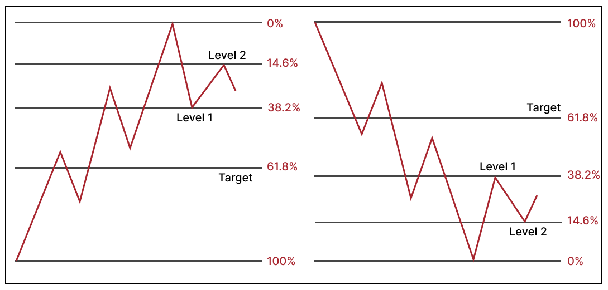

The Fibonacci sequence, a series of numbers where each number is the sum of the two preceding ones, often starting with 0 and 1, is not just a mathematical curiosity but a phenomenon with widespread implications in nature, art, architecture, and, quite intriguingly, in financial markets. Originating from the works of the medieval Italian mathematician Leonardo of Pisa, known as Fibonacci, this sequence has been identified in the arrangement of leaves on a stem, the branching of trees, the flowering of an artichoke, and the shells of snails, epitomizing a harmonious pattern that resonates with the human psyche.



In the realm of trading, Fibonacci numbers are transmuted into ratios, and these ratios—primarily 23.6%, 38.2%, 50%, 61.8%, and 100%—are esteemed for their predictive value in technical analysis. Traders apply these ratios to identify potential reversal levels on stock charts. The philosophy behind this application is that after a significant price movement, either up or down, new support and resistance levels are often at or near these Fibonacci levels. The practical manifestation of these principles is evident in tools like Fibonacci retracements, where horizontal lines are drawn on a chart to indicate where support and resistance are likely to occur, based on the Fibonacci levels.

## Table of Contents

## Theoretical Foundation

At the core of Fibonacci trading lies the Golden Ratio, approximately 1.618, often denoted by the Greek letter phi (Φ). This ratio emerges from the Fibonacci sequence when a number in the series is divided by its immediate predecessor, and as the numbers get higher, the result converges on the Golden Ratio. This irrational number is not only aesthetically pleasing but also appears in various facets of the universe, from the spirals of galaxies to the growth patterns of many living things.

In financial markets, the Golden Ratio underpins the key Fibonacci retracement levels—23.6%, 38.2%, 61.8%, and 100%. These percentages are deemed significant by traders as they represent potential turning points on price charts. For instance, if a stock price has risen from $10 to $20, a retracement to $18.38 (61.8% of the price increase) may be expected.

When juxtaposed with other technical analysis strategies, Fibonacci trading is unique. Unlike moving averages or momentum indicators, which are based on statistical formulas applied to price or volume histories, Fibonacci levels are static—offering a fixed frame of reference in the dynamic flux of market prices. They provide a map of potential future support or resistance levels, or 'hidden' barriers to price movements.

Here's how you might calculate a Fibonacci level in Python:

```python
def calculate_golden_ratio(sequence_length):
    phi = (1 + 5 ** 0.5) / 2  # The mathematical representation of the Golden Ratio
    fibonacci_number = round(phi ** sequence_length / 5 ** 0.5)
    return fibonacci_number

## Generating a Fibonacci sequence and finding the ratio
fib_sequence = [calculate_golden_ratio(i) for i in range(2, 10)]
golden_ratios = [fib_sequence[i] / fib_sequence[i - 1] for i in range(1, len(fib_sequence))]
```

In this code, we approximate the Golden Ratio using the formula for phi and then apply it to generate a Fibonacci sequence, highlighting the convergence towards the Golden Ratio. This mathematical underpinning reinforces why Fibonacci levels are so robust across different time frames and asset classes.

The elegance of Fibonacci trading lies in its universality; these levels hold across stocks, commodities, forex, and cryptocurrencies. While other strategies like Bollinger Bands or the Relative Strength Index (RSI) can indicate overbought or oversold conditions, Fibonacci levels provide a static framework that can be pre-determined and plotted on a chart, offering a timeless gauge for traders.

For a comprehensive understanding of the Golden Ratio and its significance in market analysis, "The Misbehavior of Markets" by Benoit Mandelbrot provides an insightful exploration into the fractal nature of financial markets, and how the seemingly chaotic movements still conform to underlying patterns, much like the Fibonacci sequence itself[1].

## Fibonacci Trading Tools

Fibonacci trading tools are pivotal in identifying support and resistance levels, entry and exit points, and potential reversal zones. The primary tools include Fibonacci retracements, extensions, arcs, fans, and time zones. These tools take root in the principle that markets move in predictable patterns, which the Fibonacci numbers can help decipher.

Fibonacci retracements are created by taking two extreme points on a chart and dividing the vertical distance by the key Fibonacci ratios. Traders look for signs of an uptrend or downtrend to halt and reverse at these lines. Extensions serve a similar purpose but are projected beyond the 100% level, commonly used to predict where a retracement could go after surpassing a high or low.

Arcs offer a view of resistance and support levels based on both price and time, plotted as arcs emanating from a high or low point. Fans consist of diagonal lines that use Fibonacci ratios to divide vertical distances between a peak and trough. Lastly, Fibonacci time zones are vertical lines into the future, based on the sequence, to predict potential significant shifts in price action.

Here's how to calculate and plot Fibonacci retracement levels with Python, using a simple matplotlib visualization:

```python
import numpy as np
import matplotlib.pyplot as plt

## Define the high and low price points
high_price = 215.0
low_price = 157.0

## Calculate the difference
price_range = high_price - low_price

## Calculate retracement levels
levels = [0, 0.236, 0.382, 0.5, 0.618, 1]
price_levels = [high_price - (level * price_range) for level in levels]

## Plotting
plt.figure(figsize=(10, 6))
for price_level in price_levels:
    plt.hlines(price_level, xmin=0, xmax=1, colors='blue', linestyles='--')
plt.xlabel('Time')
plt.ylabel('Price')
plt.title('Fibonacci Retracement Levels')
plt.show()
```

To set up these tools on a trading platform, traders typically select the Fibonacci tool option, click on a high and low point on the price chart, and the software automatically plots the levels. It’s crucial to adjust these lines to match significant price highs and lows, and to use them in conjunction with other indicators for more robust analysis.

For further reference and a deep understanding of these tools, "Technical Analysis of the Financial Markets" by John J. Murphy provides a detailed explanation of Fibonacci as well as other technical analysis tools. Murphy's text is particularly useful for understanding how these tools integrate into broader market analysis strategies[2].

## Advanced Fibonacci Applications

Fibonacci tools are not standalone predictors but are most powerful when combined with other technical indicators to validate trading signals. For instance, a Fibonacci retracement level coinciding with a moving average or a RSI (Relative Strength Index) turning point can provide a stronger case for a potential reversal. These confluences enhance the predictive power of a trader's strategy, allowing for more nuanced market entries and exits.

In trending markets, Fibonacci retracement levels can act as potential areas to join the trend. For example, in an uptrend, traders often look for price to retrace to key Fibonacci levels before resuming the trend. Conversely, in a range-bound market, Fibonacci levels can denote potential turning points where price may bounce within the range.

Let's consider a scenario where a trader is combining Fibonacci retracement levels with a 100-period moving average for a more robust prediction. Below is a Python code example that demonstrates how to overlay these tools on a price chart:

```python
import numpy as np
import matplotlib.pyplot as plt

## Simulated price data
np.random.seed(0)
price = np.cumprod(1 + np.random.randn(100) * 0.01) * 100

## Calculate 100-period moving average
moving_average = np.convolve(price, np.ones((100,))/100, mode='valid')

## Identify potential high and low points for Fibonacci retracement
high_price = np.max(price[:len(moving_average)])
low_price = np.min(price[:len(moving_average)])
fib_levels = [0, 0.236, 0.382, 0.5, 0.618, 1]

## Calculate the Fibonacci retracement levels
retracement_levels = [high_price - (high_price - low_price) * level for level in fib_levels]

## Plotting the price, moving average, and Fibonacci levels
plt.figure(figsize=(14, 7))
plt.plot(price, label='Price')
plt.plot(range(99, 99 + len(moving_average)), moving_average, label='100-Period Moving Average', color='red')
for level in retracement_levels:
    plt.hline(level, xmin=0, xmax=len(price), colors='green', linestyles='--')
plt.title('Price Chart with 100-Period Moving Average and Fibonacci Retracement Levels')
plt.legend()
plt.show()
```

In the above code, the moving average is used to determine the trend, while the Fibonacci levels provide potential retracement targets within that trend.

## Time Frame Analysis

The efficacy of Fibonacci trading is not confined to a single time frame but spans across various scales of market observation. Short-term traders might employ Fibonacci analysis on minute-to-minute charts, while long-term investors might look at daily, weekly, or even monthly patterns. The adaptability of Fibonacci tools across time frames is one of their most potent features.

For day traders, Fibonacci retracement levels can be drawn on a 5-minute chart to identify intraday support and resistance levels. Here, the strategy may revolve around quick responses to price actions around these levels, with trades often lasting from minutes to hours. Swing traders, on the other hand, might apply Fibonacci retracements to the high and low of the previous day or week, seeking to capture movements within a larger trend.

On higher time frames, such as the weekly or monthly charts, Fibonacci levels can help identify long-term reversal points and major areas of support and resistance. In these cases, the levels can become self-fulfilling prophecies as more traders, aware of these common markers, place orders around them.

Adjusting Fibonacci strategies across different time frames involves considering the volatility and the overall trend of the market. In highly volatile markets, traders might expect retracements to be deeper, potentially extending to the 78.6% level or beyond. Conversely, in less volatile markets, retracements might typically reverse at the 38.2% or 50% levels.

When applying Fibonacci levels, it is critical to align your strategy with the prevailing trend. A common mistake is to look for retracements without considering the direction of the market. A retracement in an uptrend is not the same as a retracement in a downtrend; the former is often a buying opportunity, while the latter could be a trap if the overall trend is downwards.

## Fibonacci in Various Markets

Fibonacci strategies exhibit remarkable versatility, applicable across various asset classes, including stocks, forex, commodities, and cryptocurrencies. Each market has its unique characteristics, but the fundamental principles of Fibonacci remain constant, serving as a tool for identifying potential support and resistance levels.

In the **stock** market, Fibonacci retracement levels are used to gauge the potential depth of pullbacks during an uptrend or rallies during a downtrend. Due to the generally less volatile nature of stocks compared to forex or cryptocurrencies, traders might find that Fibonacci levels often align with significant price points such as previous highs, lows, or consolidation zones.

The **forex** market's high liquidity and near-24-hour trading offer a fertile ground for Fibonacci trading, especially as it relates to the major currency pairs. Forex traders frequently use Fibonacci in conjunction with other indicators like pivot points and moving averages to refine their entries and exits. Given the forex market's tendency for trending, Fibonacci retracement and extension levels can be particularly potent.

**Commodities** trade in a cyclical nature, often influenced by external factors such as economic data releases, which can lead to predictable retracements and extensions. For commodities traders, Fibonacci can provide a roadmap during these cyclical periods, helping to pinpoint potential reversals in the price of assets like oil or gold.

**Cryptocurrencies** present a relatively new frontier for Fibonacci trading, marked by significant volatility. This volatility can lead to exaggerated retracements that might extend to 78.6% or beyond. Nonetheless, the foundational Fibonacci levels still offer substantial insights, helping traders navigate the rapid price changes that characterize crypto markets.

Comparing the effectiveness of Fibonacci across these markets reveals that no market operates with absolute predictability. However, the self-fulfilling prophecy of Fibonacci levels becomes more potent when many market participants are observing and acting on these levels. This is typically more evident in highly liquid markets such as forex and major stock indices, where the sheer volume of traders using Fibonacci can influence price action.

Each market's unique attributes necessitate a tailored approach to employing Fibonacci strategies. The key to success lies not just in the application of these strategies but also in the trader's ability to discern market nuances, align with the prevailing trend, and exercise discipline in risk management.

## Performance and Limitations

The performance of Fibonacci trading strategies is often debated in the financial community. Proponents argue that Fibonacci retracement levels are invaluable tools for identifying reversal points in the price trajectory of an asset, while skeptics point to the subjective nature of selecting the high and low points from which these levels are drawn.

Empirical studies and statistical data provide a mixed picture. Some research suggests that Fibonacci retracement levels have predictive power, especially the 61.8% level, which is derived from the "Golden Ratio". However, it's essential to note that the effectiveness of these strategies can vary greatly depending on market conditions, the asset being traded, and the time frame.

Backtesting remains a crucial method for evaluating the potential success of Fibonacci-based strategies. By applying Fibonacci retracements to historical price data and testing how often the price respects these levels, traders can gain insight into the conditions under which these tools are most effective. For example, a backtest might reveal that Fibonacci retracement levels are more reliable in a strongly trending market than in a sideways or choppy market.

Despite their popularity, Fibonacci trading tools have limitations and are subject to critiques. A common criticism is that the success of Fibonacci levels is largely attributed to confirmation bias, where traders remember the times the levels worked and disregard the times they did not. Another limitation is the ambiguity in choosing swing highs and lows; different traders may select different points, leading to varying results.

In addition, no trading strategy, including those based on Fibonacci levels, can predict market movements with complete accuracy. External factors, such as economic events or changes in market sentiment, can override technical patterns. Therefore, while Fibonacci tools can enhance a trading strategy, they should be used in conjunction with other analysis methods and sound risk management practices.

## Conclusion

In summary, the Fibonacci sequence transcends simple mathematics, influencing diverse fields, including financial market analysis. The Golden Ratio derived from this sequence provides a foundation for Fibonacci trading tools which, when applied correctly, can offer significant insights into potential market reversals and support/resistance levels.

The strategic implementation of Fibonacci tools—retracements, extensions, arcs, fans, and time zones—requires a solid understanding of market contexts and an adept hand at technical analysis. When these tools are used in conjunction with a comprehensive trading plan, including risk management techniques and consideration of psychological factors, they can enhance the precision and effectiveness of trading strategies.

While the effectiveness of Fibonacci strategies can be quantified by statistical data and backtesting, traders should remain aware of their limitations. Market conditions, trader behavior, and external events can all impact the success of these strategies.

## References & Further Reading

[1]: ["The Misbehavior of Markets"](https://www.amazon.com/Misbehavior-Markets-Fractal-Financial-Turbulence/dp/0465043577) by Benoit Mandelbrot

[2]: ["Technical Analysis of the Financial Markets"](https://www.amazon.com/Technical-Analysis-Financial-Markets-Comprehensive/dp/0735200661) by John J. Murphy