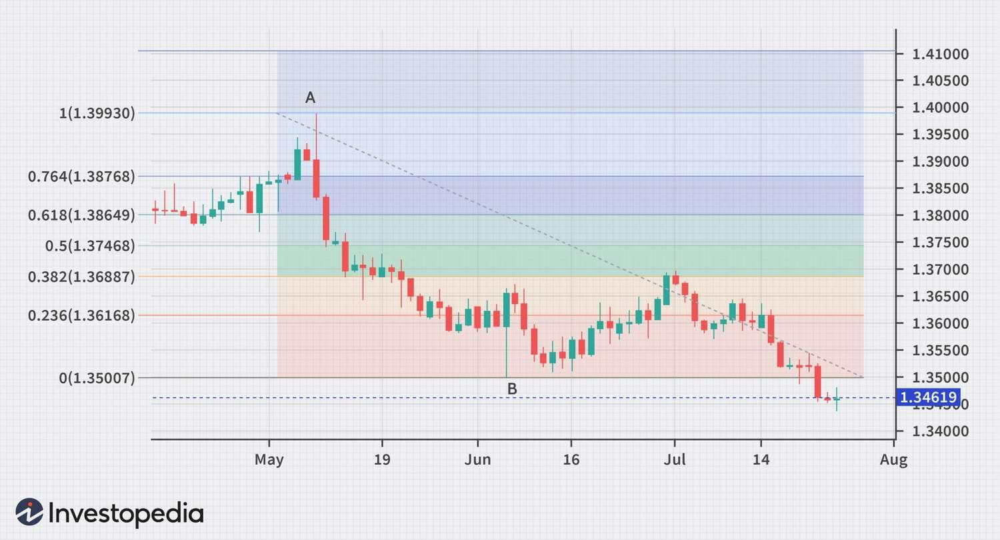

## Table of Contents

## What is the Fibonacci sequence and how is it used in trading?

The Fibonacci sequence is a series of numbers where each number is the sum of the two numbers that come before it. It starts with 0 and 1, so the sequence goes like this: 0, 1, 1, 2, 3, 5, 8, 13, and so on. This sequence is interesting because it appears in many places in nature, like in the arrangement of leaves on a stem or the pattern of seeds in a sunflower. In math, the ratios between the numbers in the Fibonacci sequence get closer and closer to a special number called the Golden Ratio, which is about 1.618.

In trading, people use the Fibonacci sequence to try to predict where prices might go next. They use something called Fibonacci retracement levels, which are numbers like 23.6%, 38.2%, 50%, 61.8%, and 100%. These numbers come from the ratios in the Fibonacci sequence. Traders draw these levels on a chart to see where the price might stop falling and start going up again, or where it might stop rising and start falling. It's not a perfect way to predict the future, but some traders find it helpful as one of many tools they use to make decisions.

## How do Fibonacci retracement levels work in trading strategies?

Fibonacci retracement levels help traders guess where a price might pause or change direction. Imagine you see a stock's price going up a lot, then starting to fall a bit. You can use Fibonacci levels to find spots where the price might stop falling and start going up again. These spots are based on the Fibonacci sequence and are usually at 23.6%, 38.2%, 50%, 61.8%, and 100% of the previous move. Traders draw these levels on a chart from the lowest point to the highest point of the price move. If the price falls to one of these levels, it might be a good time to buy, thinking the price will go back up.

Traders also use these levels to decide when to sell. If a stock's price has been falling and then starts to rise a bit, Fibonacci levels can show where the price might stop rising and start falling again. Traders draw the levels from the highest point to the lowest point of the fall. If the price reaches one of these levels, it might be a good time to sell, expecting the price to go back down. While Fibonacci retracement levels are not perfect and don't always work, many traders find them useful as part of their overall strategy to make better trading decisions.

## What are the key Fibonacci levels used in trading?

In trading, the main Fibonacci levels used are 23.6%, 38.2%, 50%, 61.8%, and 100%. These levels come from the Fibonacci sequence, which is a pattern of numbers where each number is the sum of the two before it. Traders use these levels to guess where a price might stop moving in one direction and start moving in the other.

Traders draw these levels on a chart to see where a price might pause or change direction. For example, if a stock's price goes up a lot and then starts to fall, traders look at these levels to find a good spot to buy, hoping the price will go up again. If the price falls to 38.2% or 61.8% of the previous move up, it might be a good time to buy. Similarly, if the price has been falling and starts to rise, traders might sell at these levels, expecting the price to fall again. These levels are not perfect, but many traders find them helpful.

## How can Fibonacci extensions be used to predict price targets?

Fibonacci extensions help traders guess where a price might go after it starts moving again. They use levels like 127.2%, 161.8%, and 261.8%, which come from the Fibonacci sequence. Traders draw these levels on a chart from the start of a move to the end of it. If a price goes up and then starts going up again, traders look at these levels to find a good spot to sell, hoping the price will stop at one of these levels. If the price falls and then starts falling again, traders might look at these levels to find a good spot to buy, expecting the price to stop falling at one of these levels.

These levels are not perfect and don't always work, but many traders find them useful. For example, if a stock's price goes up from $10 to $20, and then starts going up again, a trader might look at the 161.8% level. That would be $20 + ($20 - $10) * 1.618, which comes out to about $32.36. If the price reaches around $32.36, the trader might decide to sell, thinking the price will stop going up at that point. While it's not a sure thing, using Fibonacci extensions can help traders make better guesses about where a price might go next.

## What is the difference between Fibonacci retracement and Fibonacci extension?

Fibonacci retracement and Fibonacci extension are both tools traders use to guess where a price might go next, but they work in different ways. Fibonacci retracement levels help traders find spots where a price might stop falling and start going up again, or stop rising and start falling. They use levels like 23.6%, 38.2%, 50%, 61.8%, and 100% of the previous move. For example, if a stock's price goes up a lot and then starts to fall, a trader might look at these levels to find a good spot to buy, hoping the price will go back up.

On the other hand, Fibonacci extensions help traders guess where a price might go after it starts moving again. They use levels like 127.2%, 161.8%, and 261.8% of the previous move. If a stock's price goes up and then starts going up again, a trader might look at these levels to find a good spot to sell, hoping the price will stop at one of these levels. Both tools are based on the Fibonacci sequence, but retracement levels focus on where a price might pause or reverse, while extension levels focus on where a price might go after it starts moving again.

## How do traders combine Fibonacci levels with other technical indicators?

Traders often use Fibonacci levels together with other technical indicators to make better guesses about where a price might go next. For example, they might use Fibonacci retracement levels along with moving averages. A moving average is a line on a chart that shows the average price of a stock over a certain time. If a stock's price falls to a Fibonacci retracement level and also touches a moving average, a trader might see this as a strong signal to buy, thinking the price will go back up.

Another common way to combine Fibonacci levels with other indicators is to use them with something called the Relative Strength Index (RSI). The RSI is a number that shows if a stock is overbought or oversold. If a stock's price reaches a Fibonacci retracement level and the RSI shows the stock is oversold, a trader might decide it's a good time to buy. By using Fibonacci levels with other indicators, traders can get more clues about where a price might go next and make better trading decisions.

## What are some common mistakes traders make when using Fibonacci tools?

One common mistake traders make when using Fibonacci tools is relying on them too much. Fibonacci levels are not perfect and don't always work. They are just one tool among many that traders use to guess where a price might go next. If a trader only uses Fibonacci levels and ignores other important things like news or other technical indicators, they might make bad decisions. It's better to use Fibonacci levels as part of a bigger plan that includes other tools and information.

Another mistake is drawing the Fibonacci levels wrong. To use Fibonacci retracement or extension levels correctly, traders need to pick the right high and low points on the chart. If they pick the wrong points, the levels will be in the wrong places, and their guesses about where the price might go next will be off. It's important to take time to find the right points before drawing the levels. This helps make sure the Fibonacci tools are used in the best way possible.

## Can Fibonacci trading strategies be applied to all financial markets?

Fibonacci trading strategies can be used in many different financial markets, like stocks, [forex](/wiki/forex-system), and commodities. The idea is the same in all these markets: traders use Fibonacci levels to guess where a price might stop moving in one direction and start moving in the other. Whether it's a stock going up and down, or the price of gold changing, traders can draw Fibonacci retracement and extension levels on their charts to help make decisions about when to buy or sell.

However, these strategies don't work perfectly in every market all the time. Each market has its own special things to think about, like how much it moves around or what news might affect it. So, while Fibonacci tools can be helpful in many markets, traders need to use them along with other tools and information to make the best guesses about where prices might go next.

## How does one identify potential entry and exit points using Fibonacci?

To find good times to buy or sell using Fibonacci, traders first look at how the price has moved before. They draw Fibonacci retracement levels on their chart from the lowest point to the highest point of that move. If the price goes up a lot and then starts to fall, traders watch these levels to see where the price might stop falling. Levels like 38.2% or 61.8% of the previous move up are common spots where the price might pause or turn around. If the price falls to one of these levels, a trader might decide it's a good time to buy, hoping the price will start going up again.

For finding good times to sell, traders use Fibonacci extension levels. These levels help guess where the price might go after it starts moving again. If the price goes up and then keeps going up, traders draw extension levels like 127.2% or 161.8% from the start of the move to the end. If the price reaches one of these levels, a trader might decide it's a good time to sell, thinking the price will stop going up at that point. By using both retracement and extension levels, traders can make better guesses about when to get into and out of trades.

## What are advanced Fibonacci techniques like Fibonacci arcs and fans?

Fibonacci arcs and fans are more advanced ways to use the Fibonacci sequence in trading. Fibonacci arcs are curves drawn on a chart to show where a price might stop or change direction. Traders pick the highest and lowest points of a price move and draw three arcs at 38.2%, 50%, and 61.8% of the distance between those points. If the price touches one of these arcs, it might be a good time to buy or sell, depending on which way the price is moving. These arcs help traders see not just straight lines but curved paths where the price might go.

Fibonacci fans are another tool that uses lines to guess where a price might go next. Traders draw a line from the lowest point to the highest point of a price move. Then, they draw three more lines from the starting point at angles based on the Fibonacci ratios of 38.2%, 50%, and 61.8%. These lines fan out from the starting point and can show where the price might stop or change direction. If the price touches one of these fan lines, it might be a signal to buy or sell. Both arcs and fans give traders more ways to use Fibonacci levels to make better trading decisions.

## How can backtesting improve the effectiveness of a Fibonacci trading strategy?

Backtesting can help make a Fibonacci trading strategy work better by letting traders see how their ideas would have worked in the past. Traders use old price data to test their Fibonacci levels and see if buying or selling at those levels would have made money. By doing this, they can find out which Fibonacci levels work best for their trading plan. They can also see if their strategy makes more money than it loses and if it works better in some markets or time periods than others. This helps them make their strategy stronger before they use real money.

Using [backtesting](/wiki/backtesting), traders can also try out different ways to use Fibonacci levels with other tools, like moving averages or the RSI. They can see which combinations work best and make their trading plan even better. Backtesting isn't perfect because past results don't always mean the same thing will happen in the future, but it's a good way to learn and improve. By testing their Fibonacci strategy carefully, traders can feel more confident when they start using it for real.

## What are the psychological aspects of trading that affect the use of Fibonacci strategies?

When traders use Fibonacci strategies, their feelings can really affect how well they do. Sometimes, traders might see a Fibonacci level and feel really sure that the price will stop there. This can make them feel too confident and take big risks, thinking they know exactly where the price will go. But if the price doesn't stop at the Fibonacci level, they can feel disappointed and might make quick decisions to cut their losses, which can lead to more mistakes.

Also, traders might feel scared when they see the price getting close to a Fibonacci level. They might worry that the price will keep going and not stop where they expect. This fear can make them wait too long to buy or sell, missing good chances to make money. It's important for traders to know their own feelings and try to stay calm, using Fibonacci levels as just one part of their plan, not the whole thing.

## References & Further Reading

[1]: ["The Misbehavior of Markets"](https://www.amazon.com/Misbehavior-Markets-Fractal-Financial-Turbulence/dp/0465043577) by Benoit Mandelbrot

[2]: ["Technical Analysis of the Financial Markets"](https://www.amazon.com/Technical-Analysis-Financial-Markets-Comprehensive/dp/0735200661) by John J. Murphy