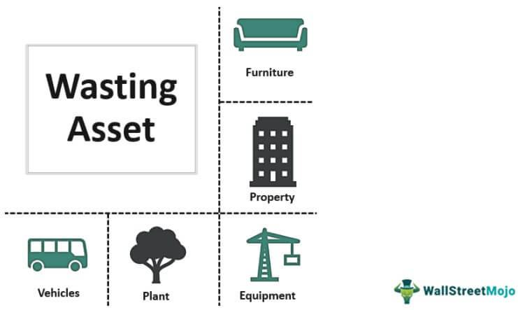

## Table of Contents

## What is fictitious trade?

Fictitious trade is when people pretend to buy or sell things, but it's not real. It's like playing a game where you act like you're trading, but no actual money or goods change hands. This can happen in the stock market or other places where trading happens. People might do this to trick others or to make it look like there's more trading happening than there really is.

This kind of fake trading can cause problems. It can make the market look busier than it is, which can confuse people who are trying to make real trades. It can also be used to cheat or steal money from others. Because of these problems, it's against the rules in many places, and people who get caught doing it can get into big trouble.

## How does fictitious trade differ from legitimate trading?

Fictitious trade is when people pretend to trade things like stocks or goods, but it's not real. They might do this to trick others into thinking the market is busy or to cheat people out of money. No actual goods or money change hands in these fake trades. It's like playing a game where you act like you're buying and selling, but nothing really happens.

On the other hand, legitimate trading is when people really buy and sell things. When you make a legitimate trade, you get something in return, like money or goods. This kind of trading is honest and follows the rules. It helps the economy work properly because it's based on real transactions where both sides get something they want.

Fictitious trade is against the law in many places because it can harm the market and hurt people who are trying to make real trades. Legitimate trading, however, is encouraged because it's an important part of how businesses and economies function. It's easy to see why it's important to tell the difference between the two.

## Can you provide a simple example of fictitious trade?

Imagine two friends, Sam and Tina, who work at a stock trading company. They want to make it look like the company is doing more trades than it really is. So, they pretend to buy and sell stocks between themselves. Sam "sells" 100 shares of a company to Tina, and then Tina "sells" those same shares back to Sam. They do this over and over, but no real money changes hands, and they don't actually own any stocks. This is a fictitious trade because it's all pretend.

This fake trading makes it look like the company is busy and doing well. Other people might see all these trades happening and think the company is successful. But it's all a trick. Sam and Tina are just pretending to trade to make the company look good. In reality, nothing real is happening, and this kind of fake trading is against the rules.

## What are the common motivations behind engaging in fictitious trade?

People engage in fictitious trade for different reasons, but one big reason is to make it look like there's more trading happening than there really is. This can make a company or a market seem busier and more successful. For example, if a company wants to attract investors, it might pretend to have lots of trades happening to make it look like a good place to invest money. This can trick people into thinking the company is doing better than it really is.

Another reason people do fictitious trading is to cheat or steal money. By pretending to trade, they can manipulate prices or create fake profits. For instance, someone might pretend to buy and sell a stock to make its price go up or down, and then they can trick others into buying or selling at the wrong time. This can lead to others losing money while the person doing the fake trading makes a profit. It's a dishonest way to make money and can hurt a lot of people.

## How can fictitious trade be detected by regulatory bodies?

Regulatory bodies can detect fictitious trade by looking at trading patterns and data. They use special computer programs to watch for signs of fake trading, like trades that happen over and over between the same people or trades that don't make sense with the normal market activity. If they see a lot of trades that seem to be going back and forth without any real change in who owns what, that might be a sign of fictitious trade. They can also check if the trades match up with real money moving around, because in real trading, money should change hands.

Another way to catch fictitious trade is by looking at the people and companies involved. If a company or a person is making a lot of trades but not actually making or losing money, that can be a red flag. Regulatory bodies can also talk to people and ask them questions about their trades. If someone can't explain their trades or if their stories don't match up with the records, that might mean they're doing fake trades. By combining these methods, regulatory bodies can find and stop fictitious trade to keep the market fair and honest.

## What are the legal consequences of participating in fictitious trade?

If you get caught doing fictitious trade, you can face big trouble. It's against the law in many places because it can hurt the market and trick people. Depending on where you live, you might have to pay a big fine. This means you have to give a lot of money to the government as a punishment. The fine can be so big that it can be really hard to pay it off.

You could also go to jail for doing fictitious trade. Going to jail means you have to stay in a prison for a while, and you can't go home or do what you want. How long you stay in jail depends on how bad the fake trading was and the rules in your area. Besides fines and jail, you might not be allowed to work in the trading business anymore. This can make it hard to find a job and can ruin your career.

## How does fictitious trade impact the economy?

Fictitious trade can mess up the economy by making the market look busier than it really is. When people pretend to trade, it can trick others into thinking that a company or the whole market is doing well. This can lead to bad decisions, like investing money in a company that's not really doing good business. If lots of people make these bad decisions, it can cause big problems for the economy. It's like a game of pretend that can fool everyone and make things unstable.

Also, fictitious trade can hurt trust in the market. When people find out that some trades are fake, they might not trust the market anymore. If people don't trust the market, they might not want to trade or invest, which can slow down the economy. It's important for the economy to work well that people can trust that the trades they see are real. When that trust is broken, it can take a long time to fix, and the economy can suffer in the meantime.

## What are some historical cases of fictitious trade?

One famous case of fictitious trade happened in the 1980s with a man named Ivan Boesky. He was a big name in the stock market and got caught doing fake trades to make money. Boesky used inside information to pretend to buy and sell stocks, making it look like he was making a lot of money. But it was all a trick. When he got caught, he had to pay a huge fine of $100 million and went to jail for three years. This case showed everyone how bad fictitious trade can be and made people more careful about trusting the stock market.

Another case happened more recently with a company called Enron. In the early 2000s, Enron pretended to make a lot of trades to make their business look good. They used fake trades to hide the fact that they were losing money. When people found out, it was a big shock. Enron went bankrupt, and many people lost their jobs and money. The people in charge at Enron, like CEO Jeffrey Skilling and CFO Andrew Fastow, went to jail and had to pay big fines. This case showed how fictitious trade can hurt a lot of people and damage the economy.

## What measures can companies implement to prevent fictitious trade?

Companies can prevent fictitious trade by setting up strict rules and checks. They can use special computer programs to watch for strange trading patterns. These programs can spot trades that happen over and over between the same people or trades that don't match up with real money moving around. Companies should also train their workers to know what fictitious trade looks like and how to report it if they see it. By keeping a close eye on all trades and making sure everyone knows the rules, companies can stop fake trading before it causes trouble.

Another way to prevent fictitious trade is to have good checks and balances. This means having different people in the company watch over each other's work. For example, one person might do the trading, but another person checks to make sure it's all real. Companies can also work with outside groups, like regulatory bodies, to make sure they're following the rules. By working together and being honest, companies can build trust and keep the market fair for everyone.

## How do advanced technologies like AI help in identifying fictitious trade?

Advanced technologies like AI help a lot in finding fictitious trade. AI can look at huge amounts of trading data really fast. It can spot patterns that might be signs of fake trading, like trades that keep going back and forth between the same people. AI can also check if the trades match up with real money moving around. If it sees trades happening but no money changing hands, that could mean the trades are fake. By using AI, companies and regulators can catch fictitious trade more quickly and stop it before it causes big problems.

AI also learns over time, which makes it even better at finding fictitious trade. As it sees more data, it gets better at telling the difference between real and fake trades. This means it can find new tricks that people might use to pretend to trade. Plus, AI can work all the time, so it never gets tired or misses anything. This constant watching helps keep the market honest and fair, which is good for everyone who trades or invests.

## What role do international regulations play in combating fictitious trade?

International regulations are important in the fight against fictitious trade because they help countries work together to stop fake trading. When countries agree on rules, it's harder for people to do fictitious trade in one place and then move to another to keep doing it. These rules can include things like sharing information about fake trades and working together to catch the people who do them. By having these international rules, countries can make sure that no place is safe for people who want to cheat the market.

These international regulations also help make the global market more fair and honest. When everyone follows the same rules, it's easier for companies and investors to trust that the trades they see are real. This trust is important for the economy to work well. If people know that countries are working together to stop fictitious trade, they are more likely to keep trading and investing, which helps the economy grow. So, international regulations play a big role in keeping the market safe and helping the economy do well.

## What are the future trends and challenges in preventing fictitious trade?

In the future, using new technology like AI and [machine learning](/wiki/machine-learning) will be a big trend in stopping fictitious trade. These tools can look at a lot of trading data very quickly and find patterns that might mean someone is pretending to trade. As these technologies get better, they will be able to spot new tricks that people might use to cheat. But, there will also be challenges. People who want to do fake trades might find new ways to hide what they're doing, so the technology will need to keep getting better to stay ahead.

Another trend will be more countries working together to fight fictitious trade. As the world gets more connected, fake trading can happen across borders, so it's important for countries to share information and work together. This will help make sure that no place is safe for people who want to cheat. But, getting different countries to agree on rules and work together can be hard. There might be disagreements about how to do things, and some countries might not want to share all their information. So, while working together is important, it will also be a big challenge.

## References & Further Reading

[1]: ["Advances in Financial Machine Learning"](https://www.amazon.com/Advances-Financial-Machine-Learning-Marcos/dp/1119482089) by Marcos Lopez de Prado

[2]: ["Quantitative Trading: How to Build Your Own Algorithmic Trading Business"](https://books.google.com/books/about/Quantitative_Trading.html?id=j70yEAAAQBAJ) by Ernest P. Chan

[3]: ["Algorithms for Hyper-Parameter Optimization."](https://papers.nips.cc/paper/4443-algorithms-for-hyper-parameter-optimization.pdf) Bergstra, J., Bardenet, R., Bengio, Y., & Kégl, B. (2011). Advances in Neural Information Processing Systems 24.

[4]: ["Machine Learning for Algorithmic Trading"](https://github.com/PacktPublishing/Machine-Learning-for-Algorithmic-Trading-Second-Edition) by Stefan Jansen

[5]: ["Evidence-Based Technical Analysis: Applying the Scientific Method and Statistical Inference to Trading Signals"](https://www.amazon.com/Evidence-Based-Technical-Analysis-Scientific-Statistical/dp/0470008741) by David Aronson