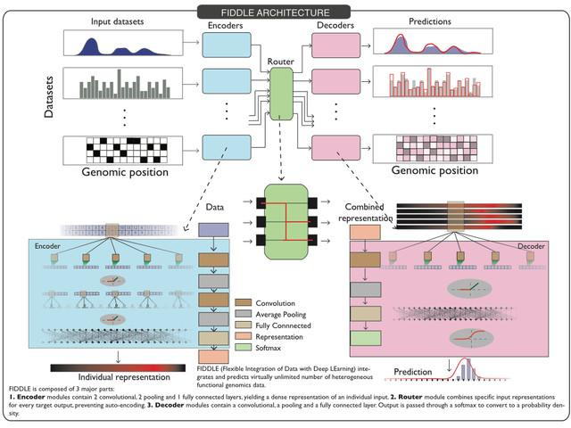

## Table of Contents

## What is Fiddle in the context of machine learning?

Fiddle is a tool used in machine learning to help developers and data scientists work more efficiently. It allows them to test and experiment with different parts of their machine learning models quickly and easily. By using Fiddle, users can make changes to their models and see the results without having to rewrite a lot of code. This makes it easier to find the best way to build and improve their models.

Fiddle is particularly useful because it helps bridge the gap between the development and deployment stages of machine learning projects. It provides a platform where users can tweak their models, try out new ideas, and see how those changes affect the model's performance. This iterative process is crucial in machine learning, where small adjustments can lead to big improvements. With Fiddle, teams can collaborate more effectively and bring their models to production faster.

## How does Fiddle help in managing machine learning models?

Fiddle helps in managing machine learning models by providing a user-friendly platform where developers and data scientists can easily experiment with different parts of their models. It allows users to make changes to their models and see the results quickly, without needing to write a lot of new code. This makes it easier to test out new ideas and find the best way to improve the model's performance. For example, if a user wants to try a different algorithm or adjust some parameters, they can do so in Fiddle and immediately see how it affects the model.

Another way Fiddle helps is by making it easier for teams to work together on machine learning projects. It acts as a central place where team members can share their work, discuss changes, and collaborate on improving the model. This is important because machine learning often involves a lot of back-and-forth between different team members. With Fiddle, everyone can see the latest version of the model and contribute their ideas, which helps speed up the process of getting the model ready for use in the real world.

## What are the key features of Fiddle for machine learning?

Fiddle has several key features that make it helpful for [machine learning](/wiki/machine-learning). One important feature is its ability to let users try out different parts of their models easily. For example, if a user wants to change a part of their model, like trying a new algorithm or adjusting some settings, they can do it quickly in Fiddle. This means they can see how their changes affect the model without writing a lot of new code. This makes it easier to find the best way to make the model work better.

Another key feature of Fiddle is that it helps teams work together on machine learning projects. It provides a place where team members can share their work and discuss ideas. This is important because machine learning often needs a lot of teamwork. With Fiddle, everyone can see the latest version of the model and suggest changes. This makes it faster to improve the model and get it ready to use in real life.

## Can you explain how to set up Fiddle for a new machine learning project?

To set up Fiddle for a new machine learning project, start by installing the Fiddle software on your computer. You can download it from the official website and follow the installation instructions. Once installed, open Fiddle and create a new project. Give your project a name that describes what you are working on. Next, you need to import your data into Fiddle. This usually involves uploading your dataset from your computer or connecting to a data source. After your data is in Fiddle, you can start building your model. You can choose different algorithms and settings to see how they work with your data.

After setting up your model in Fiddle, you can start experimenting with different parts of it. You might want to try different algorithms or change some settings to see how they affect your model's performance. Fiddle makes it easy to do this without writing a lot of code. You can quickly see how each change impacts your model's results. As you work, you can save different versions of your model in Fiddle. This way, you can compare them and decide which one works best. If you are working with a team, you can share your project in Fiddle so everyone can see and contribute to it. This helps everyone work together to make the model better.

## What types of machine learning models are supported by Fiddle?

Fiddle supports many different types of machine learning models. It can work with models for classification, where the goal is to put things into different groups, like sorting emails into spam or not spam. It also supports regression models, which are used to predict a number, like guessing how much a house will cost. Fiddle can handle models for clustering, where the aim is to find groups in data without knowing the groups ahead of time, and models for anomaly detection, which find unusual things in data.

In addition to these, Fiddle supports more advanced models like [deep learning](/wiki/deep-learning) models. These are often used for things like recognizing images or understanding speech. Fiddle can also work with models that use [reinforcement learning](/wiki/reinforcement-learning), where a model learns by trying things and getting feedback. This makes Fiddle a flexible tool that can be used for many different kinds of machine learning projects.

## How does Fiddle assist in the model deployment process?

Fiddle helps make the process of getting a machine learning model ready to use easier. It lets you test your model in a way that is similar to how it will be used in real life. This means you can see if your model works well before you actually use it. Fiddle also helps you keep track of different versions of your model. This is important because you might want to go back to an earlier version if something goes wrong. By using Fiddle, you can make sure your model is ready and works well before you start using it for real.

Another way Fiddle helps with getting your model ready to use is by making it easier to work with other tools and systems. Fiddle can connect with other software that you might need to use your model in real life. This makes it simpler to move your model from Fiddle to where it will be used. Fiddle also helps you set up rules for how your model should work, like what to do if something goes wrong. This makes sure your model will work smoothly when it is used in the real world.

## What are the best practices for using Fiddle in a machine learning workflow?

When using Fiddle in a machine learning workflow, it's important to start by setting up your project clearly. Give your project a name that describes what you are working on, and make sure to import your data correctly. Once your data is in Fiddle, you can begin building your model. Try different algorithms and settings to see what works best with your data. Fiddle makes it easy to experiment without writing a lot of code, so take advantage of this to find the best model for your project.

As you work on your model, save different versions in Fiddle. This way, you can compare them and choose the one that performs the best. If you are working with a team, use Fiddle to share your project so everyone can see and contribute to it. This helps everyone work together to make the model better. When you are ready to use your model in real life, use Fiddle to test it in a way that is similar to how it will be used. This helps you make sure your model works well before you start using it for real.

## How can Fiddle be integrated with existing machine learning pipelines?

Fiddle can be integrated with existing machine learning pipelines by acting as a central hub where you can import your data and models. You can connect Fiddle to your data sources and then bring your existing models into Fiddle to experiment with them. This means you can keep using the tools and systems you already have while also using Fiddle to try out new ideas and make improvements. For example, if you have a model that you built using another tool, you can import it into Fiddle and then adjust its settings or try different algorithms to see if you can make it better.

Once you have your model working well in Fiddle, you can use it to help with the next steps in your pipeline, like testing and deployment. Fiddle lets you test your model in a way that is similar to how it will be used in real life, which helps you make sure it will work well. You can also use Fiddle to set up rules for how your model should work, like what to do if something goes wrong. This makes it easier to move your model from Fiddle back into your existing pipeline for use in the real world.

## What are some common challenges faced when using Fiddle and how to overcome them?

One common challenge when using Fiddle is dealing with large datasets. Sometimes, it can be slow to import big data into Fiddle, which can slow down your work. To overcome this, you can try breaking your data into smaller parts and importing them one at a time. This way, Fiddle can handle the data more easily. Another thing you can do is to use data sampling techniques to work with a smaller, but still representative, part of your data. This can help you get started faster and then you can work with the full dataset once you have a good model.

Another challenge is keeping track of different versions of your model. As you experiment with different settings and algorithms, it can be hard to remember which version worked best. Fiddle helps with this by letting you save different versions of your model. Make sure to use this feature and give clear names to each version so you can easily compare them later. If you are working with a team, it's also important to communicate clearly about which version you are working on and why you made certain changes. This helps everyone stay on the same page and work together more effectively.

## How does Fiddle handle model versioning and experiment tracking?

Fiddle makes it easy to keep track of different versions of your machine learning model. When you are working on your model, you can save each version with a clear name. This helps you remember what changes you made and why. For example, if you try a new algorithm or adjust some settings, you can save that version with a name like "New Algorithm Test" or "Adjusted Parameters." This way, you can go back and compare different versions to see which one works best. Fiddle also lets you see how each version performs, so you can choose the one that gives the best results.

Fiddle is also helpful for tracking your experiments. When you try out different ideas, like changing the data you use or trying a new way to preprocess it, you can keep a record of what you did and what happened. This is important because it helps you understand what works and what doesn't. If you are working with a team, Fiddle makes it easy to share your experiments and results with others. This way, everyone can see what has been tried and contribute their own ideas to improve the model.

## Can you provide examples of real-world applications where Fiddle has been effectively used?

One real-world application where Fiddle has been effectively used is in the healthcare industry. A team of data scientists at a hospital used Fiddle to develop a model that predicts patient readmission rates. They started by importing their patient data into Fiddle and then experimented with different algorithms to find the best one for their needs. Fiddle allowed them to quickly test various models and track their performance, which helped them find a model that accurately predicted which patients were likely to be readmitted. This model helped the hospital better manage patient care and reduce readmission rates, saving time and resources.

Another example is in the financial sector, where a bank used Fiddle to improve its fraud detection system. The bank's data scientists used Fiddle to import their transaction data and then tried out different machine learning models to detect fraudulent activities. Fiddle's ability to save and compare different versions of the model was crucial for the team. They could easily see which model worked best at identifying fraud without triggering too many false alarms. As a result, the bank was able to implement a more effective fraud detection system, protecting their customers and reducing financial losses.

In the retail industry, a company used Fiddle to enhance its recommendation engine. The team imported customer purchase data into Fiddle and experimented with various models to suggest products that customers might like. Fiddle's experiment tracking feature allowed them to keep a record of what they tried and what worked. This iterative process helped them develop a recommendation engine that increased customer satisfaction and sales. By using Fiddle, the company was able to quickly test and refine their model, leading to better recommendations and a more personalized shopping experience for their customers.

## What advanced techniques can be applied using Fiddle to optimize machine learning models?

Fiddle can help you use advanced techniques to make your machine learning models better. One way is by using hyperparameter tuning. This means trying different settings for your model to see which ones make it work the best. Fiddle makes this easy because you can quickly change the settings and see how it affects your model's performance. You can use techniques like grid search or random search to try many different combinations of settings. This helps you find the best settings without doing a lot of work by hand. For example, if you are using a [neural network](/wiki/neural-network), you can try different values for the learning rate or the number of layers to see what works best.

Another advanced technique you can use with Fiddle is ensemble methods. This means combining different models to make a better one. Fiddle lets you try out different ways to combine models, like voting or averaging their predictions. This can make your model more accurate because it uses the strengths of different models. For example, you might combine a decision tree with a neural network to get better results than using either one alone. Fiddle's ability to save and compare different versions of your model makes it easy to experiment with ensemble methods and find the best way to combine your models.

## References & Further Reading

[1]: Bergstra, J., Bardenet, R., Bengio, Y., & Kégl, B. (2011). ["Algorithms for Hyper-Parameter Optimization."](https://dl.acm.org/doi/10.5555/2986459.2986743) Advances in Neural Information Processing Systems 24.

[2]: Lopez de Prado, M. (2018). ["Advances in Financial Machine Learning."](https://www.amazon.com/Advances-Financial-Machine-Learning-Marcos/dp/1119482089) Wiley.

[3]: Goodfellow, I., Bengio, Y., & Courville, A. (2016). ["Deep Learning."](https://www.deeplearningbook.org/) MIT Press.

[4]: Géron, A. (2019). [Hands-On Machine Learning with Scikit-Learn, Keras, and TensorFlow.](https://www.academia.edu/43840124/Hands_On_Machine_Learning_with_Scikit_Learn_Keras_and_TensorFlow_SECOND_EDITION_Concepts_Tools_and_Techniques_to_Build_Intelligent_Systems) O'Reilly Media.

[5]: Abadi, M., Barham, P., Chen, J., Chen, Z., Davis, A., Dean, J., ... & Zheng, X. (2016). ["TensorFlow: A system for large-scale machine learning."](https://arxiv.org/abs/1603.04467) In 12th {USENIX} Symposium on Operating Systems Design and Implementation ({OSDI} 16) (pp. 265-283).