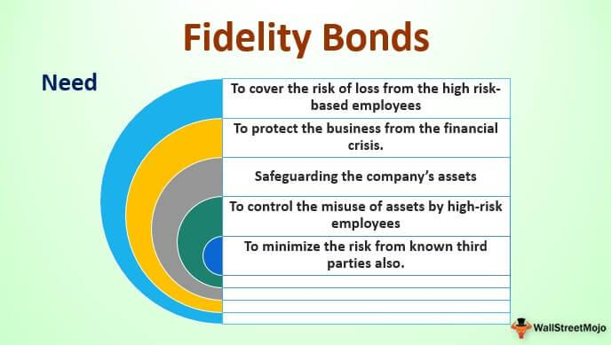

In today's complex financial landscape, businesses are continuously seeking ways to safeguard their assets and optimize their operations with the aid of innovative financial instruments. Among such vital tools is the fidelity bond, which serves as an integral part of a company's risk management strategy. Fidelity bonds represent a specialized form of insurance designed to provide financial protection against losses caused by fraudulent or dishonest acts committed by employees. While they are termed "bonds," these financial instruments function more like insurance policies rather than traditional bonds, offering organizations a way to shield themselves from unexpected internal threats.

The incorporation of fidelity bonds into a comprehensive risk management framework is crucial, especially for companies experiencing significant employee turnover or handling large volumes of cash and other valuable assets. These bonds serve as a protective measure, ensuring businesses can maintain operational stability even in the face of potentially damaging activities within their workforce. 

In addition to traditional business settings, fidelity bonds have gained notable relevance in modern trading practices, particularly in the high-paced environment of algorithmic trading. As this form of trading involves significant amounts of data and proprietary strategies, it is susceptible to internal risks that could lead to substantial financial and reputational damages. By implementing fidelity bonds, companies operating in algorithmic trading can mitigate these risks, safeguarding their assets and ensuring seamless operations.

Ultimately, this article will equip you with a comprehensive understanding of how fidelity bonds function as a vital element of financial and operational security, enhancing not only a company's risk management strategy but also its credibility and trustworthiness in the eyes of clients and investors.

## Table of Contents

## Understanding Fidelity Bonds

Fidelity bonds are a unique subset of insurance products specifically designed to safeguard businesses against financial losses stemming from acts of fraud or dishonesty by their employees. Contrary to their name, fidelity bonds are not bonds in the traditional financial sense; they do not involve borrowing funds or repayment with interest. Instead, they function as a form of insurance coverage, focusing on protecting a business from internal threats posed by potentially untrustworthy personnel.

The core utility of fidelity bonds lies in their ability to mitigate risks for companies that might be vulnerable due to factors such as high employee turnover or the handling of substantial volumes of cash and other valuable assets. In environments where numerous employees have access to sensitive financial information, the probability of encountering fraudulent activities can be significant. Thus, fidelity bonds play a vital role in bolstering a company's internal security framework by offering financial restitution in such cases.

To understand how fidelity bonds differ from traditional insurance products, one must consider the specific risks they address. While general insurance policies typically cover losses due to external factors such as natural disasters, accidents, or theft by non-employees, fidelity bonds are specifically tailored to internal risks initiated by employees. This internal focus is what makes them an essential component of risk management strategies, especially in industries where trust in employee conduct is crucial.

The mechanism of fidelity bonds involves an agreement where the insurer commits to compensating the insured company for its losses up to a predetermined limit should an employee commit a fraudulent act. This arrangement provides a financial cushion that not only covers the direct monetary loss but can also account for auxiliary expenses, such as legal fees or the costs associated with investigating the fraudulent act.

Implementing fidelity bonds is a strategic decision for companies, particularly those with dynamic workforces or those operating in highly cash-driven sectors. By ensuring that a safety net exists for potential dishonest acts, businesses can maintain operational stability and financial health over the long term.

## Types of Fidelity Bonds

Fidelity bonds come in various forms, each specifically tailored to protect businesses from different types of employee misconduct and suit particular sectors. Understanding these types can greatly assist businesses in selecting the most appropriate bond to fit their unique risk profiles.

### Business Services Bonds

Business Services Bonds are designed to protect companies that hire third-party service providers, such as cleaning services, landscapers, or repair personnel, who have access to clients' premises. These bonds safeguard against losses that might be incurred if a service provider engages in theft, vandalism, or any other misconduct while on a client's property. This protection is crucial for businesses that rely on external service providers, as incidents of dishonest acts can severely damage client relations and the company's reputation.

### Employee Dishonesty Bonds

Employee Dishonesty Bonds are crucial for businesses seeking protection against fraudulent acts committed by their employees. These bonds provide coverage for financial losses resulting from theft, fraud, or any other dishonest actions by full-time employees. Given the potential impact of internal fraud on operational stability and financial health, Employee Dishonesty Bonds are of significant importance across various industries, ensuring businesses can recover financially from such unfortunate events.

### ERISA Bonds

ERISA Bonds, or Employee Retirement Income Security Act Bonds, are mandated for fiduciaries of employee benefit plans. These bonds ensure protection against the mismanagement of funds as stipulated under the ERISA Act. Compliance with ERISA entails fiduciaries to handle plan assets with the utmost prudence and loyalty. ERISA Bonds offer peace of mind and financial protection, reinforcing fiduciary responsibility and safeguarding employees' retirement benefits.

Understanding the differences among these fidelity bonds enables businesses to tailor their risk management strategies effectively. By choosing the appropriate type of fidelity bond, companies not only protect themselves financially but also bolster their overall governance and accountability frameworks.

## The Role of Fidelity Bonds in Financial Protection

Fidelity bonds are a cornerstone of a company's risk management strategy, intended to provide robust protection against financial losses due to employee-related fraud and dishonesty. In a business landscape where internal threats can lead to significant financial drains, fidelity bonds serve as a safeguard, ensuring the continuity and financial health of organizations.

Primarily, fidelity bonds act as a safety net, stabilizing businesses by covering losses induced by dishonest activities. By doing so, they offer more than just monetary compensation, playing a crucial role in maintaining a company's reputation among clients and investors. This is important as trust is a critical component of business relationships, and any hint of internal fraud can tarnish a company’s image, affecting its market position and stock value.

Furthermore, the inclusion of fidelity bonds in a company’s risk management strategy aligns seamlessly with broader governance and accountability frameworks. Implementing such bonds reflects a proactive stance on mitigating employee-related risks, promoting a more secure financial atmosphere. As part of a comprehensive risk strategy, they provide reassurance to both internal and external stakeholders that the company is committed to safeguarding its financial integrity.

In terms of governance, fidelity bonds serve as a deterrent against employee fraud by motivating companies to improve internal controls and monitoring systems. By enhancing these internal mechanisms, businesses not only prevent potential fraudulent activities but also streamline operations, potentially leading to improved financial performance and efficiency.

In conclusion, fidelity bonds offer a multifaceted layer of security that goes beyond financial compensation, fostering an environment of trust and stability. Their role in financial protection is indispensable, providing a foundation upon which businesses can operate with confidence in an unpredictable financial landscape.

## Fidelity Bonds in Algorithmic Trading

In the rapidly evolving landscape of [algorithmic trading](/wiki/algorithmic-trading), the security of proprietary trading strategies and corporate data is paramount. Algorithmic trading, characterized by high-frequency, automated transactions, demands an environment where even slight vulnerabilities can lead to substantial financial and reputational losses. This sensitivity underscores the necessity for robust risk management solutions, such as fidelity bonds, to safeguard against potential internal threats.

Fidelity bonds are insurance products that offer protection against losses stemming from employee dishonesty, fraud, or misconduct. In the context of algorithmic trading, these bonds become particularly significant. The algorithmic trading environment relies heavily on technology and confidential data, making it susceptible to insider threats where employees may exploit their access for fraudulent activities. Fidelity bonds provide a financial safety net by covering these losses, thus maintaining the integrity and stability of a company's trading operations.

Consider a hypothetical scenario in which an employee within an algorithmic trading firm manipulates the trading algorithm to execute unauthorized trades for personal gain. This exploitation could potentially result in significant financial losses for the firm, damaging not only the balance sheet but also the company's credibility in the market. In such cases, a fidelity bond caters to the coverage of these losses, acting as a protective measure for the business.

Furthermore, algorithmic trading companies often deal with high-stakes transactions where the speed and accuracy of trading are crucial. In this high-pressure environment, employee errors or misconduct can have amplified consequences. For instance, the mishandling of sensitive trading algorithms or data breaches could lead to significant financial downturns. Fidelity bonds can be tailored to address these specific risks, providing a customized approach to risk management that aligns with the unique operational needs of algorithmic and financial technology companies.

By incorporating fidelity bonds into their risk management strategies, trading firms not only shield themselves from financial contingencies but also reinforce their reputational standing. Stakeholders, including clients and investors, gain confidence knowing that the company has mitigative measures to address potential internal risks effectively. As algorithmic trading continues to grow, embedding fidelity bonds into the broader governance framework ensures a fortified defense against the nuances of internal threats in financial technology.

## The Bottom Line

In the fast-paced world of business and finance, safeguarding against internal threats through mechanisms like fidelity bonds is crucial. These insurance instruments act as a frontline defense against the pervasive risks of fraud and misconduct that businesses face, providing a financial safety net while simultaneously reinforcing trust among clients and stakeholders.

Fidelity bonds are particularly pertinent to industries dealing with sensitive financial data and complex transactions, such as finance and algorithmic trading. These sectors, characterized by their rapid pace and reliance on data integrity, are vulnerable to potentially devastating breaches of trust and security. Implementing fidelity bonds as part of a comprehensive risk management strategy can mitigate these risks effectively.

A robust insurance policy, including fidelity bonds, addresses the specific challenge of internal threats by offering monetary compensation for losses incurred through employee dishonesty or fraudulent activities. This financial protection ensures business continuity and fosters stakeholder confidence, which is vital to maintaining a positive market reputation and securing long-term success.

For algorithmic trading companies and financial firms alike, fidelity bonds serve not only as an insurance mechanism but as a strategic tool to enhance operational reliability. By protecting against internal threats, these bonds contribute to a secure trading environment, ensuring that businesses can operate with the assurance that their assets and data are safeguarded from internal malfeasance. As such, these bonds are an essential component of any robust risk management framework, helping businesses navigate and thrive in an environment increasingly fraught with internal and external challenges.

## FAQs

### FAQs

**What is the primary purpose of a fidelity bond?**

A fidelity bond primarily serves as a security measure against financial losses due to fraudulent or dishonest acts committed by employees. This insurance product is designed to protect businesses from theft, embezzlement, or other dishonest activities that could put company assets and operations at risk. Fidelity bonds provide financial compensation, ensuring that a company can recover from such losses without bearing the full financial burden.

**How do fidelity bonds differ from traditional insurance?**

Fidelity bonds, despite the term "bond," function differently from traditional insurance. While traditional insurance covers risks like natural disasters, property damage, and liability claims, fidelity bonds specifically address losses from employee dishonesty. They are a form of surety that offers financial guarantees, thus focusing on internal threats rather than external ones. Traditional insurance usually deals with broader risk categories, while fidelity bonds provide targeted protection against specific internal financial threats.

**What industries benefit the most from fidelity bonds?**

Industries that handle large volumes of cash or manage valuable assets are the primary beneficiaries of fidelity bonds. Financial institutions, investment firms, and businesses with high employee turnover rates often rely on these bonds. Additionally, sectors such as retail, real estate, and any industry involving third-party service providers also find fidelity bonds beneficial. The protection against potential embezzlement or theft by employees makes fidelity bonds an essential component for many businesses operating in high-risk environments.

**Can fidelity bonds be customized to fit specific business needs?**

Yes, fidelity bonds can be tailored to suit specific business requirements. Companies can select coverage options that reflect the unique risk profiles they face, such as the number of employees, the nature of the work, and the degree of access employees have to financial resources. This customization allows businesses to strategically allocate resources, ensuring relevant coverage that addresses their most significant vulnerability areas.

**How do fidelity bonds apply to algorithmic trading companies?**

In algorithmic trading, companies rely on sophisticated algorithms for trading decisions, which demands high levels of security and risk management. Fidelity bonds are particularly relevant to this industry by protecting against losses from insider threats, such as unauthorized access to trading algorithms or data theft. Given the rapid trading executed by these algorithms, even minor breaches can lead to substantial financial losses. Fidelity bonds offer a framework for financial restitution, reducing the impact of such breaches, and protecting the company’s sensitive trading strategies.

## References & Further Reading

[1]: ["The Field Guide to Understanding 'Human Error'"](https://www.taylorfrancis.com/books/mono/10.1201/9781317031833/field-guide-understanding-human-error-sidney-dekker) by Sidney Dekker

[2]: ["Managing Credit Risk: The Great Challenge for the Global Financial Markets"](https://www.wiley.com/en-us/Managing+Credit+Risk%3A+The+Great+Challenge+for+Global+Financial+Markets%2C+2nd+Edition-p-9781118160695) by John B. Caouette, Edward I. Altman, Paul Narayanan, and Robert Narayanan

[3]: ["Operational Risk Management: A Practical Approach to Risk Assessment"](https://www.wiley.com/en-us/Operational+Risk+Management%3A+A+Practical+Approach+to+Intelligent+Data+Analysis-p-9781119956723) by Mark D. Abkowitz 

[4]: ["The Naked Trader: How Anyone Can Make Money Trading Shares"](https://archive.org/details/nakedtraderhowan0000robb) by Robbie Burns

[5]: ["High-Frequency Trading: A Practical Guide to Algorithmic Strategies and Trading Systems"](https://www.ahmetbeyefendi.com/wp-content/uploads/2020/07/High-Frequency-Trading-Irene-Aldridge.pdf) by Irene Aldridge