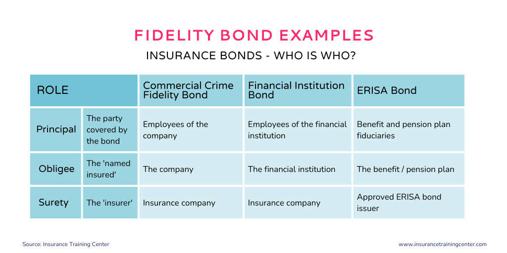

## Table of Contents

## What is a fidelity bond?

A fidelity bond is a type of insurance that protects a business from losses caused by dishonest acts of its employees. It is like a safety net that helps cover financial losses if an employee steals money, property, or commits fraud. Companies often use fidelity bonds to protect themselves from the risks associated with employee theft or misconduct.

Fidelity bonds are commonly required for businesses that handle large amounts of money or valuable assets. For example, banks, financial institutions, and companies that manage client funds often need to have fidelity bonds. By having this insurance, a business can feel more secure knowing that it has protection against potential internal threats. This can also help build trust with clients and partners, showing that the company takes precautions to safeguard their assets.

## How does a fidelity bond work?

A fidelity bond works like a special kind of insurance that protects a business from losses if an employee does something dishonest. If an employee steals money, property, or commits fraud, the fidelity bond helps the business get back the money they lost. The business pays a premium, which is like a regular payment, to the insurance company for this protection. If something bad happens, the business can file a claim with the insurance company to get reimbursed for their losses.

When a business wants to get a fidelity bond, they need to tell the insurance company about their employees and the kind of work they do. The insurance company will then decide how much the business needs to pay for the bond based on the risk involved. If an employee does something wrong, the business needs to prove it and file a claim. The insurance company will investigate the claim and, if they agree that the employee was dishonest, they will pay the business back for the losses, up to the amount covered by the bond.

## What are the different types of fidelity bonds?

There are different types of fidelity bonds that businesses can choose from, depending on their needs. One type is called a "blanket bond." This bond covers all employees in a company. It's like a big umbrella that protects the business from dishonest acts by any employee. Another type is a "position schedule bond." This bond only covers specific employees or positions in the company. For example, it might cover just the people who handle money or manage accounts.

Another kind of fidelity bond is a "name schedule bond." This bond covers only the employees whose names are listed on the bond. It's more specific than a blanket bond and is used when a company wants to cover only certain people. There's also a "commercial crime bond," which is broader and can cover not just employee dishonesty but also other types of crimes like theft or burglary. Each type of bond helps businesses in different ways, so they can pick the one that fits their needs best.

## Who needs a fidelity bond?

Businesses that handle a lot of money or valuable things often need a fidelity bond. This includes banks, financial companies, and any business that manages money for clients. These businesses need protection in case an employee steals or does something dishonest. A fidelity bond helps them get back the money they lost and keeps their clients' trust.

Some jobs or industries might also require a fidelity bond by law or as part of their rules. For example, some government jobs or contracts might need it. Even if it's not required, many businesses choose to get a fidelity bond to feel safer and to show they take care of their clients' money. It's like having a safety net for the business.

## What is the difference between a fidelity bond and a surety bond?

A fidelity bond and a surety bond are both types of insurance, but they protect against different things. A fidelity bond protects a business from losses caused by dishonest acts of its employees. It's like a safety net that helps the business get back money if an employee steals or commits fraud. Companies that handle a lot of money or valuable assets often use fidelity bonds to feel safer and to show their clients they take care of their money.

On the other hand, a surety bond makes sure that a person or business follows the rules and does what they promised to do. It's like a promise that if someone doesn't do their job right, the insurance company will pay for the mistake. Surety bonds are often needed for construction jobs, to make sure the work gets done, or for court cases, to make sure people show up when they're supposed to. While a fidelity bond protects against dishonest employees, a surety bond protects against not following through on promises.

## How much does a fidelity bond cost?

The cost of a fidelity bond can change a lot depending on things like how big the business is, what kind of work they do, and how much money they want to be protected. Usually, a business pays a premium, which is like a regular payment, to the insurance company for the bond. The premium can be different for each business because the insurance company looks at how risky the business is. If a business has a lot of employees or handles a lot of money, the premium might be higher.

For example, a small business might pay a few hundred dollars a year for a fidelity bond, while a bigger company might pay thousands. The amount of money the bond covers, called the coverage limit, also affects the cost. If a business wants a bond that covers a lot of money, they will have to pay more. It's a good idea for businesses to talk to different insurance companies to find the best price for the protection they need.

## What are the coverage limits of a fidelity bond?

The coverage limits of a fidelity bond are the most amount of money the insurance company will pay if something bad happens. This limit can be different for each business. It depends on things like how big the business is, what kind of work they do, and how much money they want to protect. A small business might choose a lower limit, while a big company might need a higher limit to cover more money.

When a business gets a fidelity bond, they can choose how much coverage they want. The more coverage they want, the more they will have to pay for the bond. It's important for a business to think about how much money they handle and how much risk they have. This helps them pick the right coverage limit to keep their business safe without paying too much.

## How can one apply for a fidelity bond?

To apply for a fidelity bond, a business needs to contact an insurance company that offers these bonds. They can do this by calling the insurance company, visiting their website, or talking to an insurance agent. The business will need to give the insurance company some information about their company, like how many employees they have, what kind of work they do, and how much money they want to be protected. This helps the insurance company decide how much the bond will cost and what kind of bond the business needs.

Once the business gives all the needed information, the insurance company will look at it and make an offer. This offer will include the cost of the bond, called the premium, and the amount of money the bond will cover, called the coverage limit. If the business likes the offer, they can agree to it and start paying the premium. After that, they will have a fidelity bond to protect them from losses if an employee does something dishonest.

## What are the common exclusions in a fidelity bond?

A fidelity bond has some things it does not cover, called exclusions. These are important for businesses to know because they show what the bond will not pay for. Common exclusions include losses that happen before the bond starts, losses caused by the business owners or partners, and losses from things like war or nuclear events. Also, if an employee does something dishonest and the business knew about it before getting the bond, that won't be covered.

Another common exclusion is losses that come from normal business risks, like bad investments or poor management. Fidelity bonds are meant to protect against dishonest acts, not everyday business problems. It's important for businesses to read the bond carefully to understand what is not covered. This way, they can make sure they have the right protection for their needs.

## How does the claims process work for a fidelity bond?

When a business thinks an employee did something dishonest, they need to start the claims process for their fidelity bond. First, they should tell the insurance company about the problem as soon as they can. They will need to give the insurance company details about what happened, like who the employee was, what they did, and how much money was lost. The business will also need to give any proof they have, like documents or police reports. This helps the insurance company understand the situation.

After the business files the claim, the insurance company will look into it. They will check if the claim follows the rules of the bond and if the loss is covered. This might take some time because the insurance company needs to make sure everything is right. If they agree that the employee was dishonest and the loss is covered by the bond, they will pay the business back for the money they lost, up to the amount the bond covers. If the claim is not covered, the insurance company will explain why and the business will not get any money back.

## What are the regulatory requirements for fidelity bonds in different industries?

Different industries have different rules about fidelity bonds. For example, banks and financial companies often have to have fidelity bonds because they handle a lot of money. The government says they need this to protect the money they manage for people. Other industries, like government contractors or companies that work with the government, might also need fidelity bonds. This is to make sure they follow the rules and do not do anything dishonest with the money they get from the government.

Some jobs or industries do not have strict rules about fidelity bonds, but it can still be a good idea to have one. For example, businesses that deal with valuable things or a lot of money might choose to get a fidelity bond even if it's not required. This helps them feel safer and can make their clients trust them more. It's important for businesses to check the rules for their industry and think about getting a fidelity bond if it makes sense for them.

## How do fidelity bonds integrate with other risk management strategies?

Fidelity bonds are an important part of a business's risk management plan. They help protect the business from losses if an employee does something dishonest, like stealing money or committing fraud. But fidelity bonds are just one piece of the puzzle. A smart business will use other risk management strategies along with a fidelity bond to keep their business safe. For example, they might have strong rules for how employees handle money, regular checks to make sure everything is right, and good training to help employees understand what is expected of them.

Using a fidelity bond with other risk management strategies makes a business even safer. It's like having a strong lock on a door but also using a security system and keeping the lights on at night. The fidelity bond acts as a safety net, but the other strategies help stop problems before they start. By combining these different ways to manage risk, a business can feel more secure and protect itself better from the things that could go wrong.

## References & Further Reading

[1]: ["The Field Guide to Understanding 'Human Error'"](https://www.taylorfrancis.com/books/mono/10.1201/9781317031833/field-guide-understanding-human-error-sidney-dekker) by Sidney Dekker

[2]: ["Managing Credit Risk: The Great Challenge for the Global Financial Markets"](https://www.wiley.com/en-us/Managing+Credit+Risk%3A+The+Great+Challenge+for+Global+Financial+Markets%2C+2nd+Edition-p-9781118160695) by John B. Caouette, Edward I. Altman, Paul Narayanan, and Robert Narayanan

[3]: ["Operational Risk Management: A Practical Approach to Risk Assessment"](https://www.wiley.com/en-us/Operational+Risk+Management%3A+A+Practical+Approach+to+Intelligent+Data+Analysis-p-9781119956723) by Mark D. Abkowitz 

[4]: ["The Naked Trader: How Anyone Can Make Money Trading Shares"](https://archive.org/details/nakedtraderhowan0000robb) by Robbie Burns

[5]: ["High-Frequency Trading: A Practical Guide to Algorithmic Strategies and Trading Systems"](https://www.ahmetbeyefendi.com/wp-content/uploads/2020/07/High-Frequency-Trading-Irene-Aldridge.pdf) by Irene Aldridge