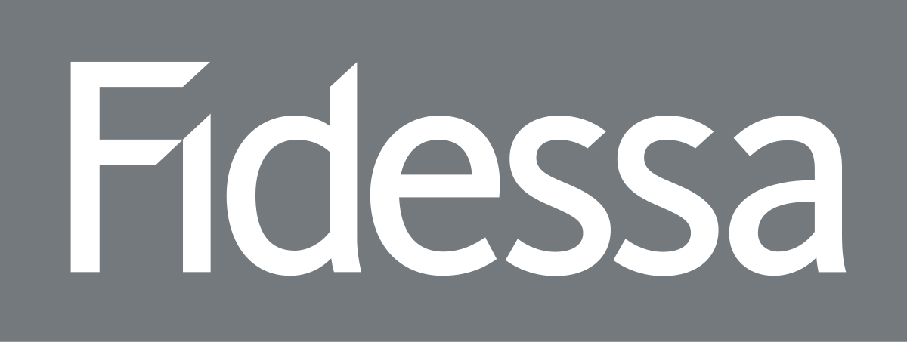

## Table of Contents

## What is Fidessa Group PLC?

Fidessa Group PLC is a company that used to make software for financial markets. It helped banks and other financial companies trade stocks, bonds, and other financial products. The company started in 1981 and grew to be very important in the financial world. It had offices in many countries and helped a lot of big financial companies do their work better.

In 2018, Fidessa Group PLC was bought by another company called Ion Group. After the purchase, Fidessa stopped being its own company and became part of Ion Group. Ion Group is a big company that owns many different businesses in finance and technology. Even though Fidessa is no longer a separate company, its software and services are still used by many financial companies around the world.

## When was Fidessa Group PLC founded?

Fidessa Group PLC was founded in 1981. It was started to make software that helps people in the financial world do their jobs better. The company focused on making tools for trading stocks, bonds, and other financial products.

Over the years, Fidessa grew a lot and became very important in the financial industry. It had offices in many different countries and helped many big banks and financial companies. In 2018, Fidessa was bought by Ion Group, and it stopped being its own company. Now, Fidessa's software and services are part of Ion Group, but they are still used by many financial companies around the world.

## What are the main products and services offered by Fidessa Group PLC?

Fidessa Group PLC made software that helps people in the financial world trade stocks, bonds, and other financial products. Their main product was called the Fidessa Trading Platform. This platform helped traders buy and sell things quickly and easily. It also had tools to help traders keep track of their trades and see how the market was doing. Fidessa's software was used by many big banks and financial companies all over the world.

Another important service Fidessa offered was called Fidessa Connectivity. This service helped different financial systems talk to each other. It made it easier for companies to work together and share information. Fidessa also provided something called Fidessa Analytics, which helped companies understand their data better. This was useful for making smart decisions about trading and investments.

Even though Fidessa Group PLC was bought by Ion Group in 2018 and is no longer its own company, its products and services are still used by many financial companies. The Fidessa Trading Platform, Fidessa Connectivity, and Fidessa Analytics continue to be important tools in the financial industry.

## In which industries does Fidessa Group PLC primarily operate?

Fidessa Group PLC mainly works in the financial industry. It makes software that helps people trade stocks, bonds, and other financial products. The company's main product is the Fidessa Trading Platform, which helps traders buy and sell things quickly and easily. This platform is used by many big banks and financial companies all over the world.

Fidessa also offers services that help different financial systems work together. One of these services is called Fidessa Connectivity, which makes it easier for companies to share information and work together. Another service is Fidessa Analytics, which helps companies understand their data better and make smart decisions about trading and investments. Even though Fidessa was bought by Ion Group in 2018, its products and services are still used by many in the financial industry.

## Who are the key competitors of Fidessa Group PLC?

Fidessa Group PLC had several key competitors in the financial software industry. One of the main competitors was Bloomberg LP, a company that provides financial data, news, and analytics. Bloomberg's trading platform is used by many financial professionals to trade stocks, bonds, and other financial products. Another competitor was Thomson Reuters, which also offers trading platforms and financial data services. Thomson Reuters helps financial companies with trading, data analysis, and risk management.

Another important competitor was Charles River Development, a company that provides software for investment management and trading. Their platform helps financial companies manage their portfolios and make trades. Additionally, companies like SimCorp and SS&C Technologies also competed with Fidessa. SimCorp offers software for investment management, while SS&C Technologies provides software for financial services, including trading and investment management. Even though Fidessa was bought by Ion Group in 2018, these companies continue to be key players in the financial software industry.

## What is the business model of Fidessa Group PLC?

Fidessa Group PLC made money by selling software to big banks and financial companies. Their main product was the Fidessa Trading Platform, which helped traders buy and sell stocks, bonds, and other financial products quickly and easily. Companies paid Fidessa to use this platform because it made their trading work faster and more efficient. Fidessa also made money by offering other services, like Fidessa Connectivity, which helped different financial systems talk to each other, and Fidessa Analytics, which helped companies understand their data better.

Even though Fidessa was bought by Ion Group in 2018 and is no longer its own company, its business model is still important. The software and services that Fidessa developed are still used by many financial companies around the world. These companies pay to use Fidessa's tools because they help them trade better, work together more easily, and make smarter decisions about their investments. Fidessa's business model was all about helping financial companies do their jobs better with technology.

## How has Fidessa Group PLC evolved over the years?

Fidessa Group PLC started in 1981 as a company that made software for financial markets. At first, it focused on helping traders buy and sell stocks and bonds more easily. Over the years, Fidessa grew bigger and became very important in the financial world. They made a trading platform called the Fidessa Trading Platform, which helped traders do their jobs faster and better. The company also started offering other services like Fidessa Connectivity, which helped different financial systems work together, and Fidessa Analytics, which helped companies understand their data.

As Fidessa grew, it opened offices in many countries and helped a lot of big banks and financial companies. By the 2000s, Fidessa was known all over the world for its software and services. In 2018, a big change happened when Fidessa was bought by Ion Group. After the purchase, Fidessa stopped being its own company and became part of Ion Group. Even though Fidessa is no longer separate, its software and services are still used by many financial companies around the world. The technology that Fidessa developed continues to help traders and financial companies do their work better.

## What are some major milestones or achievements of Fidessa Group PLC?

Fidessa Group PLC started in 1981 and grew to become a very important company in the financial world. One of their big achievements was making the Fidessa Trading Platform. This platform helped traders buy and sell stocks and bonds quickly and easily. Many big banks and financial companies all over the world used this platform because it made their work faster and better. Another important milestone was when Fidessa started offering Fidessa Connectivity. This service helped different financial systems talk to each other, making it easier for companies to work together and share information.

Another big achievement for Fidessa was the development of Fidessa Analytics. This service helped companies understand their data better, which was useful for making smart decisions about trading and investments. Over the years, Fidessa opened offices in many countries and became known worldwide for its software and services. In 2018, Fidessa reached another major milestone when it was bought by Ion Group. Even though Fidessa stopped being its own company, its software and services are still used by many financial companies around the world, showing how important its achievements were.

## What was the impact of the acquisition of Fidessa Group PLC by Ion Group?

When Ion Group bought Fidessa Group PLC in 2018, it changed things a lot for Fidessa. Fidessa was no longer its own company and became part of Ion Group. This meant that Fidessa's name disappeared, but its software and services kept going. Many financial companies still use Fidessa's tools to trade stocks and bonds, and to help their systems work together. The acquisition made Ion Group bigger and stronger in the financial software world.

The impact of the acquisition was also good for Ion Group. They got to use Fidessa's well-known trading platform and other services to help more financial companies. This made Ion Group a bigger player in the industry. Even though Fidessa is now part of Ion Group, its technology still helps traders and financial companies do their work better. So, the acquisition helped both Ion Group and the companies that use Fidessa's tools.

## How does Fidessa Group PLC address regulatory compliance in its solutions?

Fidessa Group PLC made sure its software helped financial companies follow the rules. They knew that trading stocks and bonds had a lot of rules, so they made tools to help companies keep track of everything. Their Fidessa Trading Platform had features that let companies see if they were doing things the right way. It kept records of all trades and made sure everything was clear and easy to check. This helped companies stay out of trouble and avoid fines.

Even after Fidessa was bought by Ion Group in 2018, its focus on helping with rules stayed the same. The software still has tools that help companies follow the law. These tools make it easier for companies to report what they're doing to the people who make the rules. This way, companies can trade without worrying about breaking any laws. Fidessa's solutions keep helping financial companies do their work the right way, even as part of Ion Group.

## What technological innovations has Fidessa Group PLC introduced in the financial sector?

Fidessa Group PLC brought many new ideas to the financial world with its technology. They made a trading platform called the Fidessa Trading Platform, which helped traders buy and sell stocks and bonds faster and easier. This platform had tools that let traders see the market in real-time and keep track of their trades. It made trading a lot smoother and helped financial companies do their work better. Fidessa also came up with Fidessa Connectivity, a service that let different financial systems talk to each other. This made it easier for companies to share information and work together, which was a big help in the busy world of finance.

Another important innovation from Fidessa was Fidessa Analytics. This tool helped companies understand their data better, which was really useful for making smart decisions about trading and investments. With Fidessa Analytics, financial companies could look at their data in new ways and see things they might have missed before. Even after Fidessa was bought by Ion Group in 2018, these innovations kept helping financial companies. The technology that Fidessa developed is still used by many big banks and financial companies around the world, making trading and finance easier and more efficient.

## What are the future growth strategies and market expansion plans of Fidessa Group PLC?

Since Fidessa Group PLC was bought by Ion Group in 2018, it's no longer a separate company. But the technology and services that Fidessa made are still used by many financial companies. Ion Group now uses these tools to help more financial companies around the world. They want to keep making the Fidessa Trading Platform better so it can help traders even more. They also want to make sure that Fidessa Connectivity and Fidessa Analytics keep working well so companies can share information easily and understand their data better.

Ion Group plans to grow by using Fidessa's technology in new markets. They want to help more banks and financial companies in different countries. By making Fidessa's tools work with more types of financial systems, Ion Group can reach more customers. They also want to keep adding new features to the software so it stays useful and up-to-date. This way, even though Fidessa is not its own company anymore, its technology can keep helping the financial world grow and work better.

## References & Further Reading

[1]: ["Algorithmic Trading: Winning Strategies and Their Rationale"](https://books.google.com/books/about/Algorithmic_Trading.html?id=WAlFDwAAQBAJ) by Ernie Chan

[2]: Clark, A. (2011). ["Algorithmic trading: Insights and the risks involved."](https://nurp.com/wisdom/the-complete-roadmap-to-successful-algorithmic-trading-from-idea-to-implementation/) Futures & Options World.

[3]: Aldridge, I. (2013). ["High-Frequency Trading: A Practical Guide to Algorithmic Strategies and Trading Systems"](https://www.amazon.com/High-Frequency-Trading-Practical-Algorithmic-Strategies/dp/1118343506)

[4]: ["The Impact of High-Frequency Trading on Markets"](https://rpc.cfainstitute.org/research/cfa-magazine/2011/the-impact-of-high-frequency-trading-on-markets) by Jonathan Brogaard, Terrence Hendershott, and Ryan Riordan

[5]: Marquardt, L. (2018). ["Trading at the Speed of Light: How Ultra-Fast Algorithms Have Changed Market Dynamics."](https://www.amazon.com/Trading-Speed-Light-Algorithms-Transforming/dp/0691211388) Technical Analysis of Stocks & Commodities.

[6]: Fidessa Group PLC. ["Annual Report and Accounts"](https://www.annualreports.com/HostedData/AnnualReportArchive/f/LSE_FDSA_2016.pdf) (2018)

[7]: Johnson, B., & Taylor, M. (2010). ["Global algorithmic trading survey 2010"](https://www.semanticscholar.org/paper/Algorithmic-trading-%26-DMA-%3A-an-introduction-to-Johnson/aa5de1ab883d5e23b6651faa7c1807586d688e4b) Financial News.